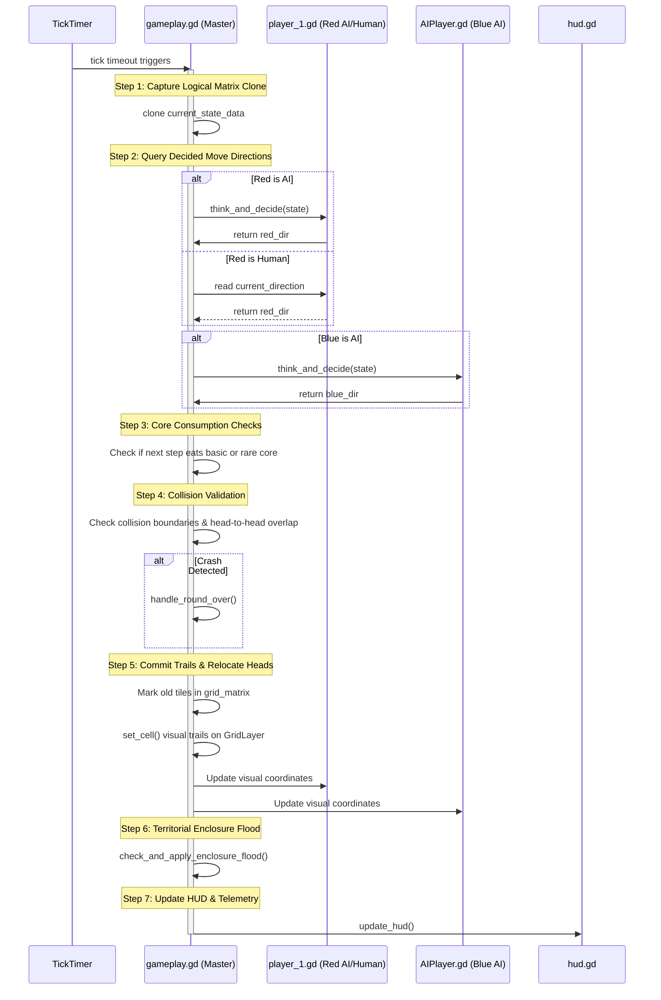
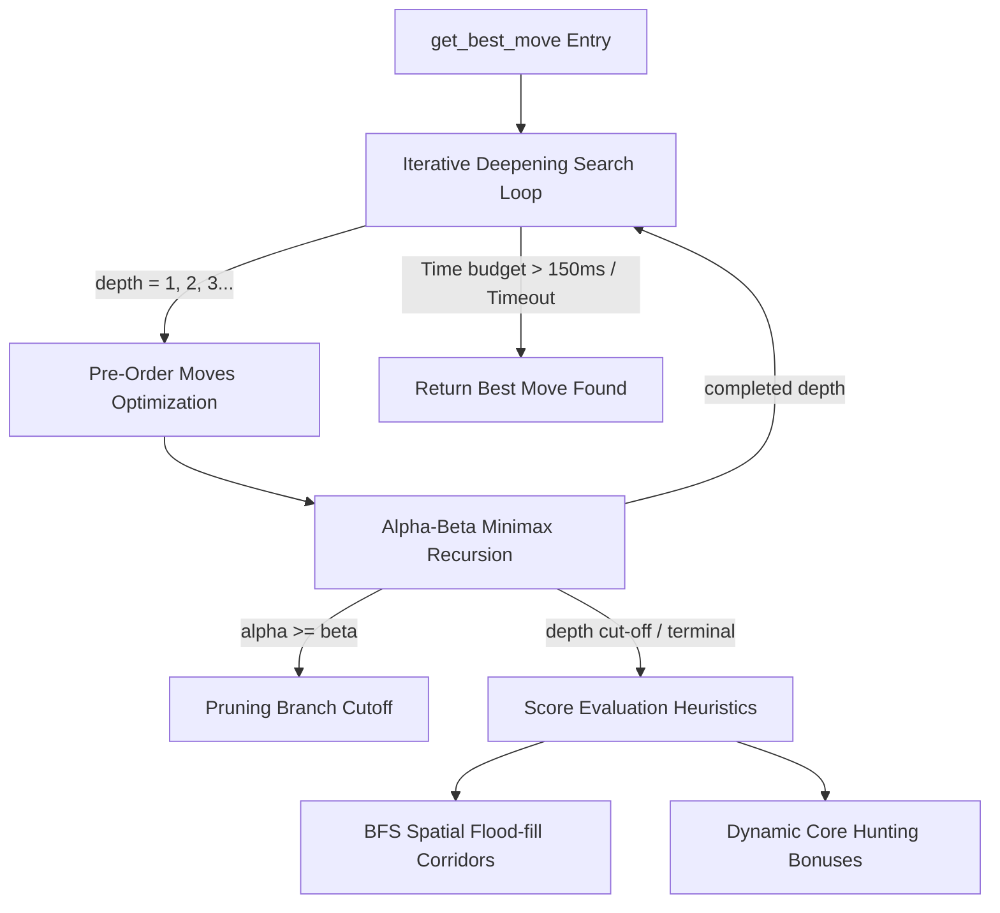
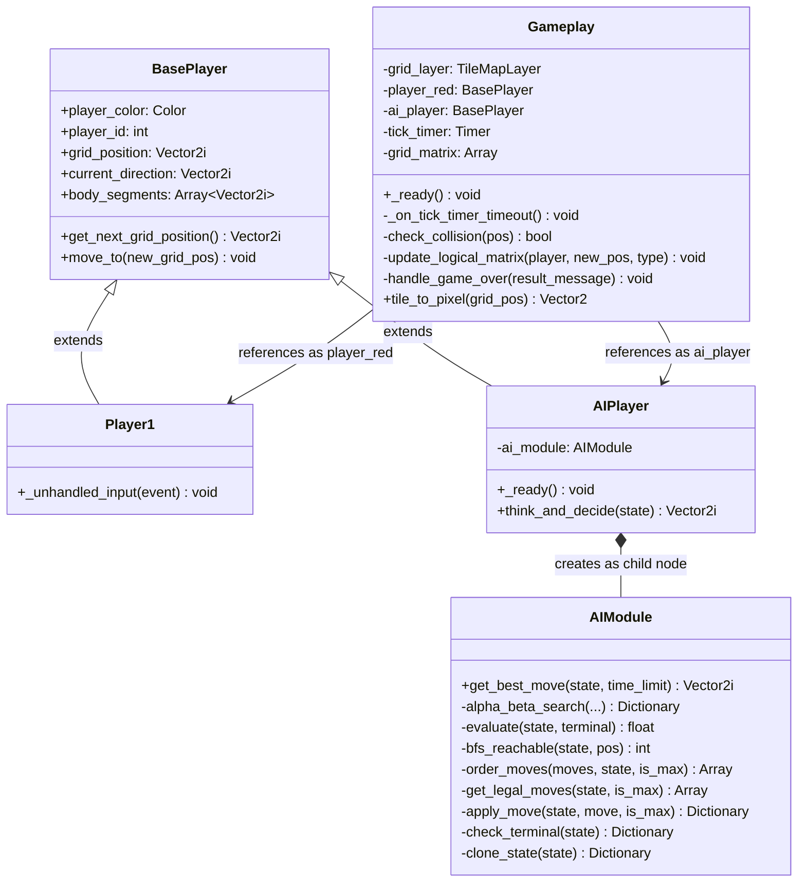
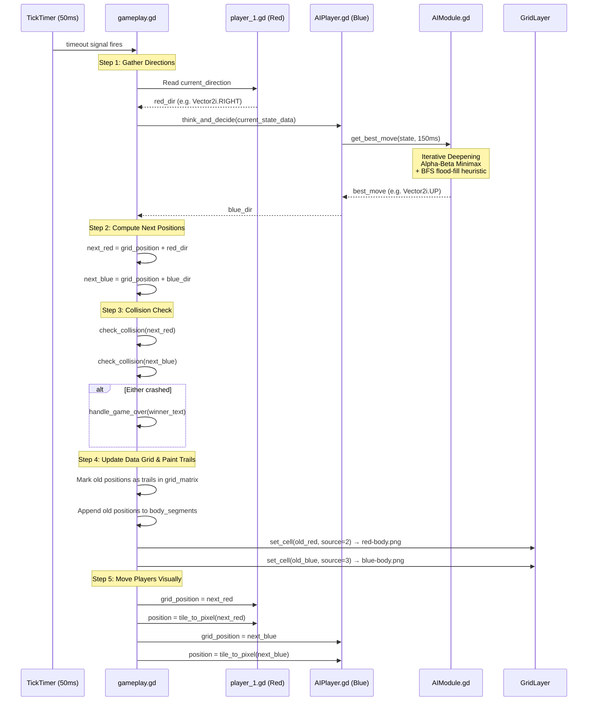
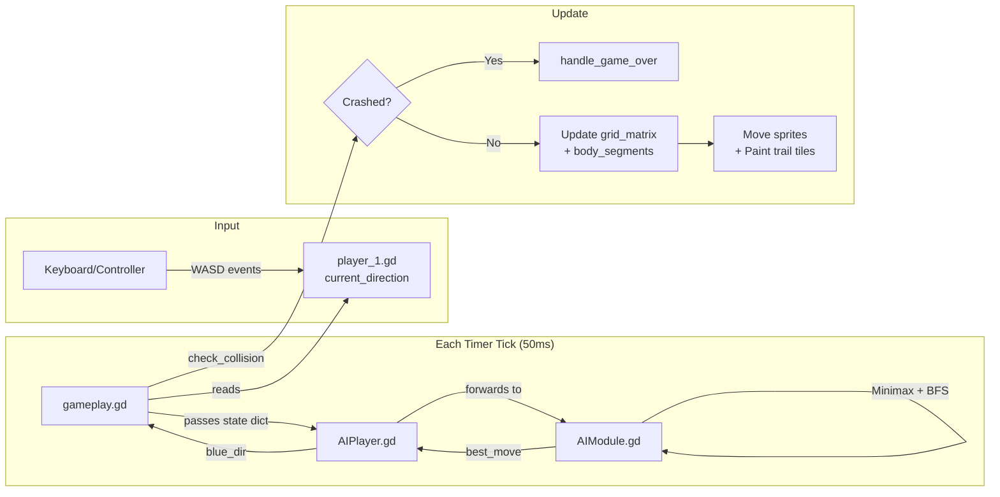

# Table of Contents

- [.editorconfig](#editorconfig)
- [.gitattributes](#gitattributes)
- [.gitignore](#gitignore)
- [assets/fonts/trs_million/license.txt](#assetsfontstrs_millionlicensetxt)
- [export_presets.cfg](#export_presetscfg)
- [project.godot](#projectgodot)
- [readme.md](#readmemd)
- [scenes/game_panel.tscn](#scenesgame_paneltscn)
- [scenes/gameplay/AIPlayer.gd](#scenesgameplayaiplayergd)
- [scenes/gameplay/gameplay.tscn](#scenesgameplaygameplaytscn)
- [scenes/gameplay/player_1.gd](#scenesgameplayplayer_1gd)
- [scenes/gameplay/player_1.tscn](#scenesgameplayplayer_1tscn)
- [scenes/gameplay/player_2.tscn](#scenesgameplayplayer_2tscn)
- [scenes/hud.gd](#sceneshudgd)
- [scenes/hud.tscn](#sceneshudtscn)
- [scenes/menu/ai_demo_panel.gd](#scenesmenuai_demo_panelgd)
- [scenes/menu/ai_demo_panel.tscn](#scenesmenuai_demo_paneltscn)
- [scenes/menu/config_panel.gd](#scenesmenuconfig_panelgd)
- [scenes/menu/config_panel.tscn](#scenesmenuconfig_paneltscn)
- [scenes/menu/controls_map.gd](#scenesmenucontrols_mapgd)
- [scenes/menu/controls_map.tscn](#scenesmenucontrols_maptscn)
- [scenes/menu/main_menu.gd](#scenesmenumain_menugd)
- [scenes/menu/main_menu.tscn](#scenesmenumain_menutscn)
- [scenes/menu/quit.gd](#scenesmenuquitgd)
- [scenes/menu/quit.tscn](#scenesmenuquittscn)
- [scenes/menu/rules_and_mechanics.gd](#scenesmenurules_and_mechanicsgd)
- [scenes/menu/rules_and_mechanics.tscn](#scenesmenurules_and_mechanicstscn)
- [scenes/menu/stats.gd](#scenesmenustatsgd)
- [scenes/menu/stats.tscn](#scenesmenustatstscn)
- [scripts/AIDemoTracer.gd](#scriptsaidemotracergd)
- [scripts/AIModule.gd](#scriptsaimodulegd)
- [scripts/BasePlayer.gd](#scriptsbaseplayergd)
- [scripts/ConfigManager.gd](#scriptsconfigmanagergd)
- [scripts/StatsManager.gd](#scriptsstatsmanagergd)
- [scripts/gameplay.gd](#scriptsgameplaygd)
- [walkthrough.md](#walkthroughmd)

## .editorconfig

```
root = true

[*]
charset = utf-8

```

## .gitattributes

```
# Normalize EOL for all files that Git considers text files.
* text=auto eol=lf

```

## .gitignore

```
# Godot 4+ specific ignores
.godot/
/android/

```

## assets/fonts/trs_million/license.txt

```
The fonts included in this archive are released under a no rights reserved Creative Commons Zero license.  Please do not ask permission to do anything with these fonts. Whatever you want to do with this font, the answer will be yes. Please read about the CC0 Public Domain license before contacting me.

https://creativecommons.org/publicdomain/zero/1.0/

To the extent possible under law, Raymond Larabie has waived all copyright and related or neighboring rights to the fonts in this archive. This work is published from: Japan.
```

## export_presets.cfg

```ini
[preset.0]

name="Windows Desktop"
platform="Windows Desktop"
runnable=true
dedicated_server=false
custom_features=""
export_filter="all_resources"
include_filter=""
exclude_filter=""
export_path="./final_snek_game.exe"
patches=PackedStringArray()
patch_delta_encoding=false
patch_delta_compression_level_zstd=19
patch_delta_min_reduction=0.1
patch_delta_include_filters="*"
patch_delta_exclude_filters=""
encryption_include_filters=""
encryption_exclude_filters=""
seed=0
encrypt_pck=false
encrypt_directory=false
script_export_mode=0

[preset.0.options]

custom_template/debug=""
custom_template/release=""
debug/export_console_wrapper=1
binary_format/embed_pck=false
texture_format/s3tc_bptc=true
texture_format/etc2_astc=false
shader_baker/enabled=false
binary_format/architecture="x86_64"
codesign/enable=false
codesign/timestamp=true
codesign/timestamp_server_url=""
codesign/digest_algorithm=1
codesign/description=""
codesign/custom_options=PackedStringArray()
application/modify_resources=true
application/icon=""
application/console_wrapper_icon=""
application/icon_interpolation=4
application/file_version=""
application/product_version=""
application/company_name=""
application/product_name=""
application/file_description=""
application/copyright=""
application/trademarks=""
application/export_angle=0
application/export_d3d12=0
application/d3d12_agility_sdk_multiarch=true
ssh_remote_deploy/enabled=false
ssh_remote_deploy/host="user@host_ip"
ssh_remote_deploy/port="22"
ssh_remote_deploy/extra_args_ssh=""
ssh_remote_deploy/extra_args_scp=""
ssh_remote_deploy/run_script="Expand-Archive -LiteralPath '{temp_dir}\\{archive_name}' -DestinationPath '{temp_dir}'
$action = New-ScheduledTaskAction -Execute '{temp_dir}\\{exe_name}' -Argument '{cmd_args}'
$trigger = New-ScheduledTaskTrigger -Once -At 00:00
$settings = New-ScheduledTaskSettingsSet -AllowStartIfOnBatteries -DontStopIfGoingOnBatteries
$task = New-ScheduledTask -Action $action -Trigger $trigger -Settings $settings
Register-ScheduledTask godot_remote_debug -InputObject $task -Force:$true
Start-ScheduledTask -TaskName godot_remote_debug
while (Get-ScheduledTask -TaskName godot_remote_debug | ? State -eq running) { Start-Sleep -Milliseconds 100 }
Unregister-ScheduledTask -TaskName godot_remote_debug -Confirm:$false -ErrorAction:SilentlyContinue"
ssh_remote_deploy/cleanup_script="Stop-ScheduledTask -TaskName godot_remote_debug -ErrorAction:SilentlyContinue
Unregister-ScheduledTask -TaskName godot_remote_debug -Confirm:$false -ErrorAction:SilentlyContinue
Remove-Item -Recurse -Force '{temp_dir}'"

```

## project.godot

```ini
; Engine configuration file.
; It's best edited using the editor UI and not directly,
; since the parameters that go here are not all obvious.
;
; Format:
;   [section] ; section goes between []
;   param=value ; assign values to parameters

config_version=5

[application]

config/name="final_snek_game"
run/main_scene="res://scenes/menu/main_menu.tscn"
config/features=PackedStringArray("4.6", "Forward Plus")
config/icon="res://icon.svg"

[autoload]

ConfigManager="*res://scripts/ConfigManager.gd"

[display]

window/size/viewport_width=1280
window/size/viewport_height=720
window/size/mode=4
window/stretch/mode="canvas_items"

[input]

ui_accept={
"deadzone": 0.5,
"events": [Object(InputEventKey,"resource_local_to_scene":false,"resource_name":"","device":0,"window_id":0,"alt_pressed":false,"shift_pressed":false,"ctrl_pressed":false,"meta_pressed":false,"pressed":false,"keycode":4194309,"physical_keycode":0,"key_label":0,"unicode":0,"location":0,"echo":false,"script":null)
, Object(InputEventKey,"resource_local_to_scene":false,"resource_name":"","device":0,"window_id":0,"alt_pressed":false,"shift_pressed":false,"ctrl_pressed":false,"meta_pressed":false,"pressed":false,"keycode":4194310,"physical_keycode":0,"key_label":0,"unicode":0,"location":0,"echo":false,"script":null)
, Object(InputEventKey,"resource_local_to_scene":false,"resource_name":"","device":0,"window_id":0,"alt_pressed":false,"shift_pressed":false,"ctrl_pressed":false,"meta_pressed":false,"pressed":false,"keycode":32,"physical_keycode":0,"key_label":0,"unicode":32,"location":0,"echo":false,"script":null)
, Object(InputEventJoypadButton,"resource_local_to_scene":false,"resource_name":"","device":-1,"button_index":0,"pressure":0.0,"pressed":true,"script":null)
, Object(InputEventKey,"resource_local_to_scene":false,"resource_name":"","device":-1,"window_id":0,"alt_pressed":false,"shift_pressed":false,"ctrl_pressed":false,"meta_pressed":false,"pressed":false,"keycode":0,"physical_keycode":70,"key_label":0,"unicode":102,"location":0,"echo":false,"script":null)
]
}
ui_cancel={
"deadzone": 0.5,
"events": [Object(InputEventKey,"resource_local_to_scene":false,"resource_name":"","device":0,"window_id":0,"alt_pressed":false,"shift_pressed":false,"ctrl_pressed":false,"meta_pressed":false,"pressed":false,"keycode":4194305,"physical_keycode":0,"key_label":0,"unicode":0,"location":0,"echo":false,"script":null)
, Object(InputEventJoypadButton,"resource_local_to_scene":false,"resource_name":"","device":-1,"button_index":1,"pressure":0.0,"pressed":true,"script":null)
]
}
ui_left={
"deadzone": 0.5,
"events": [Object(InputEventKey,"resource_local_to_scene":false,"resource_name":"","device":0,"window_id":0,"alt_pressed":false,"shift_pressed":false,"ctrl_pressed":false,"meta_pressed":false,"pressed":false,"keycode":4194319,"physical_keycode":0,"key_label":0,"unicode":0,"location":0,"echo":false,"script":null)
, Object(InputEventJoypadButton,"resource_local_to_scene":false,"resource_name":"","device":-1,"button_index":13,"pressure":0.0,"pressed":false,"script":null)
, Object(InputEventJoypadMotion,"resource_local_to_scene":false,"resource_name":"","device":-1,"axis":0,"axis_value":-1.0,"script":null)
, Object(InputEventKey,"resource_local_to_scene":false,"resource_name":"","device":-1,"window_id":0,"alt_pressed":false,"shift_pressed":false,"ctrl_pressed":false,"meta_pressed":false,"pressed":false,"keycode":0,"physical_keycode":65,"key_label":0,"unicode":97,"location":0,"echo":false,"script":null)
]
}
ui_right={
"deadzone": 0.5,
"events": [Object(InputEventKey,"resource_local_to_scene":false,"resource_name":"","device":0,"window_id":0,"alt_pressed":false,"shift_pressed":false,"ctrl_pressed":false,"meta_pressed":false,"pressed":false,"keycode":4194321,"physical_keycode":0,"key_label":0,"unicode":0,"location":0,"echo":false,"script":null)
, Object(InputEventJoypadButton,"resource_local_to_scene":false,"resource_name":"","device":-1,"button_index":14,"pressure":0.0,"pressed":false,"script":null)
, Object(InputEventJoypadMotion,"resource_local_to_scene":false,"resource_name":"","device":-1,"axis":0,"axis_value":1.0,"script":null)
, Object(InputEventKey,"resource_local_to_scene":false,"resource_name":"","device":-1,"window_id":0,"alt_pressed":false,"shift_pressed":false,"ctrl_pressed":false,"meta_pressed":false,"pressed":false,"keycode":0,"physical_keycode":68,"key_label":0,"unicode":100,"location":0,"echo":false,"script":null)
]
}
ui_up={
"deadzone": 0.5,
"events": [Object(InputEventKey,"resource_local_to_scene":false,"resource_name":"","device":0,"window_id":0,"alt_pressed":false,"shift_pressed":false,"ctrl_pressed":false,"meta_pressed":false,"pressed":false,"keycode":4194320,"physical_keycode":0,"key_label":0,"unicode":0,"location":0,"echo":false,"script":null)
, Object(InputEventJoypadButton,"resource_local_to_scene":false,"resource_name":"","device":-1,"button_index":11,"pressure":0.0,"pressed":false,"script":null)
, Object(InputEventJoypadMotion,"resource_local_to_scene":false,"resource_name":"","device":-1,"axis":1,"axis_value":-1.0,"script":null)
, Object(InputEventKey,"resource_local_to_scene":false,"resource_name":"","device":-1,"window_id":0,"alt_pressed":false,"shift_pressed":false,"ctrl_pressed":false,"meta_pressed":false,"pressed":false,"keycode":0,"physical_keycode":87,"key_label":0,"unicode":119,"location":0,"echo":false,"script":null)
]
}
ui_down={
"deadzone": 0.5,
"events": [Object(InputEventKey,"resource_local_to_scene":false,"resource_name":"","device":0,"window_id":0,"alt_pressed":false,"shift_pressed":false,"ctrl_pressed":false,"meta_pressed":false,"pressed":false,"keycode":4194322,"physical_keycode":0,"key_label":0,"unicode":0,"location":0,"echo":false,"script":null)
, Object(InputEventJoypadButton,"resource_local_to_scene":false,"resource_name":"","device":-1,"button_index":12,"pressure":0.0,"pressed":false,"script":null)
, Object(InputEventJoypadMotion,"resource_local_to_scene":false,"resource_name":"","device":-1,"axis":1,"axis_value":1.0,"script":null)
, Object(InputEventKey,"resource_local_to_scene":false,"resource_name":"","device":-1,"window_id":0,"alt_pressed":false,"shift_pressed":false,"ctrl_pressed":false,"meta_pressed":false,"pressed":false,"keycode":0,"physical_keycode":83,"key_label":0,"unicode":115,"location":0,"echo":false,"script":null)
]
}
p1_moveLeft={
"deadzone": 0.2,
"events": [Object(InputEventKey,"resource_local_to_scene":false,"resource_name":"","device":-1,"window_id":0,"alt_pressed":false,"shift_pressed":false,"ctrl_pressed":false,"meta_pressed":false,"pressed":false,"keycode":0,"physical_keycode":65,"key_label":0,"unicode":97,"location":0,"echo":false,"script":null)
, Object(InputEventJoypadMotion,"resource_local_to_scene":false,"resource_name":"","device":-1,"axis":0,"axis_value":-1.0,"script":null)
, Object(InputEventJoypadButton,"resource_local_to_scene":false,"resource_name":"","device":-1,"button_index":13,"pressure":0.0,"pressed":true,"script":null)
]
}
p1_moveRight={
"deadzone": 0.2,
"events": [Object(InputEventKey,"resource_local_to_scene":false,"resource_name":"","device":-1,"window_id":0,"alt_pressed":false,"shift_pressed":false,"ctrl_pressed":false,"meta_pressed":false,"pressed":false,"keycode":0,"physical_keycode":68,"key_label":0,"unicode":100,"location":0,"echo":false,"script":null)
, Object(InputEventJoypadMotion,"resource_local_to_scene":false,"resource_name":"","device":-1,"axis":0,"axis_value":1.0,"script":null)
, Object(InputEventJoypadButton,"resource_local_to_scene":false,"resource_name":"","device":-1,"button_index":14,"pressure":0.0,"pressed":true,"script":null)
]
}
p1_moveUp={
"deadzone": 0.2,
"events": [Object(InputEventKey,"resource_local_to_scene":false,"resource_name":"","device":-1,"window_id":0,"alt_pressed":false,"shift_pressed":false,"ctrl_pressed":false,"meta_pressed":false,"pressed":false,"keycode":0,"physical_keycode":87,"key_label":0,"unicode":119,"location":0,"echo":false,"script":null)
, Object(InputEventJoypadMotion,"resource_local_to_scene":false,"resource_name":"","device":-1,"axis":1,"axis_value":-1.0,"script":null)
, Object(InputEventJoypadButton,"resource_local_to_scene":false,"resource_name":"","device":-1,"button_index":11,"pressure":0.0,"pressed":true,"script":null)
]
}
p1_moveDown={
"deadzone": 0.2,
"events": [Object(InputEventKey,"resource_local_to_scene":false,"resource_name":"","device":-1,"window_id":0,"alt_pressed":false,"shift_pressed":false,"ctrl_pressed":false,"meta_pressed":false,"pressed":false,"keycode":0,"physical_keycode":83,"key_label":0,"unicode":115,"location":0,"echo":false,"script":null)
, Object(InputEventJoypadMotion,"resource_local_to_scene":false,"resource_name":"","device":-1,"axis":1,"axis_value":1.0,"script":null)
, Object(InputEventJoypadButton,"resource_local_to_scene":false,"resource_name":"","device":-1,"button_index":12,"pressure":0.0,"pressed":true,"script":null)
]
}
p2_moveLeft={
"deadzone": 0.2,
"events": [Object(InputEventKey,"resource_local_to_scene":false,"resource_name":"","device":-1,"window_id":0,"alt_pressed":false,"shift_pressed":false,"ctrl_pressed":false,"meta_pressed":false,"pressed":false,"keycode":0,"physical_keycode":4194319,"key_label":0,"unicode":0,"location":0,"echo":false,"script":null)
, Object(InputEventJoypadMotion,"resource_local_to_scene":false,"resource_name":"","device":-1,"axis":2,"axis_value":-1.0,"script":null)
, Object(InputEventJoypadButton,"resource_local_to_scene":false,"resource_name":"","device":-1,"button_index":2,"pressure":0.0,"pressed":true,"script":null)
]
}
p2_moveRight={
"deadzone": 0.2,
"events": [Object(InputEventKey,"resource_local_to_scene":false,"resource_name":"","device":-1,"window_id":0,"alt_pressed":false,"shift_pressed":false,"ctrl_pressed":false,"meta_pressed":false,"pressed":false,"keycode":0,"physical_keycode":4194321,"key_label":0,"unicode":0,"location":0,"echo":false,"script":null)
, Object(InputEventJoypadMotion,"resource_local_to_scene":false,"resource_name":"","device":-1,"axis":2,"axis_value":1.0,"script":null)
, Object(InputEventJoypadButton,"resource_local_to_scene":false,"resource_name":"","device":-1,"button_index":1,"pressure":0.0,"pressed":true,"script":null)
]
}
p2_moveUp={
"deadzone": 0.2,
"events": [Object(InputEventKey,"resource_local_to_scene":false,"resource_name":"","device":-1,"window_id":0,"alt_pressed":false,"shift_pressed":false,"ctrl_pressed":false,"meta_pressed":false,"pressed":false,"keycode":0,"physical_keycode":4194320,"key_label":0,"unicode":0,"location":0,"echo":false,"script":null)
, Object(InputEventJoypadMotion,"resource_local_to_scene":false,"resource_name":"","device":-1,"axis":3,"axis_value":-1.0,"script":null)
, Object(InputEventJoypadButton,"resource_local_to_scene":false,"resource_name":"","device":-1,"button_index":3,"pressure":0.0,"pressed":true,"script":null)
]
}
p2_moveDown={
"deadzone": 0.2,
"events": [Object(InputEventKey,"resource_local_to_scene":false,"resource_name":"","device":-1,"window_id":0,"alt_pressed":false,"shift_pressed":false,"ctrl_pressed":false,"meta_pressed":false,"pressed":false,"keycode":0,"physical_keycode":4194322,"key_label":0,"unicode":0,"location":0,"echo":false,"script":null)
, Object(InputEventJoypadMotion,"resource_local_to_scene":false,"resource_name":"","device":-1,"axis":3,"axis_value":1.0,"script":null)
, Object(InputEventJoypadButton,"resource_local_to_scene":false,"resource_name":"","device":-1,"button_index":0,"pressure":0.0,"pressed":true,"script":null)
]
}
pause_game={
"deadzone": 0.2,
"events": [Object(InputEventKey,"resource_local_to_scene":false,"resource_name":"","device":-1,"window_id":0,"alt_pressed":false,"shift_pressed":false,"ctrl_pressed":false,"meta_pressed":false,"pressed":false,"keycode":0,"physical_keycode":4194305,"key_label":0,"unicode":0,"location":0,"echo":false,"script":null)
, Object(InputEventJoypadButton,"resource_local_to_scene":false,"resource_name":"","device":-1,"button_index":6,"pressure":0.0,"pressed":true,"script":null)
]
}

[physics]

3d/physics_engine="Jolt Physics"

[rendering]

rendering_device/driver.windows="d3d12"

```

## readme.md

```markdown
# 👾 Color Grid Clash (v1.2)
### High-Fidelity Cybernetic Snake Duel & AI Visual Walkthrough Debugger

---

## 📝 Introduction

**Color Grid Clash** is a highly polished, grid-based, two-player snake duel game built in Godot 4.x. Inspired by the visual aesthetic and mechanics of the classic *Tron Light Cycle* arena, two competitor snakes (Red and Blue) race across a 20×20 technological coordinate field. The objective is to claim territory, consume energy cores, and trap the opponent while actively avoiding out-of-bounds walls, static generated barriers, and the trails left behind by both sneks.

The project features a **symmetrical dual-sidebar UI** with vibrant HSL-calibrated neon visuals and circular vector glowing player heads. It supports:
1. **Solo vs. AI Mode**: Test your steering against a high-performance automated minimax agent.
2. **Player vs. Player (PvP) Mode**: Local human duel with independent controller/keyboard action mappings.
3. **AI vs. AI Watch Mode**: Spectate two minimax agents competing dynamically.
4. **AI Visual Walkthrough Debugger**: An interactive educational scene displaying real-time telemetry, spatial overlays (BFS reachability fields and candidate simulated pathways), and a step-by-step 29-line code highlighted minimax recursion trace with full time-travel backtrack undos.

---

## 🎮 Rules and Mechanics of the Game

### 1. Control Bindings & Input System

The game features console-grade input mappings with full focus and keyboard/joypad navigation support:

#### Keyboard Bindings:
* **Player 1 (Red Player / Human):**
  * **Move Up:** `W` or `Up Arrow` (In Solo vs AI) / `W` (In PvP)
  * **Move Down:** `S` or `Down Arrow` (In Solo vs AI) / `S` (In PvP)
  * **Move Left:** `A` or `Left Arrow` (In Solo vs AI) / `A` (In PvP)
  * **Move Right:** `D` or `Right Arrow` (In Solo vs AI) / `D` (In PvP)
* **Player 2 (Blue Player / PvP Human):**
  * **Move Up:** `Up Arrow`
  * **Move Down:** `Down Arrow`
  * **Move Left:** `Left Arrow`
  * **Move Right:** `Right Arrow`
* **Confirm / Action:** `Enter` or `Space`
* **Cancel / Back / Pause:** `Escape`

#### Joypad / Controller Mappings:
* **Directional Movement:** D-Pad or Left Analog Joystick
* **Confirm / OK:** Xbox `A` / Sony `Cross` / Nintendo `B`
* **Cancel / Back / Forfeit:** Xbox `B` / Sony `Circle` / Nintendo `A`
* **Pause Menu Toggle:** `Start / Menu`

---

### 2. Core Gameplay Mechanics

* **The Arena (Gameplay Area):**
  * The match takes place on a **20×20 grid** where each logical cell spans a visual `30×30px` block.
  * Symmetrical spawns position Red at `red_spawn_pos` (randomized inside coordinates `X = [2..7]`, `Y = [2..17]`) and Blue at `blue_spawn_pos` (randomized inside `X = [12..17]`, `Y = [2..17]`).
  * Runways construct a 3×3 spawn safety zone and a 4-tile runway in front of the active snek to ensure players never spawn directly inside an obstacle wall.
* **Clashing and Collisions:**
  * Sneks advance one cell per tick, leaving behind a permanent trail tile of their color.
  * A **collision crash** occurs when a head cell steps into:
    * Out-of-bounds walls (boundary index `< 0` or `>= 20`).
    * Static generated obstacle walls (`CellType.WALL`).
    * Any red trail tiles (`CellType.RED_TRAIL`) or blue trail tiles (`CellType.BLUE_TRAIL`).
  * **Head-to-head Clash**: If both heads step onto the exact same coordinate on the same tick, both crash.
  * **Double Collision**: If both sneks crash on the same tick, the round ends in a **DRAW**. If only one crashes, the survivor wins the round.
* **Obstacle Wall Generation:**
  * Wall density is customizable in the settings dashboard:
    * **None**: `0.00` (0% wall density).
    * **Less**: `0.05 - 0.10` (5-10% random grid cells filled).
    * **More**: `0.11 - 0.20` (11-20% random grid cells filled).
  * Walls are placed randomly at the start of each round, strictly avoiding the spawns and safety runway vectors.

---

### 3. Scoring System

Round points are calculated dynamically upon completion and added to the permanent match score across all rounds. The player with the highest accumulated match score after **5 rounds** is crowned the Grand Champion.

| Event / Action | Score Value | Notes |
| :--- | :--- | :--- |
| **Grid Cell Claimed** | `+1 Point` | Counted from active trail trails (including flood fills) |
| **Basic Energy Core** | `+5 Points` | Collected by running over glowing standard cores |
| **Rare Energy Core** | `+10 Points` | Collected by running over rare golden pulsing cores |
| **Round Victory** | `+50 Points` | Awarded strictly to the surviving player of the round |
| **Simultaneous Draw** | `+25 Points` | Split points awarded to both players in a double crash |

---

### 4. BFS Enclosure Flood Fill & Energy Core System

#### Territorial Enclosure Flood Fill:
At the end of each tick, the game evaluates whether a snek has successfully enclosed a region of empty space:
1. **BFS Reachability Isolation**: A Breadth-First Search (BFS) is executed from the snek head.
   * To prevent co-enclosures using opposing trails, the search passes freely through the *opponent's* trails but is strictly blocked by the snek's *own* trails and static walls.
2. **Territory Isolation**: Any empty cells that were not reached by the snek's BFS are isolated as candidates.
3. **Validation Filter**: Candidates are verified to check that they do not contain either player's current head position and touch at least one segment of the snek's existing trail.
4. ** territoriale Claim**: Validated cells are instantly converted into the snek's trail color (`CellType.RED_TRAIL` or `CellType.BLUE_TRAIL`), awarding `+1 point` per cell and locking that space as an obstacle.

#### Circular Glowing Energy Cores:
* **Co-existence**: Cores are placed programmatically on empty coordinates, pulsing with tweened scale animations and glowing HSL shadows.
* **Hunt & Absorption**: Moving onto a core consumes it immediately, awarding points. If a core is swallowed inside a flooded territorial enclosure, the player absorbs it automatically (+5 for basic, +10 for rare) and a replacement core is spawned on the remaining playable grid cells.

---

## 📐 System Architecture

### 1. Project Directory Structure
```
final-snek-game/
├── project.godot                # Godot engine config (viewport width=1280, height=720, autoloads)
├── assets/                      # High-contrast neon PNG sprite assets & typefaces
│   ├── red-head.png / red-body.png
│   ├── blue-head.png / blue-body.png
│   ├── wall.png / grid.png
│   ├── goto_prevmove.png / goto_nextmove.png (stepper deck icon textures)
│   └── fonts/
│       └── TRS-Million Rg.otf   # Futuristic cybernetic neon typeface
├── scripts/                     # Global scripts and engines
│   ├── ConfigManager.gd         # Persistent configuration manager singleton (Player setup, speeds, walls)
│   ├── StatsManager.gd          # Database manager saving high scores and historic statistics to JSON
│   ├── AIModule.gd              # Minimax engine running Alpha-Beta & BFS Corridors heuristics
│   └── AIDemoTracer.gd          # Search tracer recording chronological TraceSteps for debugger
├── scenes/                      # Scene canvases
│   ├── game_panel.tscn          # Symmetrical double-sidebar gameplay canvas
│   ├── hud.tscn / hud.gd        # Programmatically drawn HUD containers (telemetry, countdown, post-round)
│   ├── gameplay/
│   │   ├── gameplay.tscn / gameplay.gd    # Master game coordinator, grid layers, spawns, and collisions
│   │   ├── player_1.tscn / player_1.gd    # Red player input or thinker bridge
│   │   └── player_2.tscn / AIPlayer.gd    # Blue AI / Human dual controller
│   └── menu/
│       ├── main_menu.tscn / main_menu.gd  # Neon cybernetic main menu sidebar panel
│       ├── config_panel.tscn / config_panel.gd # Custom slider-based options configuration
│       ├── stats.tscn / stats.gd          # Statistics history loader
│       └── ai_demo_panel.tscn / ai_demo_panel.gd # Triple-column educational visual debugger
```

---

### 2. Scene Tree Layout
When playing a standard match, the main viewport loads `game_panel.tscn` which instantiates the following hierarchy:

```
GamePanel (Node2D)
├── Background (ColorRect)                # Deep space background color (#08090d, size 1280x720)
├── Gameplay (gameplay.tscn)               # position = Vector2(340, 60), size 600x600px
│   ├── ColorRect                        # Deep cybernetic charcoal backdrop (#07090d)
│   ├── BackgroundGridLayer (TileMapLayer) # Programmatic grid coordinates guide (Steel-Blue modulation)
│   ├── GridLayer (TileMapLayer)          # Active gameplay cells (trails, walls) mod=WHITE
│   ├── Player1 (player_1.tscn)           # Red player head node
│   │   └── Area2D -> Sprite2D            # displays red-head.png
│   ├── AIPlayer (player_2.tscn)          # Blue snek head node
│   │   └── Area2D -> Sprite2D            # displays blue-head.png
│   ├── GameplayGridFrame (Panel)         # Glowing white frame border around the 600x600px grid
│   └── Node2D (UpperLeft / LowerRight)   # Marker positions
└── HUD (hud.tscn)                        # Fullscreen overlay CanvasLayer
    └── Control (MainControl)             # process_mode = PROCESS_MODE_ALWAYS
        ├── LeftHUD (PanelContainer)      # P1 Score, Captures progress bar, core indicators
        ├── RightHUD (PanelContainer)     # P2 Score, Minimax AI Telemetry Box (depth, nodes, ms)
        ├── TopHUD (HBoxContainer)        # Round counts, clock timer, round history dots (●/◌)
        └── Overlays (Pause, Countdown, Breakdown, Championship)
```

---

### 3. Tick-by-Tick Execution Sequence
On every wait-time interval (Slow=0.50s, Intermediate=0.10s, Fast=0.05s), the master tick timer `_on_tick_timer_timeout()` fires in `gameplay.gd`. The execution flows in this chronological order:



---

## 🤖 AI Architecture and Algorithm

The computer agent's decision-making flow is implemented inside [AIModule.gd](file:///c:/Users/vanmo/Documents/final-snek-game/scripts/AIModule.gd). It leverages a robust, search-depth optimizing game-tree architecture designed to solve spatial duels.

### 🧠 Deep-Dive of AIModule.gd Algorithms



---

### 1. Iterative Deepening Search (IDS)
Instead of searching to a fixed depth (which can cause slow frame stutter if the board is complex, or move shallowly when the board is empty), the AI implements **Iterative Deepening**. 
* The search starts at `depth = 1`. 
* Once the search completed successfully for that depth, it increments `depth += 1` and runs again.
* If a search branch takes too long and exceeds the **150 milliseconds** time limit budget, the loop terminates immediately, throwing a `TIMEOUT_SIGNAL` and falling back safely to the best decision committed during the last fully-completed depth search.

---

### 2. Alpha-Beta Minimax Search
The core decision engine is a recursive game-tree search that models perfect-information duels:
* **MAX Player (Blue AI)**: Selects branches that maximize the evaluation score.
* **MIN Player (Red AI / Human)**: Modeled as the opponent, selecting branches that minimize the evaluation score (playing optimally to trap Blue).
* **Alpha-Beta Pruning**: Maintains two bounds during recursion:
  * `Alpha`: The highest score the maximizing player is already guaranteed.
  * `Beta`: The lowest score the minimizing player is already guaranteed.
  * If at any node `alpha >= beta`, the maximizing player can force a better outcome elsewhere, meaning the current recursive branch is mathematically guaranteed to be discarded. The AI halts recursion on this branch instantly (**Pruning**), avoiding evaluating thousands of irrelevant grid nodes.

---

### 3. Pre-Sorted Move Ordering
To maximize the efficiency of Alpha-Beta pruning, moves at each recursion level are pre-sorted using a fast heuristics check:
* Evaluates all adjacent moves and performs a shallow Breadth-First Search (BFS) to count available corridors.
* **Blue (MAX)**: Sorts moves in descending order (highest spatial corridors explored first).
* **Red (MIN)**: Sorts moves in ascending order.
* Exploring the most optimal paths first allows Alpha-Beta to establish extremely tight bounds early in the search, leading to massive branch pruning and enabling depths of `depth = 6` to `depth = 12` within the 150ms limit.

---

### 4. BFS Spatial Flood-Fill & Corridors Heuristic
When the minimax search reaches a terminal node or depth cut-off, it scores the simulated board state using a mathematical evaluation formula:

$$\text{Score} = 1.0 \times (\text{Blue Trail} - \text{Red Trail}) + 2.0 \times (\text{Blue Reach} - \text{Red Reach}) + (\text{Blue Bonus} - \text{Red Bonus})$$

* **Breadth-First Search (BFS) Reachability**: Spawns a high-performance hash-set flood-fill starting from the simulated head positions. It counts the number of empty grid coordinates that each snek can physically navigate into.
* **Corridor Safety**: By giving a massive weighting (`2.0`) to spatial reachability, the AI establishes a supreme survival instinct. It actively avoids compact corridors, dead ends, or tunnels that would lead to entrapment, preferring wide-open areas where it cannot be easily cut off.

---

### 5. Dynamic Core Hunting Heuristic
Previously, the AI treated energy core coordinates as obstacles to avoid crashes, preventing it from ever collecting cores. 
* **Safe Traversal**: The system classifies `ENERGY_CORE` and `RARE_ENERGY_CORE` as completely safe to traverse.
* **Simulated Consumption**: Inside `apply_move()` during search simulations, if a snek steps onto a core coordinate, it is consumed logically, and a simulated bonus (`+15.0` for basic, `+30.0` for rare) is added to the snek's evaluation state (`blue_bonus` or `red_bonus`).
* **Active Hunting**: The evaluation score aggregates these core collection bonuses. Consequently, when the minimax search evaluates pathways, it naturally steers the snek toward coordinates containing energy cores, making the AI hunt and consume cores aggressively throughout the match!

```

## scenes/game_panel.tscn

```ini
[gd_scene format=3 uid="uid://bh6m5pb65b27t"]

[ext_resource type="PackedScene" uid="uid://disylkqcra4y8" path="res://scenes/gameplay/gameplay.tscn" id="1_bib8n"]
[ext_resource type="PackedScene" uid="uid://70pi5k88gfg0" path="res://scenes/hud.tscn" id="2_hud"]

[node name="GamePanel" type="Node2D" unique_id=936302786]

[node name="Background" type="ColorRect" parent="." unique_id=115575096]
offset_right = 1280.0
offset_bottom = 720.0
color = Color(0.03137255, 0.03529412, 0.05098039, 1)

[node name="Gameplay" parent="." unique_id=1072367256 instance=ExtResource("1_bib8n")]
position = Vector2(340, 60)

[node name="HUD" parent="." unique_id=639300223 instance=ExtResource("2_hud")]

```

## scenes/gameplay/AIPlayer.gd

```gdscript
# AIPlayer.gd
extends BasePlayer

var ai_module: AIModule = null

func _ready() -> void:
	if ConfigManager.blue_is_ai:
		# Create and add the AIModule node programmatically
		ai_module = AIModule.new()
		add_child(ai_module)

# Captures keyboard and controller inputs for Player 2 in Human mode
func _unhandled_input(event: InputEvent) -> void:
	if not ConfigManager.blue_is_ai:
		if event.is_action_pressed("p2_moveUp") and current_direction != Vector2i.DOWN:
			current_direction = Vector2i.UP
		elif event.is_action_pressed("p2_moveDown") and current_direction != Vector2i.UP:
			current_direction = Vector2i.DOWN
		elif event.is_action_pressed("p2_moveLeft") and current_direction != Vector2i.RIGHT:
			current_direction = Vector2i.LEFT
		elif event.is_action_pressed("p2_moveRight") and current_direction != Vector2i.LEFT:
			current_direction = Vector2i.RIGHT

# This gets called by the main gameplay coordinator right before a game tick.
# It returns the decided direction Vector2i back to the gameplay script.
func think_and_decide(game_state_data: Dictionary) -> Vector2i:
	if ai_module != null:
		# Pass the current state and a safe time limit of 150 milliseconds
		var best_move: Vector2i = ai_module.get_best_move(game_state_data, 150.0, true)
		current_direction = best_move
		return best_move
	return current_direction

```

## scenes/gameplay/gameplay.tscn

```ini
[gd_scene format=4 uid="uid://disylkqcra4y8"]

[ext_resource type="Script" uid="uid://btnexngtqht72" path="res://scripts/gameplay.gd" id="1_x0t60"]
[ext_resource type="Texture2D" uid="uid://b5lrg64b1kswb" path="res://assets/grid3.png" id="2_elju3"]
[ext_resource type="PackedScene" uid="uid://fwmgdt24h1fc" path="res://scenes/gameplay/player_1.tscn" id="3_0w2j2"]
[ext_resource type="Script" uid="uid://x0mk5c5jn12b" path="res://scenes/gameplay/player_1.gd" id="4_q64rj"]
[ext_resource type="Texture2D" uid="uid://b5b5nssvs60oh" path="res://assets/wall.png" id="5_elju3"]
[ext_resource type="PackedScene" uid="uid://85v0w31axark" path="res://scenes/gameplay/player_2.tscn" id="5_pa1on"]
[ext_resource type="Script" uid="uid://dp8i4cfhjkn1m" path="res://scenes/gameplay/AIPlayer.gd" id="6_0w2j2"]
[ext_resource type="Texture2D" uid="uid://yunfrqqlkiii" path="res://assets/red-body.png" id="7_red_body"]
[ext_resource type="Texture2D" uid="uid://b6iub3j6ojfw3" path="res://assets/blue-body.png" id="8_blue_body"]

[sub_resource type="TileSetAtlasSource" id="TileSetAtlasSource_bhb63"]
texture = ExtResource("2_elju3")
texture_region_size = Vector2i(30, 30)
0:0/0 = 0

[sub_resource type="TileSetAtlasSource" id="TileSetAtlasSource_red"]
texture = ExtResource("7_red_body")
texture_region_size = Vector2i(30, 30)
0:0/0 = 0

[sub_resource type="TileSetAtlasSource" id="TileSetAtlasSource_blue"]
texture = ExtResource("8_blue_body")
texture_region_size = Vector2i(30, 30)
0:0/0 = 0

[sub_resource type="TileSetAtlasSource" id="TileSetAtlasSource_lb4ud"]
texture = ExtResource("5_elju3")
texture_region_size = Vector2i(30, 30)
0:0/0 = 0

[sub_resource type="TileSet" id="TileSet_q64rj"]
tile_size = Vector2i(30, 30)
sources/2 = SubResource("TileSetAtlasSource_red")
sources/3 = SubResource("TileSetAtlasSource_blue")
sources/4 = SubResource("TileSetAtlasSource_lb4ud")
sources/1 = SubResource("TileSetAtlasSource_bhb63")

[node name="Gameplay" type="Node2D" unique_id=1072367256]
script = ExtResource("1_x0t60")

[node name="ColorRect" type="ColorRect" parent="." unique_id=163254071]
offset_right = 600.0
offset_bottom = 600.0
color = Color(0.75686276, 0.75686276, 0.75686276, 1)

[node name="GridLayer" type="TileMapLayer" parent="." unique_id=289266018]
tile_map_data = PackedByteArray("AAAAAAAAAQAAAAAAAAAAAAEAAQAAAAAAAAAAAAIAAQAAAAAAAAAAAAMAAQAAAAAAAAAAAAQAAQAAAAAAAAAAAAUAAQAAAAAAAAAAAAYAAQAAAAAAAAAAAAcAAQAAAAAAAAAAAAgAAQAAAAAAAAAAAAkAAQAAAAAAAAAAAAoAAQAAAAAAAAAAAAsAAQAAAAAAAAAAAAwAAQAAAAAAAAAAAA0AAQAAAAAAAAAAAA4AAQAAAAAAAAAAAA8AAQAAAAAAAAAAABAAAQAAAAAAAAAAABEAAQAAAAAAAAAAABIAAQAAAAAAAAAAABMAAQAAAAAAAAABAAAAAQAAAAAAAAABAAEAAQAAAAAAAAABAAIAAQAAAAAAAAABAAMAAQAAAAAAAAABAAQAAQAAAAAAAAABAAUAAQAAAAAAAAABAAYAAQAAAAAAAAABAAcAAQAAAAAAAAABAAgAAQAAAAAAAAABAAkAAQAAAAAAAAABAAoAAQAAAAAAAAABAAsAAQAAAAAAAAABAAwAAQAAAAAAAAABAA0AAQAAAAAAAAABAA4AAQAAAAAAAAABAA8AAQAAAAAAAAABABAAAQAAAAAAAAABABEAAQAAAAAAAAABABIAAQAAAAAAAAABABMAAQAAAAAAAAACAAAAAQAAAAAAAAACAAEAAQAAAAAAAAACAAIAAQAAAAAAAAACAAMAAQAAAAAAAAACAAQAAQAAAAAAAAACAAUAAQAAAAAAAAACAAYAAQAAAAAAAAACAAcAAQAAAAAAAAACAAgAAQAAAAAAAAACAAkAAQAAAAAAAAACAAoAAQAAAAAAAAACAAsAAQAAAAAAAAACAAwAAQAAAAAAAAACAA0AAQAAAAAAAAACAA4AAQAAAAAAAAACAA8AAQAAAAAAAAACABAAAQAAAAAAAAACABEAAQAAAAAAAAACABIAAQAAAAAAAAACABMAAQAAAAAAAAADAAAAAQAAAAAAAAADAAEAAQAAAAAAAAADAAIAAQAAAAAAAAADAAMAAQAAAAAAAAADAAQAAQAAAAAAAAADAAUAAQAAAAAAAAADAAYAAQAAAAAAAAADAAcAAQAAAAAAAAADAAgAAQAAAAAAAAADAAkAAQAAAAAAAAADAAoAAQAAAAAAAAADAAsAAQAAAAAAAAADAAwAAQAAAAAAAAADAA0AAQAAAAAAAAADAA4AAQAAAAAAAAADAA8AAQAAAAAAAAADABAAAQAAAAAAAAADABEAAQAAAAAAAAADABIAAQAAAAAAAAADABMAAQAAAAAAAAAEAAAAAQAAAAAAAAAEAAEAAQAAAAAAAAAEAAIAAQAAAAAAAAAEAAMAAQAAAAAAAAAEAAQAAQAAAAAAAAAEAAUAAQAAAAAAAAAEAAYAAQAAAAAAAAAEAAcAAQAAAAAAAAAEAAgAAQAAAAAAAAAEAAkAAQAAAAAAAAAEAAoAAQAAAAAAAAAEAAsAAQAAAAAAAAAEAAwAAQAAAAAAAAAEAA0AAQAAAAAAAAAEAA4AAQAAAAAAAAAEAA8AAQAAAAAAAAAEABAAAQAAAAAAAAAEABEAAQAAAAAAAAAEABIAAQAAAAAAAAAEABMAAQAAAAAAAAAFAAAAAQAAAAAAAAAFAAEAAQAAAAAAAAAFAAIAAQAAAAAAAAAFAAMAAQAAAAAAAAAFAAQAAQAAAAAAAAAFAAUAAQAAAAAAAAAFAAYAAQAAAAAAAAAFAAcAAQAAAAAAAAAFAAgAAQAAAAAAAAAFAAkAAQAAAAAAAAAFAAoAAQAAAAAAAAAFAAsAAQAAAAAAAAAFAAwAAQAAAAAAAAAFAA0AAQAAAAAAAAAFAA4AAQAAAAAAAAAFAA8AAQAAAAAAAAAFABAAAQAAAAAAAAAFABEAAQAAAAAAAAAFABIAAQAAAAAAAAAFABMAAQAAAAAAAAAGAAAAAQAAAAAAAAAGAAEAAQAAAAAAAAAGAAIAAQAAAAAAAAAGAAMAAQAAAAAAAAAGAAQAAQAAAAAAAAAGAAUAAQAAAAAAAAAGAAYAAQAAAAAAAAAGAAcAAQAAAAAAAAAGAAgAAQAAAAAAAAAGAAkAAQAAAAAAAAAGAAoAAQAAAAAAAAAGAAsAAQAAAAAAAAAGAAwAAQAAAAAAAAAGAA0AAQAAAAAAAAAGAA4AAQAAAAAAAAAGAA8AAQAAAAAAAAAGABAAAQAAAAAAAAAGABEAAQAAAAAAAAAGABIAAQAAAAAAAAAGABMAAQAAAAAAAAAHAAAAAQAAAAAAAAAHAAEAAQAAAAAAAAAHAAIAAQAAAAAAAAAHAAMAAQAAAAAAAAAHAAQAAQAAAAAAAAAHAAUAAQAAAAAAAAAHAAYAAQAAAAAAAAAHAAcAAQAAAAAAAAAHAAgAAQAAAAAAAAAHAAkAAQAAAAAAAAAHAAoAAQAAAAAAAAAHAAsAAQAAAAAAAAAHAAwAAQAAAAAAAAAHAA0AAQAAAAAAAAAHAA4AAQAAAAAAAAAHAA8AAQAAAAAAAAAHABAAAQAAAAAAAAAHABEAAQAAAAAAAAAHABIAAQAAAAAAAAAHABMAAQAAAAAAAAAIAAAAAQAAAAAAAAAIAAEAAQAAAAAAAAAIAAIAAQAAAAAAAAAIAAMAAQAAAAAAAAAIAAQAAQAAAAAAAAAIAAUAAQAAAAAAAAAIAAYAAQAAAAAAAAAIAAcAAQAAAAAAAAAIAAgAAQAAAAAAAAAIAAkAAQAAAAAAAAAIAAoAAQAAAAAAAAAIAAsAAQAAAAAAAAAIAAwAAQAAAAAAAAAIAA0AAQAAAAAAAAAIAA4AAQAAAAAAAAAIAA8AAQAAAAAAAAAIABAAAQAAAAAAAAAIABEAAQAAAAAAAAAIABIAAQAAAAAAAAAIABMAAQAAAAAAAAAJAAAAAQAAAAAAAAAJAAEAAQAAAAAAAAAJAAIAAQAAAAAAAAAJAAMAAQAAAAAAAAAJAAQAAQAAAAAAAAAJAAUAAQAAAAAAAAAJAAYAAQAAAAAAAAAJAAcAAQAAAAAAAAAJAAgAAQAAAAAAAAAJAAkAAQAAAAAAAAAJAAoAAQAAAAAAAAAJAAsAAQAAAAAAAAAJAAwAAQAAAAAAAAAJAA0AAQAAAAAAAAAJAA4AAQAAAAAAAAAJAA8AAQAAAAAAAAAJABAAAQAAAAAAAAAJABEAAQAAAAAAAAAJABIAAQAAAAAAAAAJABMAAQAAAAAAAAAKAAAAAQAAAAAAAAAKAAEAAQAAAAAAAAAKAAIAAQAAAAAAAAAKAAMAAQAAAAAAAAAKAAQAAQAAAAAAAAAKAAUAAQAAAAAAAAAKAAYAAQAAAAAAAAAKAAcAAQAAAAAAAAAKAAgAAQAAAAAAAAAKAAkAAQAAAAAAAAAKAAoAAQAAAAAAAAAKAAsAAQAAAAAAAAAKAAwAAQAAAAAAAAAKAA0AAQAAAAAAAAAKAA4AAQAAAAAAAAAKAA8AAQAAAAAAAAAKABAAAQAAAAAAAAAKABEAAQAAAAAAAAAKABIAAQAAAAAAAAAKABMAAQAAAAAAAAALAAAAAQAAAAAAAAALAAEAAQAAAAAAAAALAAIAAQAAAAAAAAALAAMAAQAAAAAAAAALAAQAAQAAAAAAAAALAAUAAQAAAAAAAAALAAYAAQAAAAAAAAALAAcAAQAAAAAAAAALAAgAAQAAAAAAAAALAAkAAQAAAAAAAAALAAoAAQAAAAAAAAALAAsAAQAAAAAAAAALAAwAAQAAAAAAAAALAA0AAQAAAAAAAAALAA4AAQAAAAAAAAALAA8AAQAAAAAAAAALABAAAQAAAAAAAAALABEAAQAAAAAAAAALABIAAQAAAAAAAAALABMAAQAAAAAAAAAMAAAAAQAAAAAAAAAMAAEAAQAAAAAAAAAMAAIAAQAAAAAAAAAMAAMAAQAAAAAAAAAMAAQAAQAAAAAAAAAMAAUAAQAAAAAAAAAMAAYAAQAAAAAAAAAMAAcAAQAAAAAAAAAMAAgAAQAAAAAAAAAMAAkAAQAAAAAAAAAMAAoAAQAAAAAAAAAMAAsAAQAAAAAAAAAMAAwAAQAAAAAAAAAMAA0AAQAAAAAAAAAMAA4AAQAAAAAAAAAMAA8AAQAAAAAAAAAMABAAAQAAAAAAAAAMABEAAQAAAAAAAAAMABIAAQAAAAAAAAAMABMAAQAAAAAAAAANAAAAAQAAAAAAAAANAAEAAQAAAAAAAAANAAIAAQAAAAAAAAANAAMAAQAAAAAAAAANAAQAAQAAAAAAAAANAAUAAQAAAAAAAAANAAYAAQAAAAAAAAANAAcAAQAAAAAAAAANAAgAAQAAAAAAAAANAAkAAQAAAAAAAAANAAoAAQAAAAAAAAANAAsAAQAAAAAAAAANAAwAAQAAAAAAAAANAA0AAQAAAAAAAAANAA4AAQAAAAAAAAANAA8AAQAAAAAAAAANABAAAQAAAAAAAAANABEAAQAAAAAAAAANABIAAQAAAAAAAAANABMAAQAAAAAAAAAOAAAAAQAAAAAAAAAOAAEAAQAAAAAAAAAOAAIAAQAAAAAAAAAOAAMAAQAAAAAAAAAOAAQAAQAAAAAAAAAOAAUAAQAAAAAAAAAOAAYAAQAAAAAAAAAOAAcAAQAAAAAAAAAOAAgAAQAAAAAAAAAOAAkAAQAAAAAAAAAOAAoAAQAAAAAAAAAOAAsAAQAAAAAAAAAOAAwAAQAAAAAAAAAOAA0AAQAAAAAAAAAOAA4AAQAAAAAAAAAOAA8AAQAAAAAAAAAOABAAAQAAAAAAAAAOABEAAQAAAAAAAAAOABIAAQAAAAAAAAAOABMAAQAAAAAAAAAPAAAAAQAAAAAAAAAPAAEAAQAAAAAAAAAPAAIAAQAAAAAAAAAPAAMAAQAAAAAAAAAPAAQAAQAAAAAAAAAPAAUAAQAAAAAAAAAPAAYAAQAAAAAAAAAPAAcAAQAAAAAAAAAPAAgAAQAAAAAAAAAPAAkAAQAAAAAAAAAPAAoAAQAAAAAAAAAPAAsAAQAAAAAAAAAPAAwAAQAAAAAAAAAPAA0AAQAAAAAAAAAPAA4AAQAAAAAAAAAPAA8AAQAAAAAAAAAPABAAAQAAAAAAAAAPABEAAQAAAAAAAAAPABIAAQAAAAAAAAAPABMAAQAAAAAAAAAQAAAAAQAAAAAAAAAQAAEAAQAAAAAAAAAQAAIAAQAAAAAAAAAQAAMAAQAAAAAAAAAQAAQAAQAAAAAAAAAQAAUAAQAAAAAAAAAQAAYAAQAAAAAAAAAQAAcAAQAAAAAAAAAQAAgAAQAAAAAAAAAQAAkAAQAAAAAAAAAQAAoAAQAAAAAAAAAQAAsAAQAAAAAAAAAQAAwAAQAAAAAAAAAQAA0AAQAAAAAAAAAQAA4AAQAAAAAAAAAQAA8AAQAAAAAAAAAQABAAAQAAAAAAAAAQABEAAQAAAAAAAAAQABIAAQAAAAAAAAAQABMAAQAAAAAAAAARAAAAAQAAAAAAAAARAAEAAQAAAAAAAAARAAIAAQAAAAAAAAARAAMAAQAAAAAAAAARAAQAAQAAAAAAAAARAAUAAQAAAAAAAAARAAYAAQAAAAAAAAARAAcAAQAAAAAAAAARAAgAAQAAAAAAAAARAAkAAQAAAAAAAAARAAoAAQAAAAAAAAARAAsAAQAAAAAAAAARAAwAAQAAAAAAAAARAA0AAQAAAAAAAAARAA4AAQAAAAAAAAARAA8AAQAAAAAAAAARABAAAQAAAAAAAAARABEAAQAAAAAAAAARABIAAQAAAAAAAAARABMAAQAAAAAAAAASAAAAAQAAAAAAAAASAAEAAQAAAAAAAAASAAIAAQAAAAAAAAASAAMAAQAAAAAAAAASAAQAAQAAAAAAAAASAAUAAQAAAAAAAAASAAYAAQAAAAAAAAASAAcAAQAAAAAAAAASAAgAAQAAAAAAAAASAAkAAQAAAAAAAAASAAoAAQAAAAAAAAASAAsAAQAAAAAAAAASAAwAAQAAAAAAAAASAA0AAQAAAAAAAAASAA4AAQAAAAAAAAASAA8AAQAAAAAAAAASABAAAQAAAAAAAAASABEAAQAAAAAAAAASABIAAQAAAAAAAAASABMAAQAAAAAAAAATAAAAAQAAAAAAAAATAAEAAQAAAAAAAAATAAIAAQAAAAAAAAATAAMAAQAAAAAAAAATAAQAAQAAAAAAAAATAAUAAQAAAAAAAAATAAYAAQAAAAAAAAATAAcAAQAAAAAAAAATAAgAAQAAAAAAAAATAAkAAQAAAAAAAAATAAoAAQAAAAAAAAATAAsAAQAAAAAAAAATAAwAAQAAAAAAAAATAA0AAQAAAAAAAAATAA4AAQAAAAAAAAATAA8AAQAAAAAAAAATABAAAQAAAAAAAAATABEAAQAAAAAAAAATABIAAQAAAAAAAAATABMAAQAAAAAAAAA=")
tile_set = SubResource("TileSet_q64rj")

[node name="Node2D" type="Node2D" parent="." unique_id=324678565]

[node name="UpperLeft" type="Marker2D" parent="Node2D" unique_id=822177935]

[node name="LowerRight" type="Marker2D" parent="Node2D" unique_id=1726610749]
position = Vector2(600, 600)

[node name="Player1" parent="." unique_id=692929525 instance=ExtResource("3_0w2j2")]
position = Vector2(60, 60)
script = ExtResource("4_q64rj")

[node name="AIPlayer" parent="." unique_id=451217215 instance=ExtResource("5_pa1on")]
position = Vector2(60, 90)
script = ExtResource("6_0w2j2")

```

## scenes/gameplay/player_1.gd

```gdscript
# Player1.gd
extends BasePlayer

var ai_module: AIModule = null

func _ready() -> void:
	if ConfigManager.red_is_ai:
		ai_module = AIModule.new()
		add_child(ai_module)

func _unhandled_input(event: InputEvent) -> void:
	if ConfigManager.red_is_ai:
		return # Controlled by AI, ignore human input!
		
	var is_pvp = (not ConfigManager.red_is_ai) and (not ConfigManager.blue_is_ai)
	var up_act = "p1_moveUp" if is_pvp else "ui_up"
	var down_act = "p1_moveDown" if is_pvp else "ui_down"
	var left_act = "p1_moveLeft" if is_pvp else "ui_left"
	var right_act = "p1_moveRight" if is_pvp else "ui_right"
	
	if event.is_action_pressed(up_act) and current_direction != Vector2i.DOWN:
		current_direction = Vector2i.UP
	elif event.is_action_pressed(down_act) and current_direction != Vector2i.UP:
		current_direction = Vector2i.DOWN
	elif event.is_action_pressed(left_act) and current_direction != Vector2i.RIGHT:
		current_direction = Vector2i.LEFT
	elif event.is_action_pressed(right_act) and current_direction != Vector2i.LEFT:
		current_direction = Vector2i.RIGHT

func think_and_decide(game_state_data: Dictionary) -> Vector2i:
	if ai_module != null:
		# Player 1 is RED, which is the minimizing player (is_maximizing_player = false)
		var best_move = ai_module.get_best_move(game_state_data, 150.0, false)
		current_direction = best_move
		return best_move
	return current_direction

```

## scenes/gameplay/player_1.tscn

```ini
[gd_scene format=3 uid="uid://fwmgdt24h1fc"]

[ext_resource type="Texture2D" uid="uid://8b0aq6v5og7y" path="res://assets/red-head.png" id="1_squ5q"]

[sub_resource type="RectangleShape2D" id="RectangleShape2D_bxx23"]
size = Vector2(30, 30)

[node name="Player1" type="Node2D" unique_id=692929525]

[node name="Area2D" type="Area2D" parent="." unique_id=563392802]

[node name="Sprite2D" type="Sprite2D" parent="Area2D" unique_id=1339376964]
texture = ExtResource("1_squ5q")

[node name="CollisionShape2D" type="CollisionShape2D" parent="Area2D" unique_id=1471093634]
shape = SubResource("RectangleShape2D_bxx23")

```

## scenes/gameplay/player_2.tscn

```ini
[gd_scene format=3 uid="uid://85v0w31axark"]

[ext_resource type="Texture2D" uid="uid://csggj58lxs0io" path="res://assets/blue-head.png" id="1_u0l1g"]

[sub_resource type="RectangleShape2D" id="RectangleShape2D_f3qlg"]
size = Vector2(30, 30)

[node name="Player2" type="Node2D" unique_id=451217215]

[node name="Area2D" type="Area2D" parent="." unique_id=386696299]

[node name="Sprite2D" type="Sprite2D" parent="Area2D" unique_id=423639402]
texture = ExtResource("1_u0l1g")

[node name="CollisionShape2D" type="CollisionShape2D" parent="Area2D" unique_id=196178783]
shape = SubResource("RectangleShape2D_f3qlg")

```

## scenes/hud.gd

```gdscript
extends CanvasLayer

signal play_again_requested
signal main_menu_requested
signal resume_requested
signal restart_requested

var countdown_overlay: Control
var countdown_label: Label
var countdown_round_label: Label

var post_round_overlay: Control
var post_game_overlay: Control
var pause_overlay: Control

var left_match_label: Label
var left_round_label: Label
var left_cells_label: Label
var left_progress: ProgressBar
var left_cores_label: Label
var left_rare_label: Label

var right_match_label: Label
var right_round_label: Label
var right_cells_label: Label
var right_progress: ProgressBar
var right_cores_label: Label
var right_rare_label: Label

var round_title: Label
var round_indicators: HBoxContainer
var timer_label: Label

var red_depth_label: Label
var red_speed_label: Label
var red_nodes_label: Label

var blue_depth_label: Label
var blue_speed_label: Label
var blue_nodes_label: Label

var waiting_for_continue: bool = false
var continue_callback: Callable

func create_neon_panel(border_color: Color) -> StyleBoxFlat:
	var style = StyleBoxFlat.new()
	style.bg_color = Color("#0c0e14") # Deep cybernetic charcoal
	style.border_color = border_color
	style.set_border_width_all(2)
	style.corner_radius_top_left = 8
	style.corner_radius_top_right = 8
	style.corner_radius_bottom_left = 8
	style.corner_radius_bottom_right = 8
	
	# Glow effect using shadows
	style.shadow_color = Color(border_color.r, border_color.g, border_color.b, 0.3)
	style.shadow_size = 12
	style.shadow_offset = Vector2.ZERO
	return style

func create_controls_box(player_id: int) -> PanelContainer:
	var ctrl_box = PanelContainer.new()
	var ctrl_style = StyleBoxFlat.new()
	ctrl_style.bg_color = Color("#141722")
	ctrl_style.set_border_width_all(1)
	ctrl_style.border_color = Color("#222736")
	ctrl_style.corner_radius_top_left = 6
	ctrl_style.corner_radius_top_right = 6
	ctrl_style.corner_radius_bottom_left = 6
	ctrl_style.corner_radius_bottom_right = 6
	ctrl_box.add_theme_stylebox_override("panel", ctrl_style)
	
	var ctrl_margin = MarginContainer.new()
	ctrl_margin.add_theme_constant_override("margin_left", 8)
	ctrl_margin.add_theme_constant_override("margin_top", 8)
	ctrl_margin.add_theme_constant_override("margin_right", 8)
	ctrl_margin.add_theme_constant_override("margin_bottom", 8)
	ctrl_box.add_child(ctrl_margin)
	
	var ctrl_lbl = Label.new()
	var is_pvp = (not ConfigManager.red_is_ai) and (not ConfigManager.blue_is_ai)
	if player_id == 1:
		if is_pvp:
			ctrl_lbl.text = "CONTROLS\nW/A/S/D Keys\nChange direction\nwithout 180 flips."
		else:
			ctrl_lbl.text = "CONTROLS\nArrow Keys or WASD\nChange direction\nwithout 180 flips."
	else:
		ctrl_lbl.text = "CONTROLS\nArrow Keys\nChange direction\nwithout 180 flips."
		
	ctrl_lbl.horizontal_alignment = HORIZONTAL_ALIGNMENT_CENTER
	ctrl_lbl.add_theme_font_size_override("font_size", 12)
	ctrl_lbl.add_theme_color_override("font_color", Color("#a0a5b5"))
	ctrl_margin.add_child(ctrl_lbl)
	return ctrl_box

func create_telemetry_box(player_id: int) -> PanelContainer:
	var ai_box = PanelContainer.new()
	var ctrl_style = StyleBoxFlat.new()
	ctrl_style.bg_color = Color("#141722")
	ctrl_style.set_border_width_all(1)
	ctrl_style.border_color = Color("#222736")
	ctrl_style.corner_radius_top_left = 6
	ctrl_style.corner_radius_top_right = 6
	ctrl_style.corner_radius_bottom_left = 6
	ctrl_style.corner_radius_bottom_right = 6
	ai_box.add_theme_stylebox_override("panel", ctrl_style)
	
	var ai_margin = MarginContainer.new()
	ai_margin.add_theme_constant_override("margin_left", 8)
	ai_margin.add_theme_constant_override("margin_top", 8)
	ai_margin.add_theme_constant_override("margin_right", 8)
	ai_margin.add_theme_constant_override("margin_bottom", 8)
	ai_box.add_child(ai_margin)
	
	var ai_vbox = VBoxContainer.new()
	ai_margin.add_child(ai_vbox)
	
	var ai_title = Label.new()
	ai_title.text = "MINIMAX TELEMETRY"
	ai_title.horizontal_alignment = HORIZONTAL_ALIGNMENT_CENTER
	ai_title.add_theme_font_size_override("font_size", 11)
	if player_id == 1:
		ai_title.add_theme_color_override("font_color", Color("#ff2a7a"))
	else:
		ai_title.add_theme_color_override("font_color", Color("#00f0ff"))
	ai_vbox.add_child(ai_title)
	
	var d_lbl = Label.new()
	d_lbl.text = "Search Depth: 0"
	d_lbl.add_theme_font_size_override("font_size", 11)
	d_lbl.add_theme_color_override("font_color", Color("#a0a5b5"))
	ai_vbox.add_child(d_lbl)
	
	var s_lbl = Label.new()
	s_lbl.text = "Speed: 0ms/tick"
	s_lbl.add_theme_font_size_override("font_size", 11)
	s_lbl.add_theme_color_override("font_color", Color("#a0a5b5"))
	ai_vbox.add_child(s_lbl)
	
	var n_lbl = Label.new()
	n_lbl.text = "Evaluation: Idle"
	n_lbl.add_theme_font_size_override("font_size", 11)
	n_lbl.add_theme_color_override("font_color", Color("#a0a5b5"))
	ai_vbox.add_child(n_lbl)
	
	if player_id == 1:
		red_depth_label = d_lbl
		red_speed_label = s_lbl
		red_nodes_label = n_lbl
	else:
		blue_depth_label = d_lbl
		blue_speed_label = s_lbl
		blue_nodes_label = n_lbl
		
	return ai_box

func _ready() -> void:
	# Enable UI input handling even when Node tree is paused
	process_mode = Node.PROCESS_MODE_ALWAYS
	
	# Main Control container that anchors to screen
	var main_ctrl = Control.new()
	main_ctrl.name = "MainControl"
	main_ctrl.set_anchors_preset(Control.PRESET_FULL_RECT)
	add_child(main_ctrl)
	
	# Left HUD Panel (Red Player)
	var left_panel = PanelContainer.new()
	left_panel.name = "LeftHUD"
	left_panel.position = Vector2(30, 60)
	left_panel.size = Vector2(280, 600)
	left_panel.add_theme_stylebox_override("panel", create_neon_panel(Color("#ff2a7a")))
	main_ctrl.add_child(left_panel)
	
	var left_margin = MarginContainer.new()
	left_margin.add_theme_constant_override("margin_left", 15)
	left_margin.add_theme_constant_override("margin_top", 15)
	left_margin.add_theme_constant_override("margin_right", 15)
	left_margin.add_theme_constant_override("margin_bottom", 15)
	left_panel.add_child(left_margin)
	
	var left_vbox = VBoxContainer.new()
	left_vbox.add_theme_constant_override("separation", 12)
	left_margin.add_child(left_vbox)
	
	# P1 Header
	var left_header = Label.new()
	if ConfigManager.red_is_ai:
		left_header.text = "AI SEARCHER 1"
	else:
		left_header.text = "PLAYER 1"
	left_header.horizontal_alignment = HORIZONTAL_ALIGNMENT_CENTER
	left_header.add_theme_color_override("font_color", Color("#ff2a7a"))
	left_header.add_theme_font_size_override("font_size", 22)
	left_vbox.add_child(left_header)
	
	# Match score accumulated
	left_match_label = Label.new()
	left_match_label.text = "MATCH: 0 pts"
	left_match_label.horizontal_alignment = HORIZONTAL_ALIGNMENT_CENTER
	left_match_label.add_theme_font_size_override("font_size", 18)
	left_vbox.add_child(left_match_label)
	
	var sep1 = HSeparator.new()
	left_vbox.add_child(sep1)
	
	# Round statistics
	var left_round_box = VBoxContainer.new()
	left_round_box.add_theme_constant_override("separation", 6)
	left_vbox.add_child(left_round_box)
	
	left_round_label = Label.new()
	left_round_label.text = "Round Pts: 0"
	left_round_label.add_theme_font_size_override("font_size", 16)
	left_round_box.add_child(left_round_label)
	
	left_cells_label = Label.new()
	left_cells_label.text = "Captured: 0 Cells"
	left_cells_label.add_theme_font_size_override("font_size", 14)
	left_round_box.add_child(left_cells_label)
	
	left_progress = ProgressBar.new()
	left_progress.max_value = 100.0
	left_progress.value = 0.0
	left_progress.show_percentage = true
	left_progress.custom_minimum_size = Vector2(0, 16)
	
	var sb_fill = StyleBoxFlat.new()
	sb_fill.bg_color = Color("#ff2a7a")
	sb_fill.corner_radius_top_left = 4
	sb_fill.corner_radius_top_right = 4
	sb_fill.corner_radius_bottom_left = 4
	sb_fill.corner_radius_bottom_right = 4
	left_progress.add_theme_stylebox_override("fill", sb_fill)
	left_round_box.add_child(left_progress)
	
	var sep_left_mid = HSeparator.new()
	left_vbox.add_child(sep_left_mid)
	
	# Cores Grid
	var left_grid = GridContainer.new()
	left_grid.columns = 2
	left_grid.add_theme_constant_override("h_separation", 15)
	left_grid.add_theme_constant_override("v_separation", 6)
	left_vbox.add_child(left_grid)
	
	var lbl_cores_t = Label.new()
	lbl_cores_t.text = "Basic Cores:"
	lbl_cores_t.add_theme_font_size_override("font_size", 13)
	left_grid.add_child(lbl_cores_t)
	
	left_cores_label = Label.new()
	left_cores_label.text = "0"
	left_cores_label.add_theme_font_size_override("font_size", 13)
	left_grid.add_child(left_cores_label)
	
	var lbl_rare_t = Label.new()
	lbl_rare_t.text = "Rare Cores:"
	lbl_rare_t.add_theme_font_size_override("font_size", 13)
	left_grid.add_child(lbl_rare_t)
	
	left_rare_label = Label.new()
	left_rare_label.text = "0"
	left_rare_label.add_theme_font_size_override("font_size", 13)
	left_grid.add_child(left_rare_label)
	
	# Expand spacer
	var spacer = Control.new()
	spacer.size_flags_vertical = Control.SIZE_EXPAND_FILL
	left_vbox.add_child(spacer)
	
	# Dynamic Controls / Telemetry Box for P1
	if ConfigManager.red_is_ai:
		left_vbox.add_child(create_telemetry_box(1))
	else:
		left_vbox.add_child(create_controls_box(1))
	
	# Right HUD Panel (Blue AI)
	var right_panel = PanelContainer.new()
	right_panel.name = "RightHUD"
	right_panel.position = Vector2(970, 60)
	right_panel.size = Vector2(280, 600)
	right_panel.add_theme_stylebox_override("panel", create_neon_panel(Color("#00f0ff")))
	main_ctrl.add_child(right_panel)
	
	var right_margin = MarginContainer.new()
	right_margin.add_theme_constant_override("margin_left", 15)
	right_margin.add_theme_constant_override("margin_top", 15)
	right_margin.add_theme_constant_override("margin_right", 15)
	right_margin.add_theme_constant_override("margin_bottom", 15)
	right_panel.add_child(right_margin)
	
	var right_vbox = VBoxContainer.new()
	right_vbox.add_theme_constant_override("separation", 12)
	right_margin.add_child(right_vbox)
	
	# AI Header
	var right_header = Label.new()
	if ConfigManager.blue_is_ai:
		if ConfigManager.red_is_ai:
			right_header.text = "AI SEARCHER 2"
		else:
			right_header.text = "AI SEARCHER"
	else:
		right_header.text = "PLAYER 2"
	right_header.horizontal_alignment = HORIZONTAL_ALIGNMENT_CENTER
	right_header.add_theme_color_override("font_color", Color("#00f0ff"))
	right_header.add_theme_font_size_override("font_size", 22)
	right_vbox.add_child(right_header)
	
	# Match score accumulated
	right_match_label = Label.new()
	right_match_label.text = "MATCH: 0 pts"
	right_match_label.horizontal_alignment = HORIZONTAL_ALIGNMENT_CENTER
	right_match_label.add_theme_font_size_override("font_size", 18)
	right_vbox.add_child(right_match_label)
	
	var sep2 = HSeparator.new()
	right_vbox.add_child(sep2)
	
	# Round stats
	var right_round_box = VBoxContainer.new()
	right_round_box.add_theme_constant_override("separation", 6)
	right_vbox.add_child(right_round_box)
	
	right_round_label = Label.new()
	right_round_label.text = "Round Pts: 0"
	right_round_label.add_theme_font_size_override("font_size", 16)
	right_round_box.add_child(right_round_label)
	
	right_cells_label = Label.new()
	right_cells_label.text = "Captured: 0 Cells"
	right_cells_label.add_theme_font_size_override("font_size", 14)
	right_round_box.add_child(right_cells_label)
	
	right_progress = ProgressBar.new()
	right_progress.max_value = 100.0
	right_progress.value = 0.0
	right_progress.show_percentage = true
	right_progress.custom_minimum_size = Vector2(0, 16)
	
	var sb_fill_blue = StyleBoxFlat.new()
	sb_fill_blue.bg_color = Color("#00f0ff")
	sb_fill_blue.corner_radius_top_left = 4
	sb_fill_blue.corner_radius_top_right = 4
	sb_fill_blue.corner_radius_bottom_left = 4
	sb_fill_blue.corner_radius_bottom_right = 4
	right_progress.add_theme_stylebox_override("fill", sb_fill_blue)
	right_round_box.add_child(right_progress)
	
	var sep_right_mid = HSeparator.new()
	right_vbox.add_child(sep_right_mid)
	
	# Cores Grid
	var right_grid = GridContainer.new()
	right_grid.columns = 2
	right_grid.add_theme_constant_override("h_separation", 15)
	right_grid.add_theme_constant_override("v_separation", 6)
	right_vbox.add_child(right_grid)
	
	var lbl_cores_t2 = Label.new()
	lbl_cores_t2.text = "Basic Cores:"
	lbl_cores_t2.add_theme_font_size_override("font_size", 13)
	right_grid.add_child(lbl_cores_t2)
	
	right_cores_label = Label.new()
	right_cores_label.text = "0"
	right_cores_label.add_theme_font_size_override("font_size", 13)
	right_grid.add_child(right_cores_label)
	
	var lbl_rare_t2 = Label.new()
	lbl_rare_t2.text = "Rare Cores:"
	lbl_rare_t2.add_theme_font_size_override("font_size", 13)
	right_grid.add_child(lbl_rare_t2)
	
	right_rare_label = Label.new()
	right_rare_label.text = "0"
	right_rare_label.add_theme_font_size_override("font_size", 13)
	right_grid.add_child(right_rare_label)
	
	# Expand spacer
	var spacer2 = Control.new()
	spacer2.size_flags_vertical = Control.SIZE_EXPAND_FILL
	right_vbox.add_child(spacer2)
	
	# Dynamic Controls / Telemetry Box for P2
	if ConfigManager.blue_is_ai:
		right_vbox.add_child(create_telemetry_box(2))
	else:
		right_vbox.add_child(create_controls_box(2))
	
	# Top HUD container
	var top_hud = HBoxContainer.new()
	top_hud.name = "TopHUD"
	top_hud.position = Vector2(340, 15)
	top_hud.size = Vector2(600, 40)
	top_hud.alignment = BoxContainer.ALIGNMENT_CENTER
	main_ctrl.add_child(top_hud)
	
	round_title = Label.new()
	round_title.text = "ROUND 1/5"
	round_title.add_theme_font_size_override("font_size", 18)
	round_title.add_theme_color_override("font_color", Color.WHITE)
	top_hud.add_child(round_title)
	
	var top_space = Control.new()
	top_space.custom_minimum_size = Vector2(15, 0)
	top_hud.add_child(top_space)
	
	# Round Indicators Layout
	round_indicators = HBoxContainer.new()
	round_indicators.alignment = BoxContainer.ALIGNMENT_CENTER
	round_indicators.add_theme_constant_override("separation", 6)
	top_hud.add_child(round_indicators)
	
	for i in range(ConfigManager.max_rounds):
		var indicator = Label.new()
		indicator.text = "○"
		indicator.add_theme_font_size_override("font_size", 20)
		indicator.add_theme_color_override("font_color", Color("#606575"))
		round_indicators.add_child(indicator)
		
	var top_space2 = Control.new()
	top_space2.size_flags_horizontal = Control.SIZE_EXPAND_FILL
	top_hud.add_child(top_space2)
	
	timer_label = Label.new()
	timer_label.text = "00:00"
	timer_label.add_theme_font_size_override("font_size", 18)
	timer_label.add_theme_color_override("font_color", Color.WHITE)
	top_hud.add_child(timer_label)

func update_scores(left_match: int, left_round: int, right_match: int, right_round: int) -> void:
	left_match_label.text = "MATCH: %d pts" % left_match
	left_round_label.text = "Round Pts: %d" % left_round
	right_match_label.text = "MATCH: %d pts" % right_match
	right_round_label.text = "Round Pts: %d" % right_round

func update_cells(left_cells: int, left_pct: float, right_cells: int, right_pct: float) -> void:
	left_cells_label.text = "Captured: %d Cells" % left_cells
	left_progress.value = left_pct
	
	right_cells_label.text = "Captured: %d Cells" % right_cells
	right_progress.value = right_pct

func update_cores(left_basic: int, left_rare: int, right_basic: int, right_rare: int) -> void:
	left_cores_label.text = str(left_basic)
	left_rare_label.text = str(left_rare)
	right_cores_label.text = str(right_basic)
	right_rare_label.text = str(right_rare)

func update_round(current_round: int, max_rounds: int, round_history: Array) -> void:
	round_title.text = "ROUND %d/%d" % [current_round, max_rounds]
	
	if round_indicators.get_child_count() != max_rounds:
		for child in round_indicators.get_children():
			child.queue_free()
		for i in range(max_rounds):
			var indicator = Label.new()
			indicator.text = "○"
			indicator.add_theme_font_size_override("font_size", 20)
			indicator.add_theme_color_override("font_color", Color("#606575"))
			round_indicators.add_child(indicator)
	
	var children = round_indicators.get_children()
	for i in range(children.size()):
		if i < round_history.size():
			var outcome = round_history[i]
			if outcome == "RED":
				children[i].text = "●"
				children[i].add_theme_color_override("font_color", Color("#ff2a7a"))
			elif outcome == "BLUE":
				children[i].text = "●"
				children[i].add_theme_color_override("font_color", Color("#00f0ff"))
			elif outcome == "DRAW":
				children[i].text = "◌"
				children[i].add_theme_color_override("font_color", Color("#ffaa00"))
		else:
			children[i].text = "○"
			children[i].add_theme_color_override("font_color", Color("#606575"))

func update_timer(secs: int) -> void:
	var mins = secs / 60
	var rem_secs = secs % 60
	timer_label.text = "%02d:%02d" % [mins, rem_secs]

func update_red_ai_telemetry(depth: int, time_ms: float, nodes: int) -> void:
	if red_depth_label != null:
		red_depth_label.text = "Search Depth: %d" % depth
	if red_speed_label != null:
		red_speed_label.text = "Speed: %.1f ms/tick" % time_ms
	if red_nodes_label != null:
		red_nodes_label.text = "Evaluation: %s nodes" % (str(nodes) if nodes > 0 else "Idle")

func update_blue_ai_telemetry(depth: int, time_ms: float, nodes: int) -> void:
	if blue_depth_label != null:
		blue_depth_label.text = "Search Depth: %d" % depth
	if blue_speed_label != null:
		blue_speed_label.text = "Speed: %.1f ms/tick" % time_ms
	if blue_nodes_label != null:
		blue_nodes_label.text = "Evaluation: %s nodes" % (str(nodes) if nodes > 0 else "Idle")

# For backward compatibility
func update_ai_telemetry(depth: int, time_ms: float, nodes: int) -> void:
	update_blue_ai_telemetry(depth, time_ms, nodes)

func setup_countdown_overlay() -> void:
	countdown_overlay = Control.new()
	countdown_overlay.name = "CountdownOverlay"
	countdown_overlay.set_anchors_preset(Control.PRESET_FULL_RECT)
	countdown_overlay.visible = false
	add_child(countdown_overlay)
	
	# Fullscreen dark glass overlay
	var bg = ColorRect.new()
	bg.set_anchors_preset(Control.PRESET_FULL_RECT)
	bg.color = Color(0.03, 0.04, 0.06, 0.8) # 80% opacity dark blue-gray
	countdown_overlay.add_child(bg)
	
	var vbox = VBoxContainer.new()
	vbox.set_anchors_preset(Control.PRESET_FULL_RECT)
	vbox.alignment = BoxContainer.ALIGNMENT_CENTER
	vbox.add_theme_constant_override("separation", 20)
	countdown_overlay.add_child(vbox)
	
	countdown_round_label = Label.new()
	countdown_round_label.text = "ROUND 1"
	countdown_round_label.horizontal_alignment = HORIZONTAL_ALIGNMENT_CENTER
	countdown_round_label.add_theme_color_override("font_color", Color("#00f0ff")) # Neon cyan
	countdown_round_label.add_theme_font_size_override("font_size", 36)
	vbox.add_child(countdown_round_label)
	
	var prep_lbl = Label.new()
	prep_lbl.text = "GET READY..."
	prep_lbl.horizontal_alignment = HORIZONTAL_ALIGNMENT_CENTER
	prep_lbl.add_theme_color_override("font_color", Color("#a0a5b5"))
	prep_lbl.add_theme_font_size_override("font_size", 18)
	vbox.add_child(prep_lbl)
	
	countdown_label = Label.new()
	countdown_label.text = "3"
	countdown_label.horizontal_alignment = HORIZONTAL_ALIGNMENT_CENTER
	countdown_label.add_theme_color_override("font_color", Color("#ff2a7a")) # Neon pink
	countdown_label.add_theme_font_size_override("font_size", 84)
	countdown_label.pivot_offset = Vector2(100, 100) # Ensure scaling anchors to center
	vbox.add_child(countdown_label)

func start_round_countdown(round_num: int, callback: Callable) -> void:
	if countdown_overlay == null:
		setup_countdown_overlay()
		
	# Ensure all other overlays are hidden
	if post_round_overlay != null:
		post_round_overlay.visible = false
	if post_game_overlay != null:
		post_game_overlay.visible = false
	if pause_overlay != null:
		pause_overlay.visible = false
		
	countdown_round_label.text = "ROUND %d" % round_num
	countdown_overlay.visible = true
	
	# Play "3" (1.0 second)
	countdown_label.text = "3"
	countdown_label.add_theme_color_override("font_color", Color("#ff2a7a"))
	countdown_label.modulate.a = 0.0
	countdown_label.scale = Vector2.ONE
	var tween1 = create_tween()
	tween1.tween_property(countdown_label, "modulate:a", 1.0, 0.15)
	tween1.tween_interval(0.55)
	tween1.tween_property(countdown_label, "modulate:a", 0.0, 0.3)
	await get_tree().create_timer(1.0).timeout
	
	# Play "2" (1.0 second)
	countdown_label.text = "2"
	countdown_label.add_theme_color_override("font_color", Color("#ff2a7a"))
	countdown_label.modulate.a = 0.0
	countdown_label.scale = Vector2.ONE
	var tween2 = create_tween()
	tween2.tween_property(countdown_label, "modulate:a", 1.0, 0.15)
	tween2.tween_interval(0.55)
	tween2.tween_property(countdown_label, "modulate:a", 0.0, 0.3)
	await get_tree().create_timer(1.0).timeout
	
	# Play "1" (1.0 second)
	countdown_label.text = "1"
	countdown_label.add_theme_color_override("font_color", Color("#ff2a7a"))
	countdown_label.modulate.a = 0.0
	countdown_label.scale = Vector2.ONE
	var tween3 = create_tween()
	tween3.tween_property(countdown_label, "modulate:a", 1.0, 0.15)
	tween3.tween_interval(0.55)
	tween3.tween_property(countdown_label, "modulate:a", 0.0, 0.3)
	await get_tree().create_timer(1.0).timeout
	
	# Play "GO!" (0.8 second)
	countdown_label.text = "GO!"
	countdown_label.add_theme_color_override("font_color", Color("#00f0ff"))
	countdown_label.modulate.a = 0.0
	countdown_label.scale = Vector2.ONE
	var tween4 = create_tween()
	tween4.tween_property(countdown_label, "modulate:a", 1.0, 0.15)
	tween4.tween_interval(0.35)
	tween4.tween_property(countdown_label, "modulate:a", 0.0, 0.3)
	await get_tree().create_timer(0.8).timeout
	
	countdown_overlay.visible = false
	# Reset label modulation back to fully opaque
	countdown_label.modulate.a = 1.0
	callback.call()

func setup_post_round_overlay() -> void:
	post_round_overlay = Control.new()
	post_round_overlay.name = "PostRoundOverlay"
	post_round_overlay.set_anchors_preset(Control.PRESET_FULL_RECT)
	post_round_overlay.visible = false
	add_child(post_round_overlay)
	
	var bg = ColorRect.new()
	bg.set_anchors_preset(Control.PRESET_FULL_RECT)
	bg.color = Color(0.03, 0.04, 0.06, 0.85)
	post_round_overlay.add_child(bg)

func show_round_results(round_num: int, winner_type: String, winner_text: String, p1_round_pts: int, ai_round_pts: int, p1_cells: int, ai_cells: int, p1_basic: int, p1_rare: int, ai_basic: int, ai_rare: int, callback: Callable) -> void:
	if post_round_overlay == null:
		setup_post_round_overlay()
		
	# Clear children of overlay except BG
	for child in post_round_overlay.get_children():
		if child != post_round_overlay.get_child(0):
			child.queue_free()
			
	var vbox = VBoxContainer.new()
	vbox.set_anchors_preset(Control.PRESET_FULL_RECT)
	vbox.alignment = BoxContainer.ALIGNMENT_CENTER
	vbox.add_theme_constant_override("separation", 20)
	post_round_overlay.add_child(vbox)
	
	var title = Label.new()
	title.text = "ROUND %d COMPLETE" % round_num
	title.horizontal_alignment = HORIZONTAL_ALIGNMENT_CENTER
	title.add_theme_color_override("font_color", Color("#a0a5b5"))
	title.add_theme_font_size_override("font_size", 24)
	vbox.add_child(title)
	
	var announcement = Label.new()
	announcement.text = winner_text.to_upper()
	announcement.horizontal_alignment = HORIZONTAL_ALIGNMENT_CENTER
	
	var color = Color("#ffaa00") # gold for DRAW
	if winner_type == "RED":
		color = Color("#ff2a7a")
	elif winner_type == "BLUE":
		color = Color("#00f0ff")
	announcement.add_theme_color_override("font_color", color)
	announcement.add_theme_font_size_override("font_size", 32)
	vbox.add_child(announcement)
	
	# Score Breakdown Panel
	var panel = PanelContainer.new()
	panel.size_flags_horizontal = Control.SIZE_SHRINK_CENTER
	var panel_style = StyleBoxFlat.new()
	panel_style.bg_color = Color("#0c0e14")
	panel_style.border_color = Color("#222736")
	panel_style.set_border_width_all(1)
	panel_style.set_corner_radius_all(8)
	panel.add_theme_stylebox_override("panel", panel_style)
	vbox.add_child(panel)
	
	var margin = MarginContainer.new()
	margin.add_theme_constant_override("margin_left", 25)
	margin.add_theme_constant_override("margin_right", 25)
	margin.add_theme_constant_override("margin_top", 15)
	margin.add_theme_constant_override("margin_bottom", 15)
	panel.add_child(margin)
	
	var grid = GridContainer.new()
	grid.columns = 3
	grid.add_theme_constant_override("h_separation", 40)
	grid.add_theme_constant_override("v_separation", 10)
	margin.add_child(grid)
	
	# Headers
	grid.add_child(Control.new())
	
	var h_p1 = Label.new()
	h_p1.text = "PLAYER 1"
	h_p1.add_theme_color_override("font_color", Color("#ff2a7a"))
	h_p1.add_theme_font_size_override("font_size", 14)
	grid.add_child(h_p1)
	
	var h_ai = Label.new()
	h_ai.text = "BLUE AI"
	h_ai.add_theme_color_override("font_color", Color("#00f0ff"))
	h_ai.add_theme_font_size_override("font_size", 14)
	grid.add_child(h_ai)
	
	# Rows
	add_breakdown_row(grid, "Captured Cells:", "%d (+%d)" % [p1_cells, p1_cells], "%d (+%d)" % [ai_cells, ai_cells])
	add_breakdown_row(grid, "Basic Cores:", "%d (+%d)" % [p1_basic, p1_basic * 5], "%d (+%d)" % [ai_basic, ai_basic * 5])
	add_breakdown_row(grid, "Rare Cores:", "%d (+%d)" % [p1_rare, p1_rare * 10], "%d (+%d)" % [ai_rare, ai_rare * 10])
	
	var p1_bonus = 50 if winner_type == "RED" else (25 if winner_type == "DRAW" else 0)
	var ai_bonus = 50 if winner_type == "BLUE" else (25 if winner_type == "DRAW" else 0)
	add_breakdown_row(grid, "Round Bonus:", "+%d" % p1_bonus, "+%d" % ai_bonus)
	add_breakdown_row(grid, "Round Total:", "%d pts" % p1_round_pts, "%d pts" % ai_round_pts, true)
	
	var is_ai_vs_ai = ConfigManager.red_is_ai and ConfigManager.blue_is_ai
	var next_lbl = Label.new()
	if is_ai_vs_ai:
		next_lbl.text = "PREPARING NEXT ROUND..."
	else:
		next_lbl.text = "PRESS ANY CONTROL KEY TO START NEXT ROUND\n[ ESCAPE / BACK TO FORFEIT MATCH ]"
	next_lbl.horizontal_alignment = HORIZONTAL_ALIGNMENT_CENTER
	if is_ai_vs_ai:
		next_lbl.add_theme_color_override("font_color", Color("#606575"))
	else:
		next_lbl.add_theme_color_override("font_color", Color("#00f0ff")) # glowing cyan
	next_lbl.add_theme_font_size_override("font_size", 14)
	vbox.add_child(next_lbl)
	
	post_round_overlay.visible = true
	
	if is_ai_vs_ai:
		# Wait for 3 seconds, then callback
		await get_tree().create_timer(3.0).timeout
		post_round_overlay.visible = false
		callback.call()
	else:
		# Wait for player input in _unhandled_input
		continue_callback = callback
		waiting_for_continue = false
		# Accidental press protection: Wait 1 second before detecting user inputs
		await get_tree().create_timer(1.0).timeout
		waiting_for_continue = true

func add_breakdown_row(grid: GridContainer, label_text: String, p1_text: String, ai_text: String, bold: bool = false) -> void:
	var lbl = Label.new()
	lbl.text = label_text
	lbl.add_theme_color_override("font_color", Color("#a0a5b5") if not bold else Color.WHITE)
	lbl.add_theme_font_size_override("font_size", 13 if not bold else 14)
	grid.add_child(lbl)
	
	var p1 = Label.new()
	p1.text = p1_text
	p1.add_theme_color_override("font_color", Color("#ff2a7a") if bold else Color.WHITE)
	p1.add_theme_font_size_override("font_size", 13 if not bold else 14)
	grid.add_child(p1)
	
	var ai = Label.new()
	ai.text = ai_text
	ai.add_theme_color_override("font_color", Color("#00f0ff") if bold else Color.WHITE)
	ai.add_theme_font_size_override("font_size", 13 if not bold else 14)
	grid.add_child(ai)

func setup_post_game_overlay() -> void:
	post_game_overlay = Control.new()
	post_game_overlay.name = "PostGameOverlay"
	post_game_overlay.set_anchors_preset(Control.PRESET_FULL_RECT)
	post_game_overlay.visible = false
	add_child(post_game_overlay)
	
	var bg = ColorRect.new()
	bg.set_anchors_preset(Control.PRESET_FULL_RECT)
	bg.color = Color(0.03, 0.04, 0.06, 0.9)
	post_game_overlay.add_child(bg)

func show_match_results(winner_type: String, winner_text: String, p1_total: int, ai_total: int) -> void:
	if post_game_overlay == null:
		setup_post_game_overlay()
		
	# Clear children of overlay except BG
	for child in post_game_overlay.get_children():
		if child != post_game_overlay.get_child(0):
			child.queue_free()
			
	var vbox = VBoxContainer.new()
	vbox.set_anchors_preset(Control.PRESET_FULL_RECT)
	vbox.alignment = BoxContainer.ALIGNMENT_CENTER
	vbox.add_theme_constant_override("separation", 25)
	post_game_overlay.add_child(vbox)
	
	var title = Label.new()
	title.text = "MATCH COMPLETE"
	title.horizontal_alignment = HORIZONTAL_ALIGNMENT_CENTER
	title.add_theme_color_override("font_color", Color("#a0a5b5"))
	title.add_theme_font_size_override("font_size", 28)
	vbox.add_child(title)
	
	var champion = Label.new()
	champion.text = winner_text.to_upper()
	champion.horizontal_alignment = HORIZONTAL_ALIGNMENT_CENTER
	
	var color = Color("#ffaa00") # gold for draw
	if winner_type == "RED":
		color = Color("#ff2a7a")
	elif winner_type == "BLUE":
		color = Color("#00f0ff")
	champion.add_theme_color_override("font_color", color)
	champion.add_theme_font_size_override("font_size", 36)
	vbox.add_child(champion)
	
	# Score display panel
	var panel = PanelContainer.new()
	panel.size_flags_horizontal = Control.SIZE_SHRINK_CENTER
	var panel_style = StyleBoxFlat.new()
	panel_style.bg_color = Color("#0c0e14")
	panel_style.border_color = color
	panel_style.set_border_width_all(2)
	panel_style.set_corner_radius_all(10)
	panel_style.shadow_color = Color(color.r, color.g, color.b, 0.2)
	panel_style.shadow_size = 12
	panel.add_theme_stylebox_override("panel", panel_style)
	vbox.add_child(panel)
	
	var margin = MarginContainer.new()
	margin.add_theme_constant_override("margin_left", 35)
	margin.add_theme_constant_override("margin_right", 35)
	margin.add_theme_constant_override("margin_top", 20)
	margin.add_theme_constant_override("margin_bottom", 20)
	panel.add_child(margin)
	
	var scores = Label.new()
	scores.text = "PLAYER 1: %d pts   |   BLUE AI: %d pts" % [p1_total, ai_total]
	scores.horizontal_alignment = HORIZONTAL_ALIGNMENT_CENTER
	scores.add_theme_font_size_override("font_size", 20)
	scores.add_theme_color_override("font_color", Color.WHITE)
	margin.add_child(scores)
	
	var spacer = Control.new()
	spacer.custom_minimum_size = Vector2(0, 10)
	vbox.add_child(spacer)
	
	# Action buttons
	var hbox = HBoxContainer.new()
	hbox.alignment = BoxContainer.ALIGNMENT_CENTER
	hbox.add_theme_constant_override("separation", 30)
	vbox.add_child(hbox)
	
	var again_btn = Button.new()
	again_btn.text = "PLAY AGAIN"
	again_btn.custom_minimum_size = Vector2(180, 45)
	again_btn.pressed.connect(func():
		post_game_overlay.visible = false
		play_again_requested.emit()
	)
	hbox.add_child(again_btn)
	
	var menu_btn = Button.new()
	menu_btn.text = "MAIN MENU"
	menu_btn.custom_minimum_size = Vector2(180, 45)
	menu_btn.pressed.connect(func():
		post_game_overlay.visible = false
		main_menu_requested.emit()
	)
	hbox.add_child(menu_btn)
	
	# Style buttons
	var style_again = StyleBoxFlat.new()
	style_again.bg_color = Color("#0c0e14")
	style_again.border_color = Color("#ff2a7a")
	style_again.set_border_width_all(1)
	style_again.set_corner_radius_all(6)
	
	var style_menu = StyleBoxFlat.new()
	style_menu.bg_color = Color("#0c0e14")
	style_menu.border_color = Color("#00f0ff")
	style_menu.set_border_width_all(1)
	style_menu.set_corner_radius_all(6)
	
	again_btn.add_theme_stylebox_override("normal", style_again)
	var style_again_focus = style_again.duplicate()
	style_again_focus.shadow_color = Color(1.0, 0.16, 0.48, 0.4)
	style_again_focus.shadow_size = 8
	again_btn.add_theme_stylebox_override("hover", style_again_focus)
	again_btn.add_theme_stylebox_override("focus", style_again_focus)
	again_btn.add_theme_color_override("font_color", Color("#ff2a7a"))
	
	menu_btn.add_theme_stylebox_override("normal", style_menu)
	var style_menu_focus = style_menu.duplicate()
	style_menu_focus.shadow_color = Color(0, 0.94, 1.0, 0.4)
	style_menu_focus.shadow_size = 8
	menu_btn.add_theme_stylebox_override("hover", style_menu_focus)
	menu_btn.add_theme_stylebox_override("focus", style_menu_focus)
	menu_btn.add_theme_color_override("font_color", Color("#00f0ff"))
	
	post_game_overlay.visible = true
	again_btn.grab_focus()

func setup_pause_overlay() -> void:
	pause_overlay = Control.new()
	pause_overlay.name = "PauseOverlay"
	pause_overlay.set_anchors_preset(Control.PRESET_FULL_RECT)
	pause_overlay.visible = false
	add_child(pause_overlay)
	
	# Fullscreen dark glass overlay
	var bg = ColorRect.new()
	bg.set_anchors_preset(Control.PRESET_FULL_RECT)
	bg.color = Color(0.03, 0.04, 0.06, 0.85)
	pause_overlay.add_child(bg)
	
	var vbox = VBoxContainer.new()
	vbox.set_anchors_preset(Control.PRESET_FULL_RECT)
	vbox.alignment = BoxContainer.ALIGNMENT_CENTER
	vbox.add_theme_constant_override("separation", 25)
	pause_overlay.add_child(vbox)
	
	var title = Label.new()
	title.text = "GAME PAUSED"
	title.horizontal_alignment = HORIZONTAL_ALIGNMENT_CENTER
	title.add_theme_color_override("font_color", Color("#00f0ff")) # Neon cyan
	title.add_theme_font_size_override("font_size", 36)
	vbox.add_child(title)
	
	# Spacer
	var spacer = Control.new()
	spacer.custom_minimum_size = Vector2(0, 10)
	vbox.add_child(spacer)
	
	# Buttons
	var resume_btn = Button.new()
	resume_btn.name = "ResumeButton"
	resume_btn.text = "RESUME PROTOCOL"
	resume_btn.custom_minimum_size = Vector2(200, 45)
	resume_btn.pressed.connect(func():
		resume_requested.emit()
	)
	vbox.add_child(resume_btn)
	
	var restart_btn = Button.new()
	restart_btn.text = "RESTART MATCH"
	restart_btn.custom_minimum_size = Vector2(200, 45)
	restart_btn.pressed.connect(func():
		pause_overlay.visible = false
		restart_requested.emit()
	)
	vbox.add_child(restart_btn)
	
	var menu_btn = Button.new()
	menu_btn.text = "ABORT TO MENU"
	menu_btn.custom_minimum_size = Vector2(200, 45)
	menu_btn.pressed.connect(func():
		pause_overlay.visible = false
		main_menu_requested.emit()
	)
	vbox.add_child(menu_btn)
	
	# Style buttons
	var style_resume = StyleBoxFlat.new()
	style_resume.bg_color = Color("#0c0e14")
	style_resume.border_color = Color("#00f0ff")
	style_resume.set_border_width_all(1)
	style_resume.set_corner_radius_all(6)
	
	var style_normal = StyleBoxFlat.new()
	style_normal.bg_color = Color("#0c0e14")
	style_normal.border_color = Color("#ff2a7a")
	style_normal.set_border_width_all(1)
	style_normal.set_corner_radius_all(6)
	
	resume_btn.add_theme_stylebox_override("normal", style_resume)
	var style_resume_focus = style_resume.duplicate()
	style_resume_focus.shadow_color = Color(0, 0.94, 1.0, 0.4)
	style_resume_focus.shadow_size = 8
	resume_btn.add_theme_stylebox_override("hover", style_resume_focus)
	resume_btn.add_theme_stylebox_override("focus", style_resume_focus)
	resume_btn.add_theme_color_override("font_color", Color("#00f0ff"))
	
	restart_btn.add_theme_stylebox_override("normal", style_normal)
	var style_normal_focus = style_normal.duplicate()
	style_normal_focus.shadow_color = Color(1.0, 0.16, 0.48, 0.4)
	style_normal_focus.shadow_size = 8
	restart_btn.add_theme_stylebox_override("hover", style_normal_focus)
	restart_btn.add_theme_stylebox_override("focus", style_normal_focus)
	restart_btn.add_theme_color_override("font_color", Color("#ff2a7a"))
	
	menu_btn.add_theme_stylebox_override("normal", style_normal)
	menu_btn.add_theme_stylebox_override("hover", style_normal_focus)
	menu_btn.add_theme_stylebox_override("focus", style_normal_focus)
	menu_btn.add_theme_color_override("font_color", Color("#ff2a7a"))

func show_pause_menu() -> void:
	if pause_overlay == null:
		setup_pause_overlay()
	pause_overlay.visible = true
	var resume_btn = pause_overlay.find_child("ResumeButton", true, false)
	if resume_btn != null:
		resume_btn.grab_focus()

func hide_pause_menu() -> void:
	if pause_overlay != null:
		pause_overlay.visible = false

func _unhandled_input(event: InputEvent) -> void:
	if waiting_for_continue:
		if event.is_action_pressed("ui_cancel"):
			var vp = get_viewport()
			if vp != null:
				vp.set_input_as_handled()
			waiting_for_continue = false
			post_round_overlay.visible = false
			main_menu_requested.emit() # Forfeit the match!
			return
			
		if (event is InputEventKey or event is InputEventJoypadButton or event is InputEventMouseButton) and event.is_pressed():
			var vp = get_viewport()
			if vp != null:
				vp.set_input_as_handled()
			waiting_for_continue = false
			post_round_overlay.visible = false
			continue_callback.call()
			return
			
	if pause_overlay != null and pause_overlay.visible:
		if event.is_action_pressed("pause_game") or event.is_action_pressed("ui_cancel"):
			var vp = get_viewport()
			if vp != null:
				vp.set_input_as_handled()
			resume_requested.emit()

```

## scenes/hud.tscn

```ini
[gd_scene format=3 uid="uid://70pi5k88gfg0"]

[ext_resource type="Script" uid="uid://0m0iicok7i04" path="res://scenes/hud.gd" id="1_hud_script"]

[node name="HUD" type="CanvasLayer" unique_id=639300223]
script = ExtResource("1_hud_script")

[node name="Control" type="Control" parent="." unique_id=773012418]
visible = false
layout_mode = 3
anchors_preset = 15
anchor_right = 1.0
anchor_bottom = 1.0
grow_horizontal = 2
grow_vertical = 2

[node name="LeftHUD" type="PanelContainer" parent="Control" unique_id=2129901996]
layout_mode = 0
offset_left = 30.0
offset_top = 60.0
offset_right = 310.0
offset_bottom = 660.0

[node name="MarginContainer" type="MarginContainer" parent="Control/LeftHUD" unique_id=347511088]
layout_mode = 2

[node name="VBoxContainer" type="VBoxContainer" parent="Control/LeftHUD/MarginContainer" unique_id=215222257]
layout_mode = 2

[node name="HeaderLabel" type="Label" parent="Control/LeftHUD/MarginContainer/VBoxContainer" unique_id=484007179]
layout_mode = 2
text = "Player 1"
horizontal_alignment = 1

[node name="MatchScoreLabel" type="Label" parent="Control/LeftHUD/MarginContainer/VBoxContainer" unique_id=1628531801]
layout_mode = 2
text = "MATCH: 0 pts"
horizontal_alignment = 1

[node name="HSeparator" type="HSeparator" parent="Control/LeftHUD/MarginContainer/VBoxContainer" unique_id=77840475]
layout_mode = 2

[node name="ScoreBox" type="VBoxContainer" parent="Control/LeftHUD/MarginContainer/VBoxContainer" unique_id=486384364]
layout_mode = 2

[node name="RoundScoreLabel" type="Label" parent="Control/LeftHUD/MarginContainer/VBoxContainer/ScoreBox" unique_id=828874852]
layout_mode = 2

[node name="CellCountLabel" type="Label" parent="Control/LeftHUD/MarginContainer/VBoxContainer/ScoreBox" unique_id=1629993543]
layout_mode = 2

[node name="ProgressBar" type="ProgressBar" parent="Control/LeftHUD/MarginContainer/VBoxContainer/ScoreBox" unique_id=1567501547]
layout_mode = 2

[node name="GridContainer" type="GridContainer" parent="Control/LeftHUD/MarginContainer/VBoxContainer" unique_id=1041031513]
layout_mode = 2
columns = 2

[node name="BasicCoreText" type="Label" parent="Control/LeftHUD/MarginContainer/VBoxContainer/GridContainer" unique_id=395247910]
layout_mode = 2
text = "BASIC CORES"

[node name="BasicCoreValue" type="Label" parent="Control/LeftHUD/MarginContainer/VBoxContainer/GridContainer" unique_id=1303732170]
layout_mode = 2

[node name="RareCoreText" type="Label" parent="Control/LeftHUD/MarginContainer/VBoxContainer/GridContainer" unique_id=990995330]
layout_mode = 2
text = "RARE CORES"

[node name="RareCoreValue" type="Label" parent="Control/LeftHUD/MarginContainer/VBoxContainer/GridContainer" unique_id=541629792]
layout_mode = 2

[node name="Spacer" type="Control" parent="Control/LeftHUD/MarginContainer/VBoxContainer" unique_id=397635981]
layout_mode = 2
size_flags_vertical = 3

[node name="ControlBox" type="PanelContainer" parent="Control/LeftHUD/MarginContainer/VBoxContainer" unique_id=522518712]
layout_mode = 2

[node name="RightHUD" type="PanelContainer" parent="Control" unique_id=206827249]
layout_mode = 0
offset_left = 970.0
offset_top = 60.0
offset_right = 1250.0
offset_bottom = 660.0

[node name="MarginContainer" type="MarginContainer" parent="Control/RightHUD" unique_id=2068732970]
layout_mode = 2

[node name="VBoxContainer" type="VBoxContainer" parent="Control/RightHUD/MarginContainer" unique_id=624544629]
layout_mode = 2

[node name="HeaderLabel" type="Label" parent="Control/RightHUD/MarginContainer/VBoxContainer" unique_id=1031405768]
layout_mode = 2
text = "AI Player"
horizontal_alignment = 1

[node name="Label" type="Label" parent="Control/RightHUD/MarginContainer/VBoxContainer" unique_id=322972866]
layout_mode = 2
text = "MATCH: 0 pts"
horizontal_alignment = 1

[node name="HSeparator" type="HSeparator" parent="Control/RightHUD/MarginContainer/VBoxContainer" unique_id=1724665016]
layout_mode = 2

[node name="VBoxContainer" type="VBoxContainer" parent="Control/RightHUD/MarginContainer/VBoxContainer" unique_id=378944135]
layout_mode = 2

[node name="RoundScoreLabel" type="Label" parent="Control/RightHUD/MarginContainer/VBoxContainer/VBoxContainer" unique_id=101639307]
layout_mode = 2

[node name="CellCountLabel" type="Label" parent="Control/RightHUD/MarginContainer/VBoxContainer/VBoxContainer" unique_id=908260688]
layout_mode = 2

[node name="ProgressBar" type="ProgressBar" parent="Control/RightHUD/MarginContainer/VBoxContainer/VBoxContainer" unique_id=1060884079]
layout_mode = 2

[node name="GridContainer" type="GridContainer" parent="Control/RightHUD/MarginContainer/VBoxContainer" unique_id=728146728]
layout_mode = 2
columns = 2

[node name="BasicCoreText" type="Label" parent="Control/RightHUD/MarginContainer/VBoxContainer/GridContainer" unique_id=92155709]
layout_mode = 2
text = "BASIC CORE"

[node name="BasicCoreValue" type="Label" parent="Control/RightHUD/MarginContainer/VBoxContainer/GridContainer" unique_id=554890938]
layout_mode = 2

[node name="RareCoreText" type="Label" parent="Control/RightHUD/MarginContainer/VBoxContainer/GridContainer" unique_id=2112054536]
layout_mode = 2
text = "RARE CORES"

[node name="RareCoreValue" type="Label" parent="Control/RightHUD/MarginContainer/VBoxContainer/GridContainer" unique_id=820051038]
layout_mode = 2

[node name="Control" type="Control" parent="Control/RightHUD/MarginContainer/VBoxContainer" unique_id=1256396060]
layout_mode = 2
size_flags_vertical = 3

[node name="TelemetryBox" type="PanelContainer" parent="Control/RightHUD/MarginContainer/VBoxContainer" unique_id=646683885]
layout_mode = 2

[node name="VBoxContainer" type="VBoxContainer" parent="Control/RightHUD/MarginContainer/VBoxContainer/TelemetryBox" unique_id=1676602628]
layout_mode = 2

[node name="TelemetryHeader" type="Label" parent="Control/RightHUD/MarginContainer/VBoxContainer/TelemetryBox/VBoxContainer" unique_id=1231985108]
layout_mode = 2
text = "AI STATS"
horizontal_alignment = 1

[node name="DepthLabel" type="Label" parent="Control/RightHUD/MarginContainer/VBoxContainer/TelemetryBox/VBoxContainer" unique_id=1043180785]
layout_mode = 2
text = "Search Depth: 0"

[node name="SpeedLabel" type="Label" parent="Control/RightHUD/MarginContainer/VBoxContainer/TelemetryBox/VBoxContainer" unique_id=352079798]
layout_mode = 2
text = "Speed: 0ms/tick"

[node name="NodeCountLabel" type="Label" parent="Control/RightHUD/MarginContainer/VBoxContainer/TelemetryBox/VBoxContainer" unique_id=797085138]
layout_mode = 2
text = "Nodes: 0"

[node name="TopHUD" type="HBoxContainer" parent="Control" unique_id=1626270429]
layout_mode = 0
offset_left = 340.0
offset_top = 15.0
offset_right = 940.0
offset_bottom = 55.0

[node name="RoundLabel" type="Label" parent="Control/TopHUD" unique_id=196137577]
layout_mode = 2
text = "ROUND 0/5"

[node name="HBoxContainer" type="HBoxContainer" parent="Control/TopHUD" unique_id=915690530]
layout_mode = 2

[node name="Control" type="Control" parent="Control/TopHUD" unique_id=1084790391]
layout_mode = 2

[node name="Label" type="Label" parent="Control/TopHUD" unique_id=209003051]
layout_mode = 2
text = "00:00"

```

## scenes/menu/ai_demo_panel.gd

```gdscript
# ai_demo_panel.gd
extends Control

# Preload gameplay coordinator scene to instantiate directly in the center column
var gameplay_scene = preload("res://scenes/gameplay/gameplay.tscn")
var gameplay: Gameplay = null

var tracer: AIDemoTracer = null
var trace_steps: Array = []
var trace_index: int = 0
var game_history: Array = []

var is_playing: bool = false
var step_timer: Timer = null
var demo_overlay: Node2D = null

# Pseudocode structured to exactly 29 lines
const PSEUDOCODE = [
	"func minimax(state, depth, alpha, beta, is_max):",
	"    nodes_evaluated += 1",
	"    if depth == 0 or check_terminal(state):",
	"        return evaluate(state)",
	"    var moves = order_moves(get_legal_moves(state, is_max), state, is_max)",
	"    if is_max: # AI Player's turn (Blue)",
	"        var max_eval = -INF",
	"        for move in moves:",
	"            var child = apply_move(state, move, true)",
	"            var val = minimax(child, depth-1, alpha, beta, false)",
	"            if val > max_eval:",
	"                max_eval = val",
	"                best_move = move",
	"            alpha = max(alpha, val)",
	"            if alpha >= beta:",
	"                break # Pruned!",
	"        return max_eval",
	"    else: # Human/Min Player's turn (Red)",
	"        var min_eval = INF",
	"        for move in moves:",
	"            var child = apply_move(state, move, false)",
	"            var val = minimax(child, depth-1, alpha, beta, true)",
	"            if val < min_eval:",
	"                min_eval = val",
	"                best_move = move",
	"            beta = min(beta, val)",
	"            if alpha >= beta:",
	"                break # Pruned!",
	"        return min_eval"
]

# UI references
var code_rows: Array = []
var code_labels: Array = []
var explanation_label: Label = null

var depth_lbl: Label = null
var nodes_lbl: Label = null
var alpha_lbl: Label = null
var beta_lbl: Label = null
var value_lbl: Label = null

var play_pause_btn: TextureButton = null
var prev_line_btn: TextureButton = null
var next_line_btn: TextureButton = null
var prev_move_btn: TextureButton = null
var next_move_btn: TextureButton = null

var real_time_timer: float = 0.0

func _ready() -> void:
	# Ensure the debugger is always processing so buttons work while gameplay is paused
	process_mode = Node.PROCESS_MODE_ALWAYS
	
	# Configure root size and deep charcoal background
	custom_minimum_size = Vector2(1280, 720)
	
	var bg = ColorRect.new()
	bg.name = "DemoBackground"
	bg.size = Vector2(1280, 720)
	bg.color = Color("#08090d")
	add_child(bg)
	
	# Instantiate standard gameplay coordinator in the center panel (X=300, Y=60) with 0.85 scale to fit perfectly in viewport
	gameplay = gameplay_scene.instantiate()
	gameplay.name = "Gameplay"
	gameplay.position = Vector2(300, 60)
	gameplay.scale = Vector2(0.85, 0.85)
	add_child(gameplay)
	
	# Intercept and stop the gameplay ticking timers in slow-mo & line stepping modes
	if ConfigManager.active_demo_mode != ConfigManager.DemoMode.REAL_TIME:
		if gameplay.tick_timer != null:
			gameplay.tick_timer.stop()
		if gameplay.round_clock_timer != null:
			gameplay.round_clock_timer.stop()
			
	# Programmatically build Left & Right sidebars, Stepper Controls and Pseudocode rows
	setup_left_sidebar()
	setup_right_sidebar()
	setup_gameplay_overlay()
	
	# Setup slow-motion automatic stepper timer
	step_timer = Timer.new()
	step_timer.name = "StepTimer"
	step_timer.wait_time = 0.35 # smooth default pacing
	step_timer.timeout.connect(_on_step_timer_timeout)
	add_child(step_timer)
	
	# Prime the tracing engine
	tracer = AIDemoTracer.new()
	
	# Begin tracking state
	if ConfigManager.active_demo_mode != ConfigManager.DemoMode.REAL_TIME:
		generate_new_move_trace()
		
		if ConfigManager.active_demo_mode == ConfigManager.DemoMode.SLOW_MOTION:
			# Auto start slow motion
			toggle_play_state(true)
	else:
		# Real-Time mode: gameplay ticks naturally, we just display stats dynamically
		if play_pause_btn != null:
			play_pause_btn.disabled = true
		if prev_line_btn != null:
			prev_line_btn.disabled = true
		if next_line_btn != null:
			next_line_btn.disabled = true
		if prev_move_btn != null:
			prev_move_btn.disabled = true
		if next_move_btn != null:
			next_move_btn.disabled = true
			
		explanation_label.text = "REAL-TIME WATCH MODE ACTIVE\nRunning AI vs AI match at full speed without highlighting pauses."
		explanation_label.add_theme_color_override("font_color", Color("#ffd700"))

func _process(delta: float) -> void:
	if ConfigManager.active_demo_mode == ConfigManager.DemoMode.REAL_TIME:
		real_time_timer += delta
		if real_time_timer > 0.1:
			real_time_timer = 0.0
			update_real_time_telemetry()

func update_real_time_telemetry() -> void:
	if gameplay == null or not is_instance_valid(gameplay): return
	
	# Query current statistics from active AI Module of P1 Red
	var red_ai = gameplay.player_red.get("ai_module")
	if red_ai != null and is_instance_valid(red_ai):
		depth_lbl.text = "Search Depth: %d" % red_ai.last_depth
		nodes_lbl.text = "Nodes Evaluated: %d" % red_ai.last_nodes_evaluated
	alpha_lbl.text = "Alpha Bound: DYNAMIC"
	beta_lbl.text = "Beta Bound: DYNAMIC"
	value_lbl.text = "Branch Score: DYNAMIC"

func setup_left_sidebar() -> void:
	var sidebar = PanelContainer.new()
	sidebar.name = "LeftSidebar"
	sidebar.position = Vector2(30, 60)
	sidebar.size = Vector2(240, 600)
	
	var style = StyleBoxFlat.new()
	style.bg_color = Color("#0c0e14")
	style.border_color = Color("#ff2a7a") # Glowing P1 Red secondary boundary
	style.set_border_width_all(2)
	style.set_corner_radius_all(10)
	style.shadow_color = Color(1.0, 0.16, 0.48, 0.1)
	style.shadow_size = 12
	sidebar.add_theme_stylebox_override("panel", style)
	
	var margin = MarginContainer.new()
	margin.add_theme_constant_override("margin_left", 15)
	margin.add_theme_constant_override("margin_right", 15)
	margin.add_theme_constant_override("margin_top", 15)
	margin.add_theme_constant_override("margin_bottom", 15)
	sidebar.add_child(margin)
	
	var vbox = VBoxContainer.new()
	vbox.add_theme_constant_override("separation", 10)
	margin.add_child(vbox)
	
	var title = Label.new()
	title.text = "AI VISUAL DEBUGGER"
	title.horizontal_alignment = HORIZONTAL_ALIGNMENT_CENTER
	title.add_theme_color_override("font_color", Color("#ff2a7a"))
	title.add_theme_font_size_override("font_size", 16)
	vbox.add_child(title)
	
	var subtitle = Label.new()
	subtitle.text = "P1 RED AI SEARCH ENGINE"
	subtitle.horizontal_alignment = HORIZONTAL_ALIGNMENT_CENTER
	subtitle.add_theme_color_override("font_color", Color("#606575"))
	subtitle.add_theme_font_size_override("font_size", 10)
	vbox.add_child(subtitle)
	
	vbox.add_child(HSeparator.new())
	
	# Telemetry Data Grid
	var grid = GridContainer.new()
	grid.columns = 1
	grid.add_theme_constant_override("v_separation", 6)
	vbox.add_child(grid)
	
	depth_lbl = Label.new()
	depth_lbl.text = "Search Depth: 0"
	depth_lbl.add_theme_color_override("font_color", Color("#d0d5e5"))
	depth_lbl.add_theme_font_size_override("font_size", 12)
	grid.add_child(depth_lbl)
	
	nodes_lbl = Label.new()
	nodes_lbl.text = "Nodes Evaluated: 0"
	nodes_lbl.add_theme_color_override("font_color", Color("#d0d5e5"))
	nodes_lbl.add_theme_font_size_override("font_size", 12)
	grid.add_child(nodes_lbl)
	
	alpha_lbl = Label.new()
	alpha_lbl.text = "Alpha Bound: -INF"
	alpha_lbl.add_theme_color_override("font_color", Color("#39ff14")) # Neon green
	alpha_lbl.add_theme_font_size_override("font_size", 12)
	grid.add_child(alpha_lbl)
	
	beta_lbl = Label.new()
	beta_lbl.text = "Beta Bound: INF"
	beta_lbl.add_theme_color_override("font_color", Color("#00f0ff")) # Neon cyan
	beta_lbl.add_theme_font_size_override("font_size", 12)
	grid.add_child(beta_lbl)
	
	value_lbl = Label.new()
	value_lbl.text = "Branch Score: 0.0"
	value_lbl.add_theme_color_override("font_color", Color("#ffd700")) # Neon gold
	value_lbl.add_theme_font_size_override("font_size", 12)
	grid.add_child(value_lbl)
	
	vbox.add_child(HSeparator.new())
	
	# Stepper Button Deck using res://assets/ assets with circular glowing neon backlights
	var deck = HBoxContainer.new()
	deck.alignment = BoxContainer.ALIGNMENT_CENTER
	deck.add_theme_constant_override("separation", 8)
	vbox.add_child(deck)
	
	var r_prev_move = [null]
	var p_prev_move = create_stepper_btn("res://assets/goto_prevmove.png", _on_prev_move_pressed, "Prev Game Tick / Move", r_prev_move)
	prev_move_btn = r_prev_move[0]
	deck.add_child(p_prev_move)
	
	var r_prev_line = [null]
	var p_prev_line = create_stepper_btn("res://assets/goto_prevline.png", _on_prev_line_pressed, "Step Back One Code Line", r_prev_line)
	prev_line_btn = r_prev_line[0]
	deck.add_child(p_prev_line)
	
	var r_play = [null]
	var p_play = create_stepper_btn("res://assets/play.png", _on_play_pause_pressed, "Play / Pause Slow Motion", r_play)
	play_pause_btn = r_play[0]
	deck.add_child(p_play)
	
	var r_next_line = [null]
	var p_next_line = create_stepper_btn("res://assets/goto_nextline.png", _on_next_line_pressed, "Step Forward One Code Line", r_next_line)
	next_line_btn = r_next_line[0]
	deck.add_child(p_next_line)
	
	var r_next_move = [null]
	var p_next_move = create_stepper_btn("res://assets/goto_nextmove.png", _on_next_move_pressed, "Skip / Execute Final Move", r_next_move)
	next_move_btn = r_next_move[0]
	deck.add_child(p_next_move)
	
	vbox.add_child(HSeparator.new())
	
	# Explanation Walkthrough Box
	var exp_title = Label.new()
	exp_title.text = "EXECUTION LOG & MATH"
	exp_title.add_theme_color_override("font_color", Color("#a0a5b5"))
	exp_title.add_theme_font_size_override("font_size", 11)
	vbox.add_child(exp_title)
	
	var exp_panel = PanelContainer.new()
	exp_panel.size_flags_vertical = Control.SIZE_EXPAND_FILL
	var p_style = StyleBoxFlat.new()
	p_style.bg_color = Color("#07090d")
	p_style.border_color = Color("#1d222e")
	p_style.set_border_width_all(1)
	p_style.set_corner_radius_all(6)
	exp_panel.add_theme_stylebox_override("panel", p_style)
	
	var exp_margin = MarginContainer.new()
	exp_margin.add_theme_constant_override("margin_left", 10)
	exp_margin.add_theme_constant_override("margin_right", 10)
	exp_margin.add_theme_constant_override("margin_top", 10)
	exp_margin.add_theme_constant_override("margin_bottom", 10)
	exp_panel.add_child(exp_margin)
	
	explanation_label = Label.new()
	explanation_label.text = "Initializing traces..."
	explanation_label.autowrap_mode = TextServer.AUTOWRAP_WORD
	explanation_label.add_theme_color_override("font_color", Color("#a0a5b5"))
	explanation_label.add_theme_font_size_override("font_size", 11)
	exp_margin.add_child(explanation_label)
	
	vbox.add_child(exp_panel)
	
	# Return to Main Menu
	var back_btn = Button.new()
	back_btn.text = "RETURN TO MENU"
	back_btn.custom_minimum_size = Vector2(0, 35)
	
	var btn_normal = StyleBoxFlat.new()
	btn_normal.bg_color = Color("#12141c")
	btn_normal.border_color = Color("#222736")
	btn_normal.set_border_width_all(1)
	btn_normal.set_corner_radius_all(6)
	
	var btn_hover = StyleBoxFlat.new()
	btn_hover.bg_color = Color("#1a1e2a")
	btn_hover.border_color = Color("#ff2a7a")
	btn_hover.set_border_width_all(1)
	btn_hover.set_corner_radius_all(6)
	
	back_btn.add_theme_stylebox_override("normal", btn_normal)
	back_btn.add_theme_stylebox_override("hover", btn_hover)
	back_btn.add_theme_stylebox_override("pressed", btn_hover)
	back_btn.add_theme_stylebox_override("focus", btn_hover)
	back_btn.add_theme_color_override("font_color", Color("#a0a5b5"))
	back_btn.add_theme_color_override("font_hover_color", Color.WHITE)
	back_btn.add_theme_font_size_override("font_size", 12)
	
	back_btn.pressed.connect(_on_back_pressed)
	vbox.add_child(back_btn)
	
	add_child(sidebar)

func create_stepper_btn(icon_path: String, callback: Callable, tooltip: String, out_btn_ref: Array) -> PanelContainer:
	var container = PanelContainer.new()
	
	var style_normal = StyleBoxFlat.new()
	style_normal.bg_color = Color.TRANSPARENT
	style_normal.set_border_width_all(0)
	style_normal.set_corner_radius_all(16) # Circular (32x32 size has 16px radius)
	container.add_theme_stylebox_override("panel", style_normal)
	
	var btn = TextureButton.new()
	var tex = load(icon_path)
	btn.texture_normal = tex
	btn.tooltip_text = tooltip
	btn.custom_minimum_size = Vector2(32, 32)
	btn.ignore_texture_size = true
	btn.stretch_mode = TextureButton.STRETCH_KEEP_ASPECT_CENTERED
	btn.pressed.connect(callback)
	
	# Enable focus for keyboard & controller navigation support
	btn.focus_mode = Control.FOCUS_ALL
	
	container.add_child(btn)
	out_btn_ref[0] = btn
	
	# Active glowing neon cyan backlight stylebox
	var style_active = StyleBoxFlat.new()
	style_active.bg_color = Color("#1a1e2a")
	style_active.border_color = Color("#00f0ff") # Neon cyan backlight
	style_active.set_border_width_all(1)
	style_active.set_corner_radius_all(16)
	style_active.shadow_color = Color(0, 0.94, 1.0, 0.25)
	style_active.shadow_size = 6
	
	# Connect focus & hover signals to dynamically toggle backlight
	btn.focus_entered.connect(func(): container.add_theme_stylebox_override("panel", style_active))
	btn.focus_exited.connect(func(): container.add_theme_stylebox_override("panel", style_normal))
	btn.mouse_entered.connect(func(): container.add_theme_stylebox_override("panel", style_active))
	btn.mouse_exited.connect(func(): if not btn.has_focus(): container.add_theme_stylebox_override("panel", style_normal))
	
	return container

func setup_right_sidebar() -> void:
	var sidebar = PanelContainer.new()
	sidebar.name = "RightSidebar"
	sidebar.position = Vector2(840, 60)
	sidebar.size = Vector2(410, 600)
	
	var style = StyleBoxFlat.new()
	style.bg_color = Color("#0c0e14")
	style.border_color = Color("#00f0ff") # Neon cyan secondary border
	style.set_border_width_all(2)
	style.set_corner_radius_all(10)
	style.shadow_color = Color(0.0, 0.94, 1.0, 0.1)
	style.shadow_size = 12
	sidebar.add_theme_stylebox_override("panel", style)
	
	var margin = MarginContainer.new()
	margin.add_theme_constant_override("margin_left", 12)
	margin.add_theme_constant_override("margin_right", 12)
	margin.add_theme_constant_override("margin_top", 15)
	margin.add_theme_constant_override("margin_bottom", 15)
	sidebar.add_child(margin)
	
	var vbox = VBoxContainer.new()
	vbox.add_theme_constant_override("separation", 10)
	margin.add_child(vbox)
	
	var title = Label.new()
	title.text = "ALGORITHM PSEUDOCODE"
	title.horizontal_alignment = HORIZONTAL_ALIGNMENT_CENTER
	title.add_theme_color_override("font_color", Color("#00f0ff"))
	title.add_theme_font_size_override("font_size", 16)
	vbox.add_child(title)
	
	var subtitle = Label.new()
	subtitle.text = "ALPHA-BETA MINIMAX SEARCH"
	subtitle.horizontal_alignment = HORIZONTAL_ALIGNMENT_CENTER
	subtitle.add_theme_color_override("font_color", Color("#606575"))
	subtitle.add_theme_font_size_override("font_size", 10)
	vbox.add_child(subtitle)
	
	vbox.add_child(HSeparator.new())
	
	var scroll = ScrollContainer.new()
	scroll.size_flags_vertical = Control.SIZE_EXPAND_FILL
	scroll.horizontal_scroll_mode = ScrollContainer.SCROLL_MODE_DISABLED
	vbox.add_child(scroll)
	
	var code_list = VBoxContainer.new()
	code_list.size_flags_horizontal = Control.SIZE_EXPAND_FILL
	code_list.add_theme_constant_override("separation", 1)
	scroll.add_child(code_list)
	
	code_rows.clear()
	code_labels.clear()
	
	# Instantiate 29 pseudocode line labels with specific layouts (shrunk font size & separation to fit 100% on screen)
	for i in range(PSEUDOCODE.size()):
		var line_container = PanelContainer.new()
		var p_style = StyleBoxFlat.new()
		p_style.bg_color = Color.TRANSPARENT
		p_style.set_content_margin_all(1)
		line_container.add_theme_stylebox_override("panel", p_style)
		
		var hbox = HBoxContainer.new()
		line_container.add_child(hbox)
		
		var num_lbl = Label.new()
		num_lbl.text = "%02d " % (i + 1)
		num_lbl.add_theme_color_override("font_color", Color("#00f0ff")) # Cyan numbers
		num_lbl.add_theme_font_size_override("font_size", 9)
		hbox.add_child(num_lbl)
		
		var code_lbl = Label.new()
		code_lbl.text = PSEUDOCODE[i]
		code_lbl.add_theme_color_override("font_color", Color("#a0a5b5"))
		code_lbl.add_theme_font_size_override("font_size", 9)
		hbox.add_child(code_lbl)
		
		code_list.add_child(line_container)
		code_rows.append(line_container)
		code_labels.append(code_lbl)
		
	add_child(sidebar)

func setup_gameplay_overlay() -> void:
	demo_overlay = Node2D.new()
	demo_overlay.name = "DemoOverlay"
	# Overlay aligns exactly over grid (X=300, Y=60)
	demo_overlay.position = Vector2(300, 60)
	demo_overlay.scale = Vector2(0.85, 0.85) # scale coordinates
	demo_overlay.draw.connect(_on_overlay_draw)
	add_child(demo_overlay)

func _on_overlay_draw() -> void:
	if ConfigManager.active_demo_mode == ConfigManager.DemoMode.REAL_TIME: return
	if trace_steps.is_empty() or trace_index >= trace_steps.size(): return
	
	var step = trace_steps[trace_index]
	
	# 1. Draw Breadth-First Search reachable space grids (with higher opacity and visible outlines so they stand out vibrantly over background grid lines)
	# P1 (Red) spatial reachability colors semi-transparent pink
	if step.has("red_reach_cells"):
		for cell in step.red_reach_cells:
			var rect = Rect2(cell.x * 30, cell.y * 30, 30, 30)
			demo_overlay.draw_rect(rect, Color("#ff2a7a", 0.28), true) # Increased fill opacity
			demo_overlay.draw_rect(rect, Color("#ff2a7a", 0.65), false, 1.5) # Increased outline opacity and thickness
			
	# P2 (Blue) spatial reachability colors semi-transparent cyan
	if step.has("blue_reach_cells"):
		for cell in step.blue_reach_cells:
			var rect = Rect2(cell.x * 30, cell.y * 30, 30, 30)
			demo_overlay.draw_rect(rect, Color("#00f0ff", 0.28), true) # Increased fill opacity
			demo_overlay.draw_rect(rect, Color("#00f0ff", 0.65), false, 1.5) # Increased outline opacity and thickness
			
	# 2. Draw Simulated move overlays
	if step.vars.has("move"):
		# Check if the active execution branch is simulating Blue AI (is_max) or Red (is_min)
		var is_max_line = step.line_num in [8, 9, 10, 11, 12, 13, 14, 15, 16]
		var target_pos = step.blue_pos if is_max_line else step.red_pos
		
		# Draw golden paths around the active simulated head cell
		var gold_rect = Rect2(target_pos.x * 30, target_pos.y * 30, 30, 30)
		demo_overlay.draw_rect(gold_rect, Color("#ffd700", 0.35), true)
		demo_overlay.draw_rect(gold_rect, Color("#ffd700", 0.9), false, 2.0)

func generate_new_move_trace() -> void:
	if gameplay == null or not is_instance_valid(gameplay): return
	
	var current_state = {
		"matrix": gameplay.grid_matrix.duplicate(true),
		"red_pos": gameplay.player_red.grid_position,
		"blue_pos": gameplay.ai_player.grid_position,
		"red_trail_count": gameplay.player_red.body_segments.size() + 1,
		"blue_trail_count": gameplay.ai_player.body_segments.size() + 1
	}
	
	# Execute search with trace capture
	trace_steps = tracer.run_trace(current_state, 2)
	trace_index = 0
	show_step(0)

func show_step(index: int) -> void:
	if trace_steps.is_empty(): return
	
	trace_index = clampi(index, 0, trace_steps.size() - 1)
	var step = trace_steps[trace_index]
	
	# Update Sidebar Data Grid Labels
	depth_lbl.text = "Search Depth: %d" % step.depth
	nodes_lbl.text = "Nodes Evaluated: %d" % step.nodes_evaluated
	alpha_lbl.text = "Alpha Bound: %.1f" % step.alpha
	beta_lbl.text = "Beta Bound: %.1f" % step.beta
	
	# Format score display neatly
	if step.line_num in [4, 10, 12, 17, 22, 24, 29]:
		value_lbl.text = "Branch Score: %.1f" % step.val
	else:
		value_lbl.text = "Branch Score: PENDING"
		
	explanation_label.text = step.explanation
	
	# Draw active glowing cyan background highlights on the Right Sidebar Pseudocode
	for i in range(code_rows.size()):
		var row = code_rows[i]
		var label = code_labels[i]
		
		# Reset all to default styles
		var normal_style = StyleBoxFlat.new()
		normal_style.bg_color = Color.TRANSPARENT
		normal_style.set_content_margin_all(2)
		row.add_theme_stylebox_override("panel", normal_style)
		label.add_theme_color_override("font_color", Color("#a0a5b5"))
		
	var active_line = step.line_num
	if active_line > 0 and active_line <= code_rows.size():
		var row = code_rows[active_line - 1]
		var label = code_labels[active_line - 1]
		
		var active_style = StyleBoxFlat.new()
		active_style.bg_color = Color("#14202e") # Neon cyber-blue backdrop
		active_style.border_color = Color("#00f0ff") # Neon cyan outline
		active_style.set_border_width_all(1)
		active_style.set_corner_radius_all(4)
		active_style.set_content_margin_all(2)
		active_style.shadow_color = Color(0, 0.94, 1.0, 0.15)
		active_style.shadow_size = 4
		
		row.add_theme_stylebox_override("panel", active_style)
		label.add_theme_color_override("font_color", Color.WHITE)
		
	# Redraw BFS Grid Overlays
	demo_overlay.queue_redraw()

func toggle_play_state(play: bool) -> void:
	is_playing = play
	if is_playing:
		play_pause_btn.texture_normal = load("res://assets/pause.png")
		step_timer.start()
	else:
		play_pause_btn.texture_normal = load("res://assets/play.png")
		step_timer.stop()

func save_game_state_to_history() -> void:
	# Records a complete visual & logical backup of the gameplay matrix, players and scores
	var cores_backup = {}
	for pos in gameplay.active_cores:
		var is_rare = gameplay.grid_matrix[pos.x][pos.y] == gameplay.CellType.RARE_ENERGY_CORE
		cores_backup[pos] = is_rare
		
	var frame = {
		"matrix": gameplay.grid_matrix.duplicate(true),
		"red_grid_position": gameplay.player_red.grid_position,
		"red_body_segments": gameplay.player_red.body_segments.duplicate(),
		"red_current_direction": gameplay.player_red.current_direction,
		"blue_grid_position": gameplay.ai_player.grid_position,
		"blue_body_segments": gameplay.ai_player.body_segments.duplicate(),
		"blue_current_direction": gameplay.ai_player.current_direction,
		"cores": cores_backup,
		"p1_basic_cores": gameplay.p1_basic_cores,
		"p2_basic_cores": gameplay.p2_basic_cores,
		"p1_rare_cores": gameplay.p1_rare_cores,
		"p2_rare_cores": gameplay.p2_rare_cores,
		"p1_captured_cells": gameplay.p1_captured_cells,
		"p2_captured_cells": gameplay.p2_captured_cells,
		"round_timer_elapsed": gameplay.round_timer_elapsed,
		"tick_count": gameplay.tick_count,
		"current_round": gameplay.current_round,
		"p1_match_score": gameplay.p1_match_score,
		"p2_match_score": gameplay.p2_match_score,
		"current_round_active": gameplay.current_round_active,
		"round_history": gameplay.round_history.duplicate()
	}
	game_history.append(frame)

func restore_game_state(frame: Dictionary) -> void:
	# 1. Clear current cores physically
	for pos in gameplay.active_cores:
		var node = gameplay.active_cores[pos]
		if is_instance_valid(node):
			node.queue_free()
	gameplay.active_cores.clear()
	
	# 2. Restore logical matrix
	gameplay.grid_matrix = frame.matrix.duplicate(true)
	
	# Re-spawn core nodes in exact spatial coordinates
	for pos in frame.cores:
		var is_rare = frame.cores[pos]
		spawn_core_at(pos, is_rare)
		
	# 3. Restore players position
	gameplay.player_red.grid_position = frame.red_grid_position
	gameplay.player_red.position = gameplay.tile_to_pixel(frame.red_grid_position)
	gameplay.player_red.body_segments = frame.red_body_segments.duplicate()
	gameplay.player_red.current_direction = frame.red_current_direction
	
	gameplay.ai_player.grid_position = frame.blue_grid_position
	gameplay.ai_player.position = gameplay.tile_to_pixel(frame.blue_grid_position)
	gameplay.ai_player.body_segments = frame.blue_body_segments.duplicate()
	gameplay.ai_player.current_direction = frame.blue_current_direction
	
	# 4. Restore round details
	gameplay.p1_basic_cores = frame.p1_basic_cores
	gameplay.p2_basic_cores = frame.p2_basic_cores
	gameplay.p1_rare_cores = frame.p1_rare_cores
	gameplay.p2_rare_cores = frame.p2_rare_cores
	gameplay.p1_captured_cells = frame.p1_captured_cells
	gameplay.p2_captured_cells = frame.p2_captured_cells
	gameplay.round_timer_elapsed = frame.round_timer_elapsed
	gameplay.tick_count = frame.tick_count
	gameplay.current_round = frame.current_round
	gameplay.p1_match_score = frame.p1_match_score
	gameplay.p2_match_score = frame.p2_match_score
	gameplay.current_round_active = frame.current_round_active
	gameplay.round_history = frame.round_history.duplicate()
	
	# 5. Redraw the TileMap grid visuals
	redraw_grid_layer_visuals()

func spawn_core_at(pos: Vector2i, is_rare: bool) -> Node2D:
	gameplay.grid_matrix[pos.x][pos.y] = gameplay.CellType.ENERGY_CORE if not is_rare else gameplay.CellType.RARE_ENERGY_CORE
	
	var core_node = Node2D.new()
	core_node.position = gameplay.tile_to_pixel(pos)
	
	var core_visual = Panel.new()
	core_visual.custom_minimum_size = Vector2(12, 12)
	core_visual.size = Vector2(12, 12)
	core_visual.position = Vector2(-6, -6)
	core_visual.pivot_offset = Vector2(6, 6)
	
	var style = StyleBoxFlat.new()
	var glow_color = Color("#ffd700") if is_rare else Color("#39ff14")
	style.bg_color = glow_color
	style.set_corner_radius_all(6)
	style.shadow_color = Color(glow_color.r, glow_color.g, glow_color.b, 0.8)
	style.shadow_size = 8
	
	core_visual.add_theme_stylebox_override("panel", style)
	core_node.add_child(core_visual)
	gameplay.add_child(core_node)
	
	var tween = core_node.create_tween().set_loops()
	tween.tween_property(core_visual, "scale", Vector2(1.3, 1.3), 0.4).set_trans(Tween.TRANS_SINE)
	tween.tween_property(core_visual, "scale", Vector2(0.7, 0.7), 0.4).set_trans(Tween.TRANS_SINE)
	
	gameplay.active_cores[pos] = core_node
	return core_node

func redraw_grid_layer_visuals() -> void:
	if gameplay == null or gameplay.grid_layer == null: return
	
	# Repaint entire TileMapLayer visually matching restored logical cells
	for x in range(gameplay.grid_width):
		for y in range(gameplay.grid_height):
			var type = gameplay.grid_matrix[x][y]
			var pos = Vector2i(x, y)
			
			match type:
				gameplay.CellType.EMPTY:
					gameplay.grid_layer.set_cell(pos, -1)
				gameplay.CellType.WALL:
					gameplay.grid_layer.set_cell(pos, 4, Vector2i(0, 0))
				gameplay.CellType.RED_TRAIL:
					gameplay.grid_layer.set_cell(pos, 2, Vector2i(0, 0))
				gameplay.CellType.BLUE_TRAIL:
					gameplay.grid_layer.set_cell(pos, 3, Vector2i(0, 0))
				_:
					gameplay.grid_layer.set_cell(pos, -1)

func advance_to_next_move() -> void:
	if gameplay == null or not is_instance_valid(gameplay): return
	
	# Stop auto-play while executing move transition
	var was_playing = is_playing
	toggle_play_state(false)
	
	# 1. Commit Red's decided direction from tracing results
	gameplay.player_red.current_direction = tracer.final_best_move
	
	# 2. Query P2 Blue AI automatically using its separate search
	var state_for_blue = {
		"matrix": gameplay.grid_matrix.duplicate(true),
		"red_pos": gameplay.player_red.grid_position,
		"blue_pos": gameplay.ai_player.grid_position,
		"red_trail_count": gameplay.player_red.body_segments.size() + 1,
		"blue_trail_count": gameplay.ai_player.body_segments.size() + 1
	}
	var blue_dir = gameplay.ai_player.think_and_decide(state_for_blue)
	gameplay.ai_player.current_direction = blue_dir
	
	# 3. Store visual history backup for backtracking
	save_game_state_to_history()
	
	# 4. Trigger exactly one logical tick cycle manually inside gameplay.gd
	gameplay._on_tick_timer_timeout()
	
	# Check if match/round completed
	if not gameplay.current_round_active:
		explanation_label.text = "ROUND FINISHED!\nUse 'Prev Game Tick' button to backtrack or return to menu."
		explanation_label.add_theme_color_override("font_color", Color("#ff2a7a"))
		return
		
	# 5. Generate a new minimax search trace for the next move
	generate_new_move_trace()
	
	# Resume auto play if active
	if was_playing:
		toggle_play_state(true)

# Stepper button callbacks

func _on_step_timer_timeout() -> void:
	if trace_index < trace_steps.size() - 1:
		trace_index += 1
		show_step(trace_index)
	else:
		# End of minimax search timeline reached! Advance to the next game tick!
		advance_to_next_move()

func _on_prev_line_pressed() -> void:
	toggle_play_state(false)
	if trace_index > 0:
		trace_index -= 1
		show_step(trace_index)

func _on_next_line_pressed() -> void:
	toggle_play_state(false)
	if trace_index < trace_steps.size() - 1:
		trace_index += 1
		show_step(trace_index)
	else:
		# Search trace finished, execute move
		advance_to_next_move()

func _on_play_pause_pressed() -> void:
	toggle_play_state(not is_playing)

func _on_prev_move_pressed() -> void:
	toggle_play_state(false)
	if not game_history.is_empty():
		var last_frame = game_history.pop_back()
		restore_game_state(last_frame)
		generate_new_move_trace()
	else:
		explanation_label.text = "No prior move timeline recorded to backtrack."

func _on_next_move_pressed() -> void:
	toggle_play_state(false)
	advance_to_next_move()

func _on_back_pressed() -> void:
	toggle_play_state(false)
	ConfigManager.is_in_demo = false
	get_tree().change_scene_to_file("res://scenes/menu/main_menu.tscn")

```

## scenes/menu/ai_demo_panel.tscn

```ini
[gd_scene format=3 uid="uid://bkm2xrrfq5fnf"]

[ext_resource type="Script" uid="uid://bm1fg2hs620lr" path="res://scenes/menu/ai_demo_panel.gd" id="1_demo_script"]

[node name="AIDemoPanel" type="Control" unique_id=1239059409]
layout_mode = 3
anchors_preset = 15
anchor_right = 1.0
anchor_bottom = 1.0
grow_horizontal = 2
grow_vertical = 2
script = ExtResource("1_demo_script")

```

## scenes/menu/config_panel.gd

```gdscript
# config_panel.gd
extends Control

var mode_status_lbl: Label

func _ready() -> void:
	var control = self
	
	# ScrollContainer to allow scrolling if window size is small
	var scroll = ScrollContainer.new()
	scroll.set_anchors_preset(Control.PRESET_FULL_RECT)
	scroll.size_flags_horizontal = Control.SIZE_EXPAND_FILL
	scroll.size_flags_vertical = Control.SIZE_EXPAND_FILL
	control.add_child(scroll)
	
	# MarginContainer for padding
	var margin = MarginContainer.new()
	margin.add_theme_constant_override("margin_left", 30)
	margin.add_theme_constant_override("margin_right", 30)
	margin.add_theme_constant_override("margin_top", 15)
	margin.add_theme_constant_override("margin_bottom", 15)
	margin.size_flags_horizontal = Control.SIZE_EXPAND_FILL
	margin.size_flags_vertical = Control.SIZE_EXPAND_FILL
	scroll.add_child(margin)
	
	var vbox = VBoxContainer.new()
	vbox.add_theme_constant_override("separation", 20)
	vbox.size_flags_horizontal = Control.SIZE_EXPAND_FILL
	vbox.size_flags_vertical = Control.SIZE_EXPAND_FILL
	margin.add_child(vbox)
	
	# Title
	var title = Label.new()
	title.text = "SYSTEM CONFIGURATION"
	title.horizontal_alignment = HORIZONTAL_ALIGNMENT_CENTER
	title.add_theme_color_override("font_color", Color("#00f0ff")) # Neon cyan
	title.add_theme_font_size_override("font_size", 22)
	vbox.add_child(title)
	
	# GridContainer for parameters
	var grid = GridContainer.new()
	grid.columns = 2
	grid.add_theme_constant_override("h_separation", 40)
	grid.add_theme_constant_override("v_separation", 15)
	grid.size_flags_horizontal = Control.SIZE_EXPAND_FILL
	vbox.add_child(grid)
	
	# 1. Player Setup (Two CheckButtons for P1 and P2)
	var mode_lbl = create_label("Player Setup Mode:")
	grid.add_child(mode_lbl)
	
	var mode_box = VBoxContainer.new()
	mode_box.size_flags_horizontal = Control.SIZE_EXPAND_FILL
	mode_box.add_theme_constant_override("separation", 6)
	grid.add_child(mode_box)
	
	var chk_row = HBoxContainer.new()
	chk_row.add_theme_constant_override("separation", 12)
	mode_box.add_child(chk_row)
	
	var red_chk = CheckButton.new()
	red_chk.text = "P1 (Red) AI"
	red_chk.button_pressed = ConfigManager.red_is_ai
	style_checkbutton(red_chk)
	chk_row.add_child(red_chk)
	
	var vs_lbl = Label.new()
	vs_lbl.text = "vs."
	vs_lbl.add_theme_color_override("font_color", Color("#606575"))
	vs_lbl.add_theme_font_size_override("font_size", 14)
	chk_row.add_child(vs_lbl)
	
	var blue_chk = CheckButton.new()
	blue_chk.text = "P2 (Blue) AI"
	blue_chk.button_pressed = ConfigManager.blue_is_ai
	style_checkbutton(blue_chk)
	chk_row.add_child(blue_chk)
	
	mode_status_lbl = Label.new()
	mode_status_lbl.add_theme_color_override("font_color", Color("#00f0ff")) # glowing cyan
	mode_status_lbl.add_theme_font_size_override("font_size", 12)
	mode_box.add_child(mode_status_lbl)
	
	# Connect checkbuttons
	var update_mode_status = func():
		ConfigManager.red_is_ai = red_chk.button_pressed
		ConfigManager.blue_is_ai = blue_chk.button_pressed
		var p1_str = "AI Searcher 1" if ConfigManager.red_is_ai else "Player 1 (WASD)"
		var p2_str = "AI Searcher 2" if ConfigManager.blue_is_ai else "Player 2 (Arrows)"
		mode_status_lbl.text = "Active Protocol: %s vs. %s" % [p1_str.to_upper(), p2_str.to_upper()]
	
	red_chk.toggled.connect(func(pressed): update_mode_status.call())
	blue_chk.toggled.connect(func(pressed): update_mode_status.call())
	update_mode_status.call() # initial call
	
	# 2. Rounds Slider (1-10)
	var format_rounds = func(val):
		return "%d Round(s)" % int(val)
	create_slider_row(
		grid,
		"Match Rounds:",
		1.0, 10.0, 1.0,
		float(ConfigManager.max_rounds),
		func(val): ConfigManager.max_rounds = int(val),
		format_rounds
	)
	
	# 3. Speed Slider (Slow, Intermediate, Fast)
	var speed_idx = 2 # default Fast
	if is_equal_approx(ConfigManager.tick_speed, 0.5):
		speed_idx = 0
	elif is_equal_approx(ConfigManager.tick_speed, 0.1):
		speed_idx = 1
		
	var format_speed = func(val):
		var idx = int(val)
		if idx == 0: return "Slow (0.50s ticks)"
		elif idx == 1: return "Intermediate (0.10s / 100ms ticks)"
		else: return "Fast (0.05s / 50ms ticks)"
		
	create_slider_row(
		grid,
		"Game Movement Speed:",
		0.0, 2.0, 1.0,
		float(speed_idx),
		func(val):
			var idx = int(val)
			if idx == 0: ConfigManager.tick_speed = 0.5
			elif idx == 1: ConfigManager.tick_speed = 0.1
			else: ConfigManager.tick_speed = 0.05,
		format_speed
	)
	
	# 4. Timer / Limit Slider
	var timer_idx = 0 # Default Infinite
	if ConfigManager.timer_mode == ConfigManager.TimerMode.LIMITED:
		var duration_times = [0, 30, 45, 60, 90, 120, 180]
		var found = duration_times.find(ConfigManager.round_time_limit)
		timer_idx = found if found != -1 else 3 # fallback to 60s
		
	var format_timer = func(val):
		var idx = int(val)
		if idx == 0: return "Infinite (No Time Limit)"
		var sec = [0, 30, 45, 60, 90, 120, 180][idx]
		var mins = sec / 60
		var rem = sec % 60
		if mins > 0:
			if rem > 0: return "%d min %d sec (%d s)" % [mins, rem, sec]
			else: return "%d min (%d s)" % [mins, sec]
		return "%d seconds" % sec
		
	create_slider_row(
		grid,
		"Round Time Limit:",
		0.0, 6.0, 1.0,
		float(timer_idx),
		func(val):
			var idx = int(val)
			if idx == 0:
				ConfigManager.timer_mode = ConfigManager.TimerMode.INFINITE
			else:
				ConfigManager.timer_mode = ConfigManager.TimerMode.LIMITED
				ConfigManager.round_time_limit = [0, 30, 45, 60, 90, 120, 180][idx],
		format_timer
	)
	
	# 5. Wall Density Slider
	var wall_idx = 1 # Less default
	match ConfigManager.wall_density_type:
		"NONE": wall_idx = 0
		"LESS": wall_idx = 1
		"MORE": wall_idx = 2
		
	var format_wall = func(val):
		var idx = int(val)
		if idx == 0: return "None (0.00)"
		elif idx == 1: return "Less (0.05 - 0.10)"
		else: return "More (0.11 - 0.20)"
		
	create_slider_row(
		grid,
		"Obstacle Wall Density:",
		0.0, 2.0, 1.0,
		float(wall_idx),
		func(val):
			var idx = int(val)
			if idx == 0: ConfigManager.wall_density_type = "NONE"
			elif idx == 1: ConfigManager.wall_density_type = "LESS"
			else: ConfigManager.wall_density_type = "MORE",
		format_wall
	)
	
	# 6. Energy Cores Slider
	var cores_idx = 1 # Less default
	match ConfigManager.cores_count_type:
		"NONE": cores_idx = 0
		"LESS": cores_idx = 1
		"MORE": cores_idx = 2
		
	var format_cores = func(val):
		var idx = int(val)
		if idx == 0: return "None (0 cores)"
		elif idx == 1: return "Less (2-3 cores simultaneously)"
		else: return "More (3-6 cores simultaneously)"
		
	create_slider_row(
		grid,
		"Energy Cores count:",
		0.0, 2.0, 1.0,
		float(cores_idx),
		func(val):
			var idx = int(val)
			if idx == 0: ConfigManager.cores_count_type = "NONE"
			elif idx == 1: ConfigManager.cores_count_type = "LESS"
			else: ConfigManager.cores_count_type = "MORE",
		format_cores
	)
	
	# 7. Flood Fill Enabled CheckButton
	var flood_lbl = create_label("Enclosure Flood Fill:")
	grid.add_child(flood_lbl)
	
	var flood_chk = CheckButton.new()
	flood_chk.text = "Enabled" if ConfigManager.flood_fill_enabled else "Disabled"
	flood_chk.button_pressed = ConfigManager.flood_fill_enabled
	style_checkbutton(flood_chk)
	grid.add_child(flood_chk)
	
	flood_chk.toggled.connect(func(pressed):
		ConfigManager.flood_fill_enabled = pressed
		flood_chk.text = "Enabled" if pressed else "Disabled"
	)
	
	# Setup autofocus on Red checkbutton so keyboard/controller navigation works immediately
	red_chk.grab_focus()

func create_label(txt: String) -> Label:
	var lbl = Label.new()
	lbl.text = txt
	lbl.add_theme_color_override("font_color", Color("#a0a5b5"))
	lbl.add_theme_font_size_override("font_size", 14)
	lbl.size_flags_horizontal = Control.SIZE_EXPAND_FILL
	return lbl

func create_slider_row(grid: GridContainer, label_text: String, min_val: float, max_val: float, step: float, current_val: float, value_changed_callback: Callable, format_callback: Callable) -> HSlider:
	var lbl = create_label(label_text)
	grid.add_child(lbl)
	
	var row = HBoxContainer.new()
	row.size_flags_horizontal = Control.SIZE_EXPAND_FILL
	row.add_theme_constant_override("separation", 15)
	grid.add_child(row)
	
	var slider = HSlider.new()
	slider.min_value = min_val
	slider.max_value = max_val
	slider.step = step
	slider.value = current_val
	slider.size_flags_horizontal = Control.SIZE_EXPAND_FILL
	row.add_child(slider)
	
	var val_lbl = Label.new()
	val_lbl.text = format_callback.call(current_val)
	val_lbl.add_theme_color_override("font_color", Color("#00f0ff")) # Cyan glow text
	val_lbl.add_theme_font_size_override("font_size", 13)
	val_lbl.custom_minimum_size = Vector2(180, 0)
	row.add_child(val_lbl)
	
	slider.value_changed.connect(func(val):
		val_lbl.text = format_callback.call(val)
		value_changed_callback.call(val)
	)
	
	style_slider(slider)
	return slider

func style_checkbutton(chk: CheckButton) -> void:
	chk.size_flags_horizontal = Control.SIZE_SHRINK_BEGIN
	
	var style_normal = StyleBoxFlat.new()
	style_normal.bg_color = Color("#12141c")
	style_normal.border_color = Color("#222736")
	style_normal.set_border_width_all(1)
	style_normal.set_corner_radius_all(6)
	style_normal.content_margin_left = 12
	style_normal.content_margin_right = 12
	style_normal.content_margin_top = 6
	style_normal.content_margin_bottom = 6
	
	var style_hover = StyleBoxFlat.new()
	style_hover.bg_color = Color("#1a1e2a")
	style_hover.border_color = Color("#00f0ff") # Neon cyan
	style_hover.set_border_width_all(1)
	style_hover.set_corner_radius_all(6)
	style_hover.content_margin_left = 12
	style_hover.content_margin_right = 12
	style_hover.content_margin_top = 6
	style_hover.content_margin_bottom = 6
	style_hover.shadow_color = Color(0, 0.94, 1.0, 0.1)
	style_hover.shadow_size = 6
	
	chk.add_theme_stylebox_override("normal", style_normal)
	chk.add_theme_stylebox_override("hover", style_hover)
	chk.add_theme_stylebox_override("pressed", style_hover)
	chk.add_theme_stylebox_override("focus", style_hover) # Glow on focus!
	chk.add_theme_color_override("font_color", Color("#d0d5e5"))
	chk.add_theme_color_override("font_hover_color", Color.WHITE)
	chk.add_theme_color_override("font_focus_color", Color.WHITE)

func style_slider(slider: HSlider) -> void:
	var track = StyleBoxFlat.new()
	track.bg_color = Color("#141722")
	track.set_border_width_all(1)
	track.border_color = Color("#222736")
	track.corner_radius_top_left = 3
	track.corner_radius_top_right = 3
	track.corner_radius_bottom_left = 3
	track.corner_radius_bottom_right = 3
	track.content_margin_top = 4
	track.content_margin_bottom = 4
	
	var area = StyleBoxFlat.new()
	area.bg_color = Color("#00f0ff") # Cyan track filled glow
	area.corner_radius_top_left = 3
	area.corner_radius_top_right = 3
	area.corner_radius_bottom_left = 3
	area.corner_radius_bottom_right = 3
	
	slider.add_theme_stylebox_override("slider", track)
	slider.add_theme_stylebox_override("grabber_area", area)
	slider.add_theme_stylebox_override("grabber_area_highlight", area)

```

## scenes/menu/config_panel.tscn

```ini
[gd_scene format=3 uid="uid://bfb3nrmk7y1p5"]

[ext_resource type="Script" uid="uid://bx124gag6wwb7" path="res://scenes/menu/config_panel.gd" id="1_c6y1p"]

[node name="ConfigPanel" type="Control" unique_id=737986987]
layout_mode = 3
anchors_preset = 15
anchor_right = 1.0
anchor_bottom = 1.0
grow_horizontal = 2
grow_vertical = 2
script = ExtResource("1_c6y1p")

```

## scenes/menu/controls_map.gd

```gdscript
# controls_map.gd
extends Control

func _ready() -> void:
	var control = self
	
	var vbox = VBoxContainer.new()
	vbox.set_anchors_preset(Control.PRESET_FULL_RECT)
	vbox.add_theme_constant_override("separation", 25)
	# Center it inside the panel with padding
	vbox.size_flags_horizontal = Control.SIZE_EXPAND_FILL
	vbox.size_flags_vertical = Control.SIZE_EXPAND_FILL
	control.add_child(vbox)
	
	# Add dynamic top spacer
	var top_spacer = Control.new()
	top_spacer.custom_minimum_size = Vector2(0, 10)
	vbox.add_child(top_spacer)
	
	var title = Label.new()
	title.text = "SYSTEM CONTROLS"
	title.horizontal_alignment = HORIZONTAL_ALIGNMENT_CENTER
	title.add_theme_color_override("font_color", Color("#00f0ff")) # Neon cyan
	title.add_theme_font_size_override("font_size", 24)
	vbox.add_child(title)
	
	var grid = GridContainer.new()
	grid.columns = 2
	grid.size_flags_horizontal = Control.SIZE_SHRINK_CENTER
	grid.add_theme_constant_override("h_separation", 60)
	grid.add_theme_constant_override("v_separation", 15)
	vbox.add_child(grid)
	
	# Keyboard controls
	var keyboard_title = Label.new()
	keyboard_title.text = "KEYBOARD MAPPINGS"
	keyboard_title.add_theme_color_override("font_color", Color("#ff2a7a"))
	keyboard_title.add_theme_font_size_override("font_size", 16)
	grid.add_child(keyboard_title)
	
	var gamepad_title = Label.new()
	gamepad_title.text = "CONTROLLER MAPPINGS"
	gamepad_title.add_theme_color_override("font_color", Color("#ff2a7a"))
	gamepad_title.add_theme_font_size_override("font_size", 16)
	grid.add_child(gamepad_title)
	
	var key_info = Label.new()
	key_info.text = "• MOVE UP: W / Up Arrow\n• MOVE DOWN: S / Down Arrow\n• MOVE LEFT: A / Left Arrow\n• MOVE RIGHT: D / Right Arrow\n\n• PAUSE: Escape"
	key_info.add_theme_font_size_override("font_size", 14)
	key_info.add_theme_color_override("font_color", Color("#a0a5b5"))
	grid.add_child(key_info)
	
	var pad_info = Label.new()
	pad_info.text = "• STEERING: Left Analog Stick\n• DIRECTIONAL: D-Pad buttons\n\n• SYSTEM: Start Button\n\n[ FULL CONTROLLER SUPPORT ACTIVE ]"
	pad_info.add_theme_font_size_override("font_size", 14)
	pad_info.add_theme_color_override("font_color", Color("#a0a5b5"))
	grid.add_child(pad_info)
	
	# Expand spacer
	var spacer = Control.new()
	spacer.size_flags_vertical = Control.SIZE_EXPAND_FILL
	vbox.add_child(spacer)
	
	var subtext = Label.new()
	subtext.text = "Note: 180-degree quick turns into your own trail are blocked to prevent accidental crashes."
	subtext.horizontal_alignment = HORIZONTAL_ALIGNMENT_CENTER
	subtext.add_theme_color_override("font_color", Color("#606575"))
	subtext.add_theme_font_size_override("font_size", 12)
	vbox.add_child(subtext)
	
	# Add dynamic bottom spacer
	var bottom_spacer = Control.new()
	bottom_spacer.custom_minimum_size = Vector2(0, 10)
	vbox.add_child(bottom_spacer)

```

## scenes/menu/controls_map.tscn

```ini
[gd_scene load_steps=2 format=3 uid="uid://c1bylx0jovj5u"]

[ext_resource type="Script" path="res://scenes/menu/controls_map.gd" id="1_controls_map_script"]

[node name="ControlsMap" type="Control"]
layout_mode = 3
anchors_preset = 15
anchor_right = 1.0
anchor_bottom = 1.0
grow_horizontal = 2
grow_vertical = 2
script = ExtResource("1_controls_map_script")

```

## scenes/menu/main_menu.gd

```gdscript
# main_menu.gd
extends CanvasLayer

@onready var display_panel = $DisplayPanel
@onready var start_button = $Control/Panel/VBoxContainer/StartButton
@onready var controls_button = $Control/Panel/VBoxContainer/ControlsButton
@onready var rules_button = $Control/Panel/VBoxContainer/RulesButton
@onready var stats_button = $Control/Panel/VBoxContainer/StatsButton
@onready var quit_button = $Control/Panel/VBoxContainer/QuitButton
@onready var config_button = $Control/Panel/VBoxContainer/ConfigButton
@onready var ai_demo_button = $Control/Panel/VBoxContainer/AIdemo

var controls_scene = preload("res://scenes/menu/controls_map.tscn")
var rules_scene = preload("res://scenes/menu/rules_and_mechanics.tscn")
var stats_scene = preload("res://scenes/menu/stats.tscn")
var config_scene = preload("res://scenes/menu/config_panel.tscn")
var quit_scene = preload("res://scenes/menu/quit.tscn")

func _ready() -> void:
	# Ensure existing button texts are structured perfectly
	config_button.text = "CONFIGURATION"
	config_button.custom_minimum_size = Vector2(0, 35) # match other buttons
	ai_demo_button.text = "AI VISUAL DEMO"
	ai_demo_button.custom_minimum_size = Vector2(0, 35)
	
	start_button.pressed.connect(_on_start_pressed)
	controls_button.pressed.connect(_on_controls_pressed)
	rules_button.pressed.connect(_on_rules_pressed)
	stats_button.pressed.connect(_on_stats_pressed)
	config_button.pressed.connect(_on_config_pressed)
	ai_demo_button.pressed.connect(_on_ai_demo_pressed)
	quit_button.pressed.connect(_on_quit_pressed)
	
	# Apply gorgeous neon theme styling programmatically
	setup_styling()
	
	# Show rules or default welcome screen in the display panel
	show_welcome_screen()
	
	# Grab focus initially for controller/keyboard navigation support
	start_button.grab_focus()

func setup_styling() -> void:
	# Main menu panel styling
	var menu_style = StyleBoxFlat.new()
	menu_style.bg_color = Color("#07090e")
	$Control/Panel.add_theme_stylebox_override("panel", menu_style)
	
	# Display panel styling
	var display_style = StyleBoxFlat.new()
	display_style.bg_color = Color("#0c0e14")
	display_style.border_color = Color("#ff2a7a") # Pulse pink
	display_style.set_border_width_all(2)
	display_style.corner_radius_top_left = 10
	display_style.corner_radius_top_right = 10
	display_style.corner_radius_bottom_left = 10
	display_style.corner_radius_bottom_right = 10
	display_style.shadow_color = Color(1.0, 0.16, 0.48, 0.2)
	display_style.shadow_size = 15
	display_panel.add_theme_stylebox_override("panel", display_style)
	
	# Style buttons
	var buttons = [start_button, controls_button, rules_button, stats_button, config_button, ai_demo_button, quit_button]
	for btn in buttons:
		# Gorgeous cybernetic buttons
		var btn_normal = StyleBoxFlat.new()
		btn_normal.bg_color = Color("#12141c")
		btn_normal.border_color = Color("#222736")
		btn_normal.set_border_width_all(1)
		btn_normal.set_corner_radius_all(6)
		btn_normal.content_margin_left = 15
		btn_normal.content_margin_top = 8
		btn_normal.content_margin_bottom = 8
		
		var btn_hover = StyleBoxFlat.new()
		btn_hover.bg_color = Color("#1a1e2a")
		btn_hover.border_color = Color("#00f0ff") # Neon cyan glow
		btn_hover.set_border_width_all(1)
		btn_hover.set_corner_radius_all(6)
		btn_hover.content_margin_left = 15
		btn_hover.content_margin_top = 8
		btn_hover.content_margin_bottom = 8
		btn_hover.shadow_color = Color(0, 0.94, 1.0, 0.1)
		btn_hover.shadow_size = 8
		
		btn.add_theme_stylebox_override("normal", btn_normal)
		btn.add_theme_stylebox_override("hover", btn_hover)
		btn.add_theme_stylebox_override("pressed", btn_hover)
		btn.add_theme_stylebox_override("focus", btn_hover) # Glow on focus!
		btn.add_theme_color_override("font_color", Color("#a0a5b5"))
		btn.add_theme_color_override("font_hover_color", Color.WHITE)
		btn.add_theme_color_override("font_pressed_color", Color("#00f0ff"))

func _unhandled_input(event: InputEvent) -> void:
	if event.is_action_pressed("ui_cancel"):
		var active_child = display_panel.get_child(0) if display_panel.get_child_count() > 0 else null
		if active_child != null and active_child.name != "WelcomeScreen":
			show_welcome_screen()
			if active_child.name == "ControlsMap":
				controls_button.grab_focus()
			elif active_child.name == "RulesAndMechanics":
				rules_button.grab_focus()
			elif active_child.name == "StatsPanel":
				stats_button.grab_focus()
			elif active_child.name == "ConfigPanel":
				config_button.grab_focus()
			elif active_child.name == "QuitPanel":
				quit_button.grab_focus()
			else:
				start_button.grab_focus()
		else:
			# Welcome screen Back key navigates to Quit panel
			_on_quit_pressed()

func _on_start_pressed() -> void:
	get_tree().change_scene_to_file("res://scenes/game_panel.tscn")

func _on_controls_pressed() -> void:
	var inst = controls_scene.instantiate()
	inst.name = "ControlsMap"
	set_display_content(inst)

func _on_rules_pressed() -> void:
	var inst = rules_scene.instantiate()
	inst.name = "RulesAndMechanics"
	set_display_content(inst)

func _on_stats_pressed() -> void:
	var inst = stats_scene.instantiate()
	inst.name = "StatsPanel"
	set_display_content(inst)

func _on_config_pressed() -> void:
	var inst = config_scene.instantiate()
	inst.name = "ConfigPanel"
	set_display_content(inst)

func _on_ai_demo_pressed() -> void:
	var demo_select = VBoxContainer.new()
	demo_select.name = "DemoSelectPanel"
	demo_select.alignment = BoxContainer.ALIGNMENT_CENTER
	demo_select.add_theme_constant_override("separation", 15)
	
	var title = Label.new()
	title.text = "SELECT AI VISUAL DEMO MODE"
	title.horizontal_alignment = HORIZONTAL_ALIGNMENT_CENTER
	title.add_theme_color_override("font_color", Color("#00f0ff")) # Glowing cyan
	title.add_theme_font_size_override("font_size", 20)
	demo_select.add_child(title)
	
	var desc = Label.new()
	desc.text = "Experience step-by-step code execution & board heuristic visualizers."
	desc.horizontal_alignment = HORIZONTAL_ALIGNMENT_CENTER
	desc.add_theme_color_override("font_color", Color("#606575"))
	desc.add_theme_font_size_override("font_size", 12)
	demo_select.add_child(desc)
	
	var btn_realtime = Button.new()
	btn_realtime.text = "REAL-TIME WATCH MODE\nRun AI vs. AI match at full speed without highlighting pauses."
	style_demo_selector_btn(btn_realtime)
	btn_realtime.pressed.connect(func(): start_ai_demo(ConfigManager.DemoMode.REAL_TIME))
	demo_select.add_child(btn_realtime)
	
	var btn_slowmo = Button.new()
	btn_slowmo.text = "SLOW MOTION WALKTHROUGH\nAutomatically steps code execution line-by-line."
	style_demo_selector_btn(btn_slowmo)
	btn_slowmo.pressed.connect(func(): start_ai_demo(ConfigManager.DemoMode.SLOW_MOTION))
	demo_select.add_child(btn_slowmo)
	
	var btn_step = Button.new()
	btn_step.text = "LINE-BY-LINE STEPPING\nPause game execution and step manually using stepper deck."
	style_demo_selector_btn(btn_step)
	btn_step.pressed.connect(func(): start_ai_demo(ConfigManager.DemoMode.LINE_BY_LINE))
	demo_select.add_child(btn_step)
	
	set_display_content(demo_select)
	btn_step.grab_focus() # Focus the line-by-line mode initially for convenience!

func start_ai_demo(mode: int) -> void:
	ConfigManager.is_in_demo = true
	ConfigManager.active_demo_mode = mode
	
	# Override settings for the demo: AI vs. AI watch-mode, 1-10 rounds (set config is kept)
	ConfigManager.red_is_ai = true
	ConfigManager.blue_is_ai = true
	
	get_tree().change_scene_to_file("res://scenes/menu/ai_demo_panel.tscn")

func style_demo_selector_btn(btn: Button) -> void:
	btn.custom_minimum_size = Vector2(500, 50)
	
	var btn_normal = StyleBoxFlat.new()
	btn_normal.bg_color = Color("#12141c")
	btn_normal.border_color = Color("#222736")
	btn_normal.set_border_width_all(1)
	btn_normal.set_corner_radius_all(6)
	btn_normal.content_margin_left = 15
	btn_normal.content_margin_top = 10
	btn_normal.content_margin_bottom = 10
	
	var btn_hover = StyleBoxFlat.new()
	btn_hover.bg_color = Color("#1a1e2a")
	btn_hover.border_color = Color("#00f0ff") # Neon cyan glow
	btn_hover.set_border_width_all(1)
	btn_hover.set_corner_radius_all(6)
	btn_hover.content_margin_left = 15
	btn_hover.content_margin_top = 10
	btn_hover.content_margin_bottom = 10
	btn_hover.shadow_color = Color(0, 0.94, 1.0, 0.15)
	btn_hover.shadow_size = 8
	
	btn.add_theme_stylebox_override("normal", btn_normal)
	btn.add_theme_stylebox_override("hover", btn_hover)
	btn.add_theme_stylebox_override("pressed", btn_hover)
	btn.add_theme_stylebox_override("focus", btn_hover) # Glow on focus!
	btn.add_theme_color_override("font_color", Color("#d0d5e5"))
	btn.add_theme_color_override("font_hover_color", Color.WHITE)
	btn.add_theme_color_override("font_pressed_color", Color("#00f0ff"))
	btn.add_theme_font_size_override("font_size", 12)


func _on_quit_pressed() -> void:
	var quit_inst = quit_scene.instantiate()
	quit_inst.name = "QuitPanel"
	set_display_content(quit_inst)
	# Connect signals from the quit scene
	var yes_btn = quit_inst.find_child("YesButton", true, false)
	var no_btn = quit_inst.find_child("NoButton", true, false)
	if yes_btn:
		yes_btn.pressed.connect(func(): get_tree().quit())
	if no_btn:
		no_btn.pressed.connect(_on_quit_cancelled)
		no_btn.grab_focus() # Focus NO button by default for safety!

func _on_quit_cancelled() -> void:
	show_welcome_screen()
	quit_button.grab_focus() # Refocus the quit button on cancel

func set_display_content(node: Node) -> void:
	for child in display_panel.get_children():
		child.queue_free()
	display_panel.add_child(node)
	if node is Control:
		node.set_anchors_preset(Control.PRESET_FULL_RECT)
		node.offset_left = 15
		node.offset_top = 15
		node.offset_right = -15
		node.offset_bottom = -15

func show_welcome_screen() -> void:
	# Create a beautiful welcome screen in code for a seamless experience
	var welcome = VBoxContainer.new()
	welcome.name = "WelcomeScreen"
	welcome.alignment = BoxContainer.ALIGNMENT_CENTER
	welcome.add_theme_constant_override("separation", 20)
	
	var welcome_lbl = Label.new()
	welcome_lbl.text = "WELCOME TO THE GRID"
	welcome_lbl.horizontal_alignment = HORIZONTAL_ALIGNMENT_CENTER
	welcome_lbl.add_theme_color_override("font_color", Color("#ff2a7a"))
	welcome_lbl.add_theme_font_size_override("font_size", 28)
	welcome.add_child(welcome_lbl)
	
	var desc_lbl = Label.new()
	desc_lbl.text = "SELECT AN OPTION FROM THE LEFT TO BEGIN\n\n\n[ PROTOCOL ACTIVATED: COLOR GRID CLASH v1.2 ]"
	desc_lbl.horizontal_alignment = HORIZONTAL_ALIGNMENT_CENTER
	desc_lbl.add_theme_color_override("font_color", Color("#606575"))
	desc_lbl.add_theme_font_size_override("font_size", 14)
	welcome.add_child(desc_lbl)
	
	set_display_content(welcome)

```

## scenes/menu/main_menu.tscn

```ini
[gd_scene format=3 uid="uid://beqca4d46sap8"]

[ext_resource type="Script" uid="uid://b4tkyaq0s6nhc" path="res://scenes/menu/main_menu.gd" id="1_main_menu_script"]
[ext_resource type="FontFile" uid="uid://c1oqh1ktsv8po" path="res://assets/fonts/LEDCalculator.ttf" id="1_nl8w3"]
[ext_resource type="FontFile" uid="uid://cyie71cpqoh45" path="res://assets/fonts/TRS-Million Rg.otf" id="2_3rkf3"]

[sub_resource type="StyleBoxEmpty" id="StyleBoxEmpty_247la"]

[sub_resource type="LabelSettings" id="LabelSettings_3rkf3"]
font = ExtResource("1_nl8w3")
font_size = 64

[node name="MainMenuScreen" type="CanvasLayer" unique_id=763482701]
script = ExtResource("1_main_menu_script")

[node name="Control" type="Control" parent="." unique_id=1353223675]
layout_mode = 3
anchors_preset = 0
offset_right = 1280.0
offset_bottom = 720.0

[node name="Panel" type="Panel" parent="Control" unique_id=1695618329]
layout_mode = 0
offset_right = 1280.0
offset_bottom = 720.0

[node name="PanelContainer" type="PanelContainer" parent="Control/Panel" unique_id=487070719]
layout_mode = 0
offset_left = 60.0
offset_top = 60.0
offset_right = 780.0
offset_bottom = 210.0
theme_override_styles/panel = SubResource("StyleBoxEmpty_247la")

[node name="Label" type="Label" parent="Control/Panel/PanelContainer" unique_id=2042471775]
layout_mode = 2
text = "COLOR GRID CLASH"
label_settings = SubResource("LabelSettings_3rkf3")

[node name="VBoxContainer" type="VBoxContainer" parent="Control/Panel" unique_id=1689160189]
layout_mode = 0
offset_left = 60.0
offset_top = 210.0
offset_right = 100.0
offset_bottom = 250.0

[node name="StartButton" type="Button" parent="Control/Panel/VBoxContainer" unique_id=1945063328]
layout_mode = 2
theme_override_fonts/font = ExtResource("2_3rkf3")
theme_override_font_sizes/font_size = 24
text = "START GAME"
alignment = 0

[node name="ControlsButton" type="Button" parent="Control/Panel/VBoxContainer" unique_id=184920053]
layout_mode = 2
theme_override_fonts/font = ExtResource("2_3rkf3")
theme_override_font_sizes/font_size = 24
text = "CONTROLS"
alignment = 0

[node name="RulesButton" type="Button" parent="Control/Panel/VBoxContainer" unique_id=600269314]
layout_mode = 2
theme_override_fonts/font = ExtResource("2_3rkf3")
theme_override_font_sizes/font_size = 24
text = "RULES AND MECHANICS  "
alignment = 0

[node name="StatsButton" type="Button" parent="Control/Panel/VBoxContainer" unique_id=971277413]
layout_mode = 2
theme_override_fonts/font = ExtResource("2_3rkf3")
theme_override_font_sizes/font_size = 24
text = "STATISTICS"
alignment = 0

[node name="ConfigButton" type="Button" parent="Control/Panel/VBoxContainer" unique_id=1216769904]
layout_mode = 2
theme_override_fonts/font = ExtResource("2_3rkf3")
theme_override_font_sizes/font_size = 24
text = "Configuration"
alignment = 0

[node name="AIdemo" type="Button" parent="Control/Panel/VBoxContainer" unique_id=1906558961]
layout_mode = 2
theme_override_fonts/font = ExtResource("2_3rkf3")
theme_override_font_sizes/font_size = 24
text = "AI VISUAL DEMO"
alignment = 0

[node name="QuitButton" type="Button" parent="Control/Panel/VBoxContainer" unique_id=75112816]
layout_mode = 2
theme_override_fonts/font = ExtResource("2_3rkf3")
theme_override_font_sizes/font_size = 24
text = "QUIT"
alignment = 0

[node name="DisplayPanel" type="Panel" parent="." unique_id=731169241]
offset_left = 480.0
offset_top = 210.0
offset_right = 1200.0
offset_bottom = 630.0

```

## scenes/menu/quit.gd

```gdscript
# quit.gd
extends Control

func _ready() -> void:
	var control = self
	
	var vbox = VBoxContainer.new()
	vbox.set_anchors_preset(Control.PRESET_FULL_RECT)
	vbox.alignment = BoxContainer.ALIGNMENT_CENTER
	vbox.add_theme_constant_override("separation", 25)
	vbox.size_flags_horizontal = Control.SIZE_EXPAND_FILL
	vbox.size_flags_vertical = Control.SIZE_EXPAND_FILL
	control.add_child(vbox)
	
	var prompt = Label.new()
	prompt.text = "TERMINATE PROTOCOL?\n\nAre you sure you want to quit the game?"
	prompt.horizontal_alignment = HORIZONTAL_ALIGNMENT_CENTER
	prompt.add_theme_color_override("font_color", Color("#ff2a7a"))
	prompt.add_theme_font_size_override("font_size", 20)
	vbox.add_child(prompt)
	
	var hbox = HBoxContainer.new()
	hbox.alignment = BoxContainer.ALIGNMENT_CENTER
	hbox.add_theme_constant_override("separation", 30)
	vbox.add_child(hbox)
	
	var yes_btn = Button.new()
	yes_btn.name = "YesButton"
	yes_btn.text = "YES, QUIT"
	yes_btn.custom_minimum_size = Vector2(150, 40)
	hbox.add_child(yes_btn)
	
	var no_btn = Button.new()
	no_btn.name = "NoButton"
	no_btn.text = "NO, RETURN"
	no_btn.custom_minimum_size = Vector2(150, 40)
	hbox.add_child(no_btn)
	
	# Style buttons
	var style_yes = StyleBoxFlat.new()
	style_yes.bg_color = Color("#220b12")
	style_yes.border_color = Color("#ff2a7a")
	style_yes.set_border_width_all(1)
	style_yes.set_corner_radius_all(6)
	
	var style_no = StyleBoxFlat.new()
	style_no.bg_color = Color("#0b221a")
	style_no.border_color = Color("#00f0ff")
	style_no.set_border_width_all(1)
	style_no.set_corner_radius_all(6)
	
	yes_btn.add_theme_stylebox_override("normal", style_yes)
	var style_yes_focus = style_yes.duplicate()
	style_yes_focus.shadow_color = Color(1.0, 0.16, 0.48, 0.4)
	style_yes_focus.shadow_size = 8
	yes_btn.add_theme_stylebox_override("hover", style_yes_focus)
	yes_btn.add_theme_stylebox_override("focus", style_yes_focus)
	yes_btn.add_theme_color_override("font_color", Color("#ff2a7a"))
	
	no_btn.add_theme_stylebox_override("normal", style_no)
	var style_no_focus = style_no.duplicate()
	style_no_focus.shadow_color = Color(0, 0.94, 1.0, 0.4)
	style_no_focus.shadow_size = 8
	no_btn.add_theme_stylebox_override("hover", style_no_focus)
	no_btn.add_theme_stylebox_override("focus", style_no_focus)
	no_btn.add_theme_color_override("font_color", Color("#00f0ff"))

```

## scenes/menu/quit.tscn

```ini
[gd_scene load_steps=2 format=3 uid="uid://vggrmpliep6b"]

[ext_resource type="Script" path="res://scenes/menu/quit.gd" id="1_quit_script"]

[node name="Quit" type="Control"]
layout_mode = 3
anchors_preset = 15
anchor_right = 1.0
anchor_bottom = 1.0
grow_horizontal = 2
grow_vertical = 2
script = ExtResource("1_quit_script")

```

## scenes/menu/rules_and_mechanics.gd

```gdscript
# rules_and_mechanics.gd
extends Control

func _ready() -> void:
	var control = self
	
	var vbox = VBoxContainer.new()
	vbox.set_anchors_preset(Control.PRESET_FULL_RECT)
	vbox.add_theme_constant_override("separation", 15)
	vbox.size_flags_horizontal = Control.SIZE_EXPAND_FILL
	vbox.size_flags_vertical = Control.SIZE_EXPAND_FILL
	control.add_child(vbox)
	
	# Add dynamic top spacer
	var top_spacer = Control.new()
	top_spacer.custom_minimum_size = Vector2(0, 10)
	vbox.add_child(top_spacer)
	
	var title = Label.new()
	title.text = "RULES & GRID MECHANICS"
	title.horizontal_alignment = HORIZONTAL_ALIGNMENT_CENTER
	title.add_theme_color_override("font_color", Color("#00f0ff"))
	title.add_theme_font_size_override("font_size", 22)
	vbox.add_child(title)
	
	var rules_scroll = ScrollContainer.new()
	rules_scroll.size_flags_vertical = Control.SIZE_EXPAND_FILL
	vbox.add_child(rules_scroll)
	
	var scroll_vbox = VBoxContainer.new()
	scroll_vbox.size_flags_horizontal = Control.SIZE_EXPAND_FILL
	scroll_vbox.add_theme_constant_override("separation", 12)
	rules_scroll.add_child(scroll_vbox)
	
	# Rule 1: Enclosure Flood
	var rule_ef = Label.new()
	rule_ef.text = "1. ENCLOSURE FLOOD MECHANISM"
	rule_ef.add_theme_color_override("font_color", Color("#ff2a7a"))
	rule_ef.add_theme_font_size_override("font_size", 14)
	scroll_vbox.add_child(rule_ef)
	
	var rule_ef_desc = Label.new()
	rule_ef_desc.text = "   Draw a closed shape with your trail that connects back to your trail, a wall, or the grid edge.\n   The entire enclosed empty region instantly floods in your color. Any energy cores caught inside\n   are swallowed, giving you full points, and new cores spawn in the open grid."
	rule_ef_desc.add_theme_font_size_override("font_size", 12)
	rule_ef_desc.add_theme_color_override("font_color", Color("#a0a5b5"))
	scroll_vbox.add_child(rule_ef_desc)
	
	# Rule 2: Scoring Matrix
	var rule_score = Label.new()
	rule_score.text = "2. SCORING MATRIX"
	rule_score.add_theme_color_override("font_color", Color("#ff2a7a"))
	rule_score.add_theme_font_size_override("font_size", 14)
	scroll_vbox.add_child(rule_score)
	
	var rule_score_desc = Label.new()
	rule_score_desc.text = "   • Captured Cell: +1 point\n   • Basic Energy Core (Neon Green): +5 points\n   • Rare Energy Core (Neon Gold): +10 points (25% spawn chance)\n   • Round Victory: +50 points (Draw: +25 points each)"
	rule_score_desc.add_theme_font_size_override("font_size", 12)
	rule_score_desc.add_theme_color_override("font_color", Color("#a0a5b5"))
	scroll_vbox.add_child(rule_score_desc)
	
	# Rule 3: Match Rounds
	var rule_rounds = Label.new()
	rule_rounds.text = "3. CHAMPIONSHIP ROUNDS"
	rule_rounds.add_theme_color_override("font_color", Color("#ff2a7a"))
	rule_rounds.add_theme_font_size_override("font_size", 14)
	scroll_vbox.add_child(rule_rounds)
	
	var rule_rounds_desc = Label.new()
	rule_rounds_desc.text = "   Games consist of 5 distinct rounds. The player with the highest accumulated score across all\n   rounds is crowned the Grid Champion. Between rounds, spawn positions are randomized."
	rule_rounds_desc.add_theme_font_size_override("font_size", 12)
	rule_rounds_desc.add_theme_color_override("font_color", Color("#a0a5b5"))
	scroll_vbox.add_child(rule_rounds_desc)
	
	# Add dynamic bottom spacer
	var bottom_spacer = Control.new()
	bottom_spacer.custom_minimum_size = Vector2(0, 10)
	vbox.add_child(bottom_spacer)

```

## scenes/menu/rules_and_mechanics.tscn

```ini
[gd_scene load_steps=2 format=3 uid="uid://b8j2pp7pgia8h"]

[ext_resource type="Script" path="res://scenes/menu/rules_and_mechanics.gd" id="1_rules_script"]

[node name="RulesAndMechanics" type="Control"]
layout_mode = 3
anchors_preset = 15
anchor_right = 1.0
anchor_bottom = 1.0
grow_horizontal = 2
grow_vertical = 2
script = ExtResource("1_rules_script")

```

## scenes/menu/stats.gd

```gdscript
# stats.gd
extends Control

func _ready() -> void:
	var control = self
	
	var vbox = VBoxContainer.new()
	vbox.set_anchors_preset(Control.PRESET_FULL_RECT)
	vbox.add_theme_constant_override("separation", 15)
	vbox.size_flags_horizontal = Control.SIZE_EXPAND_FILL
	vbox.size_flags_vertical = Control.SIZE_EXPAND_FILL
	control.add_child(vbox)
	
	# Add dynamic top spacer
	var top_spacer = Control.new()
	top_spacer.custom_minimum_size = Vector2(0, 10)
	vbox.add_child(top_spacer)
	
	var title = Label.new()
	title.text = "DATALINK: GRID STATISTICS"
	title.horizontal_alignment = HORIZONTAL_ALIGNMENT_CENTER
	title.add_theme_color_override("font_color", Color("#00f0ff"))
	title.add_theme_font_size_override("font_size", 22)
	vbox.add_child(title)
	
	# Load current stats
	var stats = StatsManager.load_stats()
	
	var grid = GridContainer.new()
	grid.columns = 2
	grid.size_flags_horizontal = Control.SIZE_SHRINK_CENTER
	grid.add_theme_constant_override("h_separation", 60)
	grid.add_theme_constant_override("v_separation", 10)
	vbox.add_child(grid)
	
	add_stat_row(grid, "Total Games Played:", str(stats["games_played"]))
	
	var win_ratio = 0.0
	if stats["games_played"] > 0:
		win_ratio = float(stats["p1_wins"]) / stats["games_played"] * 100.0
	add_stat_row(grid, "Player 1 Wins:", "%d (%.1f%%)" % [stats["p1_wins"], win_ratio])
	
	var ai_ratio = 0.0
	if stats["games_played"] > 0:
		ai_ratio = float(stats["ai_wins"]) / stats["games_played"] * 100.0
	add_stat_row(grid, "AI Searcher Wins:", "%d (%.1f%%)" % [stats["ai_wins"], ai_ratio])
	
	add_stat_row(grid, "Match Draws:", str(stats["draws"]))
	add_stat_row(grid, "Total Cores Absorbed:", str(stats["total_cores_eaten"]))
	add_stat_row(grid, "Total Cells Claimed:", str(stats["total_cells_captured"]))
	add_stat_row(grid, "P1 Record Score:", str(stats["p1_max_round_score"]) + " pts")
	add_stat_row(grid, "AI Record Score:", str(stats["ai_max_round_score"]) + " pts")
	
	# Clear stats button
	var clear_btn = Button.new()
	clear_btn.text = "RESET DATABASE"
	clear_btn.size_flags_horizontal = Control.SIZE_SHRINK_CENTER
	clear_btn.pressed.connect(_on_reset_pressed)
	
	var style_normal = StyleBoxFlat.new()
	style_normal.bg_color = Color("#220b12")
	style_normal.border_color = Color("#aa0f33")
	style_normal.set_border_width_all(1)
	style_normal.set_corner_radius_all(6)
	style_normal.content_margin_left = 12
	style_normal.content_margin_right = 12
	
	clear_btn.add_theme_stylebox_override("normal", style_normal)
	var style_focus = style_normal.duplicate()
	style_focus.shadow_color = Color(1.0, 0.16, 0.48, 0.4)
	style_focus.shadow_size = 8
	clear_btn.add_theme_stylebox_override("hover", style_focus)
	clear_btn.add_theme_stylebox_override("focus", style_focus)
	clear_btn.add_theme_color_override("font_color", Color("#ffa0af"))
	vbox.add_child(clear_btn)
	
	# Add dynamic bottom spacer
	var bottom_spacer = Control.new()
	bottom_spacer.custom_minimum_size = Vector2(0, 10)
	vbox.add_child(bottom_spacer)

func add_stat_row(grid: GridContainer, label_text: String, value_text: String) -> void:
	var lbl = Label.new()
	lbl.text = label_text
	lbl.add_theme_color_override("font_color", Color("#a0a5b5"))
	lbl.add_theme_font_size_override("font_size", 14)
	grid.add_child(lbl)
	
	var val = Label.new()
	val.text = value_text
	val.add_theme_color_override("font_color", Color.WHITE)
	val.add_theme_font_size_override("font_size", 14)
	grid.add_child(val)

func _on_reset_pressed() -> void:
	StatsManager.save_stats(StatsManager.get_default_stats())
	# Re-enter the statistics panel to reload values
	var main_menu = get_tree().current_scene
	if main_menu and main_menu.has_method("_on_stats_pressed"):
		main_menu._on_stats_pressed()

```

## scenes/menu/stats.tscn

```ini
[gd_scene load_steps=2 format=3 uid="uid://drymokbksqumu"]

[ext_resource type="Script" path="res://scenes/menu/stats.gd" id="1_stats_script"]

[node name="Stats" type="Control"]
layout_mode = 3
anchors_preset = 15
anchor_right = 1.0
anchor_bottom = 1.0
grow_horizontal = 2
grow_vertical = 2
script = ExtResource("1_stats_script")

```

## scripts/AIDemoTracer.gd

```gdscript
# AIDemoTracer.gd
extends RefCounted
class_name AIDemoTracer

# Mirrors AIModule.gd CellType and Direction Vectors
enum CellType { EMPTY, WALL, RED_TRAIL, BLUE_TRAIL, ENERGY_CORE, RARE_ENERGY_CORE }
const DIRECTIONS = [
	Vector2i.UP,
	Vector2i.DOWN,
	Vector2i.LEFT,
	Vector2i.RIGHT
]

var grid_width: int = 20
var grid_height: int = 20

var trace_steps: Array = []
var nodes_evaluated: int = 0
var root_depth: int = 2
var final_best_move: Vector2i = Vector2i.RIGHT

# Run depth-limited Minimax tracing and return a linear timeline array of steps
func run_trace(initial_state: Dictionary, max_depth: int = 2) -> Array:
	trace_steps = []
	nodes_evaluated = 0
	root_depth = max_depth
	final_best_move = Vector2i.RIGHT
	
	var state_copy = clone_state(initial_state)
	
	# Red is P1, the MIN player (is_max = false)
	# Alpha = -100000, Beta = 100000
	var _final_val = minimax_trace(state_copy, max_depth, -100000.0, 100000.0, false)
	
	return trace_steps

# Main minimax tracing recursion mapping exactly to the 29-line pseudocode
func minimax_trace(state: Dictionary, depth: int, alpha: float, beta: float, is_max: bool) -> float:
	# Line 1: func minimax(state, depth, alpha, beta, is_max)
	var vars = {}
	record_step(1, state, depth, alpha, beta, is_max, 0.0, vars)
	
	# Line 2: nodes_evaluated += 1
	nodes_evaluated += 1
	record_step(2, state, depth, alpha, beta, is_max, 0.0, vars)
	
	# Line 3: if depth == 0 or check_terminal(state):
	var is_terminal_res = check_terminal(state)
	var terminal_cond = (depth == 0 or is_terminal_res["is_terminal"])
	vars["is_terminal"] = terminal_cond
	record_step(3, state, depth, alpha, beta, is_max, 0.0, vars)
	
	# Line 4: return evaluate(state)
	if terminal_cond:
		var score = evaluate(state)
		record_step(4, state, depth, alpha, beta, is_max, score, vars)
		return score
		
	# Line 5: var moves = order_moves(get_legal_moves(state, is_max), state, is_max)
	var legal_moves = get_legal_moves(state, is_max)
	var ordered_moves = order_moves(legal_moves, state, is_max)
	vars["moves"] = ordered_moves
	record_step(5, state, depth, alpha, beta, is_max, 0.0, vars)
	
	# Line 6: if is_max: # AI Player's turn (Blue)
	record_step(6, state, depth, alpha, beta, is_max, 0.0, vars)
	if is_max:
		# Line 7: var max_eval = -INF
		var max_eval = -1000000.0
		vars["max_eval"] = max_eval
		record_step(7, state, depth, alpha, beta, is_max, 0.0, vars)
		
		# Line 8: for move in moves:
		var best_move = Vector2i.ZERO
		for move in ordered_moves:
			vars["move"] = move
			record_step(8, state, depth, alpha, beta, is_max, 0.0, vars)
			
			# Line 9: var child = apply_move(state, move, true)
			var child = apply_move(state, move, true)
			vars["child"] = child
			record_step(9, state, depth, alpha, beta, is_max, 0.0, vars)
			
			# Line 10: var val = minimax(child, depth-1, alpha, beta, false)
			record_step(10, state, depth, alpha, beta, is_max, 0.0, vars) # pre-call
			var val = minimax_trace(child, depth - 1, alpha, beta, false)
			vars["val"] = val
			record_step(10, state, depth, alpha, beta, is_max, val, vars) # post-call
			
			# Line 11: if val > max_eval:
			var condition = val > max_eval
			vars["val_greater_than_max_eval"] = condition
			record_step(11, state, depth, alpha, beta, is_max, 0.0, vars)
			
			if condition:
				# Line 12: max_eval = val
				max_eval = val
				vars["max_eval"] = max_eval
				record_step(12, state, depth, alpha, beta, is_max, 0.0, vars)
				
				# Line 13: best_move = move
				best_move = move
				vars["best_move"] = best_move
				record_step(13, state, depth, alpha, beta, is_max, 0.0, vars)
				if depth == root_depth:
					final_best_move = best_move
				
			# Line 14: alpha = max(alpha, val)
			alpha = max(alpha, val)
			vars["alpha"] = alpha
			record_step(14, state, depth, alpha, beta, is_max, 0.0, vars)
			
			# Line 15: if alpha >= beta:
			var prune = alpha >= beta
			vars["pruned"] = prune
			record_step(15, state, depth, alpha, beta, is_max, 0.0, vars)
			
			if prune:
				# Line 16: break # Pruned!
				record_step(16, state, depth, alpha, beta, is_max, 0.0, vars)
				break
				
		# Line 17: return max_eval
		record_step(17, state, depth, alpha, beta, is_max, max_eval, vars)
		return max_eval
		
	else: # Human/Min Player's turn (Red)
		# Line 18: else: # Human/Min Player's turn
		record_step(18, state, depth, alpha, beta, is_max, 0.0, vars)
		
		# Line 19: var min_eval = INF
		var min_eval = 1000000.0
		vars["min_eval"] = min_eval
		record_step(19, state, depth, alpha, beta, is_max, 0.0, vars)
		
		# Line 20: for move in moves:
		var best_move = Vector2i.ZERO
		for move in ordered_moves:
			vars["move"] = move
			record_step(20, state, depth, alpha, beta, is_max, 0.0, vars)
			
			# Line 21: var child = apply_move(state, move, false)
			var child = apply_move(state, move, false)
			vars["child"] = child
			record_step(21, state, depth, alpha, beta, is_max, 0.0, vars)
			
			# Line 22: var val = minimax(child, depth-1, alpha, beta, true)
			record_step(22, state, depth, alpha, beta, is_max, 0.0, vars) # pre-call
			var val = minimax_trace(child, depth - 1, alpha, beta, true)
			vars["val"] = val
			record_step(22, state, depth, alpha, beta, is_max, val, vars) # post-call
			
			# Line 23: if val < min_eval:
			var condition = val < min_eval
			vars["val_less_than_min_eval"] = condition
			record_step(23, state, depth, alpha, beta, is_max, 0.0, vars)
			
			if condition:
				# Line 24: min_eval = val
				min_eval = val
				vars["min_eval"] = min_eval
				record_step(24, state, depth, alpha, beta, is_max, 0.0, vars)
				
				# Line 25: best_move = move
				best_move = move
				vars["best_move"] = best_move
				record_step(25, state, depth, alpha, beta, is_max, 0.0, vars)
				if depth == root_depth:
					final_best_move = best_move
				
			# Line 26: beta = min(beta, val)
			beta = min(beta, val)
			vars["beta"] = beta
			record_step(26, state, depth, alpha, beta, is_max, 0.0, vars)
			
			# Line 27: if alpha >= beta:
			var prune = alpha >= beta
			vars["pruned"] = prune
			record_step(27, state, depth, alpha, beta, is_max, 0.0, vars)
			
			if prune:
				# Line 28: break # Pruned!
				record_step(28, state, depth, alpha, beta, is_max, 0.0, vars)
				break
				
		# Line 29: return min_eval
		record_step(29, state, depth, alpha, beta, is_max, min_eval, vars)
		return min_eval

# Helper to record structural step details into trace_steps array
func record_step(line_num: int, state: Dictionary, depth: int, alpha: float, beta: float, is_max: bool, val: float, vars: Dictionary) -> void:
	var red_reach = bfs_reachable(state, state["red_pos"])
	var blue_reach = bfs_reachable(state, state["blue_pos"])
	
	var explanation = get_line_explanation(line_num, depth, is_max, vars)
	
	var step = {
		"line_num": line_num,
		"depth": depth,
		"alpha": alpha,
		"beta": beta,
		"is_max": is_max,
		"val": val,
		"matrix": clone_matrix(state["matrix"]),
		"red_pos": state["red_pos"],
		"blue_pos": state["blue_pos"],
		"red_trail_count": state["red_trail_count"],
		"blue_trail_count": state["blue_trail_count"],
		"red_reach_count": red_reach["count"],
		"red_reach_cells": red_reach["cells"],
		"blue_reach_count": blue_reach["count"],
		"blue_reach_cells": blue_reach["cells"],
		"nodes_evaluated": nodes_evaluated,
		"vars": vars.duplicate(true),
		"explanation": explanation
	}
	trace_steps.append(step)

# Plain English explanations for each line in the pseudocode to assist educational walkthroughs
func get_line_explanation(line_num: int, depth: int, is_max: bool, vars: Dictionary) -> String:
	match line_num:
		1:
			return "Entering minimax evaluation tree at depth %d. Turn is: %s Player." % [depth, "MAX (Blue)" if is_max else "MIN (Red)"]
		2:
			return "Evaluating node. Total nodes evaluated during search: %d." % nodes_evaluated
		3:
			return "Checking base conditions: is remaining depth 0 or is game terminal (crash detected)?"
		4:
			return "Terminal state / cutoff met. Evaluated position score: %.1f." % (vars.get("val", 0.0) if vars.has("val") else 0.0)
		5:
			var moves_str = ""
			if vars.has("moves"):
				moves_str = str(vars["moves"])
			return "Generating and ordering legal directions to examine: %s." % moves_str
		6:
			return "Deciding branch: Is this the MAX player's (Blue) turn?"
		7:
			return "MAX player (Blue AI) search: Initializing maximum evaluation value to negative infinity (-INF)."
		8:
			var m = vars.get("move", Vector2i.ZERO)
			return "Iterating MAX moves: Simulating direction %s." % get_direction_name(m)
		9:
			return "Applying move: Simulating board state after Blue AI moves."
		10:
			if vars.has("val"):
				return "Minimax sub-search returned a score of %.1f." % vars["val"]
			return "Calling minimax recursively to evaluate MIN's (Red) best response."
		11:
			return "Checking if branch value %.1f is higher than best max value %.1f so far." % [vars.get("val", 0.0), vars.get("max_eval", -1000000.0)]
		12:
			return "Found a better response path. Updating max evaluation score to %.1f." % vars.get("max_eval", 0.0)
		13:
			return "Committing local best move to simulated direction: %s." % get_direction_name(vars.get("best_move", Vector2i.ZERO))
		14:
			return "Updating Alpha bound to %.1f (the highest guarantee MAX has secured so far)." % vars.get("alpha", 0.0)
		15:
			return "Checking Alpha-Beta threshold: Has Alpha exceeded Beta? (Can we prune?)"
		16:
			return "Alpha >= Beta! MAX will discard this branch since MIN can force a better option elsewhere. PRUNING!"
		17:
			return "MAX search complete. Returning best evaluation score found: %.1f." % vars.get("max_eval", 0.0)
		18:
			return "MAX branch bypassed. MIN player (Red AI) search logic activated."
		19:
			return "MIN player (Red AI) search: Initializing minimum evaluation value to infinity (+INF)."
		20:
			var m = vars.get("move", Vector2i.ZERO)
			return "Iterating MIN moves: Simulating direction %s." % get_direction_name(m)
		21:
			return "Applying move: Simulating board state after Red AI moves."
		22:
			if vars.has("val"):
				return "Minimax sub-search returned a score of %.1f." % vars["val"]
			return "Calling minimax recursively to evaluate MAX's (Blue) best response."
		23:
			return "Checking if branch value %.1f is lower than best min value %.1f so far." % [vars.get("val", 0.0), vars.get("min_eval", 1000000.0)]
		24:
			return "Found a better response path. Updating min evaluation score to %.1f." % vars.get("min_eval", 0.0)
		25:
			return "Committing local best move to simulated direction: %s." % get_direction_name(vars.get("best_move", Vector2i.ZERO))
		26:
			return "Updating Beta bound to %.1f (the lowest guarantee MIN has secured so far)." % vars.get("beta", 0.0)
		27:
			return "Checking Alpha-Beta threshold: Has Alpha exceeded Beta? (Can we prune?)"
		28:
			return "Alpha >= Beta! MIN will discard this branch since MAX can force a better option elsewhere. PRUNING!"
		29:
			return "MIN search complete. Returning best evaluation score found: %.1f." % vars.get("min_eval", 0.0)
		_:
			return "Executing minimax routine..."

func get_direction_name(dir: Vector2i) -> String:
	if dir == Vector2i.UP: return "UP"
	if dir == Vector2i.DOWN: return "DOWN"
	if dir == Vector2i.LEFT: return "LEFT"
	if dir == Vector2i.RIGHT: return "RIGHT"
	return "STATIONARY"

# BFS Reachable calculations mirroring AIModule
func bfs_reachable(state: Dictionary, head_pos: Vector2i) -> Dictionary:
	var matrix = state["matrix"]
	var visited = {}
	var queue: Array = []
	
	for dir in DIRECTIONS:
		var neighbor = head_pos + dir
		if is_empty_cell(matrix, neighbor):
			queue.append(neighbor)
			
	while not queue.is_empty():
		var cell = queue.pop_front()
		if not visited.has(cell):
			visited[cell] = true
			for dir in DIRECTIONS:
				var neighbor = cell + dir
				if is_empty_cell(matrix, neighbor) and not visited.has(neighbor):
					queue.append(neighbor)
					
	return {"count": visited.size(), "cells": visited.keys()}

func evaluate(state: Dictionary) -> float:
	var terminal_status = check_terminal(state)
	if terminal_status["is_terminal"]:
		if terminal_status["winner"] == "BLUE": return 100000.0
		if terminal_status["winner"] == "RED": return -100000.0
		return 0.0 # Draw
		
	var blue_trail: int = state["blue_trail_count"]
	var red_trail: int = state["red_trail_count"]
	
	var blue_reach_res = bfs_reachable(state, state["blue_pos"])
	var red_reach_res = bfs_reachable(state, state["red_pos"])
	
	var blue_bonus: float = state.get("blue_bonus", 0.0)
	var red_bonus: float = state.get("red_bonus", 0.0)
	
	# Evaluator formula matches AIModule.gd
	return 1.0 * (blue_trail - red_trail) + 2.0 * (blue_reach_res["count"] - red_reach_res["count"]) + (blue_bonus - red_bonus)

func order_moves(moves: Array, state: Dictionary, is_max: bool) -> Array:
	var scored_moves = []
	for move in moves:
		var child = apply_move(state, move, is_max)
		var current_head = child["blue_pos"] if is_max else child["red_pos"]
		var space_score = bfs_reachable(child, current_head)["count"]
		scored_moves.append({"move": move, "score": space_score})
		
	if is_max:
		scored_moves.sort_custom(func(a, b): return a["score"] > b["score"]) # Descending
	else:
		scored_moves.sort_custom(func(a, b): return a["score"] < b["score"]) # Ascending
		
	var sorted_moves = []
	for item in scored_moves:
		sorted_moves.append(item["move"])
	return sorted_moves

func get_legal_moves(state: Dictionary, is_max: bool) -> Array:
	var legal = []
	var head = state["blue_pos"] if is_max else state["red_pos"]
	for dir in DIRECTIONS:
		var target = head + dir
		if is_empty_cell(state["matrix"], target):
			legal.append(dir)
	return legal

func is_empty_cell(matrix: Array, pos: Vector2i) -> bool:
	if pos.x < 0 or pos.x >= grid_width or pos.y < 0 or pos.y >= grid_height:
		return false
	var type = matrix[pos.x][pos.y]
	return type == CellType.EMPTY or type == CellType.ENERGY_CORE or type == CellType.RARE_ENERGY_CORE

func apply_move(state: Dictionary, move: Vector2i, is_max: bool) -> Dictionary:
	var next_state = clone_state(state)
	if is_max:
		next_state["matrix"][state["blue_pos"].x][state["blue_pos"].y] = CellType.BLUE_TRAIL
		next_state["blue_pos"] += move
		next_state["blue_trail_count"] += 1
		
		var target_type = next_state["matrix"][next_state["blue_pos"].x][next_state["blue_pos"].y]
		if target_type == CellType.ENERGY_CORE:
			next_state["blue_bonus"] += 15.0
			next_state["matrix"][next_state["blue_pos"].x][next_state["blue_pos"].y] = CellType.EMPTY
		elif target_type == CellType.RARE_ENERGY_CORE:
			next_state["blue_bonus"] += 30.0
			next_state["matrix"][next_state["blue_pos"].x][next_state["blue_pos"].y] = CellType.EMPTY
	else:
		next_state["matrix"][state["red_pos"].x][state["red_pos"].y] = CellType.RED_TRAIL
		next_state["red_pos"] += move
		next_state["red_trail_count"] += 1
		
		var target_type = next_state["matrix"][next_state["red_pos"].x][next_state["red_pos"].y]
		if target_type == CellType.ENERGY_CORE:
			next_state["red_bonus"] += 15.0
			next_state["matrix"][next_state["red_pos"].x][next_state["red_pos"].y] = CellType.EMPTY
		elif target_type == CellType.RARE_ENERGY_CORE:
			next_state["red_bonus"] += 30.0
			next_state["matrix"][next_state["red_pos"].x][next_state["red_pos"].y] = CellType.EMPTY
	return next_state

func check_terminal(state: Dictionary) -> Dictionary:
	var matrix = state["matrix"]
	var r_pos = state["red_pos"]
	var b_pos = state["blue_pos"]
	
	var red_crashed = not is_empty_cell(matrix, r_pos)
	var blue_crashed = not is_empty_cell(matrix, b_pos)
	
	if red_crashed and blue_crashed: return {"is_terminal": true, "winner": "DRAW"}
	if red_crashed: return {"is_terminal": true, "winner": "BLUE"}
	if blue_crashed: return {"is_terminal": true, "winner": "RED"}
	return {"is_terminal": false, "winner": ""}

func clone_matrix(matrix: Array) -> Array:
	var cloned_matrix = []
	for x in range(grid_width):
		cloned_matrix.append(matrix[x].duplicate())
	return cloned_matrix

func clone_state(state: Dictionary) -> Dictionary:
	return {
		"matrix": clone_matrix(state["matrix"]),
		"red_pos": state["red_pos"],
		"blue_pos": state["blue_pos"],
		"red_trail_count": state["red_trail_count"],
		"blue_trail_count": state["blue_trail_count"],
		"red_bonus": state.get("red_bonus", 0.0),
		"blue_bonus": state.get("blue_bonus", 0.0)
	}

```

## scripts/AIModule.gd

```gdscript
extends Node
class_name AIModule

# Constants mapping directly to your Gameplay configuration
enum CellType { EMPTY, WALL, RED_TRAIL, BLUE_TRAIL, ENERGY_CORE, RARE_ENERGY_CORE }

const WIN_SCORE = 100000.0
const LOSS_SCORE = -100000.0
const TIMEOUT_SIGNAL = -999999.0

# Define cardinal movement vectors
const DIRECTIONS = [
	Vector2i.UP,
	Vector2i.DOWN,
	Vector2i.LEFT,
	Vector2i.RIGHT
]

var grid_width: int = 20
var grid_height: int = 20

var last_depth: int = 0
var last_nodes_evaluated: int = 0
var nodes_count_in_search: int = 0

# Main AI Entry Routine (Called by the Coordinator on the AI's Tick)
func get_best_move(current_state: Dictionary, time_limit_ms: float, is_maximizing_player: bool = true) -> Vector2i:
	nodes_count_in_search = 0
	var legal_moves = get_legal_moves(current_state, is_maximizing_player)
	if legal_moves.is_empty():
		last_depth = 1
		last_nodes_evaluated = 0
		return Vector2i.RIGHT # Trapped anyway, default backup
		
	var best_move: Vector2i = legal_moves[0] # Fallback
	var start_time: float = Time.get_ticks_msec()
	var depth: int = 1
	
	while (Time.get_ticks_msec() - start_time) < time_limit_ms:
		# Deep-copy the state data structure so simulation branches don't overwrite the original board
		var state_copy = clone_state(current_state)
		
		var result = alpha_beta_search(state_copy, depth, -INF, INF, is_maximizing_player, start_time, time_limit_ms)
		
		# If the search completed fully without a timeout signal, commit the found path
		if result["score"] != TIMEOUT_SIGNAL:
			best_move = result["move"]
			depth += 1
		else:
			break # Stop search immediately if budget blown
			
	last_depth = depth - 1
	last_nodes_evaluated = nodes_count_in_search
	return best_move

# Alpha-Beta Minimax Core
func alpha_beta_search(state: Dictionary, depth: int, alpha: float, beta: float, is_max: bool, start_time: float, time_limit: float) -> Dictionary:
	nodes_count_in_search += 1
	# 1. Real-time budget tracking
	if (Time.get_ticks_msec() - start_time) >= time_limit:
		return {"move": Vector2i.ZERO, "score": TIMEOUT_SIGNAL}
		
	# 2. Base Cases: Depth cutoff or Terminal state check
	var terminal_status = check_terminal(state)
	if depth == 0 or terminal_status["is_terminal"]:
		return {"move": Vector2i.ZERO, "score": evaluate(state, terminal_status)}
		
	var legal_moves = get_legal_moves(state, is_max)
	
	# 3. Trapped Condition Handling
	if legal_moves.is_empty():
		return {"move": Vector2i.ZERO, "score": LOSS_SCORE if is_max else WIN_SCORE}
		
	# 4. Move Ordering to maximize Pruning efficiency
	legal_moves = order_moves(legal_moves, state, is_max)
	var best_move: Vector2i = legal_moves[0]
	
	if is_max: # AI's turn (MAX / Blue)
		var max_eval = -INF
		for move in legal_moves:
			var child_state = apply_move(state, move, true)
			var result = alpha_beta_search(child_state, depth - 1, alpha, beta, false, start_time, time_limit)
			
			if result["score"] == TIMEOUT_SIGNAL: 
				return result
				
			if result["score"] > max_eval:
				max_eval = result["score"]
				best_move = move
				
			alpha = max(alpha, result["score"])
			if alpha >= beta:
				break # Prune branch
		return {"move": best_move, "score": max_eval}
		
	else: # Human's turn (MIN / Red)
		var min_eval = INF
		for move in legal_moves:
			var child_state = apply_move(state, move, false)
			var result = alpha_beta_search(child_state, depth - 1, alpha, beta, true, start_time, time_limit)
			
			if result["score"] == TIMEOUT_SIGNAL: 
				return result
				
			if result["score"] < min_eval:
				min_eval = result["score"]
				best_move = move
				
			beta = min(beta, result["score"])
			if alpha >= beta:
				break # Prune branch
		return {"move": best_move, "score": min_eval}

# Mathematical Evaluation Function
func evaluate(state: Dictionary, terminal_status: Dictionary) -> float:
	# Fixes the heuristic tracking issue by assigning massive values to true victory states
	if terminal_status["is_terminal"]:
		if terminal_status["winner"] == "BLUE": return WIN_SCORE
		if terminal_status["winner"] == "RED": return LOSS_SCORE
		return 0.0 # Draw
		
	var blue_trail: int = state["blue_trail_count"]
	var red_trail: int = state["red_trail_count"]
	
	var blue_reach: int = bfs_reachable(state, state["blue_pos"])
	var red_reach: int = bfs_reachable(state, state["red_pos"])
	
	var blue_bonus: float = state.get("blue_bonus", 0.0)
	var red_bonus: float = state.get("red_bonus", 0.0)
	
	# Group Weights: w1 = 1.0, w2 = 2.0, plus core bonuses
	return 1.0 * (blue_trail - red_trail) + 2.0 * (blue_reach - red_reach) + (blue_bonus - red_bonus)

# Breadth-First Search (BFS) for Flood-Fill Spatial Analysis
func bfs_reachable(state: Dictionary, head_pos: Vector2i) -> int:
	var matrix = state["matrix"]
	var visited = {} # Dictionary utilized as a high-performance hash set
	var queue: Array[Vector2i] = []
	
	# Prime the queue with valid adjacent steps
	for dir in DIRECTIONS:
		var neighbor = head_pos + dir
		if is_empty_cell(matrix, neighbor):
			queue.append(neighbor)
			
	while not queue.is_empty():
		var cell = queue.pop_front()
		if not visited.has(cell):
			visited[cell] = true
			for dir in DIRECTIONS:
				var neighbor = cell + dir
				if is_empty_cell(matrix, neighbor) and not visited.has(neighbor):
					queue.append(neighbor)
					
	return visited.size()

# Move Ordering Optimization Layer
func order_moves(moves: Array, state: Dictionary, is_max: bool) -> Array:
	var scored_moves = []
	for move in moves:
		var child = apply_move(state, move, is_max)
		var current_head = child["blue_pos"] if is_max else child["red_pos"]
		var space_score = bfs_reachable(child, current_head)
		scored_moves.append({"move": move, "score": space_score})
		
	# Sort array using an inline custom lambda configuration
	if is_max:
		scored_moves.sort_custom(func(a, b): return a["score"] > b["score"]) # Descending
	else:
		scored_moves.sort_custom(func(a, b): return a["score"] < b["score"]) # Ascending
		
	var sorted_moves = []
	for item in scored_moves:
		sorted_moves.append(item["move"])
	return sorted_moves

# --- Simulation & Game Utility Helpers ---

func get_legal_moves(state: Dictionary, is_max: bool) -> Array:
	var legal = []
	var head = state["blue_pos"] if is_max else state["red_pos"]
	for dir in DIRECTIONS:
		var target = head + dir
		if is_empty_cell(state["matrix"], target):
			legal.append(dir)
	return legal

func is_empty_cell(matrix: Array, pos: Vector2i) -> bool:
	if pos.x < 0 or pos.x >= grid_width or pos.y < 0 or pos.y >= grid_height:
		return false
	var type = matrix[pos.x][pos.y]
	return type == CellType.EMPTY or type == CellType.ENERGY_CORE or type == CellType.RARE_ENERGY_CORE

func apply_move(state: Dictionary, move: Vector2i, is_max: bool) -> Dictionary:
	var next_state = clone_state(state)
	if is_max:
		next_state["matrix"][state["blue_pos"].x][state["blue_pos"].y] = CellType.BLUE_TRAIL
		next_state["blue_pos"] += move
		next_state["blue_trail_count"] += 1
		
		# Check if Blue is stepping onto an energy core
		var target_type = next_state["matrix"][next_state["blue_pos"].x][next_state["blue_pos"].y]
		if target_type == CellType.ENERGY_CORE:
			next_state["blue_bonus"] += 15.0
			next_state["matrix"][next_state["blue_pos"].x][next_state["blue_pos"].y] = CellType.EMPTY # consume standard core in simulation
		elif target_type == CellType.RARE_ENERGY_CORE:
			next_state["blue_bonus"] += 30.0
			next_state["matrix"][next_state["blue_pos"].x][next_state["blue_pos"].y] = CellType.EMPTY # consume rare core in simulation
	else:
		next_state["matrix"][state["red_pos"].x][state["red_pos"].y] = CellType.RED_TRAIL
		next_state["red_pos"] += move
		next_state["red_trail_count"] += 1
		
		# Check if Red is stepping onto an energy core
		var target_type = next_state["matrix"][next_state["red_pos"].x][next_state["red_pos"].y]
		if target_type == CellType.ENERGY_CORE:
			next_state["red_bonus"] += 15.0
			next_state["matrix"][next_state["red_pos"].x][next_state["red_pos"].y] = CellType.EMPTY # consume standard core in simulation
		elif target_type == CellType.RARE_ENERGY_CORE:
			next_state["red_bonus"] += 30.0
			next_state["matrix"][next_state["red_pos"].x][next_state["red_pos"].y] = CellType.EMPTY # consume rare core in simulation
	return next_state

func check_terminal(state: Dictionary) -> Dictionary:
	var matrix = state["matrix"]
	var r_pos = state["red_pos"]
	var b_pos = state["blue_pos"]
	
	# Check if either head has stepped into an out-of-bounds or non-empty/unsafe block
	var red_crashed = not is_empty_cell(matrix, r_pos)
	var blue_crashed = not is_empty_cell(matrix, b_pos)
	
	if red_crashed and blue_crashed: return {"is_terminal": true, "winner": "DRAW"}
	if red_crashed: return {"is_terminal": true, "winner": "BLUE"}
	if blue_crashed: return {"is_terminal": true, "winner": "RED"}
	return {"is_terminal": false, "winner": ""}

func clone_state(state: Dictionary) -> Dictionary:
	var cloned_matrix = []
	for x in range(grid_width):
		cloned_matrix.append(state["matrix"][x].duplicate())
	return {
		"matrix": cloned_matrix,
		"red_pos": state["red_pos"],
		"blue_pos": state["blue_pos"],
		"red_trail_count": state["red_trail_count"],
		"blue_trail_count": state["blue_trail_count"],
		"red_bonus": state.get("red_bonus", 0.0),
		"blue_bonus": state.get("blue_bonus", 0.0)
	}

```

## scripts/BasePlayer.gd

```gdscript
# BasePlayer.gd
extends Node2D
class_name BasePlayer

@export var player_color: Color = Color.WHITE
@export var player_id: int = 1 # 1 for Red (Player 1), 2 for Blue (Player 2 / AI)

var grid_position: Vector2i = Vector2i.ZERO
var current_direction: Vector2i = Vector2i.RIGHT
var body_segments: Array[Vector2i] = [] # Keeps track of all coordinates occupied by this player's trail

# Helper function to calculate what the next coordinate will be based on current direction
func get_next_grid_position() -> Vector2i:
	return grid_position + current_direction

# Helper function to update the logical position of the player
func move_to(new_grid_pos: Vector2i) -> void:
	grid_position = new_grid_pos

```

## scripts/ConfigManager.gd

```gdscript
# ConfigManager.gd
extends Node

enum PlayerSetup {P_VS_AI, P_VS_P, AI_VS_AI}
enum TimerMode {INFINITE, LIMITED}
enum DemoMode { REAL_TIME, SLOW_MOTION, LINE_BY_LINE }

var red_is_ai: bool = false
var blue_is_ai: bool = true

var active_demo_mode: DemoMode = DemoMode.LINE_BY_LINE
var is_in_demo: bool = false

var player_setup: PlayerSetup:
	get:
		if not red_is_ai and blue_is_ai:
			return PlayerSetup.P_VS_AI
		elif not red_is_ai and not blue_is_ai:
			return PlayerSetup.P_VS_P
		else:
			return PlayerSetup.AI_VS_AI
	set(val):
		match val:
			PlayerSetup.P_VS_AI:
				red_is_ai = false
				blue_is_ai = true
			PlayerSetup.P_VS_P:
				red_is_ai = false
				blue_is_ai = false
			PlayerSetup.AI_VS_AI:
				red_is_ai = true
				blue_is_ai = true

var max_rounds: int = 5
var tick_speed: float = 0.05 # default is Intermediate (0.1) or Fast (0.05)
var timer_mode: TimerMode = TimerMode.INFINITE
var round_time_limit: int = 60 # in seconds (default is 1 minute)
var wall_density_type: String = "LESS" # NONE, LESS, MORE
var cores_count_type: String = "LESS" # NONE, LESS, MORE
var flood_fill_enabled: bool = true

func get_wall_density() -> float:
	match wall_density_type:
		"NONE":
			return 0.00
		"LESS":
			return randf_range(0.05, 0.10)
		"MORE":
			return randf_range(0.11, 0.20)
		_:
			return randf_range(0.05, 0.10)

func get_basic_cores_count() -> int:
	match cores_count_type:
		"NONE":
			return 0
		"LESS":
			return 2
		"MORE":
			return 4
		_:
			return 2

func get_rare_cores_count() -> int:
	match cores_count_type:
		"NONE":
			return 0
		"LESS":
			return 1
		"MORE":
			return 2
		_:
			return 1

```

## scripts/StatsManager.gd

```gdscript
# StatsManager.gd
class_name StatsManager

const STATS_FILE = "user://grid_clash_stats.json"

static func get_default_stats() -> Dictionary:
	return {
		"games_played": 0,
		"p1_wins": 0,
		"ai_wins": 0,
		"draws": 0,
		"p1_total_score": 0,
		"ai_total_score": 0,
		"p1_max_round_score": 0,
		"ai_max_round_score": 0,
		"total_cores_eaten": 0,
		"total_cells_captured": 0
	}

static func load_stats() -> Dictionary:
	var file = FileAccess.open(STATS_FILE, FileAccess.READ)
	if file == null:
		return get_default_stats()
	var json_text = file.get_as_text()
	var json = JSON.new()
	var error = json.parse(json_text)
	if error == OK:
		var data = json.get_data()
		if typeof(data) == TYPE_DICTIONARY:
			# Merge with defaults to ensure all keys exist
			var default_stats = get_default_stats()
			for key in default_stats.keys():
				if not data.has(key):
					data[key] = default_stats[key]
			return data
	return get_default_stats()

static func save_stats(stats: Dictionary) -> void:
	var file = FileAccess.open(STATS_FILE, FileAccess.WRITE)
	if file != null:
		file.store_string(JSON.stringify(stats, "\t"))

static func record_game_result(p1_score: int, ai_score: int, winner: String, total_cores: int, total_cells: int) -> void:
	var stats = load_stats()
	stats["games_played"] += 1
	stats["p1_total_score"] += p1_score
	stats["ai_total_score"] += ai_score
	stats["total_cores_eaten"] += total_cores
	stats["total_cells_captured"] += total_cells
	
	if winner == "RED":
		stats["p1_wins"] += 1
	elif winner == "BLUE":
		stats["ai_wins"] += 1
	else:
		stats["draws"] += 1
		
	if p1_score > stats["p1_max_round_score"]:
		stats["p1_max_round_score"] = p1_score
	if ai_score > stats["ai_max_round_score"]:
		stats["ai_max_round_score"] = ai_score
		
	save_stats(stats)

```

## scripts/gameplay.gd

```gdscript
class_name Gameplay extends Node2D

@onready var grid_layer: TileMapLayer = $GridLayer
@onready var player_red: BasePlayer = $Player1
@onready var ai_player: BasePlayer = $AIPlayer

var tick_timer: Timer
var round_clock_timer: Timer
var background_layer: TileMapLayer
enum CellType {EMPTY, WALL, RED_TRAIL, BLUE_TRAIL, ENERGY_CORE, RARE_ENERGY_CORE}

# Grid parameters
var tile_size: int = 30
var grid_width: int = 20
var grid_height: int = 20
var grid_matrix: Array = []

# Match rounds & accumulated scoring
var max_rounds: int = 5
var current_round: int = 1
var p1_match_score: int = 0
var p2_match_score: int = 0
var match_total_cores: int = 0
var match_total_cells: int = 0
var current_round_active: bool = true
var round_history: Array = [] # Stores: "RED", "BLUE", or "DRAW"

# Round specific metrics
var p1_basic_cores: int = 0
var p2_basic_cores: int = 0
var p1_rare_cores: int = 0
var p2_rare_cores: int = 0
var p1_captured_cells: int = 0
var p2_captured_cells: int = 0
var round_timer_elapsed: int = 0
var tick_count: int = 0

# Energy core nodes reference
var active_cores: Dictionary = {} # Maps Vector2i -> Node2D

# HUD reference
var hud: CanvasLayer = null

# Spawn tiles
var red_spawn_pos := Vector2i(2, 10)
var blue_spawn_pos := Vector2i(17, 10)

func initialize_matrix():
	grid_matrix.clear()
	for x in range(grid_width):
		var row = []
		for y in range(grid_height):
			row.append(CellType.EMPTY)
		grid_matrix.append(row)

func get_safety_zones() -> Array[Vector2i]:
	var zones: Array[Vector2i] = []
	
	# Add red player spawn safety bubble (3x3 grid around spawn)
	for dx in range(-1, 2):
		for dy in range(-1, 2):
			zones.append(red_spawn_pos + Vector2i(dx, dy))
			
	# Add blue player spawn safety bubble (3x3 grid around spawn)
	for dx in range(-1, 2):
		for dy in range(-1, 2):
			zones.append(blue_spawn_pos + Vector2i(dx, dy))
			
	# Add red player runway (4 tiles ahead, plus their adjacent tiles for steering)
	var red_dir = player_red.current_direction
	var red_side_dir = Vector2i(-red_dir.y, red_dir.x) # perpendicular vector
	for i in range(1, 5):
		var runway_center = red_spawn_pos + red_dir * i
		zones.append(runway_center)
		zones.append(runway_center + red_side_dir)
		zones.append(runway_center - red_side_dir)
		
	# Add blue player runway (4 tiles ahead, plus their adjacent tiles for steering)
	var blue_dir = ai_player.current_direction
	var blue_side_dir = Vector2i(-blue_dir.y, blue_dir.x) # perpendicular vector
	for i in range(1, 5):
		var runway_center = blue_spawn_pos + blue_dir * i
		zones.append(runway_center)
		zones.append(runway_center + blue_side_dir)
		zones.append(runway_center - blue_side_dir)
		
	return zones

func generate_random_walls(density: float) -> void:
	# 1. Calculate exactly how many walls are needed
	var total_cells: int = grid_width * grid_height
	var target_wall_count: int = int(total_cells * density)
	
	var walls_placed: int = 0
	var safety_zones = get_safety_zones()
	
	# 2. Keep looping until we successfully place the exact target number
	while walls_placed < target_wall_count:
		var rand_x: int = randi_range(0, grid_width - 1)
		var rand_y: int = randi_range(0, grid_height - 1)
		var candidate_pos := Vector2i(rand_x, rand_y)
		
		# 3. SAFETY CHECKS: Skip this tile if it violates starting conditions
		if grid_matrix[rand_x][rand_y] == CellType.WALL:
			continue
			
		if candidate_pos in safety_zones:
			continue
			
		# 4. COMMIT THE WALL
		grid_matrix[rand_x][rand_y] = CellType.WALL
		grid_layer.set_cell(candidate_pos, 4, Vector2i(0, 0)) 
		walls_placed += 1

# Helper to convert grid coordinates to screen pixel positions centered inside the tiles
func tile_to_pixel(grid_pos: Vector2i) -> Vector2:
	return Vector2(grid_pos * tile_size) + Vector2(tile_size / 2.0, tile_size / 2.0)

# Called when the node enters the scene tree for the first time.
func _ready() -> void:
	initialize_matrix()
	setup_cybernetic_grid_layout()
	
	# Search parent/sibling hierarchy for HUD CanvasLayer node
	hud = get_parent().get_node_or_null("HUD")
	
	# 1. Randomize spawn positions within safe zones (Red: left quadrant, Blue: right quadrant)
	red_spawn_pos = Vector2i(randi_range(2, 7), randi_range(2, 17))
	blue_spawn_pos = Vector2i(randi_range(12, 17), randi_range(2, 17))
	
	# 2. Randomize initial directions (preventing facing immediate outer boundary wall)
	player_red.current_direction = [Vector2i.UP, Vector2i.DOWN, Vector2i.RIGHT].pick_random()
	ai_player.current_direction = [Vector2i.UP, Vector2i.DOWN, Vector2i.LEFT].pick_random()
	
	# Correctly position players logically and visually to their spawn tiles
	player_red.grid_position = red_spawn_pos
	player_red.position = tile_to_pixel(red_spawn_pos)
	
	ai_player.grid_position = blue_spawn_pos
	ai_player.position = tile_to_pixel(blue_spawn_pos)
	
	# Paint the spawn trail tiles visually
	grid_layer.set_cell(red_spawn_pos, 2, Vector2i(0, 0))
	grid_layer.set_cell(blue_spawn_pos, 3, Vector2i(0, 0))
	
	generate_random_walls(ConfigManager.get_wall_density()) # configured static walls
	
	# Spawn energy cores
	spawn_initial_cores()
	
	# Search parent/sibling hierarchy for HUD CanvasLayer node and connect signals
	hud = get_parent().get_node_or_null("HUD")
	if hud != null:
		hud.play_again_requested.connect(restart_match)
		hud.main_menu_requested.connect(go_to_main_menu)
		hud.resume_requested.connect(toggle_pause)
		hud.restart_requested.connect(func():
			toggle_pause()
			restart_match()
		)
		
	max_rounds = ConfigManager.max_rounds
	
	if ConfigManager.timer_mode == ConfigManager.TimerMode.INFINITE:
		round_timer_elapsed = 0
	else:
		round_timer_elapsed = ConfigManager.round_time_limit
		
	# Update HUD live at the start (deferred so HUD's _ready() finishes building labels first)
	call_deferred("update_hud")
	
	# Configure the Timer programmatically
	tick_timer = Timer.new()
	tick_timer.wait_time = ConfigManager.tick_speed # Configured tick speed
	add_child(tick_timer)
	tick_timer.timeout.connect(_on_tick_timer_timeout)
	
	round_clock_timer = Timer.new()
	round_clock_timer.wait_time = 1.0
	add_child(round_clock_timer)
	round_clock_timer.timeout.connect(_on_round_clock_timer_timeout)
	
	if hud != null:
		hud.start_round_countdown(current_round, func(): 
			tick_timer.start()
			round_clock_timer.start()
		)
	else:
		tick_timer.start()
		round_clock_timer.start()

func _on_round_clock_timer_timeout() -> void:
	if current_round_active:
		if ConfigManager.timer_mode == ConfigManager.TimerMode.INFINITE:
			round_timer_elapsed += 1
			if hud != null:
				hud.update_timer(round_timer_elapsed)
		else:
			# LIMITED Countdown Timer Mode
			if round_timer_elapsed > 0:
				round_timer_elapsed -= 1
				if hud != null:
					hud.update_timer(round_timer_elapsed)
				if round_timer_elapsed == 0:
					# TIME EXPIRED! End the round in a DRAW!
					handle_round_over("DRAW", "TIME EXPIRED! IT'S A DRAW!")

func _on_tick_timer_timeout() -> void:
	# Ticks & timer tracking
	tick_count += 1
			
	# 1. Get intended movements
	var red_dir = player_red.current_direction
	
	# Pass game state data structure directly to the AI routines
	var current_state_data = {
		"matrix": grid_matrix.duplicate(true),
		"red_pos": player_red.grid_position,
		"blue_pos": ai_player.grid_position,
		"red_trail_count": player_red.body_segments.size() + 1,
		"blue_trail_count": ai_player.body_segments.size() + 1
	}
	
	var think_time_ms_red = 0.0
	if ConfigManager.red_is_ai and player_red.has_method("think_and_decide"):
		var start_think_time = Time.get_ticks_msec()
		red_dir = player_red.think_and_decide(current_state_data)
		think_time_ms_red = float(Time.get_ticks_msec() - start_think_time)
	
	var blue_dir = ai_player.current_direction
	var think_time_ms_blue = 0.0
	if ConfigManager.blue_is_ai and ai_player.has_method("think_and_decide"):
		var start_think_time = Time.get_ticks_msec()
		blue_dir = ai_player.think_and_decide(current_state_data)
		think_time_ms_blue = float(Time.get_ticks_msec() - start_think_time)
	
	# Update Minimax telemetry stats on HUD
	if hud != null:
		if ConfigManager.red_is_ai and player_red.get("ai_module") != null:
			hud.update_red_ai_telemetry(player_red.ai_module.last_depth, think_time_ms_red, player_red.ai_module.last_nodes_evaluated)
		if ConfigManager.blue_is_ai and ai_player.get("ai_module") != null:
			hud.update_blue_ai_telemetry(ai_player.ai_module.last_depth, think_time_ms_blue, ai_player.ai_module.last_nodes_evaluated)
	
	# 2. Compute candidate positions
	var next_red = player_red.grid_position + red_dir
	var next_blue = ai_player.grid_position + blue_dir
	
	# Handle energy core consumption before collision check
	# Check Red player eating core
	if next_red in active_cores:
		var is_rare = grid_matrix[next_red.x][next_red.y] == CellType.RARE_ENERGY_CORE
		eat_energy_core(next_red, "RED", is_rare)
		
	# Check Blue player eating core
	if next_blue in active_cores:
		var is_rare = grid_matrix[next_blue.x][next_blue.y] == CellType.RARE_ENERGY_CORE
		eat_energy_core(next_blue, "BLUE", is_rare)
		
	# 3. Check for terminal/crash states simultaneously
	var red_crashed = check_collision(next_red)
	var blue_crashed = check_collision(next_blue)
	
	# Head-to-head collision crash
	if next_red == next_blue:
		red_crashed = true
		blue_crashed = true
		
	if red_crashed or blue_crashed:
		var round_outcome = ""
		var winner_text = ""
		if red_crashed and blue_crashed:
			round_outcome = "DRAW"
			winner_text = "Round %d DRAW - Both players crashed!" % current_round
		elif red_crashed:
			round_outcome = "BLUE"
			winner_text = "Round %d BLUE AI wins the round!" % current_round
		else:
			round_outcome = "RED"
			winner_text = "Round %d RED Player wins the round!" % current_round
			
		handle_round_over(round_outcome, winner_text)
		return
	
	# 4. Commit moves to logical data grid matrix and record histories
	update_logical_matrix(player_red, next_red, "RED")
	update_logical_matrix(ai_player, next_blue, "BLUE")
	
	# 5. Move actual game nodes visually
	player_red.grid_position = next_red
	player_red.position = tile_to_pixel(next_red)
	
	ai_player.grid_position = next_blue
	ai_player.position = tile_to_pixel(next_blue)
	
	# Run enclosure flood algorithm
	if ConfigManager.flood_fill_enabled:
		check_and_apply_enclosure_flood()
	
	# Update HUD scores & percentages continually
	update_hud()

func check_collision(pos: Vector2i) -> bool:
	if pos.x < 0 or pos.x >= grid_width or pos.y < 0 or pos.y >= grid_height:
		return true
	var type = grid_matrix[pos.x][pos.y]
	# Stepping on empty cells or energy cores is safe!
	if type == CellType.WALL or type == CellType.RED_TRAIL or type == CellType.BLUE_TRAIL:
		return true
	return false

func update_logical_matrix(player: BasePlayer, new_pos: Vector2i, type: String) -> void:
	# Turn old position into trailing obstacle data
	var old_pos = player.grid_position
	grid_matrix[old_pos.x][old_pos.y] = CellType.RED_TRAIL if type == "RED" else CellType.BLUE_TRAIL
	player.body_segments.append(old_pos)
	
	# Render the trail tile visually at the old position
	var source_id = 2 if type == "RED" else 3
	grid_layer.set_cell(old_pos, source_id, Vector2i(0, 0))

func spawn_initial_cores() -> void:
	var basic_count = ConfigManager.get_basic_cores_count()
	var rare_count = ConfigManager.get_rare_cores_count()
	for i in range(basic_count):
		spawn_energy_core(false)
	for i in range(rare_count):
		spawn_energy_core(true)

func spawn_energy_core(is_rare: bool) -> void:
	var attempts = 0
	while attempts < 100:
		var rx = randi_range(1, grid_width - 2)
		var ry = randi_range(1, grid_height - 2)
		var pos = Vector2i(rx, ry)
		
		# Validate that cell is empty, not safety zones, and not player heads
		if grid_matrix[rx][ry] == CellType.EMPTY and pos != player_red.grid_position and pos != ai_player.grid_position:
			var safety_zones = get_safety_zones()
			if pos in safety_zones:
				attempts += 1
				continue
				
			# Commit to grid matrix
			grid_matrix[rx][ry] = CellType.ENERGY_CORE if not is_rare else CellType.RARE_ENERGY_CORE
			
			# Spawn animated visual core node
			var core_node = Node2D.new()
			core_node.position = tile_to_pixel(pos)
			
			var core_visual = Panel.new()
			core_visual.custom_minimum_size = Vector2(12, 12)
			core_visual.size = Vector2(12, 12)
			core_visual.position = Vector2(-6, -6)
			core_visual.pivot_offset = Vector2(6, 6)
			
			var style = StyleBoxFlat.new()
			var glow_color = Color("#ffd700") if is_rare else Color("#39ff14")
			style.bg_color = glow_color
			style.set_corner_radius_all(6) # Circular pulsing core!
			style.shadow_color = Color(glow_color.r, glow_color.g, glow_color.b, 0.8)
			style.shadow_size = 8
			
			core_visual.add_theme_stylebox_override("panel", style)
			core_node.add_child(core_visual)
			add_child(core_node)
			
			# Pulse animation
			var tween = core_node.create_tween().set_loops()
			tween.tween_property(core_visual, "scale", Vector2(1.3, 1.3), 0.4).set_trans(Tween.TRANS_SINE)
			tween.tween_property(core_visual, "scale", Vector2(0.7, 0.7), 0.4).set_trans(Tween.TRANS_SINE)
			
			active_cores[pos] = core_node
			break
			
		attempts += 1

func eat_energy_core(pos: Vector2i, player_type: String, is_rare: bool) -> void:
	# 1. Clear visual representation
	if active_cores.has(pos):
		var node = active_cores[pos]
		if is_instance_valid(node):
			node.queue_free()
		active_cores.erase(pos)
		
	# 2. Reset grid matrix cell
	grid_matrix[pos.x][pos.y] = CellType.EMPTY
	
	# 3. Credit points based on core type
	if player_type == "RED":
		if is_rare:
			p1_rare_cores += 1
		else:
			p1_basic_cores += 1
	else:
		if is_rare:
			p2_rare_cores += 1
		else:
			p2_basic_cores += 1
			
	# 4. Immediately spawn a replacement core
	spawn_energy_core(randf() < 0.25) # 25% chance of spawning as rare
	
	# 5. Update HUD stats
	update_hud()

func recount_captured_cells() -> void:
	var red_count = 0
	var blue_count = 0
	for x in range(grid_width):
		for y in range(grid_height):
			var val = grid_matrix[x][y]
			if val == CellType.RED_TRAIL:
				red_count += 1
			elif val == CellType.BLUE_TRAIL:
				blue_count += 1
	p1_captured_cells = red_count
	p2_captured_cells = blue_count

func update_hud() -> void:
	recount_captured_cells()
	
	# Round points: cells (1 pt each) + cores
	var left_round_pts = p1_captured_cells + p1_basic_cores * 5 + p1_rare_cores * 10
	var right_round_pts = p2_captured_cells + p2_basic_cores * 5 + p2_rare_cores * 10
	
	# Match points: past rounds total + current round
	var left_match_total = p1_match_score
	var right_match_total = p2_match_score
	if current_round_active:
		left_match_total += left_round_pts
		right_match_total += right_round_pts
	
	if hud != null:
		hud.update_scores(left_match_total, left_round_pts, right_match_total, right_round_pts)
		
		var total_cells = grid_width * grid_height
		var left_pct = (float(p1_captured_cells) / total_cells) * 100.0
		var right_pct = (float(p2_captured_cells) / total_cells) * 100.0
		hud.update_cells(p1_captured_cells, left_pct, p2_captured_cells, right_pct)
		hud.update_cores(p1_basic_cores, p1_rare_cores, p2_basic_cores, p2_rare_cores)
		hud.update_round(current_round, max_rounds, round_history)

func handle_round_over(outcome: String, round_message: String) -> void:
	tick_timer.stop()
	round_clock_timer.stop()
	
	var p1_won = outcome == "RED"
	var p2_won = outcome == "BLUE"
	var is_draw = outcome == "DRAW"
	
	round_history.append(outcome)
	
	# Finalize round scores including round win bonus
	var r1_base = p1_captured_cells + p1_basic_cores * 5 + p1_rare_cores * 10
	var r2_base = p2_captured_cells + p2_basic_cores * 5 + p2_rare_cores * 10
	
	var r1_bonus = 50 if p1_won else (25 if is_draw else 0)
	var r2_bonus = 50 if p2_won else (25 if is_draw else 0)
	
	# Accumulate to permanent match scores
	p1_match_score += (r1_base + r1_bonus)
	p2_match_score += (r2_base + r2_bonus)
	
	# Accumulate match statistics
	match_total_cores += p1_basic_cores + p1_rare_cores + p2_basic_cores + p2_rare_cores
	match_total_cells += p1_captured_cells + p2_captured_cells
	
	current_round_active = false
	update_hud()
	
	# Play post-round results display & then transition
	if hud != null:
		hud.show_round_results(
			current_round,
			outcome,
			round_message,
			r1_base + r1_bonus,
			r2_base + r2_bonus,
			p1_captured_cells,
			p2_captured_cells,
			p1_basic_cores,
			p1_rare_cores,
			p2_basic_cores,
			p2_rare_cores,
			func():
				if current_round < max_rounds:
					start_next_round()
				else:
					var grand_winner = ""
					var grand_message = ""
					if p1_match_score > p2_match_score:
						grand_winner = "RED"
						grand_message = "PLAYER 1 WINS THE MATCH!"
					elif p2_match_score > p1_match_score:
						grand_winner = "BLUE"
						grand_message = "BLUE AI WINS THE MATCH!"
					else:
						grand_winner = "DRAW"
						grand_message = "IT'S A GRAND DRAW!"
						
					# Save persistent database statistics
					StatsManager.record_game_result(
						p1_match_score,
						p2_match_score,
						grand_winner,
						match_total_cores,
						match_total_cells
					)
					
					hud.show_match_results(grand_winner, grand_message, p1_match_score, p2_match_score)
		)
	else:
		# Fallback if HUD is null
		await get_tree().create_timer(2.0).timeout
		if current_round < max_rounds:
			start_next_round()

func start_next_round() -> void:
	if tick_timer != null:
		tick_timer.stop()
	if round_clock_timer != null:
		round_clock_timer.stop()
		
	current_round += 1
	
	# 1. Clear active energy cores
	for pos in active_cores.keys():
		var node = active_cores[pos]
		if is_instance_valid(node):
			node.queue_free()
	active_cores.clear()
	
	# Reset logical matrix
	initialize_matrix()
	
	# Reset visual layers: paint background grid and clear active trails/walls on grid_layer
	for x in range(grid_width):
		for y in range(grid_height):
			if background_layer != null:
				background_layer.set_cell(Vector2i(x, y), 1, Vector2i(0, 0))
			grid_layer.set_cell(Vector2i(x, y), -1)
			
	# 2. Reset round counters
	p1_basic_cores = 0
	p2_basic_cores = 0
	p1_rare_cores = 0
	p2_rare_cores = 0
	p1_captured_cells = 0
	p2_captured_cells = 0
	
	if ConfigManager.timer_mode == ConfigManager.TimerMode.INFINITE:
		round_timer_elapsed = 0
	else:
		round_timer_elapsed = ConfigManager.round_time_limit
		
	tick_count = 0
	
	player_red.body_segments.clear()
	ai_player.body_segments.clear()
	
	# 3. Re-randomize spawns
	red_spawn_pos = Vector2i(randi_range(2, 7), randi_range(2, 17))
	blue_spawn_pos = Vector2i(randi_range(12, 17), randi_range(2, 17))
	
	player_red.current_direction = [Vector2i.UP, Vector2i.DOWN, Vector2i.RIGHT].pick_random()
	ai_player.current_direction = [Vector2i.UP, Vector2i.DOWN, Vector2i.LEFT].pick_random()
	
	player_red.grid_position = red_spawn_pos
	player_red.position = tile_to_pixel(red_spawn_pos)
	ai_player.grid_position = blue_spawn_pos
	ai_player.position = tile_to_pixel(blue_spawn_pos)
	
	# Re-paint spawn trail tiles
	grid_layer.set_cell(red_spawn_pos, 2, Vector2i(0, 0))
	grid_layer.set_cell(blue_spawn_pos, 3, Vector2i(0, 0))
	
	# Regenerate static walls
	generate_random_walls(ConfigManager.get_wall_density())
	
	# Spawn energy cores
	spawn_initial_cores()
	
	# Update HUD
	current_round_active = true
	update_hud()
	
	if hud != null:
		hud.update_timer(round_timer_elapsed)
	
	# Start round ticking with preparations countdown
	if hud != null:
		hud.start_round_countdown(current_round, func(): 
			tick_timer.start()
			round_clock_timer.start()
		)
	else:
		tick_timer.start()
		round_clock_timer.start()

func check_and_apply_enclosure_flood() -> void:
	var red_flooded_cells: Array[Vector2i] = []
	var blue_flooded_cells: Array[Vector2i] = []

	# 1. Scan Red's enclosures
	var red_reachable = get_reachable_cells(player_red.grid_position, CellType.RED_TRAIL)
	var red_candidates = get_unreachable_free_cells(red_reachable)
	for cell in red_candidates:
		if cell != player_red.grid_position and cell != ai_player.grid_position:
			if touches_trail(cell, CellType.RED_TRAIL):
				red_flooded_cells.append(cell)

	# 2. Scan Blue's enclosures
	var blue_reachable = get_reachable_cells(ai_player.grid_position, CellType.BLUE_TRAIL)
	var blue_candidates = get_unreachable_free_cells(blue_reachable)
	for cell in blue_candidates:
		if cell != player_red.grid_position and cell != ai_player.grid_position:
			if touches_trail(cell, CellType.BLUE_TRAIL):
				blue_flooded_cells.append(cell)

	# Apply floods
	var flooded_any = false
	if not red_flooded_cells.is_empty():
		apply_flood(red_flooded_cells, "RED")
		flooded_any = true
	if not blue_flooded_cells.is_empty():
		apply_flood(blue_flooded_cells, "BLUE")
		flooded_any = true

	if flooded_any:
		update_hud()

func get_reachable_cells(start_pos: Vector2i, blocking_trail_type: int) -> Dictionary:
	var reachable = {}
	var queue = [start_pos]
	reachable[start_pos] = true
	
	while queue.size() > 0:
		var curr = queue.pop_front()
		for dir in [Vector2i.UP, Vector2i.DOWN, Vector2i.LEFT, Vector2i.RIGHT]:
			var neighbor = curr + dir
			if neighbor.x < 0 or neighbor.x >= grid_width or neighbor.y < 0 or neighbor.y >= grid_height:
				continue
			if reachable.has(neighbor):
				continue
				
			var type = grid_matrix[neighbor.x][neighbor.y]
			# The search can traverse anything EXCEPT the player's own trail and permanent walls.
			if type != blocking_trail_type and type != CellType.WALL:
				reachable[neighbor] = true
				queue.append(neighbor)
				
	return reachable

func get_unreachable_free_cells(reachable: Dictionary) -> Array[Vector2i]:
	var unreachable: Array[Vector2i] = []
	for x in range(grid_width):
		for y in range(grid_height):
			var pos = Vector2i(x, y)
			var type = grid_matrix[x][y]
			var is_free = type == CellType.EMPTY or type == CellType.ENERGY_CORE or type == CellType.RARE_ENERGY_CORE
			if is_free and not reachable.has(pos):
				unreachable.append(pos)
	return unreachable

func touches_trail(pos: Vector2i, trail_type: int) -> bool:
	for dir in [Vector2i.UP, Vector2i.DOWN, Vector2i.LEFT, Vector2i.RIGHT]:
		var neighbor = pos + dir
		if neighbor.x >= 0 and neighbor.x < grid_width and neighbor.y >= 0 and neighbor.y < grid_height:
			if grid_matrix[neighbor.x][neighbor.y] == trail_type:
				return true
	return false

func apply_flood(cells: Array[Vector2i], player_type: String) -> void:
	var trail_type = CellType.RED_TRAIL if player_type == "RED" else CellType.BLUE_TRAIL
	var source_id = 2 if player_type == "RED" else 3
	var player = player_red if player_type == "RED" else ai_player
	
	var cores_eaten = 0
	var rare_cores_eaten = 0
	
	# First pass: remove cores and update matrix + tilemap
	for cell in cells:
		var type = grid_matrix[cell.x][cell.y]
		if type == CellType.ENERGY_CORE or type == CellType.RARE_ENERGY_CORE:
			var is_rare = type == CellType.RARE_ENERGY_CORE
			if is_rare:
				rare_cores_eaten += 1
			else:
				cores_eaten += 1
				
			if active_cores.has(cell):
				var node = active_cores[cell]
				if is_instance_valid(node):
					node.queue_free()
				active_cores.erase(cell)
				
		grid_matrix[cell.x][cell.y] = trail_type
		grid_layer.set_cell(cell, source_id, Vector2i(0, 0))
		player.body_segments.append(cell)
		
	# Second pass: credit core points & spawn replacements
	if player_type == "RED":
		p1_basic_cores += cores_eaten
		p1_rare_cores += rare_cores_eaten
	else:
		p2_basic_cores += cores_eaten
		p2_rare_cores += rare_cores_eaten
		
	for i in range(cores_eaten + rare_cores_eaten):
		spawn_energy_core(randf() < 0.25)

func restart_match() -> void:
	current_round = 0
	p1_match_score = 0
	p2_match_score = 0
	match_total_cores = 0
	match_total_cells = 0
	round_history.clear()
	current_round_active = true
	start_next_round()

func go_to_main_menu() -> void:
	get_tree().paused = false
	get_tree().change_scene_to_file("res://scenes/menu/main_menu.tscn")

var is_paused: bool = false

func _unhandled_input(event: InputEvent) -> void:
	if event.is_action_pressed("pause_game"):
		toggle_pause()

func toggle_pause() -> void:
	if hud != null:
		# Ignore pause if round breakdown, countdown, or post-game overlays are open
		var round_visible = hud.post_round_overlay != null and hud.post_round_overlay.visible
		var game_visible = hud.post_game_overlay != null and hud.post_game_overlay.visible
		var count_visible = hud.countdown_overlay != null and hud.countdown_overlay.visible
		if round_visible or game_visible or count_visible:
			return
			
	is_paused = not is_paused
	get_tree().paused = is_paused
	
	if hud != null:
		if is_paused:
			hud.show_pause_menu()
		else:
			hud.hide_pause_menu()

func setup_cybernetic_grid_layout() -> void:
	# 1. Redesign grid background ColorRect to deep space charcoal
	var bg_rect = $ColorRect
	if bg_rect != null:
		bg_rect.color = Color("#07090d") # Deep cybernetic charcoal
		
	# Create a dedicated background_layer programmatically to show high-fidelity subtle grid lines
	# without modulating active trails and walls on grid_layer
	background_layer = TileMapLayer.new()
	background_layer.name = "BackgroundGridLayer"
	background_layer.tile_set = grid_layer.tile_set
	background_layer.self_modulate = Color(0.25, 0.3, 0.45, 0.75) # Subtle, highly visible grid lines
	add_child(background_layer)
	# Move background_layer to be behind grid_layer
	move_child(background_layer, grid_layer.get_index())
	
	# Paint background grid lines immediately
	for x in range(grid_width):
		for y in range(grid_height):
			background_layer.set_cell(Vector2i(x, y), 1, Vector2i(0, 0))
			
	# Keep grid_layer completely unmodulated so trails and walls are 100% bright and vibrant!
	grid_layer.self_modulate = Color.WHITE
	
	# 3. Add a premium, glowing neon frame around the 600x600px gameplay area
	var frame = Panel.new()
	frame.name = "GameplayGridFrame"
	frame.size = Vector2(600, 600)
	frame.mouse_filter = Control.MOUSE_FILTER_IGNORE
	
	var frame_style = StyleBoxFlat.new()
	frame_style.draw_center = false
	frame_style.border_color = Color("#1c2030") # Sleek high-tech border
	frame_style.set_border_width_all(2)
	frame_style.corner_radius_top_left = 6
	frame_style.corner_radius_top_right = 6
	frame_style.corner_radius_bottom_left = 6
	frame_style.corner_radius_bottom_right = 6
	
	# Add an outer glow using shadow
	frame_style.shadow_color = Color(1.0, 1.0, 1.0, 0.15) # Neutral white glow
	frame_style.shadow_size = 15
	frame.add_theme_stylebox_override("panel", frame_style)
	add_child(frame)
	
	# 4. setup player heads
	setup_neon_player_heads()

func setup_neon_player_heads() -> void:
	# Customize Player 1 (Red)
	var red_sprite = player_red.get_node_or_null("Area2D/Sprite2D")
	if red_sprite != null:
		# Hide the old png sprite texture
		red_sprite.visible = false
		
		# Create a gorgeous glowing neon-pink circle/square
		var neon_head = Panel.new()
		neon_head.name = "NeonHead"
		neon_head.custom_minimum_size = Vector2(20, 20)
		neon_head.size = Vector2(20, 20)
		neon_head.position = Vector2(-10, -10) # Center on tile
		
		var style = StyleBoxFlat.new()
		style.bg_color = Color("#ff2a7a") # Solid glowing neon pink
		style.set_corner_radius_all(10) # Circular head!
		style.shadow_color = Color(1.0, 0.16, 0.48, 0.8)
		style.shadow_size = 8
		neon_head.add_theme_stylebox_override("panel", style)
		
		player_red.add_child(neon_head)

	# Customize Player 2 (Blue AI)
	var blue_sprite = ai_player.get_node_or_null("Area2D/Sprite2D")
	if blue_sprite != null:
		# Hide the old png sprite texture
		blue_sprite.visible = false
		
		# Create a gorgeous glowing neon-cyan circle/square
		var neon_head = Panel.new()
		neon_head.name = "NeonHead"
		neon_head.custom_minimum_size = Vector2(20, 20)
		neon_head.size = Vector2(20, 20)
		neon_head.position = Vector2(-10, -10) # Center on tile
		
		var style = StyleBoxFlat.new()
		style.bg_color = Color("#00f0ff") # Solid glowing neon cyan
		style.set_corner_radius_all(10) # Circular head!
		style.shadow_color = Color(0.0, 0.94, 1.0, 0.8)
		style.shadow_size = 8
		neon_head.add_theme_stylebox_override("panel", style)
		
		ai_player.add_child(neon_head)

```

## walkthrough.md

```markdown
# Game Project Walkthrough: Code Structure & Logic

A complete beginner-friendly walkthrough of how every file in the project connects, how data flows through the game loop, and how the AI thinks.

---

## 📁 Project File Structure

```
final-snek-game/
├── project.godot              # Godot engine config (window size, input mappings, main scene)
├── assets/                    # Sprite textures
│   ├── grid3.png              # Background grid tile (30×30px)
│   ├── wall.png               # Wall obstacle tile
│   ├── red-head.png           # Red player head sprite
│   ├── red-body.png           # Red player trail tile
│   ├── blue-head.png          # Blue AI head sprite
│   └── blue-body.png          # Blue AI trail tile
├── scripts/                   # Shared/global scripts
│   ├── BasePlayer.gd          # Base class inherited by both players
│   ├── gameplay.gd            # Main game coordinator (attached to root scene)
│   └── AIModule.gd            # Minimax + BFS AI brain
└── scenes/
    └── gameplay/
        ├── gameplay.tscn       # Main scene file (the scene tree)
        ├── player_1.gd         # Human player input handler
        ├── player_1.tscn       # Player 1 scene (head sprite + collision shape)
        ├── player_2.tscn       # Player 2 scene (head sprite + collision shape)
        └── AIPlayer.gd         # AI player controller (bridges to AIModule)
```

---

## 🌳 Scene Tree (What Godot Loads)

When the game runs, Godot loads [gameplay.tscn](file:///c:/Users/vanmo/Documents/final-snek-game/scenes/gameplay/gameplay.tscn), which builds this node tree:

```
Gameplay (Node2D)                 ← Root node, runs gameplay.gd
├── ColorRect                     ← Grey background rectangle (600×600px)
├── GridLayer (TileMapLayer)      ← The visual grid, paints tiles for trails/walls
├── Node2D                        ← Container for reference markers
│   ├── UpperLeft (Marker2D)      ← Grid origin reference point
│   └── LowerRight (Marker2D)     ← Grid boundary reference (600, 600)
├── Player1 (Node2D)              ← Red player instance, runs player_1.gd
│   └── Area2D
│       ├── Sprite2D              ← Displays red-head.png
│       └── CollisionShape2D      ← 30×30 rectangle
├── AIPlayer (Node2D)             ← Blue AI instance, runs AIPlayer.gd
│   └── Area2D
│       ├── Sprite2D              ← Displays blue-head.png
│       └── CollisionShape2D      ← 30×30 rectangle
└── CanvasLayer                   ← Reserved for future HUD (currently hidden)
```

---

## 🧬 Class Hierarchy & Script Relationships



---

## 🔄 The Game Loop: Tick-by-Tick Execution

The core of the game is a **timer-driven tick loop**. Every 50ms (configurable via `tick_timer.wait_time`), the function [_on_tick_timer_timeout()](file:///c:/Users/vanmo/Documents/final-snek-game/scripts/gameplay.gd#L83) fires and executes one full game step. Here's what happens in order:



---

## 📋 Script-by-Script Breakdown

### 1. [BasePlayer.gd](file:///c:/Users/vanmo/Documents/final-snek-game/scripts/BasePlayer.gd) — The Shared Foundation

This is the **base class** that both the human player and AI inherit from. It holds all the common data every player needs:

| Variable | Type | Purpose |
|---|---|---|
| `player_color` | `Color` | Visual color (set in editor) |
| `player_id` | `int` | `1` = Red Player, `2` = Blue AI |
| `grid_position` | `Vector2i` | Current logical position on the 20×20 grid |
| `current_direction` | `Vector2i` | Which way the player is currently heading |
| `body_segments` | `Array[Vector2i]` | History of all grid cells this player has occupied (their trail) |

The two helper methods:
- **`get_next_grid_position()`** — Returns `grid_position + current_direction` (where the player *will* be next tick)
- **`move_to()`** — Updates `grid_position` to a new coordinate

---

### 2. [player_1.gd](file:///c:/Users/vanmo/Documents/final-snek-game/scenes/gameplay/player_1.gd) — Human Input Handler

Extends `BasePlayer`. Its only job is listening for keyboard/controller input via `_unhandled_input()` and updating `current_direction`. The direction is **read passively** by the game coordinator on each tick.

**Anti-reversal guard:** Each direction change checks that you're not trying to turn 180° into yourself (e.g., pressing LEFT while moving RIGHT is ignored).

**Input mappings** (defined in [project.godot](file:///c:/Users/vanmo/Documents/final-snek-game/project.godot)):
| Action | Key | Controller |
|---|---|---|
| `p1_moveUp` | W | Left Stick Up / D-Pad Up |
| `p1_moveDown` | S | Left Stick Down / D-Pad Down |
| `p1_moveLeft` | A | Left Stick Left / D-Pad Left |
| `p1_moveRight` | D | Left Stick Right / D-Pad Right |

---

### 3. [AIPlayer.gd](file:///c:/Users/vanmo/Documents/final-snek-game/scenes/gameplay/AIPlayer.gd) — AI Controller Bridge

Extends `BasePlayer`. Acts as the interface between the game coordinator and the AI brain:

1. **`_ready()`** — Creates an `AIModule` instance and adds it as a child node
2. **`think_and_decide(game_state_data)`** — Called by the game coordinator each tick. Forwards the current board state to `ai_module.get_best_move()` with a 150ms time budget, stores the result in `current_direction`, and returns it

---

### 4. [AIModule.gd](file:///c:/Users/vanmo/Documents/final-snek-game/scripts/AIModule.gd) — The AI Brain

This is the most complex file. It implements an **Iterative Deepening Alpha-Beta Minimax** search with a **BFS flood-fill** spatial heuristic. Here's how it works layer by layer:

#### Entry Point: [get_best_move()](file:///c:/Users/vanmo/Documents/final-snek-game/scripts/AIModule.gd#L23-L45)
```
Start with depth = 1
While time remains (< 150ms):
    Clone the game state
    Run alpha_beta_search at current depth
    If search completed → save the best move, increase depth by 1
    If search timed out → stop, use the last completed result
Return best_move
```
This is called **Iterative Deepening** — it searches 1 move ahead, then 2, then 3, etc., until the time budget runs out. The deeper it searches, the smarter the decision.

#### Core Search: [alpha_beta_search()](file:///c:/Users/vanmo/Documents/final-snek-game/scripts/AIModule.gd#L48-L102)
A recursive Minimax with Alpha-Beta pruning:

- **Maximizing player (Blue/AI, `is_max = true`):** Picks the move with the **highest** score
- **Minimizing player (Red/Human, `is_max = false`):** Picks the move with the **lowest** score (assumes the human plays optimally to hurt the AI)
- **Alpha-Beta pruning:** Cuts off branches that can't possibly be better than what's already found, dramatically reducing computation

#### Evaluation Function: [evaluate()](file:///c:/Users/vanmo/Documents/final-snek-game/scripts/AIModule.gd#L104-L119)
When the search reaches its depth limit, it scores the board state:

```
Score = 1.0 × (blue_trails − red_trails) + 2.0 × (blue_reachable − red_reachable)
```

| Factor | Weight | Meaning |
|---|---|---|
| Trail count difference | 1.0 | More trail = more board captured |
| Reachable space difference | 2.0 | **More important** — having more open space means less risk of being trapped |

Terminal states get extreme scores: `+100,000` (AI wins), `−100,000` (AI loses), `0` (draw).

#### Spatial Analysis: [bfs_reachable()](file:///c:/Users/vanmo/Documents/final-snek-game/scripts/AIModule.gd#L121-L142)
A standard **Breadth-First Search flood-fill** starting from a player's head position. It counts how many empty cells that player can reach without passing through walls or trails. This is the key to the AI's survival instinct — it avoids moves that lead into small, enclosed areas.

#### Move Ordering: [order_moves()](file:///c:/Users/vanmo/Documents/final-snek-game/scripts/AIModule.gd#L144-L162)
Before exploring moves at each search depth, the AI **pre-sorts** them by running a quick BFS on each candidate. Moves that lead to more open space are explored first. This makes Alpha-Beta pruning far more effective since the best moves are checked early, allowing more bad branches to be cut.

#### Simulation Helpers
| Function | Purpose |
|---|---|
| [get_legal_moves()](file:///c:/Users/vanmo/Documents/final-snek-game/scripts/AIModule.gd#L166-L173) | Returns all directions where the adjacent cell is empty |
| [is_empty_cell()](file:///c:/Users/vanmo/Documents/final-snek-game/scripts/AIModule.gd#L175-L178) | Bounds-checks a coordinate and verifies it's `CellType.EMPTY` |
| [apply_move()](file:///c:/Users/vanmo/Documents/final-snek-game/scripts/AIModule.gd#L180-L190) | Simulates a move on a cloned state (marks old position as trail, shifts head) |
| [check_terminal()](file:///c:/Users/vanmo/Documents/final-snek-game/scripts/AIModule.gd#L192-L204) | Checks if either player has crashed (out-of-bounds or non-empty cell) |
| [clone_state()](file:///c:/Users/vanmo/Documents/final-snek-game/scripts/AIModule.gd#L206-L216) | Deep-copies the state dictionary so simulations don't corrupt the real board |

---

### 5. [gameplay.gd](file:///c:/Users/vanmo/Documents/final-snek-game/scripts/gameplay.gd) — The Main Coordinator

This is the master controller attached to the root `Gameplay` node. It owns the entire game state and orchestrates everything.

#### Data Model: The Grid Matrix
The game board is a **20×20 2D array** stored in `grid_matrix`. Each cell holds a `CellType` enum value:

| Enum | Value | Meaning |
|---|---|---|
| `EMPTY` | 0 | Open space — players can move here |
| `WALL` | 1 | Static obstacle — placed at game start |
| `RED_TRAIL` | 2 | Red player's trail — impassable |
| `BLUE_TRAIL` | 3 | Blue AI's trail — impassable |
| `ENERGY_CORE` | 4 | Standard glowing green energy core (+5 pts) |
| `RARE_ENERGY_CORE` | 5 | Glowing gold rare energy core (+10 pts) |

#### Key Functions

**[_ready()](file:///c:/Users/vanmo/Documents/final-snek-game/scripts/gameplay.gd#L65-L82)** — Game initialization sequence:
1. `initialize_matrix()` — Creates a clean 20×20 grid of `EMPTY` cells
2. `hud = get_parent().get_node_or_null("HUD")` — Locates the HUD CanvasLayer
3. Randomizes both players' spawn coordinates and directions (safely inside runways)
4. `generate_random_walls()` — Randomly places static walls (5–10% density)
5. `spawn_initial_cores()` — Spawns 2 standard and 1 rare core dynamically
6. Creates and starts the programmatic tick timer (50ms interval)

**[generate_random_walls()](file:///c:/Users/vanmo/Documents/final-snek-game/scripts/gameplay.gd#L22-L59)** — Randomly scatters wall obstacles, strictly avoiding spawn safety zones and steering runways.

**[tile_to_pixel()](file:///c:/Users/vanmo/Documents/final-snek-game/scripts/gameplay.gd#L62-L63)** — Converts grid coordinates to screen pixel positions.

**[check_collision()](file:///c:/Users/vanmo/Documents/final-snek-game/scripts/gameplay.gd#L130-L137)** — Returns `true` if a position is out-of-bounds OR contains a wall/trail obstacle (stepping on EMPTY or ENERGY_CORE is safe).

**[update_logical_matrix()](file:///c:/Users/vanmo/Documents/final-snek-game/scripts/gameplay.gd#L138-L142)** — Records the player's old position as a trail in the grid matrix, appends to history, and paints the trail cell visually.

**[handle_round_over()](file:///c:/Users/vanmo/Documents/final-snek-game/scripts/gameplay.gd#L143-L145)** — Finalizes round scores (+50 for winner, +25 for draw), adds to match score, prints victory announcements, and schedules the next round or ends the match.

**[start_next_round()](file:///c:/Users/vanmo/Documents/final-snek-game/scripts/gameplay.gd)** — Wipes the grid tilemap cells, clears active cores, resets player stats, regenerates walls, spawns new cores, and ticks off the next round.

---

## 🎨 Visual Rendering: TileSet Source Map

The [TileMapLayer](file:///c:/Users/vanmo/Documents/final-snek-game/scenes/gameplay/gameplay.tscn#L48) (`GridLayer`) uses a TileSet with 4 atlas sources. When `set_cell()` is called with a source ID, Godot paints the corresponding texture:

| Source ID | Texture File | Used For |
|---|---|---|
| 1 | `grid3.png` | Background grid tiles (pre-painted in editor) |
| 2 | `red-body.png` | Red player trail |
| 3 | `blue-body.png` | Blue AI trail |
| 4 | `wall.png` | Static wall obstacles |

---

## 🧠 Data Flow Summary



---

## ✅ Applied Bug Fixes

We have successfully resolved the following gameplay bugs:

1. **Trail Offset Fix:** Trail tiles are now painted visually at the player's **old (previous) position** before updating the head to the new tile. This ensures that the trail is left *behind* the player as they move, keeping the head sprite clean and visually aligned. Additionally, spawn tiles are painted with a trail immediately on start so spawn points are fully visible.
2. **Spawn Trapping Prevention:** Added a dynamic `get_safety_zones()` calculation which constructs a 3x3 safety bubble around each player's spawn and a 4-tile runway (including adjacent cells) in front of their initial direction. Wall generation skips these coordinates, guaranteeing both players a safe space to start and steer.

---

## 🏆 Round & Scoring Management System

We have introduced a competitive, multi-round match architecture to enrich the gameplay experience:

### 1. 5-Round Match Cycle
* Matches run consecutively up to **5 rounds**.
* The player with the **highest accumulated Match Score** at the end of all 5 rounds is crowned the champion.
* Between rounds, players are presented with their scores before the board resets, spawn points randomize, and the next round begins after a **2-second cinematic delay**.

### 2. Point Matrix
* **Captured Cell**: `+1 point` (counted continually from the active tile trails).
* **Basic Energy Core**: `+5 points` (dynamic neon green pulsing vector shapes that eat and re-spawn).
* **Rare Energy Core**: `+10 points` (neon gold pulsing shape, spawned at a 25% chance).
* **Round Victory**: `+50 points` (granted to the round survivor).
* **Simultaneous Crash**: `+25 points` (split draw points for both players).

---

## 💻 Programmatic Cybernetic HUD
To eliminate asset file dependencies, the HUD is built **entirely programmatically** inside [hud.gd](file:///c:/Users/vanmo/Documents/final-snek-game/scenes/hud.gd):
* **Left HUD Panel**: Displays Player 1's live Match Score, current Round Points, percentage of grid captured (via a styled progress bar), and collected energy cores.
* **Right HUD Panel**: Displays the AI's Match Score, current Round Points, capture percentage, and a **Minimax Telemetry Box** tracking search depth, thinking speeds in milliseconds, and evaluated node counts in real-time.
* **Top Bar HUD**: Tracks the active round progress (`ROUND 3/5`), displays visual match history slots (`●` for P1 win, `●` for AI win, `◌` for Draw, `○` for unplayed), and runs a round clock timer.

---

## 🌊 Enclosure Flood Mechanism

An advanced gameplay algorithm has been implemented in [gameplay.gd](file:///c:/Users/vanmo/Documents/final-snek-game/scripts/gameplay.gd) that allows players to perform sweeping territorial captures by enclosing empty space:

### 1. The Algorithm
At the end of each game tick, after both players have completed their moves, `check_and_apply_enclosure_flood()` is executed:
* **BFS Reachability Search:** A Breadth-First Search (BFS) is executed from each player's current head position.
  * To prevent co-enclosures using opponent trails, the reachability search is allowed to pass freely through the **other** player's trail and head. It is blocked ONLY by the player's **own** trail and permanent walls.
* **Candidate Isolation:** Any playable/empty cell in the grid that was not reached by the BFS is identified as "cut off" (candidate).
* **Validation Filtering:** The candidate cells are filtered to verify that:
  * They do not contain either player's current head position.
  * They touch (are adjacent to) at least one cell of the player's trail, ensuring pre-existing closed wall structures aren't flooded automatically.
* **Flood Execution:** All validated cells are instantly converted into the player's color (`CellType.RED_TRAIL` or `CellType.BLUE_TRAIL`), visually colored, and added to the player's `body_segments` to award points and update the AI Minimax search.

### 2. Core/Point Absorption
If any basic or rare energy cores are caught inside the flooded enclosure:
* They are instantly swallowed/eaten.
* The player is credited with full points (+5 for basic, +10 for rare).
* New energy cores are automatically spawned in the remaining open, playable grid space.

### 3. Collision and Strategy
Once flooded, these captured regions act as permanent obstacles for both players for the remainder of the round. This forces players to balance aggressive expansion against restricting their own future movement, drastically elevating the tactical depth of the game.

---

## 🖥️ Main Menu & UX Overhaul

A full-fledged, high-fidelity Main Menu system and interactive match lifecycle flow have been implemented to elevate the user experience.

### 1. Main Menu Screen (`main_menu.tscn` / `main_menu.gd`)
The main menu acts as the launchpad for the entire game, configured as the default startup scene in Godot.
* **Title Banner**: Displays the glowing title "COLOR GRID CLASH".
* **Dynamic Content Panel**: Clicking any sub-menu button dynamically loads its respective scene into the large 720×420px display panel with premium neon styled borders:
  * **Start Game**: Transitions instantly to the gameplay scene.
  * **Controls Map**: Shows W/A/S/D Keyboard mappings alongside analog joypad configurations.
  * **Rules and Mechanics**: Details the Enclosure Flood ability, clash rules, and the multi-round score matrix.
  * **Statistics**: Shows total games, win counts and percentages for both player and AI, total cores, cells claimed, and historic records.
  * **Quit**: Prompts a safe confirmation overlays with a cyan/pink YES/NO layout.

### 2. Persistent Database System (`StatsManager.gd`)
Saves overall player achievements persistently to `user://grid_clash_stats.json`. Games, round victories, maximum score records, eaten cores, and captured cells are safely preserved across sessions and can be reset instantly from the statistics tab.

### 3. Preparation Countdown Transition
To give players a moment to prepare, a fullscreen 3-2-1-GO! countdown is initiated on every round start:
* Freezes the gameplay clock and players.
* Features Tween-pulsing scale animations on the neon numbers.
* Once "GO!" is reached, the overlay fades out, and the game loop starts.

### 4. Post-Round Breakdown Panel
Instead of a simple delay, completing a round brings up a detailed stats breakdown:
* Announces the round winner (Player 1, Blue AI, or Draw) in HSL-neon colors.
* Computes and displays a breakdown card comparing cells captured, basic cores eaten, rare cores eaten, round bonuses (+50 for victory, +25 for draw), and round total points side-by-side.
* Automatically schedules the randomized spawn point reset after 3 seconds.

### 5. Post-Game Championship UI
Completing 5 rounds presents a premium championship overlay:
* Proclaims the Grand Champion based on accumulated match scores.
* Displays final scores side-by-side inside a glowing shadow-radius container.
* Offers interactive navigation buttons to **PLAY AGAIN** (resets scores and starts round 1) or return to the **MAIN MENU**.

---

## ⏸️ Pause Menu System

An advanced Pause Menu overlay system has been integrated to allow players to pause and manage active sessions seamlessly:

### 1. Triggers & Engine Pause
* Pressing the **`Escape`** key on keyboard or the **`Start / Menu`** button on a local Joypad controller triggers the `"pause_game"` action.
* When triggered, `toggle_pause()` is called on `gameplay.gd`, halting all game nodes and ticks using Godot's built-in `get_tree().paused` mechanism.
* Pause inputs are automatically ignored if the game is already in a post-round card, start preparations countdown, or post-game championship screen.

### 2. UI Overlay (`hud.gd`)
* Built completely programmatically as a premium semi-transparent dark overlay covering the game area.
* Displays a prominent neon-cyan `"GAME PAUSED"` title.
* Equipped with three styled cybernetic buttons:
  * **`RESUME PROTOCOL`** (Neon Cyan): Unpauses the engine and closes the overlay.
  * **`RESTART MATCH`** (Neon Pink): Unpauses the engine, closes the overlay, and resets all round history and scores to begin from Round 1.
  * **`ABORT TO MENU`** (Neon Pink): Unpauses the engine, closes the overlay, and safely transitions back to the home Main Menu.

### 3. Pause Processing Configuration
To ensure the player can interact with the buttons while the main game engine and timer are frozen, the HUD CanvasLayer node is explicitly configured with `process_mode = Node.PROCESS_MODE_ALWAYS` in its `_ready()` sequence. This keeps the UI completely responsive and fully operational during pause freezes.

---

## 🔮 Gameplay Scene Aesthetic Redesign

To ensure the active gameplay grid matches the high-fidelity, premium cybernetic neon aesthetic of the menus and HUD, the main gameplay area has been completely redesigned programmatically:

### 1. Deep Space Tech-Grid Background
* **Darkened Viewport:** The light-grey prototype `ColorRect` background has been updated to a deep space `#07090d` charcoal color.
* **Subtle Techy Grid Lines:** Modulated the `GridLayer` tilemap lines to an extremely subtle, semi-transparent steel-blue `Color(0.12, 0.15, 0.22, 0.45)`. This retains standard visual guidance for grid coordinates while allowing player trails to vibrantly pop out.
* **Sleek High-Tech Board Frame:** Framed the entire `600x600px` gameplay coordinate space with a styled high-tech frame, featuring a neon-cyan outer shadow-glow.

### 2. Glowing Circular Cyber-Cores
* Swapped out flat, basic rectangular core representations for dynamic circular cyber-cores.
* Generated using programmatically styled vector panels with high-glow HSL shadow filters (+5 Green Neon shadow for standard, +10 Gold Neon shadow for rare) that pulse in sync with the core scaling tweens.

### 3. Vector-Glow Player Heads
* Completely bypassed the flat, low-contrast sprite `.png` template files for the player heads.
* Programmed glowing vector light spheres in pink (`#ff2a7a` for Player 1) and cyan (`#00f0ff` for Blue AI) that draw circular heads with deep neon-glow HSL shadow maps centered on the active gameplay cells.

---

## ⏱️ Match Timer Calibration Fix

We have successfully resolved the round gameplay timer ticking inaccuracies:

### 1. The Root Cause
Previously, the HUD match timer accumulated time inside `_on_tick_timer_timeout()` by counting modulo loops assuming a fixed `0.05`s tick rate. However, since the engine's game-speed timer `tick_timer.wait_time` is configured to `0.01`s, and the AI's alpha-beta minimax search introduces computation times that vary each frame, the actual execution tick-rate deviates from a static model, making the in-game clock drift and tick at a highly inaccurate, slow rate.

### 2. High-Accuracy Clock System
To solve this, we decoupled the clock timer completely from the game's simulation tick-rate:
* **Independent 1.0-Second Timer:** Added a programmatically-instantiated `round_clock_timer` in `gameplay.gd` configured with a precise `1.0`-second interval.
* **Synchronized States:** The new clock timer starts and stops in perfect synchronization with `tick_timer` (such as at countdown timeouts and round victories).
* **Automatic Pause Handling:** By inheriting the game tree's default pause behavior, the clock automatically freezes when `get_tree().paused` is enabled during menu pauses, resuming flawlessly without losing time segments.

---

## 🔄 Restart Match & Timers Cleanup Fix

We have resolved a critical bug during match restarts where the previous game's session would run in the background under the new round's start preparations countdown:

### 1. The Root Cause
When the player selected "RESTART MATCH" from the pause menu, the game unpaused the tree (`get_tree().paused = false`), which instantly resumed the engine execution. However, because the previous round's `tick_timer` and `round_clock_timer` were never explicitly stopped, they continued ticking and updating player movements and AI decisions in the background during the 3-second visual countdown. By the time countdown reached "GO!", the players had already moved or crashed behind the overlay.

### 2. Implementation Cleanup
To guarantee a clean slate on every new round start and match restart:
* **Immediate Timer Halt:** Added explicit `tick_timer.stop()` and `round_clock_timer.stop()` calls at the very beginning of `start_next_round()` in `gameplay.gd`. This guarantees that timers never run or execute logic during the start-of-round preparation countdowns.
* **Aggressive Overlay Hiding:** Standardized countdown initiation inside `hud.gd` to automatically hide all other active UI overlays (such as pause, post-round breakdown, and post-game championship screens). This prevents overlay overlapping and guarantees a seamless UI progression.

---

## 🎮 Controller & Keyboard Menu Navigation Support

We have implemented a comprehensive, console-grade menu navigation system across all screens:

### 1. Unified Directional Navigation
* **Keyboard & D-Pad Mappings:** Fully supports navigation using Keyboard Arrow keys, Keyboard `W/A/S/D` keys, Joypad D-Pad, and Joypad Left Analog Stick.
* **Autofocus on Load:** When the Main Menu loads, the `Start Game` button is automatically focused. If the Pause Menu is opened, `RESUME PROTOCOL` is focused. If the championship screen is reached, `PLAY AGAIN` is focused.
* **Safety Defaults:** The `NO, RETURN` button in the Quit panel is focused by default to prevent accidental exits.
* **Aesthetic Focus Indicators:** All buttons programmatically receive a glowing cyan neon highlight style when focused (either via controller, keyboard, or mouse hover) to maintain our sleek, high-tech visual feedback.

### 2. "Cancel/Back" Button Protocol
* **Intuitive Dismissal:** Pressing Keyboard `Escape` or the Joypad Cancel button (Xbox `B` / Sony `Circle`) acts as a universal back key:
  * In sub-menus (Controls, Rules, Stats, Quit), it immediately returns the player to the Main Menu welcome screen.
  * In the Main Menu welcome screen, pressing back opens the Quit panel.
  * In the Pause Menu, pressing back unpauses the game tree and resumes play.

---

## ⏱️ Static Fade Countdown, Double-Layer Grid, & Pause Freeze Fix

We have completed another round of critical polish to elevate visual legibility and stability:

### 1. Static Center Fade-In/Fade-Out Countdown
* **Old Behavior:** The round countdown number grew and shrunk with a heavy scale tween, creating a sliding/shifting effect that made it harder to read.
* **New Behavior:** The countdown numbers (`3`, `2`, `1`, `GO!`) are now held static in the center at `scale = Vector2.ONE`.
* **Sleek Transitions:** Programmed smooth fade-in (opacity `0.0` to `1.0` over 0.15s) and fade-out (opacity `1.0` to `0.0` over 0.3s) tweens for each step. This achieves a cinematic, highly readable center fade countdown.

### 2. High-Visibility Double-Layer Grid Layout
* **The Challenge:** Modulating `grid_layer` to a dark blue charcoal made the grid lines subtle but also modulated all walls and trails drawn on the same node, rendering active player trails and barriers dark and barely visible.
* **Double-Layer Solution:** 
  * **`BackgroundGridLayer` (Programmatic):** Instantiated a dedicated background `TileMapLayer` underneath the gameplay elements. This layer is modulated to a subtle, highly visible steel-blue (`Color(0.25, 0.3, 0.45, 0.75)`), creating clear visual coordinates.
  * **`GridLayer` (Gameplay):** Restored the main gameplay `TileMapLayer` to fully unmodulated (`self_modulate = Color.WHITE`). Player snek heads, energy cores, walls, and enclosure floods are drawn at 100% opacity with vibrant, glowing HSL-neon pink and cyan colors, maximizing legibility.

### 3. Corrected Pause-Freeze Architecture
* **The Challenge:** Setting `process_mode = Node.PROCESS_MODE_ALWAYS` on the parent `Gameplay` node caused all of its child timers (`tick_timer`, `round_clock_timer`) and player input controllers to inherit `ALWAYS` processing, which meant the game loop continued running in the background when the engine was paused.
* **The Solution:** 
  * Reverted `Gameplay`'s process mode to default, restoring full Godot pausing to freeze all game step timers and players completely.
  * Transferred unhandled pause inputs (Escape / Joypad B / Start) during freezes to `hud.gd`. Since `hud.gd` is always processing (`process_mode = ALWAYS`), it safely captures unpause commands while the game is frozen and triggers `resume_requested` to unpause the engine tree.

---

## ⚙️ Dynamic System Configuration Dashboard & Dynamic HUD Overhaul

We have implemented a fully interactive **System Configuration** screen accessible directly from the Main Menu, allowing players to customize the match parameters dynamically:

### 1. Overhauled Configuration Parameters
* **P1 & P2 Character Setup Mode**:
  * Replaced the three-choice dropdown with two independent cybernetic **CheckButton** toggles:
    * **Player 1 (Red) AI Toggle**: Unchecked = Human Player (Red), Checked = Minimax AI Agent.
    * **Player 2 (Blue) AI Toggle**: Unchecked = Human Player (Blue), Checked = Minimax AI Agent (Default).
  * This dynamically supports **all four gameplay combinations**:
    * **Player vs. AI (Default)**: Solo vs. AI.
    * **Player vs. Player (PvP)**: Local human vs. human. Player 1 uses WASD keys, Player 2 uses Arrow keys.
    * **AI vs. AI (Watch Mode)**: Spectate two automated minimax agents competing.
    * **AI vs. Player**: Red AI vs. Blue Human.
* **Match Rounds (HSlider)**: Smooth `1` to `10` rounds HSlider.
* **Game Movement Speed (HSlider)**: Discrete 3-step HSlider mapping to Slow (`0.50s` ticks), Intermediate (`0.10s` ticks), or Fast (`0.05s` ticks).
* **Round Time Limit (HSlider)**: Discrete 7-step HSlider where `0` represents "Infinite (No Limit)" and `1-6` maps to seconds (`30s`, `45s`, `60s`, `90s`, `120s`, `180s`).
* **Obstacle Wall Density (HSlider)**: Discrete 3-step HSlider mapping to None (`0%`), Less (`5% - 10%`), or More (`11% - 20%`).
* **Energy Cores Count (HSlider)**: Discrete 3-step HSlider mapping to None (`0`), Less (`2-3`), or More (`3-6`).
* **Enclosure Flood Fill (CheckButton)**: Dynamic toggle button showing checked ("Enabled") or unchecked ("Disabled") status.
* *Note: Every slider row programmatically updates a glowing cyan value label next to it in real-time as you drag.*

### 2. Main Menu UI Integration
* **Sleek Cybernetic Button**: Linked seamlessly to the existing `ConfigButton` node in `main_menu.tscn` to perfectly preserve left-alignment, the gorgeous TRS Million typeface, and 24px sizing.
* **Harmonious Theme**: Styled normal, hover, pressed, and focus overrides with custom deep charcoal backgrounds and glowing cyan shadow borders.
* **Robust Input Flow**: Fully compatible with keyboard (Arrow keys/WASD/Enter) and controller D-pad / Joystick navigation, automatically grabbing focus when the screen loads and allowing quick dismissal back to the welcome screen with `Escape` / `B` / `Circle`.

### 3. Dynamic Gameplay HUD Overhaul
* **Adaptive Headers**: HUD panels inspect `ConfigManager` flags and dynamically display names matching the setup: e.g., `PLAYER 1` vs `AI SEARCHER` in PvAI, or `AI SEARCHER 1` vs `AI SEARCHER 2` in AI vs AI.
* **Alternate Footers**: Footers dynamically swap contents:
  * **Human Sides**: Displays a clean **Controls Info Box** detailing the custom keyboard movements (WASD for Red, Arrow keys for Blue).
  * **AI Sides**: Displays the real-time **Minimax Telemetry Box** tracking search depth, think speed in milliseconds, and evaluated node count.
* **Dynamic Indicators**: Replaced the static 5-circle indicator bar at the top with a dynamic HBox container that clears and spawns the exact amount of indicators matching `max_rounds`.
* **Neutral Frame Glow**: Changed the grid frame shadow color from blue to a semi-transparent neutral white (`Color(1.0, 1.0, 1.0, 0.15)`) for enhanced grid legibility.

### 4. Post-Round Confirmation Pause
* **Human confirmation**: If there is at least one Human Player in the setup, the round breakdown overlay will pause indefinitely, displaying `"PRESS ANY CONTROL KEY TO START NEXT ROUND"`. Transition is started only when a key or joypad button is pressed.
* **AI Watch Mode**: If playing AI vs. AI, the game automatically resets and loads the next round after a 3-second delay to preserve seamless, hands-free spectating.

### 5. AI Energy Core Hunting Heuristics Fix
* **The Root Cause**: Previously, the minimax AI snek treated energy core cell values (`CellType.ENERGY_CORE` and `CellType.RARE_ENERGY_CORE`) as blocked obstacles inside `is_empty_cell()` and `check_terminal()`. As a result, the AI actively avoided cores under the impression that moving onto them would result in a crash and round loss.
* **The Solution**: 
  * Redefined `is_empty_cell()` and `check_terminal()` in `AIModule.gd` to recognize `ENERGY_CORE` and `RARE_ENERGY_CORE` as 100% safe to traverse.
  * Overhauled `apply_move()` inside the simulation layer to detect when the AI or Human player moves onto a core, adding a score bonus (`+15.0` for basic cores, `+30.0` for rare cores) and consuming it in the simulated matrix.
  * Updated `evaluate()` to add this accumulated core bonus to the final evaluation score, motivating the AI to actively target, hunt, and consume energy cores throughout the match!


```

