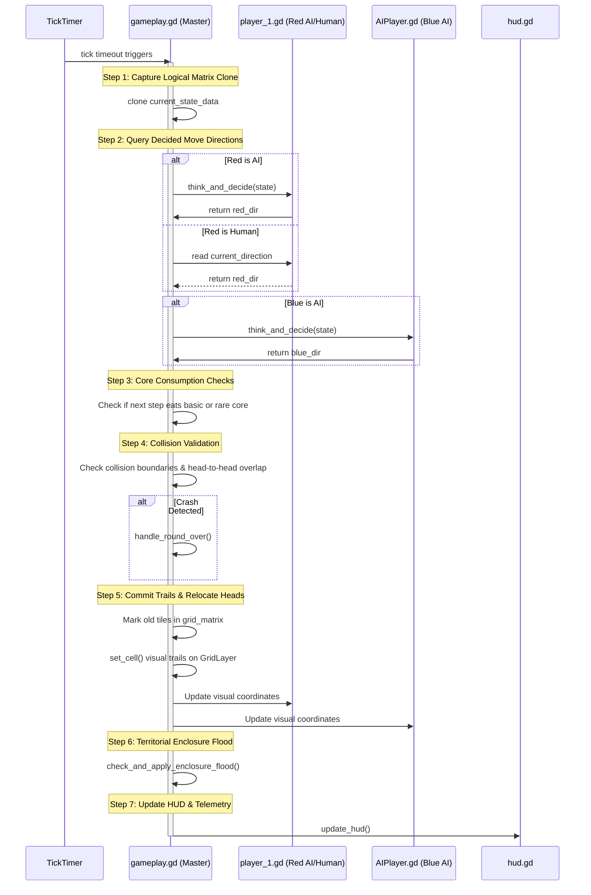
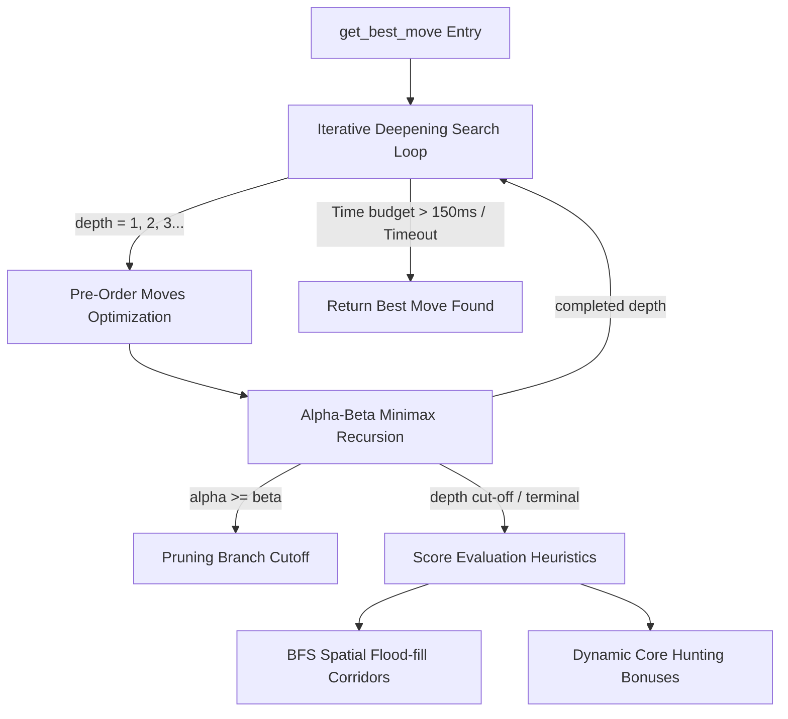

# 👾 Color Grid Clash (v1.2)
### High-Fidelity Cybernetic Snake Duel & AI Visual Walkthrough Debugger

---

## 📝 Introduction

**Color Grid Clash** is a highly polished, grid-based, two-player snake duel game built in Godot 4.x. Inspired by the visual aesthetic and mechanics of the classic *Tron Light Cycle* arena, two competitor snakes (Red and Blue) race across a 20×20 technological coordinate field. The objective is to claim territory, consume energy cores, and trap the opponent while actively avoiding out-of-bounds walls, static generated barriers, and the trails left behind by both sneks.

The project features a **symmetrical dual-sidebar UI** with vibrant HSL-calibrated neon visuals and circular vector glowing player heads. It supports:
1. **Solo vs. AI Mode**: Test your steering against a high-performance automated minimax agent.
2. **Player vs. Player (PvP) Mode**: Local human duel with independent controller/keyboard action mappings.
3. **AI vs. AI Watch Mode**: Spectate two minimax agents competing dynamically.
4. **AI Visual Walkthrough Debugger**: An interactive educational scene displaying real-time telemetry, spatial overlays (BFS reachability fields and candidate simulated pathways), and a step-by-step 29-line code highlighted minimax recursion trace with full time-travel backtrack undos.

---

## 🎮 Rules and Mechanics of the Game

### 1. Control Bindings & Input System

The game features console-grade input mappings with full focus and keyboard/joypad navigation support:

#### Keyboard Bindings:
* **Player 1 (Red Player / Human):**
  * **Move Up:** `W` or `Up Arrow` (In Solo vs AI) / `W` (In PvP)
  * **Move Down:** `S` or `Down Arrow` (In Solo vs AI) / `S` (In PvP)
  * **Move Left:** `A` or `Left Arrow` (In Solo vs AI) / `A` (In PvP)
  * **Move Right:** `D` or `Right Arrow` (In Solo vs AI) / `D` (In PvP)
* **Player 2 (Blue Player / PvP Human):**
  * **Move Up:** `Up Arrow`
  * **Move Down:** `Down Arrow`
  * **Move Left:** `Left Arrow`
  * **Move Right:** `Right Arrow`
* **Confirm / Action:** `Enter` or `Space`
* **Cancel / Back / Pause:** `Escape`

#### Joypad / Controller Mappings:
* **Directional Movement:** D-Pad or Left Analog Joystick
* **Confirm / OK:** Xbox `A` / Sony `Cross` / Nintendo `B`
* **Cancel / Back / Forfeit:** Xbox `B` / Sony `Circle` / Nintendo `A`
* **Pause Menu Toggle:** `Start / Menu`

---

### 2. Core Gameplay Mechanics

* **The Arena (Gameplay Area):**
  * The match takes place on a **20×20 grid** where each logical cell spans a visual `30×30px` block.
  * Symmetrical spawns position Red at `red_spawn_pos` (randomized inside coordinates `X = [2..7]`, `Y = [2..17]`) and Blue at `blue_spawn_pos` (randomized inside `X = [12..17]`, `Y = [2..17]`).
  * Runways construct a 3×3 spawn safety zone and a 4-tile runway in front of the active snek to ensure players never spawn directly inside an obstacle wall.
* **Clashing and Collisions:**
  * Sneks advance one cell per tick, leaving behind a permanent trail tile of their color.
  * A **collision crash** occurs when a head cell steps into:
    * Out-of-bounds walls (boundary index `< 0` or `>= 20`).
    * Static generated obstacle walls (`CellType.WALL`).
    * Any red trail tiles (`CellType.RED_TRAIL`) or blue trail tiles (`CellType.BLUE_TRAIL`).
  * **Head-to-head Clash**: If both heads step onto the exact same coordinate on the same tick, both crash.
  * **Double Collision**: If both sneks crash on the same tick, the round ends in a **DRAW**. If only one crashes, the survivor wins the round.
* **Obstacle Wall Generation:**
  * Wall density is customizable in the settings dashboard:
    * **None**: `0.00` (0% wall density).
    * **Less**: `0.05 - 0.10` (5-10% random grid cells filled).
    * **More**: `0.11 - 0.20` (11-20% random grid cells filled).
  * Walls are placed randomly at the start of each round, strictly avoiding the spawns and safety runway vectors.

---

### 3. Scoring System

Round points are calculated dynamically upon completion and added to the permanent match score across all rounds. The player with the highest accumulated match score after **5 rounds** is crowned the Grand Champion.

| Event / Action | Score Value | Notes |
| :--- | :--- | :--- |
| **Grid Cell Claimed** | `+1 Point` | Counted from active trail trails (including flood fills) |
| **Basic Energy Core** | `+5 Points` | Collected by running over glowing standard cores |
| **Rare Energy Core** | `+10 Points` | Collected by running over rare golden pulsing cores |
| **Round Victory** | `+50 Points` | Awarded strictly to the surviving player of the round |
| **Simultaneous Draw** | `+25 Points` | Split points awarded to both players in a double crash |

---

### 4. BFS Enclosure Flood Fill & Energy Core System

#### Territorial Enclosure Flood Fill:
At the end of each tick, the game evaluates whether a snek has successfully enclosed a region of empty space:
1. **BFS Reachability Isolation**: A Breadth-First Search (BFS) is executed from the snek head.
   * To prevent co-enclosures using opposing trails, the search passes freely through the *opponent's* trails but is strictly blocked by the snek's *own* trails and static walls.
2. **Territory Isolation**: Any empty cells that were not reached by the snek's BFS are isolated as candidates.
3. **Validation Filter**: Candidates are verified to check that they do not contain either player's current head position and touch at least one segment of the snek's existing trail.
4. ** territoriale Claim**: Validated cells are instantly converted into the snek's trail color (`CellType.RED_TRAIL` or `CellType.BLUE_TRAIL`), awarding `+1 point` per cell and locking that space as an obstacle.

#### Circular Glowing Energy Cores:
* **Co-existence**: Cores are placed programmatically on empty coordinates, pulsing with tweened scale animations and glowing HSL shadows.
* **Hunt & Absorption**: Moving onto a core consumes it immediately, awarding points. If a core is swallowed inside a flooded territorial enclosure, the player absorbs it automatically (+5 for basic, +10 for rare) and a replacement core is spawned on the remaining playable grid cells.

---

## 📐 System Architecture

### 1. Project Directory Structure
```
final-snek-game/
├── project.godot                # Godot engine config (viewport width=1280, height=720, autoloads)
├── assets/                      # High-contrast neon PNG sprite assets & typefaces
│   ├── red-head.png / red-body.png
│   ├── blue-head.png / blue-body.png
│   ├── wall.png / grid.png
│   ├── goto_prevmove.png / goto_nextmove.png (stepper deck icon textures)
│   └── fonts/
│       └── TRS-Million Rg.otf   # Futuristic cybernetic neon typeface
├── scripts/                     # Global scripts and engines
│   ├── ConfigManager.gd         # Persistent configuration manager singleton (Player setup, speeds, walls)
│   ├── StatsManager.gd          # Database manager saving high scores and historic statistics to JSON
│   ├── AIModule.gd              # Minimax engine running Alpha-Beta & BFS Corridors heuristics
│   └── AIDemoTracer.gd          # Search tracer recording chronological TraceSteps for debugger
├── scenes/                      # Scene canvases
│   ├── game_panel.tscn          # Symmetrical double-sidebar gameplay canvas
│   ├── hud.tscn / hud.gd        # Programmatically drawn HUD containers (telemetry, countdown, post-round)
│   ├── gameplay/
│   │   ├── gameplay.tscn / gameplay.gd    # Master game coordinator, grid layers, spawns, and collisions
│   │   ├── player_1.tscn / player_1.gd    # Red player input or thinker bridge
│   │   └── player_2.tscn / AIPlayer.gd    # Blue AI / Human dual controller
│   └── menu/
│       ├── main_menu.tscn / main_menu.gd  # Neon cybernetic main menu sidebar panel
│       ├── config_panel.tscn / config_panel.gd # Custom slider-based options configuration
│       ├── stats.tscn / stats.gd          # Statistics history loader
│       └── ai_demo_panel.tscn / ai_demo_panel.gd # Triple-column educational visual debugger
```

---

### 2. Scene Tree Layout
When playing a standard match, the main viewport loads `game_panel.tscn` which instantiates the following hierarchy:

```
GamePanel (Node2D)
├── Background (ColorRect)                # Deep space background color (#08090d, size 1280x720)
├── Gameplay (gameplay.tscn)               # position = Vector2(340, 60), size 600x600px
│   ├── ColorRect                        # Deep cybernetic charcoal backdrop (#07090d)
│   ├── BackgroundGridLayer (TileMapLayer) # Programmatic grid coordinates guide (Steel-Blue modulation)
│   ├── GridLayer (TileMapLayer)          # Active gameplay cells (trails, walls) mod=WHITE
│   ├── Player1 (player_1.tscn)           # Red player head node
│   │   └── Area2D -> Sprite2D            # displays red-head.png
│   ├── AIPlayer (player_2.tscn)          # Blue snek head node
│   │   └── Area2D -> Sprite2D            # displays blue-head.png
│   ├── GameplayGridFrame (Panel)         # Glowing white frame border around the 600x600px grid
│   └── Node2D (UpperLeft / LowerRight)   # Marker positions
└── HUD (hud.tscn)                        # Fullscreen overlay CanvasLayer
    └── Control (MainControl)             # process_mode = PROCESS_MODE_ALWAYS
        ├── LeftHUD (PanelContainer)      # P1 Score, Captures progress bar, core indicators
        ├── RightHUD (PanelContainer)     # P2 Score, Minimax AI Telemetry Box (depth, nodes, ms)
        ├── TopHUD (HBoxContainer)        # Round counts, clock timer, round history dots (●/◌)
        └── Overlays (Pause, Countdown, Breakdown, Championship)
```

---

### 3. Tick-by-Tick Execution Sequence
On every wait-time interval (Slow=0.50s, Intermediate=0.10s, Fast=0.05s), the master tick timer `_on_tick_timer_timeout()` fires in `gameplay.gd`. The execution flows in this chronological order:



---

## 🤖 AI Architecture and Algorithm

The computer agent's decision-making flow is implemented inside [AIModule.gd](file:///c:/Users/vanmo/Documents/final-snek-game/scripts/AIModule.gd). It leverages a robust, search-depth optimizing game-tree architecture designed to solve spatial duels.

### 🧠 Deep-Dive of AIModule.gd Algorithms



---

### 1. Iterative Deepening Search (IDS)
Instead of searching to a fixed depth (which can cause slow frame stutter if the board is complex, or move shallowly when the board is empty), the AI implements **Iterative Deepening**. 
* The search starts at `depth = 1`. 
* Once the search completed successfully for that depth, it increments `depth += 1` and runs again.
* If a search branch takes too long and exceeds the **150 milliseconds** time limit budget, the loop terminates immediately, throwing a `TIMEOUT_SIGNAL` and falling back safely to the best decision committed during the last fully-completed depth search.

---

### 2. Alpha-Beta Minimax Search
The core decision engine is a recursive game-tree search that models perfect-information duels:
* **MAX Player (Blue AI)**: Selects branches that maximize the evaluation score.
* **MIN Player (Red AI / Human)**: Modeled as the opponent, selecting branches that minimize the evaluation score (playing optimally to trap Blue).
* **Alpha-Beta Pruning**: Maintains two bounds during recursion:
  * `Alpha`: The highest score the maximizing player is already guaranteed.
  * `Beta`: The lowest score the minimizing player is already guaranteed.
  * If at any node `alpha >= beta`, the maximizing player can force a better outcome elsewhere, meaning the current recursive branch is mathematically guaranteed to be discarded. The AI halts recursion on this branch instantly (**Pruning**), avoiding evaluating thousands of irrelevant grid nodes.

---

### 3. Pre-Sorted Move Ordering
To maximize the efficiency of Alpha-Beta pruning, moves at each recursion level are pre-sorted using a fast heuristics check:
* Evaluates all adjacent moves and performs a shallow Breadth-First Search (BFS) to count available corridors.
* **Blue (MAX)**: Sorts moves in descending order (highest spatial corridors explored first).
* **Red (MIN)**: Sorts moves in ascending order.
* Exploring the most optimal paths first allows Alpha-Beta to establish extremely tight bounds early in the search, leading to massive branch pruning and enabling depths of `depth = 6` to `depth = 12` within the 150ms limit.

---

### 4. BFS Spatial Flood-Fill & Corridors Heuristic
When the minimax search reaches a terminal node or depth cut-off, it scores the simulated board state using a mathematical evaluation formula:

$$\text{Score} = 1.0 \times (\text{Blue Trail} - \text{Red Trail}) + 2.0 \times (\text{Blue Reach} - \text{Red Reach}) + (\text{Blue Bonus} - \text{Red Bonus})$$

* **Breadth-First Search (BFS) Reachability**: Spawns a high-performance hash-set flood-fill starting from the simulated head positions. It counts the number of empty grid coordinates that each snek can physically navigate into.
* **Corridor Safety**: By giving a massive weighting (`2.0`) to spatial reachability, the AI establishes a supreme survival instinct. It actively avoids compact corridors, dead ends, or tunnels that would lead to entrapment, preferring wide-open areas where it cannot be easily cut off.

---

### 5. Dynamic Core Hunting Heuristic
Previously, the AI treated energy core coordinates as obstacles to avoid crashes, preventing it from ever collecting cores. 
* **Safe Traversal**: The system classifies `ENERGY_CORE` and `RARE_ENERGY_CORE` as completely safe to traverse.
* **Simulated Consumption**: Inside `apply_move()` during search simulations, if a snek steps onto a core coordinate, it is consumed logically, and a simulated bonus (`+15.0` for basic, `+30.0` for rare) is added to the snek's evaluation state (`blue_bonus` or `red_bonus`).
* **Active Hunting**: The evaluation score aggregates these core collection bonuses. Consequently, when the minimax search evaluates pathways, it naturally steers the snek toward coordinates containing energy cores, making the AI hunt and consume cores aggressively throughout the match!
