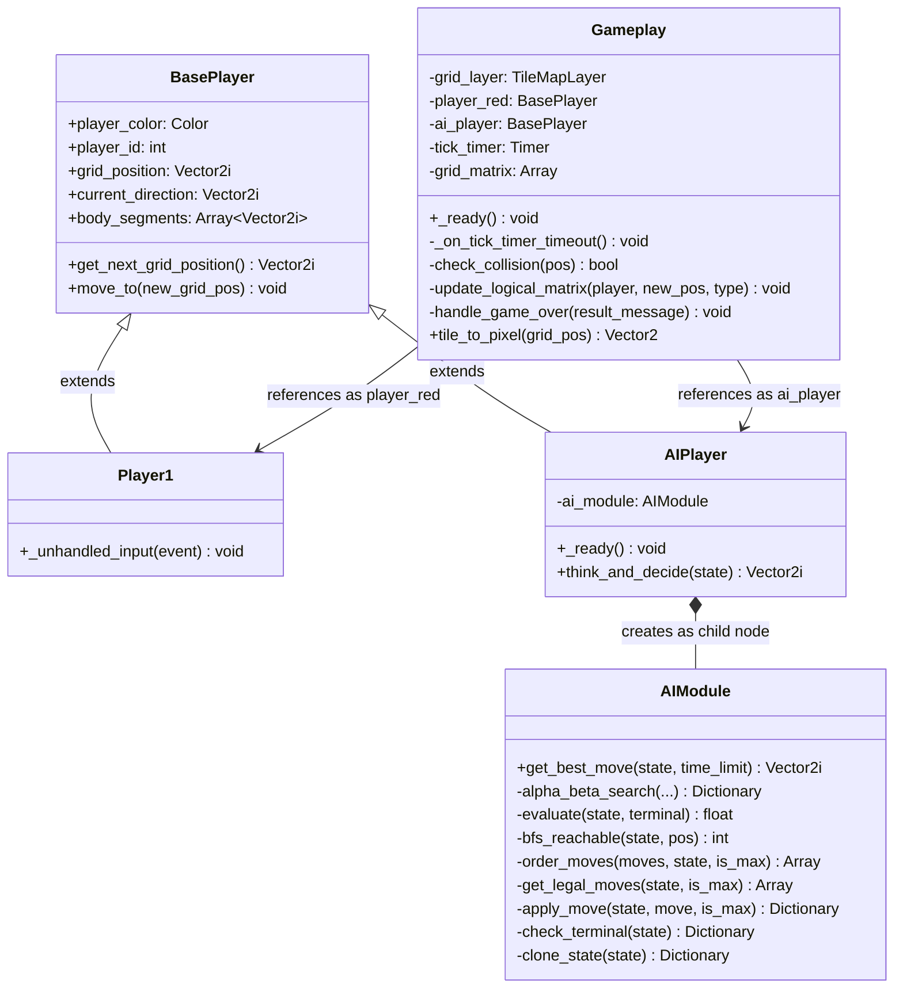
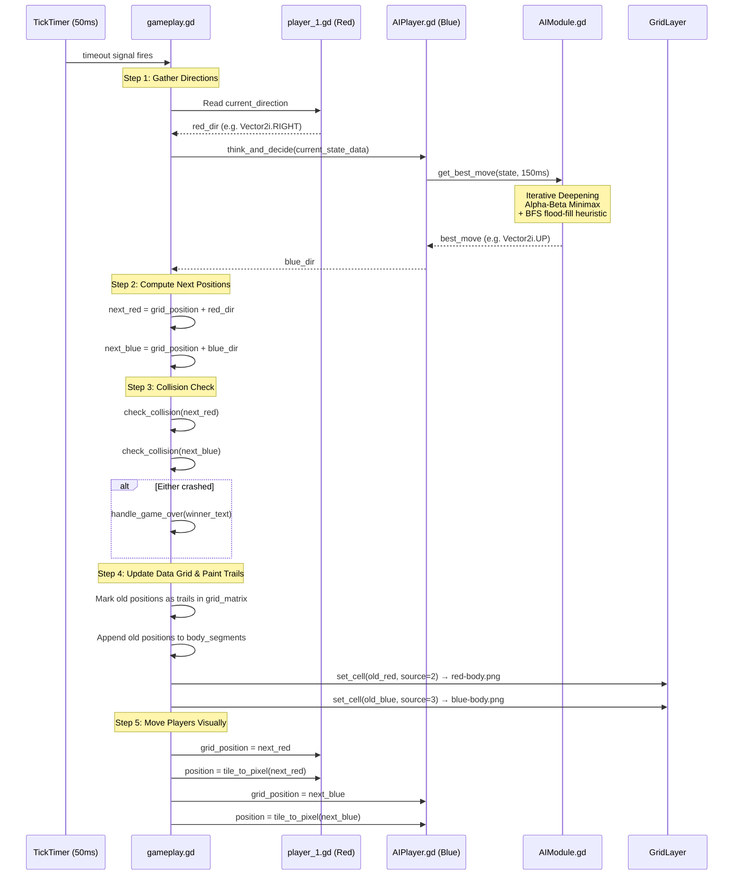
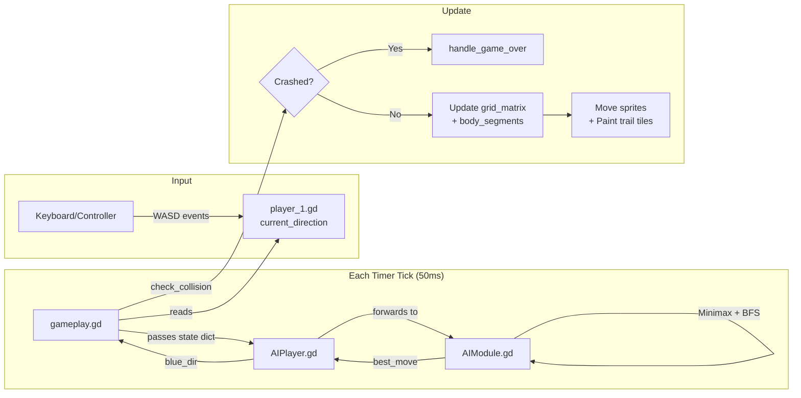

# Game Project Walkthrough: Code Structure & Logic

A complete beginner-friendly walkthrough of how every file in the project connects, how data flows through the game loop, and how the AI thinks.

---

## 📁 Project File Structure

```
final-snek-game/
├── project.godot              # Godot engine config (window size, input mappings, main scene)
├── assets/                    # Sprite textures
│   ├── grid3.png              # Background grid tile (30×30px)
│   ├── wall.png               # Wall obstacle tile
│   ├── red-head.png           # Red player head sprite
│   ├── red-body.png           # Red player trail tile
│   ├── blue-head.png          # Blue AI head sprite
│   └── blue-body.png          # Blue AI trail tile
├── scripts/                   # Shared/global scripts
│   ├── BasePlayer.gd          # Base class inherited by both players
│   ├── gameplay.gd            # Main game coordinator (attached to root scene)
│   └── AIModule.gd            # Minimax + BFS AI brain
└── scenes/
    └── gameplay/
        ├── gameplay.tscn       # Main scene file (the scene tree)
        ├── player_1.gd         # Human player input handler
        ├── player_1.tscn       # Player 1 scene (head sprite + collision shape)
        ├── player_2.tscn       # Player 2 scene (head sprite + collision shape)
        └── AIPlayer.gd         # AI player controller (bridges to AIModule)
```

---

## 🌳 Scene Tree (What Godot Loads)

When the game runs, Godot loads [gameplay.tscn](file:///c:/Users/vanmo/Documents/final-snek-game/scenes/gameplay/gameplay.tscn), which builds this node tree:

```
Gameplay (Node2D)                 ← Root node, runs gameplay.gd
├── ColorRect                     ← Grey background rectangle (600×600px)
├── GridLayer (TileMapLayer)      ← The visual grid, paints tiles for trails/walls
├── Node2D                        ← Container for reference markers
│   ├── UpperLeft (Marker2D)      ← Grid origin reference point
│   └── LowerRight (Marker2D)     ← Grid boundary reference (600, 600)
├── Player1 (Node2D)              ← Red player instance, runs player_1.gd
│   └── Area2D
│       ├── Sprite2D              ← Displays red-head.png
│       └── CollisionShape2D      ← 30×30 rectangle
├── AIPlayer (Node2D)             ← Blue AI instance, runs AIPlayer.gd
│   └── Area2D
│       ├── Sprite2D              ← Displays blue-head.png
│       └── CollisionShape2D      ← 30×30 rectangle
└── CanvasLayer                   ← Reserved for future HUD (currently hidden)
```

---

## 🧬 Class Hierarchy & Script Relationships



---

## 🔄 The Game Loop: Tick-by-Tick Execution

The core of the game is a **timer-driven tick loop**. Every 50ms (configurable via `tick_timer.wait_time`), the function [_on_tick_timer_timeout()](file:///c:/Users/vanmo/Documents/final-snek-game/scripts/gameplay.gd#L83) fires and executes one full game step. Here's what happens in order:



---

## 📋 Script-by-Script Breakdown

### 1. [BasePlayer.gd](file:///c:/Users/vanmo/Documents/final-snek-game/scripts/BasePlayer.gd) — The Shared Foundation

This is the **base class** that both the human player and AI inherit from. It holds all the common data every player needs:

| Variable | Type | Purpose |
|---|---|---|
| `player_color` | `Color` | Visual color (set in editor) |
| `player_id` | `int` | `1` = Red Player, `2` = Blue AI |
| `grid_position` | `Vector2i` | Current logical position on the 20×20 grid |
| `current_direction` | `Vector2i` | Which way the player is currently heading |
| `body_segments` | `Array[Vector2i]` | History of all grid cells this player has occupied (their trail) |

The two helper methods:
- **`get_next_grid_position()`** — Returns `grid_position + current_direction` (where the player *will* be next tick)
- **`move_to()`** — Updates `grid_position` to a new coordinate

---

### 2. [player_1.gd](file:///c:/Users/vanmo/Documents/final-snek-game/scenes/gameplay/player_1.gd) — Human Input Handler

Extends `BasePlayer`. Its only job is listening for keyboard/controller input via `_unhandled_input()` and updating `current_direction`. The direction is **read passively** by the game coordinator on each tick.

**Anti-reversal guard:** Each direction change checks that you're not trying to turn 180° into yourself (e.g., pressing LEFT while moving RIGHT is ignored).

**Input mappings** (defined in [project.godot](file:///c:/Users/vanmo/Documents/final-snek-game/project.godot)):
| Action | Key | Controller |
|---|---|---|
| `p1_moveUp` | W | Left Stick Up / D-Pad Up |
| `p1_moveDown` | S | Left Stick Down / D-Pad Down |
| `p1_moveLeft` | A | Left Stick Left / D-Pad Left |
| `p1_moveRight` | D | Left Stick Right / D-Pad Right |

---

### 3. [AIPlayer.gd](file:///c:/Users/vanmo/Documents/final-snek-game/scenes/gameplay/AIPlayer.gd) — AI Controller Bridge

Extends `BasePlayer`. Acts as the interface between the game coordinator and the AI brain:

1. **`_ready()`** — Creates an `AIModule` instance and adds it as a child node
2. **`think_and_decide(game_state_data)`** — Called by the game coordinator each tick. Forwards the current board state to `ai_module.get_best_move()` with a 150ms time budget, stores the result in `current_direction`, and returns it

---

### 4. [AIModule.gd](file:///c:/Users/vanmo/Documents/final-snek-game/scripts/AIModule.gd) — The AI Brain

This is the most complex file. It implements an **Iterative Deepening Alpha-Beta Minimax** search with a **BFS flood-fill** spatial heuristic. Here's how it works layer by layer:

#### Entry Point: [get_best_move()](file:///c:/Users/vanmo/Documents/final-snek-game/scripts/AIModule.gd#L23-L45)
```
Start with depth = 1
While time remains (< 150ms):
    Clone the game state
    Run alpha_beta_search at current depth
    If search completed → save the best move, increase depth by 1
    If search timed out → stop, use the last completed result
Return best_move
```
This is called **Iterative Deepening** — it searches 1 move ahead, then 2, then 3, etc., until the time budget runs out. The deeper it searches, the smarter the decision.

#### Core Search: [alpha_beta_search()](file:///c:/Users/vanmo/Documents/final-snek-game/scripts/AIModule.gd#L48-L102)
A recursive Minimax with Alpha-Beta pruning:

- **Maximizing player (Blue/AI, `is_max = true`):** Picks the move with the **highest** score
- **Minimizing player (Red/Human, `is_max = false`):** Picks the move with the **lowest** score (assumes the human plays optimally to hurt the AI)
- **Alpha-Beta pruning:** Cuts off branches that can't possibly be better than what's already found, dramatically reducing computation

#### Evaluation Function: [evaluate()](file:///c:/Users/vanmo/Documents/final-snek-game/scripts/AIModule.gd#L104-L119)
When the search reaches its depth limit, it scores the board state:

```
Score = 1.0 × (blue_trails − red_trails) + 2.0 × (blue_reachable − red_reachable)
```

| Factor | Weight | Meaning |
|---|---|---|
| Trail count difference | 1.0 | More trail = more board captured |
| Reachable space difference | 2.0 | **More important** — having more open space means less risk of being trapped |

Terminal states get extreme scores: `+100,000` (AI wins), `−100,000` (AI loses), `0` (draw).

#### Spatial Analysis: [bfs_reachable()](file:///c:/Users/vanmo/Documents/final-snek-game/scripts/AIModule.gd#L121-L142)
A standard **Breadth-First Search flood-fill** starting from a player's head position. It counts how many empty cells that player can reach without passing through walls or trails. This is the key to the AI's survival instinct — it avoids moves that lead into small, enclosed areas.

#### Move Ordering: [order_moves()](file:///c:/Users/vanmo/Documents/final-snek-game/scripts/AIModule.gd#L144-L162)
Before exploring moves at each search depth, the AI **pre-sorts** them by running a quick BFS on each candidate. Moves that lead to more open space are explored first. This makes Alpha-Beta pruning far more effective since the best moves are checked early, allowing more bad branches to be cut.

#### Simulation Helpers
| Function | Purpose |
|---|---|
| [get_legal_moves()](file:///c:/Users/vanmo/Documents/final-snek-game/scripts/AIModule.gd#L166-L173) | Returns all directions where the adjacent cell is empty |
| [is_empty_cell()](file:///c:/Users/vanmo/Documents/final-snek-game/scripts/AIModule.gd#L175-L178) | Bounds-checks a coordinate and verifies it's `CellType.EMPTY` |
| [apply_move()](file:///c:/Users/vanmo/Documents/final-snek-game/scripts/AIModule.gd#L180-L190) | Simulates a move on a cloned state (marks old position as trail, shifts head) |
| [check_terminal()](file:///c:/Users/vanmo/Documents/final-snek-game/scripts/AIModule.gd#L192-L204) | Checks if either player has crashed (out-of-bounds or non-empty cell) |
| [clone_state()](file:///c:/Users/vanmo/Documents/final-snek-game/scripts/AIModule.gd#L206-L216) | Deep-copies the state dictionary so simulations don't corrupt the real board |

---

### 5. [gameplay.gd](file:///c:/Users/vanmo/Documents/final-snek-game/scripts/gameplay.gd) — The Main Coordinator

This is the master controller attached to the root `Gameplay` node. It owns the entire game state and orchestrates everything.

#### Data Model: The Grid Matrix
The game board is a **20×20 2D array** stored in `grid_matrix`. Each cell holds a `CellType` enum value:

| Enum | Value | Meaning |
|---|---|---|
| `EMPTY` | 0 | Open space — players can move here |
| `WALL` | 1 | Static obstacle — placed at game start |
| `RED_TRAIL` | 2 | Red player's trail — impassable |
| `BLUE_TRAIL` | 3 | Blue AI's trail — impassable |
| `ENERGY_CORE` | 4 | Standard glowing green energy core (+5 pts) |
| `RARE_ENERGY_CORE` | 5 | Glowing gold rare energy core (+10 pts) |

#### Key Functions

**[_ready()](file:///c:/Users/vanmo/Documents/final-snek-game/scripts/gameplay.gd#L65-L82)** — Game initialization sequence:
1. `initialize_matrix()` — Creates a clean 20×20 grid of `EMPTY` cells
2. `hud = get_parent().get_node_or_null("HUD")` — Locates the HUD CanvasLayer
3. Randomizes both players' spawn coordinates and directions (safely inside runways)
4. `generate_random_walls()` — Randomly places static walls (5–10% density)
5. `spawn_initial_cores()` — Spawns 2 standard and 1 rare core dynamically
6. Creates and starts the programmatic tick timer (50ms interval)

**[generate_random_walls()](file:///c:/Users/vanmo/Documents/final-snek-game/scripts/gameplay.gd#L22-L59)** — Randomly scatters wall obstacles, strictly avoiding spawn safety zones and steering runways.

**[tile_to_pixel()](file:///c:/Users/vanmo/Documents/final-snek-game/scripts/gameplay.gd#L62-L63)** — Converts grid coordinates to screen pixel positions.

**[check_collision()](file:///c:/Users/vanmo/Documents/final-snek-game/scripts/gameplay.gd#L130-L137)** — Returns `true` if a position is out-of-bounds OR contains a wall/trail obstacle (stepping on EMPTY or ENERGY_CORE is safe).

**[update_logical_matrix()](file:///c:/Users/vanmo/Documents/final-snek-game/scripts/gameplay.gd#L138-L142)** — Records the player's old position as a trail in the grid matrix, appends to history, and paints the trail cell visually.

**[handle_round_over()](file:///c:/Users/vanmo/Documents/final-snek-game/scripts/gameplay.gd#L143-L145)** — Finalizes round scores (+50 for winner, +25 for draw), adds to match score, prints victory announcements, and schedules the next round or ends the match.

**[start_next_round()](file:///c:/Users/vanmo/Documents/final-snek-game/scripts/gameplay.gd)** — Wipes the grid tilemap cells, clears active cores, resets player stats, regenerates walls, spawns new cores, and ticks off the next round.

---

## 🎨 Visual Rendering: TileSet Source Map

The [TileMapLayer](file:///c:/Users/vanmo/Documents/final-snek-game/scenes/gameplay/gameplay.tscn#L48) (`GridLayer`) uses a TileSet with 4 atlas sources. When `set_cell()` is called with a source ID, Godot paints the corresponding texture:

| Source ID | Texture File | Used For |
|---|---|---|
| 1 | `grid3.png` | Background grid tiles (pre-painted in editor) |
| 2 | `red-body.png` | Red player trail |
| 3 | `blue-body.png` | Blue AI trail |
| 4 | `wall.png` | Static wall obstacles |

---

## 🧠 Data Flow Summary



---

## ✅ Applied Bug Fixes

We have successfully resolved the following gameplay bugs:

1. **Trail Offset Fix:** Trail tiles are now painted visually at the player's **old (previous) position** before updating the head to the new tile. This ensures that the trail is left *behind* the player as they move, keeping the head sprite clean and visually aligned. Additionally, spawn tiles are painted with a trail immediately on start so spawn points are fully visible.
2. **Spawn Trapping Prevention:** Added a dynamic `get_safety_zones()` calculation which constructs a 3x3 safety bubble around each player's spawn and a 4-tile runway (including adjacent cells) in front of their initial direction. Wall generation skips these coordinates, guaranteeing both players a safe space to start and steer.

---

## 🏆 Round & Scoring Management System

We have introduced a competitive, multi-round match architecture to enrich the gameplay experience:

### 1. 5-Round Match Cycle
* Matches run consecutively up to **5 rounds**.
* The player with the **highest accumulated Match Score** at the end of all 5 rounds is crowned the champion.
* Between rounds, players are presented with their scores before the board resets, spawn points randomize, and the next round begins after a **2-second cinematic delay**.

### 2. Point Matrix
* **Captured Cell**: `+1 point` (counted continually from the active tile trails).
* **Basic Energy Core**: `+5 points` (dynamic neon green pulsing vector shapes that eat and re-spawn).
* **Rare Energy Core**: `+10 points` (neon gold pulsing shape, spawned at a 25% chance).
* **Round Victory**: `+50 points` (granted to the round survivor).
* **Simultaneous Crash**: `+25 points` (split draw points for both players).

---

## 💻 Programmatic Cybernetic HUD
To eliminate asset file dependencies, the HUD is built **entirely programmatically** inside [hud.gd](file:///c:/Users/vanmo/Documents/final-snek-game/scenes/hud.gd):
* **Left HUD Panel**: Displays Player 1's live Match Score, current Round Points, percentage of grid captured (via a styled progress bar), and collected energy cores.
* **Right HUD Panel**: Displays the AI's Match Score, current Round Points, capture percentage, and a **Minimax Telemetry Box** tracking search depth, thinking speeds in milliseconds, and evaluated node counts in real-time.
* **Top Bar HUD**: Tracks the active round progress (`ROUND 3/5`), displays visual match history slots (`●` for P1 win, `●` for AI win, `◌` for Draw, `○` for unplayed), and runs a round clock timer.

---

## 🌊 Enclosure Flood Mechanism

An advanced gameplay algorithm has been implemented in [gameplay.gd](file:///c:/Users/vanmo/Documents/final-snek-game/scripts/gameplay.gd) that allows players to perform sweeping territorial captures by enclosing empty space:

### 1. The Algorithm
At the end of each game tick, after both players have completed their moves, `check_and_apply_enclosure_flood()` is executed:
* **BFS Reachability Search:** A Breadth-First Search (BFS) is executed from each player's current head position.
  * To prevent co-enclosures using opponent trails, the reachability search is allowed to pass freely through the **other** player's trail and head. It is blocked ONLY by the player's **own** trail and permanent walls.
* **Candidate Isolation:** Any playable/empty cell in the grid that was not reached by the BFS is identified as "cut off" (candidate).
* **Validation Filtering:** The candidate cells are filtered to verify that:
  * They do not contain either player's current head position.
  * They touch (are adjacent to) at least one cell of the player's trail, ensuring pre-existing closed wall structures aren't flooded automatically.
* **Flood Execution:** All validated cells are instantly converted into the player's color (`CellType.RED_TRAIL` or `CellType.BLUE_TRAIL`), visually colored, and added to the player's `body_segments` to award points and update the AI Minimax search.

### 2. Core/Point Absorption
If any basic or rare energy cores are caught inside the flooded enclosure:
* They are instantly swallowed/eaten.
* The player is credited with full points (+5 for basic, +10 for rare).
* New energy cores are automatically spawned in the remaining open, playable grid space.

### 3. Collision and Strategy
Once flooded, these captured regions act as permanent obstacles for both players for the remainder of the round. This forces players to balance aggressive expansion against restricting their own future movement, drastically elevating the tactical depth of the game.

---

## 🖥️ Main Menu & UX Overhaul

A full-fledged, high-fidelity Main Menu system and interactive match lifecycle flow have been implemented to elevate the user experience.

### 1. Main Menu Screen (`main_menu.tscn` / `main_menu.gd`)
The main menu acts as the launchpad for the entire game, configured as the default startup scene in Godot.
* **Title Banner**: Displays the glowing title "COLOR GRID CLASH".
* **Dynamic Content Panel**: Clicking any sub-menu button dynamically loads its respective scene into the large 720×420px display panel with premium neon styled borders:
  * **Start Game**: Transitions instantly to the gameplay scene.
  * **Controls Map**: Shows W/A/S/D Keyboard mappings alongside analog joypad configurations.
  * **Rules and Mechanics**: Details the Enclosure Flood ability, clash rules, and the multi-round score matrix.
  * **Statistics**: Shows total games, win counts and percentages for both player and AI, total cores, cells claimed, and historic records.
  * **Quit**: Prompts a safe confirmation overlays with a cyan/pink YES/NO layout.

### 2. Persistent Database System (`StatsManager.gd`)
Saves overall player achievements persistently to `user://grid_clash_stats.json`. Games, round victories, maximum score records, eaten cores, and captured cells are safely preserved across sessions and can be reset instantly from the statistics tab.

### 3. Preparation Countdown Transition
To give players a moment to prepare, a fullscreen 3-2-1-GO! countdown is initiated on every round start:
* Freezes the gameplay clock and players.
* Features Tween-pulsing scale animations on the neon numbers.
* Once "GO!" is reached, the overlay fades out, and the game loop starts.

### 4. Post-Round Breakdown Panel
Instead of a simple delay, completing a round brings up a detailed stats breakdown:
* Announces the round winner (Player 1, Blue AI, or Draw) in HSL-neon colors.
* Computes and displays a breakdown card comparing cells captured, basic cores eaten, rare cores eaten, round bonuses (+50 for victory, +25 for draw), and round total points side-by-side.
* Automatically schedules the randomized spawn point reset after 3 seconds.

### 5. Post-Game Championship UI
Completing 5 rounds presents a premium championship overlay:
* Proclaims the Grand Champion based on accumulated match scores.
* Displays final scores side-by-side inside a glowing shadow-radius container.
* Offers interactive navigation buttons to **PLAY AGAIN** (resets scores and starts round 1) or return to the **MAIN MENU**.

---

## ⏸️ Pause Menu System

An advanced Pause Menu overlay system has been integrated to allow players to pause and manage active sessions seamlessly:

### 1. Triggers & Engine Pause
* Pressing the **`Escape`** key on keyboard or the **`Start / Menu`** button on a local Joypad controller triggers the `"pause_game"` action.
* When triggered, `toggle_pause()` is called on `gameplay.gd`, halting all game nodes and ticks using Godot's built-in `get_tree().paused` mechanism.
* Pause inputs are automatically ignored if the game is already in a post-round card, start preparations countdown, or post-game championship screen.

### 2. UI Overlay (`hud.gd`)
* Built completely programmatically as a premium semi-transparent dark overlay covering the game area.
* Displays a prominent neon-cyan `"GAME PAUSED"` title.
* Equipped with three styled cybernetic buttons:
  * **`RESUME PROTOCOL`** (Neon Cyan): Unpauses the engine and closes the overlay.
  * **`RESTART MATCH`** (Neon Pink): Unpauses the engine, closes the overlay, and resets all round history and scores to begin from Round 1.
  * **`ABORT TO MENU`** (Neon Pink): Unpauses the engine, closes the overlay, and safely transitions back to the home Main Menu.

### 3. Pause Processing Configuration
To ensure the player can interact with the buttons while the main game engine and timer are frozen, the HUD CanvasLayer node is explicitly configured with `process_mode = Node.PROCESS_MODE_ALWAYS` in its `_ready()` sequence. This keeps the UI completely responsive and fully operational during pause freezes.

---

## 🔮 Gameplay Scene Aesthetic Redesign

To ensure the active gameplay grid matches the high-fidelity, premium cybernetic neon aesthetic of the menus and HUD, the main gameplay area has been completely redesigned programmatically:

### 1. Deep Space Tech-Grid Background
* **Darkened Viewport:** The light-grey prototype `ColorRect` background has been updated to a deep space `#07090d` charcoal color.
* **Subtle Techy Grid Lines:** Modulated the `GridLayer` tilemap lines to an extremely subtle, semi-transparent steel-blue `Color(0.12, 0.15, 0.22, 0.45)`. This retains standard visual guidance for grid coordinates while allowing player trails to vibrantly pop out.
* **Sleek High-Tech Board Frame:** Framed the entire `600x600px` gameplay coordinate space with a styled high-tech frame, featuring a neon-cyan outer shadow-glow.

### 2. Glowing Circular Cyber-Cores
* Swapped out flat, basic rectangular core representations for dynamic circular cyber-cores.
* Generated using programmatically styled vector panels with high-glow HSL shadow filters (+5 Green Neon shadow for standard, +10 Gold Neon shadow for rare) that pulse in sync with the core scaling tweens.

### 3. Vector-Glow Player Heads
* Completely bypassed the flat, low-contrast sprite `.png` template files for the player heads.
* Programmed glowing vector light spheres in pink (`#ff2a7a` for Player 1) and cyan (`#00f0ff` for Blue AI) that draw circular heads with deep neon-glow HSL shadow maps centered on the active gameplay cells.

---

## ⏱️ Match Timer Calibration Fix

We have successfully resolved the round gameplay timer ticking inaccuracies:

### 1. The Root Cause
Previously, the HUD match timer accumulated time inside `_on_tick_timer_timeout()` by counting modulo loops assuming a fixed `0.05`s tick rate. However, since the engine's game-speed timer `tick_timer.wait_time` is configured to `0.01`s, and the AI's alpha-beta minimax search introduces computation times that vary each frame, the actual execution tick-rate deviates from a static model, making the in-game clock drift and tick at a highly inaccurate, slow rate.

### 2. High-Accuracy Clock System
To solve this, we decoupled the clock timer completely from the game's simulation tick-rate:
* **Independent 1.0-Second Timer:** Added a programmatically-instantiated `round_clock_timer` in `gameplay.gd` configured with a precise `1.0`-second interval.
* **Synchronized States:** The new clock timer starts and stops in perfect synchronization with `tick_timer` (such as at countdown timeouts and round victories).
* **Automatic Pause Handling:** By inheriting the game tree's default pause behavior, the clock automatically freezes when `get_tree().paused` is enabled during menu pauses, resuming flawlessly without losing time segments.

---

## 🔄 Restart Match & Timers Cleanup Fix

We have resolved a critical bug during match restarts where the previous game's session would run in the background under the new round's start preparations countdown:

### 1. The Root Cause
When the player selected "RESTART MATCH" from the pause menu, the game unpaused the tree (`get_tree().paused = false`), which instantly resumed the engine execution. However, because the previous round's `tick_timer` and `round_clock_timer` were never explicitly stopped, they continued ticking and updating player movements and AI decisions in the background during the 3-second visual countdown. By the time countdown reached "GO!", the players had already moved or crashed behind the overlay.

### 2. Implementation Cleanup
To guarantee a clean slate on every new round start and match restart:
* **Immediate Timer Halt:** Added explicit `tick_timer.stop()` and `round_clock_timer.stop()` calls at the very beginning of `start_next_round()` in `gameplay.gd`. This guarantees that timers never run or execute logic during the start-of-round preparation countdowns.
* **Aggressive Overlay Hiding:** Standardized countdown initiation inside `hud.gd` to automatically hide all other active UI overlays (such as pause, post-round breakdown, and post-game championship screens). This prevents overlay overlapping and guarantees a seamless UI progression.

---

## 🎮 Controller & Keyboard Menu Navigation Support

We have implemented a comprehensive, console-grade menu navigation system across all screens:

### 1. Unified Directional Navigation
* **Keyboard & D-Pad Mappings:** Fully supports navigation using Keyboard Arrow keys, Keyboard `W/A/S/D` keys, Joypad D-Pad, and Joypad Left Analog Stick.
* **Autofocus on Load:** When the Main Menu loads, the `Start Game` button is automatically focused. If the Pause Menu is opened, `RESUME PROTOCOL` is focused. If the championship screen is reached, `PLAY AGAIN` is focused.
* **Safety Defaults:** The `NO, RETURN` button in the Quit panel is focused by default to prevent accidental exits.
* **Aesthetic Focus Indicators:** All buttons programmatically receive a glowing cyan neon highlight style when focused (either via controller, keyboard, or mouse hover) to maintain our sleek, high-tech visual feedback.

### 2. "Cancel/Back" Button Protocol
* **Intuitive Dismissal:** Pressing Keyboard `Escape` or the Joypad Cancel button (Xbox `B` / Sony `Circle`) acts as a universal back key:
  * In sub-menus (Controls, Rules, Stats, Quit), it immediately returns the player to the Main Menu welcome screen.
  * In the Main Menu welcome screen, pressing back opens the Quit panel.
  * In the Pause Menu, pressing back unpauses the game tree and resumes play.

---

## ⏱️ Static Fade Countdown, Double-Layer Grid, & Pause Freeze Fix

We have completed another round of critical polish to elevate visual legibility and stability:

### 1. Static Center Fade-In/Fade-Out Countdown
* **Old Behavior:** The round countdown number grew and shrunk with a heavy scale tween, creating a sliding/shifting effect that made it harder to read.
* **New Behavior:** The countdown numbers (`3`, `2`, `1`, `GO!`) are now held static in the center at `scale = Vector2.ONE`.
* **Sleek Transitions:** Programmed smooth fade-in (opacity `0.0` to `1.0` over 0.15s) and fade-out (opacity `1.0` to `0.0` over 0.3s) tweens for each step. This achieves a cinematic, highly readable center fade countdown.

### 2. High-Visibility Double-Layer Grid Layout
* **The Challenge:** Modulating `grid_layer` to a dark blue charcoal made the grid lines subtle but also modulated all walls and trails drawn on the same node, rendering active player trails and barriers dark and barely visible.
* **Double-Layer Solution:** 
  * **`BackgroundGridLayer` (Programmatic):** Instantiated a dedicated background `TileMapLayer` underneath the gameplay elements. This layer is modulated to a subtle, highly visible steel-blue (`Color(0.25, 0.3, 0.45, 0.75)`), creating clear visual coordinates.
  * **`GridLayer` (Gameplay):** Restored the main gameplay `TileMapLayer` to fully unmodulated (`self_modulate = Color.WHITE`). Player snek heads, energy cores, walls, and enclosure floods are drawn at 100% opacity with vibrant, glowing HSL-neon pink and cyan colors, maximizing legibility.

### 3. Corrected Pause-Freeze Architecture
* **The Challenge:** Setting `process_mode = Node.PROCESS_MODE_ALWAYS` on the parent `Gameplay` node caused all of its child timers (`tick_timer`, `round_clock_timer`) and player input controllers to inherit `ALWAYS` processing, which meant the game loop continued running in the background when the engine was paused.
* **The Solution:** 
  * Reverted `Gameplay`'s process mode to default, restoring full Godot pausing to freeze all game step timers and players completely.
  * Transferred unhandled pause inputs (Escape / Joypad B / Start) during freezes to `hud.gd`. Since `hud.gd` is always processing (`process_mode = ALWAYS`), it safely captures unpause commands while the game is frozen and triggers `resume_requested` to unpause the engine tree.

---

## ⚙️ Dynamic System Configuration Dashboard

We have implemented a fully interactive **System Configuration** screen accessible directly from the Main Menu, allowing players to customize the match parameters dynamically:

### 1. Customizable Game Parameters
* **Player Setup Mode**:
  * **Player vs. AI (Default)**: Play against the advanced minimax snek.
  * **Player vs. Player (PvP)**: Play locally against another human. Player 1 uses the WASD keys (configured as `p1_move` in the Godot Input Map), while Player 2 uses the Arrow Keys (configured as `p2_move`).
  * **AI vs. AI (Watch Mode)**: Watch two automated minimax search agents compete against each other.
* **Match Rounds**: Set the match length to anywhere between `1` and `10` rounds per game.
* **Game Movement Speed**:
  * **Slow**: `0.50s` game loop tick speed.
  * **Intermediate**: `0.10s` game loop tick speed.
  * **Fast**: `0.05s` game loop tick speed.
* **Clock Mode & Round Time Limit**:
  * **Infinite (No Time Limit)**: The match clock increments upward from `00:00` with no time restrictions.
  * **Limited (Countdown)**: The match clock decrements downward from a customized limit (up to `3 minutes / 180s`). If the timer expires before a clash, the round terminates in a **DRAW** with no winner.
* **Obstacle Wall Density**:
  * **None**: `0%` of grid space covered by permanent walls.
  * **Less**: Between `5%` and `10%` grid density.
  * **More**: Between `11%` and `20%` grid density.
* **Energy Cores Count**:
  * **None**: `0` active energy cores.
  * **Less**: `2` standard cores and `1` rare core spawned simultaneously on the grid.
  * **More**: `4` standard cores and `2` rare cores spawned simultaneously on the grid.
* **Enclosure Flood Fill**: Toggle to **Enable** or **Disable** the programmatic flood fill system.

### 2. Main Menu UI Integration
* **Sleek Cybernetic Button**: Programmatically instantiates the `CONFIGURATION` button directly into the Main Menu sidebar, positioned seamlessly above `QUIT`.
* **Harmonious Theme**: Styled with the custom-themed space charcoal normal state and glowing neon-cyan border focus/hover state to match other sidebar buttons.
* **Robust Input Flow**: Fully compatible with keyboard (Arrow keys/WASD/Enter) and controller D-pad / Joystick navigation, automatically grabbing focus when the screen loads and allowing quick dismissal back to the welcome screen with `Escape` / `B` / `Circle`.


