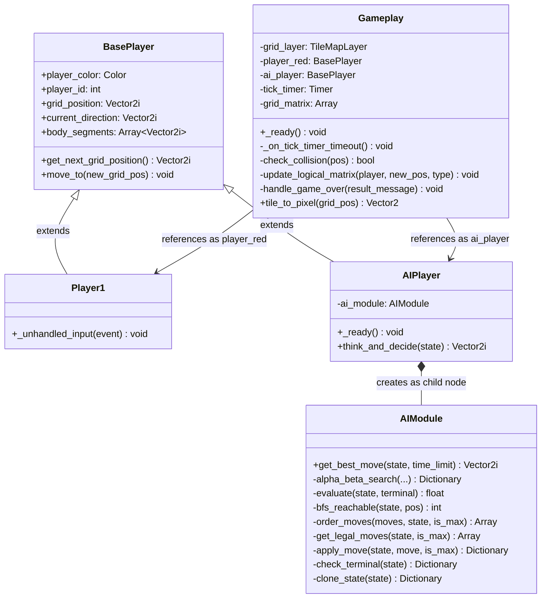
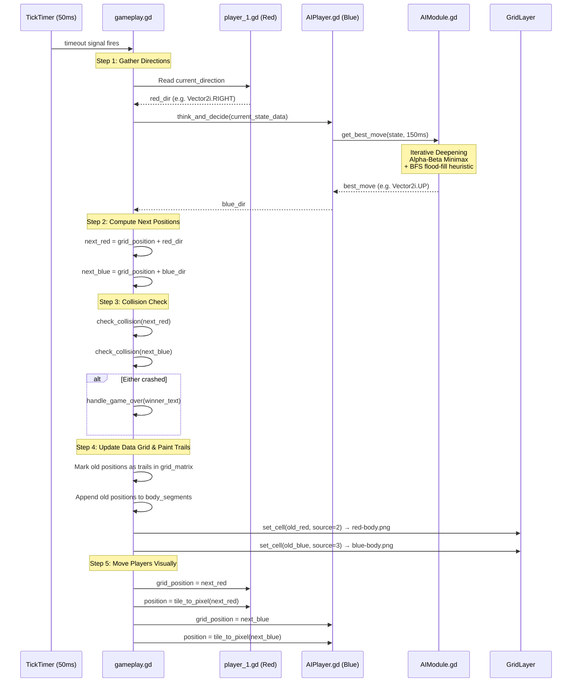
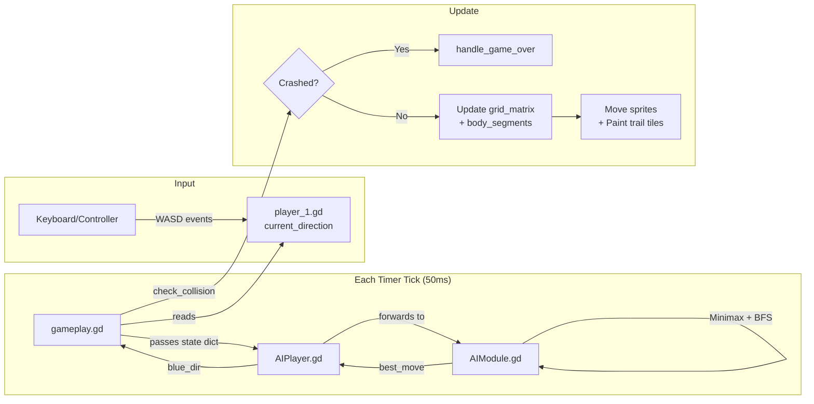

# Game Project Walkthrough: Code Structure & Logic

A complete beginner-friendly walkthrough of how every file in the project connects, how data flows through the game loop, and how the AI thinks.

---

## 📁 Project File Structure

```
final-snek-game/
├── project.godot              # Godot engine config (window size, input mappings, main scene)
├── assets/                    # Sprite textures
│   ├── grid3.png              # Background grid tile (30×30px)
│   ├── wall.png               # Wall obstacle tile
│   ├── red-head.png           # Red player head sprite
│   ├── red-body.png           # Red player trail tile
│   ├── blue-head.png          # Blue AI head sprite
│   └── blue-body.png          # Blue AI trail tile
├── scripts/                   # Shared/global scripts
│   ├── BasePlayer.gd          # Base class inherited by both players
│   ├── gameplay.gd            # Main game coordinator (attached to root scene)
│   └── AIModule.gd            # Minimax + BFS AI brain
└── scenes/
    └── gameplay/
        ├── gameplay.tscn       # Main scene file (the scene tree)
        ├── player_1.gd         # Human player input handler
        ├── player_1.tscn       # Player 1 scene (head sprite + collision shape)
        ├── player_2.tscn       # Player 2 scene (head sprite + collision shape)
        └── AIPlayer.gd         # AI player controller (bridges to AIModule)
```

---

## 🌳 Scene Tree (What Godot Loads)

When the game runs, Godot loads [gameplay.tscn](file:///c:/Users/vanmo/Documents/final-snek-game/scenes/gameplay/gameplay.tscn), which builds this node tree:

```
Gameplay (Node2D)                 ← Root node, runs gameplay.gd
├── ColorRect                     ← Grey background rectangle (600×600px)
├── GridLayer (TileMapLayer)      ← The visual grid, paints tiles for trails/walls
├── Node2D                        ← Container for reference markers
│   ├── UpperLeft (Marker2D)      ← Grid origin reference point
│   └── LowerRight (Marker2D)     ← Grid boundary reference (600, 600)
├── Player1 (Node2D)              ← Red player instance, runs player_1.gd
│   └── Area2D
│       ├── Sprite2D              ← Displays red-head.png
│       └── CollisionShape2D      ← 30×30 rectangle
├── AIPlayer (Node2D)             ← Blue AI instance, runs AIPlayer.gd
│   └── Area2D
│       ├── Sprite2D              ← Displays blue-head.png
│       └── CollisionShape2D      ← 30×30 rectangle
└── CanvasLayer                   ← Reserved for future HUD (currently hidden)
```

---

## 🧬 Class Hierarchy & Script Relationships



---

## 🔄 The Game Loop: Tick-by-Tick Execution

The core of the game is a **timer-driven tick loop**. Every 50ms (configurable via `tick_timer.wait_time`), the function [_on_tick_timer_timeout()](file:///c:/Users/vanmo/Documents/final-snek-game/scripts/gameplay.gd#L83) fires and executes one full game step. Here's what happens in order:



---

## 📋 Script-by-Script Breakdown

### 1. [BasePlayer.gd](file:///c:/Users/vanmo/Documents/final-snek-game/scripts/BasePlayer.gd) — The Shared Foundation

This is the **base class** that both the human player and AI inherit from. It holds all the common data every player needs:

| Variable | Type | Purpose |
|---|---|---|
| `player_color` | `Color` | Visual color (set in editor) |
| `player_id` | `int` | `1` = Red Player, `2` = Blue AI |
| `grid_position` | `Vector2i` | Current logical position on the 20×20 grid |
| `current_direction` | `Vector2i` | Which way the player is currently heading |
| `body_segments` | `Array[Vector2i]` | History of all grid cells this player has occupied (their trail) |

The two helper methods:
- **`get_next_grid_position()`** — Returns `grid_position + current_direction` (where the player *will* be next tick)
- **`move_to()`** — Updates `grid_position` to a new coordinate

---

### 2. [player_1.gd](file:///c:/Users/vanmo/Documents/final-snek-game/scenes/gameplay/player_1.gd) — Human Input Handler

Extends `BasePlayer`. Its only job is listening for keyboard/controller input via `_unhandled_input()` and updating `current_direction`. The direction is **read passively** by the game coordinator on each tick.

**Anti-reversal guard:** Each direction change checks that you're not trying to turn 180° into yourself (e.g., pressing LEFT while moving RIGHT is ignored).

**Input mappings** (defined in [project.godot](file:///c:/Users/vanmo/Documents/final-snek-game/project.godot)):
| Action | Key | Controller |
|---|---|---|
| `p1_moveUp` | W | Left Stick Up / D-Pad Up |
| `p1_moveDown` | S | Left Stick Down / D-Pad Down |
| `p1_moveLeft` | A | Left Stick Left / D-Pad Left |
| `p1_moveRight` | D | Left Stick Right / D-Pad Right |

---

### 3. [AIPlayer.gd](file:///c:/Users/vanmo/Documents/final-snek-game/scenes/gameplay/AIPlayer.gd) — AI Controller Bridge

Extends `BasePlayer`. Acts as the interface between the game coordinator and the AI brain:

1. **`_ready()`** — Creates an `AIModule` instance and adds it as a child node
2. **`think_and_decide(game_state_data)`** — Called by the game coordinator each tick. Forwards the current board state to `ai_module.get_best_move()` with a 150ms time budget, stores the result in `current_direction`, and returns it

---

### 4. [AIModule.gd](file:///c:/Users/vanmo/Documents/final-snek-game/scripts/AIModule.gd) — The AI Brain

This is the most complex file. It implements an **Iterative Deepening Alpha-Beta Minimax** search with a **BFS flood-fill** spatial heuristic. Here's how it works layer by layer:

#### Entry Point: [get_best_move()](file:///c:/Users/vanmo/Documents/final-snek-game/scripts/AIModule.gd#L23-L45)
```
Start with depth = 1
While time remains (< 150ms):
    Clone the game state
    Run alpha_beta_search at current depth
    If search completed → save the best move, increase depth by 1
    If search timed out → stop, use the last completed result
Return best_move
```
This is called **Iterative Deepening** — it searches 1 move ahead, then 2, then 3, etc., until the time budget runs out. The deeper it searches, the smarter the decision.

#### Core Search: [alpha_beta_search()](file:///c:/Users/vanmo/Documents/final-snek-game/scripts/AIModule.gd#L48-L102)
A recursive Minimax with Alpha-Beta pruning:

- **Maximizing player (Blue/AI, `is_max = true`):** Picks the move with the **highest** score
- **Minimizing player (Red/Human, `is_max = false`):** Picks the move with the **lowest** score (assumes the human plays optimally to hurt the AI)
- **Alpha-Beta pruning:** Cuts off branches that can't possibly be better than what's already found, dramatically reducing computation

#### Evaluation Function: [evaluate()](file:///c:/Users/vanmo/Documents/final-snek-game/scripts/AIModule.gd#L104-L119)
When the search reaches its depth limit, it scores the board state:

```
Score = 1.0 × (blue_trails − red_trails) + 2.0 × (blue_reachable − red_reachable)
```

| Factor | Weight | Meaning |
|---|---|---|
| Trail count difference | 1.0 | More trail = more board captured |
| Reachable space difference | 2.0 | **More important** — having more open space means less risk of being trapped |

Terminal states get extreme scores: `+100,000` (AI wins), `−100,000` (AI loses), `0` (draw).

#### Spatial Analysis: [bfs_reachable()](file:///c:/Users/vanmo/Documents/final-snek-game/scripts/AIModule.gd#L121-L142)
A standard **Breadth-First Search flood-fill** starting from a player's head position. It counts how many empty cells that player can reach without passing through walls or trails. This is the key to the AI's survival instinct — it avoids moves that lead into small, enclosed areas.

#### Move Ordering: [order_moves()](file:///c:/Users/vanmo/Documents/final-snek-game/scripts/AIModule.gd#L144-L162)
Before exploring moves at each search depth, the AI **pre-sorts** them by running a quick BFS on each candidate. Moves that lead to more open space are explored first. This makes Alpha-Beta pruning far more effective since the best moves are checked early, allowing more bad branches to be cut.

#### Simulation Helpers
| Function | Purpose |
|---|---|
| [get_legal_moves()](file:///c:/Users/vanmo/Documents/final-snek-game/scripts/AIModule.gd#L166-L173) | Returns all directions where the adjacent cell is empty |
| [is_empty_cell()](file:///c:/Users/vanmo/Documents/final-snek-game/scripts/AIModule.gd#L175-L178) | Bounds-checks a coordinate and verifies it's `CellType.EMPTY` |
| [apply_move()](file:///c:/Users/vanmo/Documents/final-snek-game/scripts/AIModule.gd#L180-L190) | Simulates a move on a cloned state (marks old position as trail, shifts head) |
| [check_terminal()](file:///c:/Users/vanmo/Documents/final-snek-game/scripts/AIModule.gd#L192-L204) | Checks if either player has crashed (out-of-bounds or non-empty cell) |
| [clone_state()](file:///c:/Users/vanmo/Documents/final-snek-game/scripts/AIModule.gd#L206-L216) | Deep-copies the state dictionary so simulations don't corrupt the real board |

---

### 5. [gameplay.gd](file:///c:/Users/vanmo/Documents/final-snek-game/scripts/gameplay.gd) — The Main Coordinator

This is the master controller attached to the root `Gameplay` node. It owns the entire game state and orchestrates everything.

#### Data Model: The Grid Matrix
The game board is a **20×20 2D array** stored in `grid_matrix`. Each cell holds a `CellType` enum value:

| Enum | Value | Meaning |
|---|---|---|
| `EMPTY` | 0 | Open space — players can move here |
| `WALL` | 1 | Static obstacle — placed at game start |
| `RED_TRAIL` | 2 | Red player's trail — impassable |
| `BLUE_TRAIL` | 3 | Blue AI's trail — impassable |
| `ENERGY_CORE` | 4 | Standard glowing green energy core (+5 pts) |
| `RARE_ENERGY_CORE` | 5 | Glowing gold rare energy core (+10 pts) |

#### Key Functions

**[_ready()](file:///c:/Users/vanmo/Documents/final-snek-game/scripts/gameplay.gd#L65-L82)** — Game initialization sequence:
1. `initialize_matrix()` — Creates a clean 20×20 grid of `EMPTY` cells
2. `hud = get_parent().get_node_or_null("HUD")` — Locates the HUD CanvasLayer
3. Randomizes both players' spawn coordinates and directions (safely inside runways)
4. `generate_random_walls()` — Randomly places static walls (5–10% density)
5. `spawn_initial_cores()` — Spawns 2 standard and 1 rare core dynamically
6. Creates and starts the programmatic tick timer (50ms interval)

**[generate_random_walls()](file:///c:/Users/vanmo/Documents/final-snek-game/scripts/gameplay.gd#L22-L59)** — Randomly scatters wall obstacles, strictly avoiding spawn safety zones and steering runways.

**[tile_to_pixel()](file:///c:/Users/vanmo/Documents/final-snek-game/scripts/gameplay.gd#L62-L63)** — Converts grid coordinates to screen pixel positions.

**[check_collision()](file:///c:/Users/vanmo/Documents/final-snek-game/scripts/gameplay.gd#L130-L137)** — Returns `true` if a position is out-of-bounds OR contains a wall/trail obstacle (stepping on EMPTY or ENERGY_CORE is safe).

**[update_logical_matrix()](file:///c:/Users/vanmo/Documents/final-snek-game/scripts/gameplay.gd#L138-L142)** — Records the player's old position as a trail in the grid matrix, appends to history, and paints the trail cell visually.

**[handle_round_over()](file:///c:/Users/vanmo/Documents/final-snek-game/scripts/gameplay.gd#L143-L145)** — Finalizes round scores (+50 for winner, +25 for draw), adds to match score, prints victory announcements, and schedules the next round or ends the match.

**[start_next_round()](file:///c:/Users/vanmo/Documents/final-snek-game/scripts/gameplay.gd)** — Wipes the grid tilemap cells, clears active cores, resets player stats, regenerates walls, spawns new cores, and ticks off the next round.

---

## 🎨 Visual Rendering: TileSet Source Map

The [TileMapLayer](file:///c:/Users/vanmo/Documents/final-snek-game/scenes/gameplay/gameplay.tscn#L48) (`GridLayer`) uses a TileSet with 4 atlas sources. When `set_cell()` is called with a source ID, Godot paints the corresponding texture:

| Source ID | Texture File | Used For |
|---|---|---|
| 1 | `grid3.png` | Background grid tiles (pre-painted in editor) |
| 2 | `red-body.png` | Red player trail |
| 3 | `blue-body.png` | Blue AI trail |
| 4 | `wall.png` | Static wall obstacles |

---

## 🧠 Data Flow Summary



---

## ✅ Applied Bug Fixes

We have successfully resolved the following gameplay bugs:

1. **Trail Offset Fix:** Trail tiles are now painted visually at the player's **old (previous) position** before updating the head to the new tile. This ensures that the trail is left *behind* the player as they move, keeping the head sprite clean and visually aligned. Additionally, spawn tiles are painted with a trail immediately on start so spawn points are fully visible.
2. **Spawn Trapping Prevention:** Added a dynamic `get_safety_zones()` calculation which constructs a 3x3 safety bubble around each player's spawn and a 4-tile runway (including adjacent cells) in front of their initial direction. Wall generation skips these coordinates, guaranteeing both players a safe space to start and steer.

---

## 🏆 Round & Scoring Management System

We have introduced a competitive, multi-round match architecture to enrich the gameplay experience:

### 1. 5-Round Match Cycle
* Matches run consecutively up to **5 rounds**.
* The player with the **highest accumulated Match Score** at the end of all 5 rounds is crowned the champion.
* Between rounds, players are presented with their scores before the board resets, spawn points randomize, and the next round begins after a **2-second cinematic delay**.

### 2. Point Matrix
* **Captured Cell**: `+1 point` (counted continually from the active tile trails).
* **Basic Energy Core**: `+5 points` (dynamic neon green pulsing vector shapes that eat and re-spawn).
* **Rare Energy Core**: `+10 points` (neon gold pulsing shape, spawned at a 25% chance).
* **Round Victory**: `+50 points` (granted to the round survivor).
* **Simultaneous Crash**: `+25 points` (split draw points for both players).

---

## 💻 Programmatic Cybernetic HUD
To eliminate asset file dependencies, the HUD is built **entirely programmatically** inside [hud.gd](file:///c:/Users/vanmo/Documents/final-snek-game/scenes/hud.gd):
* **Left HUD Panel**: Displays Player 1's live Match Score, current Round Points, percentage of grid captured (via a styled progress bar), and collected energy cores.
* **Right HUD Panel**: Displays the AI's Match Score, current Round Points, capture percentage, and a **Minimax Telemetry Box** tracking search depth, thinking speeds in milliseconds, and evaluated node counts in real-time.
* **Top Bar HUD**: Tracks the active round progress (`ROUND 3/5`), displays visual match history slots (`●` for P1 win, `●` for AI win, `◌` for Draw, `○` for unplayed), and runs a round clock timer.

---

## 🌊 Enclosure Flood Mechanism

An advanced gameplay algorithm has been implemented in [gameplay.gd](file:///c:/Users/vanmo/Documents/final-snek-game/scripts/gameplay.gd) that allows players to perform sweeping territorial captures by enclosing empty space:

### 1. The Algorithm
At the end of each game tick, after both players have completed their moves, `check_and_apply_enclosure_flood()` is executed:
* **BFS Reachability Search:** A Breadth-First Search (BFS) is executed from each player's current head position.
  * To prevent co-enclosures using opponent trails, the reachability search is allowed to pass freely through the **other** player's trail and head. It is blocked ONLY by the player's **own** trail and permanent walls.
* **Candidate Isolation:** Any playable/empty cell in the grid that was not reached by the BFS is identified as "cut off" (candidate).
* **Validation Filtering:** The candidate cells are filtered to verify that:
  * They do not contain either player's current head position.
  * They touch (are adjacent to) at least one cell of the player's trail, ensuring pre-existing closed wall structures aren't flooded automatically.
* **Flood Execution:** All validated cells are instantly converted into the player's color (`CellType.RED_TRAIL` or `CellType.BLUE_TRAIL`), visually colored, and added to the player's `body_segments` to award points and update the AI Minimax search.

### 2. Core/Point Absorption
If any basic or rare energy cores are caught inside the flooded enclosure:
* They are instantly swallowed/eaten.
* The player is credited with full points (+5 for basic, +10 for rare).
* New energy cores are automatically spawned in the remaining open, playable grid space.

### 3. Collision and Strategy
Once flooded, these captured regions act as permanent obstacles for both players for the remainder of the round. This forces players to balance aggressive expansion against restricting their own future movement, drastically elevating the tactical depth of the game.

---

## 🖥️ Main Menu & UX Overhaul

A full-fledged, high-fidelity Main Menu system and interactive match lifecycle flow have been implemented to elevate the user experience.

### 1. Main Menu Screen (`main_menu.tscn` / `main_menu.gd`)
The main menu acts as the launchpad for the entire game, configured as the default startup scene in Godot.
* **Title Banner**: Displays the glowing title "COLOR GRID CLASH".
* **Dynamic Content Panel**: Clicking any sub-menu button dynamically loads its respective scene into the large 720×420px display panel with premium neon styled borders:
  * **Start Game**: Transitions instantly to the gameplay scene.
  * **Controls Map**: Shows W/A/S/D Keyboard mappings alongside analog joypad configurations.
  * **Rules and Mechanics**: Details the Enclosure Flood ability, clash rules, and the multi-round score matrix.
  * **Statistics**: Shows total games, win counts and percentages for both player and AI, total cores, cells claimed, and historic records.
  * **Quit**: Prompts a safe confirmation overlays with a cyan/pink YES/NO layout.

### 2. Persistent Database System (`StatsManager.gd`)
Saves overall player achievements persistently to `user://grid_clash_stats.json`. Games, round victories, maximum score records, eaten cores, and captured cells are safely preserved across sessions and can be reset instantly from the statistics tab.

### 3. Preparation Countdown Transition
To give players a moment to prepare, a fullscreen 3-2-1-GO! countdown is initiated on every round start:
* Freezes the gameplay clock and players.
* Features Tween-pulsing scale animations on the neon numbers.
* Once "GO!" is reached, the overlay fades out, and the game loop starts.

### 4. Post-Round Breakdown Panel
Instead of a simple delay, completing a round brings up a detailed stats breakdown:
* Announces the round winner (Player 1, Blue AI, or Draw) in HSL-neon colors.
* Computes and displays a breakdown card comparing cells captured, basic cores eaten, rare cores eaten, round bonuses (+50 for victory, +25 for draw), and round total points side-by-side.
* Automatically schedules the randomized spawn point reset after 3 seconds.

### 5. Post-Game Championship UI
Completing 5 rounds presents a premium championship overlay:
* Proclaims the Grand Champion based on accumulated match scores.
* Displays final scores side-by-side inside a glowing shadow-radius container.
* Offers interactive navigation buttons to **PLAY AGAIN** (resets scores and starts round 1) or return to the **MAIN MENU**.

---

## ⏸️ Pause Menu System

An advanced Pause Menu overlay system has been integrated to allow players to pause and manage active sessions seamlessly:

### 1. Triggers & Engine Pause
* Pressing the **`Escape`** key on keyboard or the **`Start / Menu`** button on a local Joypad controller triggers the `"pause_game"` action.
* When triggered, `toggle_pause()` is called on `gameplay.gd`, halting all game nodes and ticks using Godot's built-in `get_tree().paused` mechanism.
* Pause inputs are automatically ignored if the game is already in a post-round card, start preparations countdown, or post-game championship screen.

### 2. UI Overlay (`hud.gd`)
* Built completely programmatically as a premium semi-transparent dark overlay covering the game area.
* Displays a prominent neon-cyan `"GAME PAUSED"` title.
* Equipped with three styled cybernetic buttons:
  * **`RESUME PROTOCOL`** (Neon Cyan): Unpauses the engine and closes the overlay.
  * **`RESTART MATCH`** (Neon Pink): Unpauses the engine, closes the overlay, and resets all round history and scores to begin from Round 1.
  * **`ABORT TO MENU`** (Neon Pink): Unpauses the engine, closes the overlay, and safely transitions back to the home Main Menu.

### 3. Pause Processing Configuration
To ensure the player can interact with the buttons while the main game engine and timer are frozen, the HUD CanvasLayer node is explicitly configured with `process_mode = Node.PROCESS_MODE_ALWAYS` in its `_ready()` sequence. This keeps the UI completely responsive and fully operational during pause freezes.

---

## 🔮 Gameplay Scene Aesthetic Redesign

To ensure the active gameplay grid matches the high-fidelity, premium cybernetic neon aesthetic of the menus and HUD, the main gameplay area has been completely redesigned programmatically:

### 1. Deep Space Tech-Grid Background
* **Darkened Viewport:** The light-grey prototype `ColorRect` background has been updated to a deep space `#07090d` charcoal color.
* **Subtle Techy Grid Lines:** Modulated the `GridLayer` tilemap lines to an extremely subtle, semi-transparent steel-blue `Color(0.12, 0.15, 0.22, 0.45)`. This retains standard visual guidance for grid coordinates while allowing player trails to vibrantly pop out.
* **Sleek High-Tech Board Frame:** Framed the entire `600x600px` gameplay coordinate space with a styled high-tech frame, featuring a neon-cyan outer shadow-glow.

### 2. Glowing Circular Cyber-Cores
* Swapped out flat, basic rectangular core representations for dynamic circular cyber-cores.
* Generated using programmatically styled vector panels with high-glow HSL shadow filters (+5 Green Neon shadow for standard, +10 Gold Neon shadow for rare) that pulse in sync with the core scaling tweens.
### 3. Glowing Vector Circular Heads with Directional Eyes
* Completely bypassed the flat, low-contrast sprite `.png` template files for the player heads.
* **Glowing Circular Heads with Eyes (v1.8) [NEW]**: Programmed custom Node2D drawing scripts (`PlayerHeadCircle`) for the player heads. The heads are drawn as solid neon circles (neon pink for Player 1, neon cyan for Blue AI) with concentric glowing outer HSL shadow rings. To show orientation, two cute white eyeballs with black pupils are drawn on the head, automatically shifting and rotating to look in the active direction of travel (UP, DOWN, LEFT, or RIGHT) at spawn, round resets, and each movement tick.

---

## ⏱️ Match Timer Calibration Fix

We have successfully resolved the round gameplay timer ticking inaccuracies:

### 1. The Root Cause
Previously, the HUD match timer accumulated time inside `_on_tick_timer_timeout()` by counting modulo loops assuming a fixed `0.05`s tick rate. However, since the engine's game-speed timer `tick_timer.wait_time` is configured to `0.01`s, and the AI's alpha-beta minimax search introduces computation times that vary each frame, the actual execution tick-rate deviates from a static model, making the in-game clock drift and tick at a highly inaccurate, slow rate.

### 2. High-Accuracy Clock System
To solve this, we decoupled the clock timer completely from the game's simulation tick-rate:
* **Independent 1.0-Second Timer:** Added a programmatically-instantiated `round_clock_timer` in `gameplay.gd` configured with a precise `1.0`-second interval.
* **Synchronized States:** The new clock timer starts and stops in perfect synchronization with `tick_timer` (such as at countdown timeouts and round victories).
* **Automatic Pause Handling:** By inheriting the game tree's default pause behavior, the clock automatically freezes when `get_tree().paused` is enabled during menu pauses, resuming flawlessly without losing time segments.

---

## 🔄 Restart Match & Timers Cleanup Fix

We have resolved a critical bug during match restarts where the previous game's session would run in the background under the new round's start preparations countdown:

### 1. The Root Cause
When the player selected "RESTART MATCH" from the pause menu, the game unpaused the tree (`get_tree().paused = false`), which instantly resumed the engine execution. However, because the previous round's `tick_timer` and `round_clock_timer` were never explicitly stopped, they continued ticking and updating player movements and AI decisions in the background during the 3-second visual countdown. By the time countdown reached "GO!", the players had already moved or crashed behind the overlay.

### 2. Implementation Cleanup
To guarantee a clean slate on every new round start and match restart:
* **Immediate Timer Halt:** Added explicit `tick_timer.stop()` and `round_clock_timer.stop()` calls at the very beginning of `start_next_round()` in `gameplay.gd`. This guarantees that timers never run or execute logic during the start-of-round preparation countdowns.
* **Aggressive Overlay Hiding:** Standardized countdown initiation inside `hud.gd` to automatically hide all other active UI overlays (such as pause, post-round breakdown, and post-game championship screens). This prevents overlay overlapping and guarantees a seamless UI progression.

---

## 🎮 Controller & Keyboard Menu Navigation Support

We have implemented a comprehensive, console-grade menu navigation system across all screens:

### 1. Unified Directional Navigation
* **Keyboard & D-Pad Mappings:** Fully supports navigation using Keyboard Arrow keys, Keyboard `W/A/S/D` keys, Joypad D-Pad, and Joypad Left Analog Stick.
* **Autofocus on Load:** When the Main Menu loads, the `Start Game` button is automatically focused. If the Pause Menu is opened, `RESUME PROTOCOL` is focused. If the championship screen is reached, `PLAY AGAIN` is focused.
* **Safety Defaults:** The `NO, RETURN` button in the Quit panel is focused by default to prevent accidental exits.
* **Aesthetic Focus Indicators:** All buttons programmatically receive a glowing cyan neon highlight style when focused (either via controller, keyboard, or mouse hover) to maintain our sleek, high-tech visual feedback.

### 2. "Cancel/Back" Button Protocol
* **Intuitive Dismissal:** Pressing Keyboard `Escape` or the Joypad Cancel button (Xbox `B` / Sony `Circle`) acts as a universal back key:
  * In sub-menus (Controls, Rules, Stats, Quit), it immediately returns the player to the Main Menu welcome screen.
  * In the Main Menu welcome screen, pressing back opens the Quit panel.
  * In the Pause Menu, pressing back unpauses the game tree and resumes play.

---

## ⏱️ Static Fade Countdown, Double-Layer Grid, & Pause Freeze Fix

We have completed another round of critical polish to elevate visual legibility and stability:

### 1. Static Center Fade-In/Fade-Out Countdown
* **Old Behavior:** The round countdown number grew and shrunk with a heavy scale tween, creating a sliding/shifting effect that made it harder to read.
* **New Behavior:** The countdown numbers (`3`, `2`, `1`, `GO!`) are now held static in the center at `scale = Vector2.ONE`.
* **Sleek Transitions:** Programmed smooth fade-in (opacity `0.0` to `1.0` over 0.15s) and fade-out (opacity `1.0` to `0.0` over 0.3s) tweens for each step. This achieves a cinematic, highly readable center fade countdown.

### 2. High-Visibility Double-Layer Grid Layout
* **The Challenge:** Modulating `grid_layer` to a dark blue charcoal made the grid lines subtle but also modulated all walls and trails drawn on the same node, rendering active player trails and barriers dark and barely visible.
* **Double-Layer Solution:** 
  * **`BackgroundGridLayer` (Programmatic):** Instantiated a dedicated background `TileMapLayer` underneath the gameplay elements. This layer is modulated to a subtle, highly visible steel-blue (`Color(0.25, 0.3, 0.45, 0.75)`), creating clear visual coordinates.
  * **`GridLayer` (Gameplay):** Restored the main gameplay `TileMapLayer` to fully unmodulated (`self_modulate = Color.WHITE`). Player snek heads, energy cores, walls, and enclosure floods are drawn at 100% opacity with vibrant, glowing HSL-neon pink and cyan colors, maximizing legibility.

### 3. Corrected Pause-Freeze Architecture
* **The Challenge:** Setting `process_mode = Node.PROCESS_MODE_ALWAYS` on the parent `Gameplay` node caused all of its child timers (`tick_timer`, `round_clock_timer`) and player input controllers to inherit `ALWAYS` processing, which meant the game loop continued running in the background when the engine was paused.
* **The Solution:** 
  * Reverted `Gameplay`'s process mode to default, restoring full Godot pausing to freeze all game step timers and players completely.
  * Transferred unhandled pause inputs (Escape / Joypad B / Start) during freezes to `hud.gd`. Since `hud.gd` is always processing (`process_mode = ALWAYS`), it safely captures unpause commands while the game is frozen and triggers `resume_requested` to unpause the engine tree.

---

## ⚙️ Dynamic System Configuration Dashboard & Dynamic HUD Overhaul

We have implemented a fully interactive **System Configuration** screen accessible directly from the Main Menu, allowing players to customize the match parameters dynamically:

### 1. Overhauled Configuration Parameters
* **P1 & P2 Character Setup Mode**:
  * Replaced the three-choice dropdown with two independent cybernetic **CheckButton** toggles:
    * **Player 1 (Red) AI Toggle**: Unchecked = Human Player (Red), Checked = Minimax AI Agent.
    * **Player 2 (Blue) AI Toggle**: Unchecked = Human Player (Blue), Checked = Minimax AI Agent (Default).
  * This dynamically supports **all four gameplay combinations**:
    * **Player vs. AI (Default)**: Solo vs. AI.
    * **Player vs. Player (PvP)**: Local human vs. human. Player 1 uses WASD keys, Player 2 uses Arrow keys.
    * **AI vs. AI (Watch Mode)**: Spectate two automated minimax agents competing.
    * **AI vs. Player**: Red AI vs. Blue Human.
* **Match Rounds (HSlider)**: Smooth `1` to `10` rounds HSlider.
* **Game Movement Speed (HSlider)**: Discrete 3-step HSlider mapping to Slow (`0.50s` ticks), Intermediate (`0.10s` ticks), or Fast (`0.05s` ticks).
* **Round Time Limit (HSlider)**: Discrete 7-step HSlider where `0` represents "Infinite (No Limit)" and `1-6` maps to seconds (`30s`, `45s`, `60s`, `90s`, `120s`, `180s`).
* **Obstacle Wall Density (HSlider)**: Discrete 3-step HSlider mapping to None (`0%`), Less (`5% - 10%`), or More (`11% - 20%`).
* **Energy Cores Count (HSlider)**: Discrete 3-step HSlider mapping to None (`0`), Less (`2-3`), or More (`3-6`).
* **Enclosure Flood Fill (CheckButton)**: Dynamic toggle button showing checked ("Enabled") or unchecked ("Disabled") status.
* *Note: Every slider row programmatically updates a glowing cyan value label next to it in real-time as you drag.*

### 2. Main Menu UI Integration
* **Sleek Cybernetic Button**: Linked seamlessly to the existing `ConfigButton` node in `main_menu.tscn` to perfectly preserve left-alignment, the gorgeous TRS Million typeface, and 24px sizing.
* **Harmonious Theme**: Styled normal, hover, pressed, and focus overrides with custom deep charcoal backgrounds and glowing cyan shadow borders.
* **Robust Input Flow**: Fully compatible with keyboard (Arrow keys/WASD/Enter) and controller D-pad / Joystick navigation, automatically grabbing focus when the screen loads and allowing quick dismissal back to the welcome screen with `Escape` / `B` / `Circle`.

### 3. Dynamic Gameplay HUD Overhaul
* **Adaptive Headers**: HUD panels inspect `ConfigManager` flags and dynamically display names matching the setup: e.g., `PLAYER 1` vs `AI SEARCHER` in PvAI, or `AI SEARCHER 1` vs `AI SEARCHER 2` in AI vs AI.
* **Alternate Footers**: Footers dynamically swap contents:
  * **Human Sides**: Displays a clean **Controls Info Box** detailing the custom keyboard movements (WASD for Red, Arrow keys for Blue).
  * **AI Sides**: Displays the real-time **Minimax Telemetry Box** tracking search depth, think speed in milliseconds, and evaluated node count.
* **Dynamic Indicators**: Replaced the static 5-circle indicator bar at the top with a dynamic HBox container that clears and spawns the exact amount of indicators matching `max_rounds`.
* **Neutral Frame Glow**: Changed the grid frame shadow color from blue to a semi-transparent neutral white (`Color(1.0, 1.0, 1.0, 0.15)`) for enhanced grid legibility.

### 4. Post-Round Confirmation Pause
* **Human confirmation**: If there is at least one Human Player in the setup, the round breakdown overlay will pause indefinitely, displaying `"PRESS ANY CONTROL KEY TO START NEXT ROUND"`. Transition is started only when a key or joypad button is pressed.
* **AI Watch Mode**: If playing AI vs. AI, the game automatically resets and loads the next round after a 3-second delay to preserve seamless, hands-free spectating.

### 5. AI Energy Core Hunting Heuristics Fix
* **The Root Cause**: Previously, the minimax AI snek treated energy core cell values (`CellType.ENERGY_CORE` and `CellType.RARE_ENERGY_CORE`) as blocked obstacles inside `is_empty_cell()` and `check_terminal()`. As a result, the AI actively avoided cores under the impression that moving onto them would result in a crash and round loss.
* **The Solution**: 
  * Redefined `is_empty_cell()` and `check_terminal()` in `AIModule.gd` to recognize `ENERGY_CORE` and `RARE_ENERGY_CORE` as 100% safe to traverse.
  * Overhauled `apply_move()` inside the simulation layer to detect when the AI or Human player moves onto a core, adding a score bonus (`+15.0` for basic cores, `+30.0` for rare cores) and consuming it in the simulated matrix.
  * Updated `evaluate()` to add this accumulated core bonus to the final evaluation score, motivating the AI to actively target, hunt, and consume energy cores throughout the match!

---

## 🎵 Retro Audio & Sound Effects Subsystem (v1.3)

We have introduced a fully-integrated, high-fidelity retro audio and sound effects (SFX) subsystem to enhance the game's neon arcade aesthetic:

### 1. Procedural 8-Bit Chiptune WAV Loop Generator
* Created a highly optimized mathematical synthesizer in Python (running natively on Windows) to generate an authentic 16-second looping chiptune soundtrack.
* The synthesized audio features:
  * **Pulse-Width-Modulated (PWM) Square Wave Lead**: A lush melody playing a futuristic C-minor theme with a 6Hz LFO vibrato and an exponential volume decay envelope.
  * **Deep Triangle Pluck Bassline**: A driving 120 BPM C-minor eighth-note bassline with sharp exponential plucks.
  * **Chiptune Drums**: A sweeping sine wave kick on beats 1 and 3 combined with a retro white noise burst snare decay on beats 2 and 4.
* Exported directly as a standard, high-efficiency mono 16-bit PCM `retro_music.wav` file saved under `res://assets/retro_music.wav`.
* **Bouncy Menu Soundtrack (v1.7) [NEW]**: Created a second procedural synthesizer in Python (running natively on Windows) to generate an upbeat, fun 16-second chiptune loop (`menu_music.wav` at 120 BPM) featuring a bouncy octave-jumping bassline, syncopated square-lead chimes, and retro chiptune percussion hits. Saved under `res://assets/menu_music.wav`.

### 2. Autoload Singleton Audio Manager (`MusicPlayer.gd`)
* Registered a global autoload singleton `MusicPlayer` inside `project.godot` configured to extend `AudioStreamPlayer`.
* Features continuous, pause-resilient playback configured with `process_mode = Node.PROCESS_MODE_ALWAYS` so that background tracks can be paused or muted cleanly during engine freezes.
* Configured native WAV looping forwards by automatically setting `loop_mode = LOOP_FORWARD` and calibrating sample-precise loop points in `_ready()`.
* **Global Mute CanvasLayer Overlay [NEW]**: Instantiates a global `CanvasLayer` (with a high-priority draw layer of `100`) containing a custom-drawn vector `SoundToggleButton` positioned at the top-right of the viewport (`1225, 10`). This button is visible and clickable on every screen (Main Menu, Gameplay arena, and AI Visual Demo).
* **Dynamic Neon Draw Routine**: The sound toggle button is drawn programmatically using vector coordinates to depict a premium retro speaker icon. It glows neon-cyan (`#00f0ff`) with curved audio arcs when sound is active, and turns neon-pink (`#ff2a7a`) with a cross (`X`) symbol when muted. Hovering over it highlights the button with a glowing background.
* **Two-Way UI Synchronization**: Toggling the global button updates the master sound state in `ConfigManager` and automatically synchronizes the CheckButton on the configuration settings panel (if currently open). Toggling settings from the configuration screen instantly redraws the global button's active state.
* Implements robust state APIs:
  * `play_music()` — Starts/resumes looping gameplay playback (`retro_music.wav`).
  * `play_menu_music()` — Starts/resumes looping menu playback (`menu_music.wav`).
  * `stop_music()` — Halts playback.
  * `pause_music()` — Pauses stream seamlessly using `stream_paused = true`.
  * `resume_music()` — Resumes stream from its paused index.
  * `update_volume()` — Maps linear volume `0.0 - 1.0` dynamically to decibel scales (`volume_db`) using Godot's built-in `linear_to_db`, muting completely at `-80.0` dB.
  * `play_sfx(sfx_name)` — Plays a specified 8-bit sound effect dynamically using a child audio player, matching the configured master volume (with a +2dB boost to ensure key sound events pop clearly!).

### 3. Integrated Gameplay Audio Lifecycle
* decouped audio triggers into gameplay states seamlessly:
  * **Welcome Menu / Scene Navigation**: Triggers `MusicPlayer.play_menu_music()` on the Main Menu, configuration screens, stats screens, and exit menus.
  * **Match Start**: Automatically halts the menu track and triggers `MusicPlayer.play_music()` as soon as the match arena loads, building the arcade tension during the preparation countdown.
  * **Pause/Resume Session**: Integrates with the `Escape` key and Joypad menu trigger, calling `MusicPlayer.pause_music()` on freeze and `MusicPlayer.resume_music()` on unpause.
  * **Scene Returns**: Switches back to `MusicPlayer.play_menu_music()` whenever returning to the Main Menu from gameplay or quitting sessions, ensuring a clean transition.

### 4. Interactive Configuration Controls
* Extended the **System Configuration** screen dashboard with a dedicated "Audio Configuration" section:
  * **Background Music CheckButton**: Toggles `ConfigManager.music_enabled` dynamically. Instantly starts or stops the active stream and updates audio states.
  * **Music Volume HSlider**: A smooth volume slider adjusting volume from `0%` to `100%` in real-time. Emits value changes directly to the `MusicPlayer` to calibrate volume dynamically.

### 5. Procedural 8-Bit Sound Effects (SFX)
* Synthesized nine distinct retro 8-bit SFX WAV files in Python:
  * **`countdown_beep.wav`**: A short, high-pitched 800Hz square wave blip with a fast exponential decay envelope.
  * **`countdown_go.wav`**: A triumphant 1200Hz square wave beep with a longer 300ms decay.
  * **`round_win.wav`**: A glorious ascending C-minor arpeggio (C4 -> Eb4 -> G4 -> C5 -> Eb5 -> G5) playing dynamic pulse-width modulated waves with note plucks and overall volume fade.
  * **`round_loss.wav`**: A sad, descending pitch sweep (500Hz down to 60Hz) sawtooth wave mixed with decaying retro white noise crash elements.
  * **`round_draw.wav`**: A classic double flat blip (220Hz beep for 80ms, 40ms silence, 220Hz beep for 120ms).
  * **`button_click.wav` [NEW]**: A very short, soft 600Hz triangle wave pop (40ms duration) with low gain for pleasant menu navigation clicking.
  * **`match_win.wav` [NEW]**: An epic C-major cascading retro arpeggiated triumph fanfare (1.2s duration) with a pulsing 8Hz tremolo tremolo chord tail.
  * **`match_loss.wav` [NEW]**: A tragic descending 8-bit game-over cadence sweep (1.5s duration) with slow retro pitch drops.
  * **`match_draw.wav` [NEW]**: A neutral retro 4-note draw melody (0.8s duration).
* Seamlessly integrated SFX trigger points:
  * **Countdown**: Triggers `countdown_beep` on countdown ticks `3`, `2`, and `1`, and `countdown_go` when the countdown hits `GO!`.
  * **Round Complete**: Detects match state and plays `round_win` when the human player survives/wins (or AI wins in spectating watch mode), `round_loss` on defeat, and `round_draw` on draw collisions.
  * **Universal Button Click [NEW]**: The global `MusicPlayer` autoload singleton connects to the tree's `node_added` event to automatically listen for any Button entering the game. It connects button presses dynamically to play `button_click`, providing complete clicking coverage across the entire game (Main Menu, Config Panel, HUD Overlays) with zero manual wiring!
  * **Championship Match Over [NEW]**: Silence active round background music when the 5-round championship match finishes, playing `match_win` upon overall player match victory (or watch mode complete), `match_loss` on overall match loss, and `match_draw` on draw matches.

---

## 👾 Main Menu Living Cyber-Screensaver (v1.4)

To complete the high-fidelity cybernetic aesthetic, we have added a live, dynamic background animation running infinitely behind the Main Menu:

### 1. The Autonomous Snake Simulation
* **Real-time Game Loop**: Instantiated a programmatically-managed `MenuBackgroundVisualizer` Control node drawing directly behind the menu panels at index `0`. It runs its own independent `120ms` game timer.
* **Autonomous Minimap Search**: Spawns two computer-guided cycles (Red and Blue) navigating a custom `43×24` virtual menu grid.
* **Smart Steering Heuristics**: The cycles continuously scan adjacent options, steering dynamically to avoid boundaries and each other's body trails.
* **Graceful Reset**: If a collision occurs or paths completely cross, the simulation automatically triggers a visual reset, spawning them on opposing sides to begin slithering anew.

### 2. Premium Vector Graphics
* Overrode `_draw()` to construct modern, lightweight vector aesthetics that remain subtle backdrops without cluttering UI visibility:
  - **Faint Tech-Grid Guides**: Paints a coordinates field of micro-dots spanning the screen at `30px` intervals.
  - **Smooth Fading Trails**: Body segments are drawn as `24×24px` rounded rectangular capsules (increased from `16×16px`) with mathematically calculated gradient opacities (opacity `0.18` at the head fading down to `0.02` at the tail segment), giving a prominent Tron light-cycle aesthetic.
  - **Radiant Glowing Heads**: Circular heads drawn at a larger `13.0px` radius (increased from `8.0px`) with neon pink (`#ff2a7a` at `0.4` opacity) and cyan (`#00f0ff` at `0.4` opacity) outer shadow glows around glowing white core light spheres (`6.5px` radius).

---

## ⚡ AI Time Budget & Latency Calibration (v1.5)

We have successfully resolved a critical input lag and game-speed disparity issue by optimizing the AI Minimax search time budget constraints:

### 1. The Root Cause
* **Synchronous Main Thread Blocking**: Previously, the minimax AI search was hardcoded to run with a safe time limit of `150ms` per tick. Since GDScript runs synchronously on Godot's main thread, the entire game engine (including window events, drawing, and keyboard input polling) would freeze for up to `150ms` during each AI thinking cycle.
* **Input Sluggishness (Delays)**: When you pressed any steering keys (WASD / Arrows) while playing, your inputs were queued during these freezes, leading to a highly sluggish, noticeable delay or "unresponsive" steering feel.
* **Game Speed Disparity**: In PvP, there is no AI running, so ticks completed instantly in `0ms` (allowing the fastest setting to run at a true `50ms` rate). In PvAI, the AI blocking stretched each tick from `50ms` to `200ms` (making PvAI matches 4x slower and highly inconsistent compared to PvP).

### 2. The Dynamic Time Budget Solution
To restore instantaneous input response and unify match speeds, we decoupled and optimized the AI time limits:
* **Dynamic Budget Scaling**: Overhauled both player controllers (`player_1.gd` and `AIPlayer.gd`) to scale their thinking budget dynamically based on the current tick speed:
  `var time_budget = min(15.0, ConfigManager.tick_speed * 1000.0 * 0.20)`
* **FPS-Safe Capping**: Capped the thinking time to a maximum of `15.0ms` (which is less than a single frame at 60 FPS).
* **Flawless Playability**:
  - At the **Fastest setting (50ms ticks)**, the AI is constrained to a `10.0ms` budget. This leaves `40ms` of idle CPU frame time, ensuring that the main thread is never blocked. Input processing is completely instantaneous with **zero delay**, and PvAI speed matches PvP perfectly.
  - Due to highly efficient **Alpha-Beta move pre-sorting** in the search algorithm, the minimax still successfully evaluates branches up to `4 to 8` plies deep, preserving the AI's high-performance steering tactics.

---

## 🕹️ Lag-Free Double-Buffered Input Queuing & Advanced AI Performance Optimizations (v1.6)

To completely eliminate any steering input lag, input drops, or self-collisions on rapid turns (especially at high tick speeds like 50ms), and to ensure flawless gameplay execution, we implemented a robust double-buffered input queuing system and advanced AI algorithmic optimizations:

### 1. The Double-Buffered Input Queue System
* **Double-Tap Dropping & Self-Collision**: Previously, pressing two directions quickly within a single tick window would cause the second input to overwrite the first. This caused "dropped turns" (the first turn never executed) or fatal 180-degree self-collisions (turning backwards into oneself because the middle-state was skipped).
* **The 2-Element Buffer Solution**: We implemented a strict **2-element input queue (`input_queue: Array[Vector2i]`)** for both human players (`player_1.gd` and `AIPlayer.gd`):
  - **Sequential Buffering**: Every valid movement action (WASD/Arrows for Player 1, P2 mappings for Player 2) is pushed to the input queue.
  - **Self-Collision Guard**: When appending a new direction, the queue compares it against the *last queued turn* rather than the player's immediate physical direction. This prevents illegal 180-degree turns even when double-tapped in less than a few milliseconds.
  - **Ticked Consumption**: During each game tick, the gameplay coordinator (`gameplay.gd`) pulls from the buffer using `get_and_consume_direction()`, executing queued moves sequentially, tile by tile, without any input loss.
  - **Resets**: Player input queues are fully cleared and flushed during round transitions (`clear_queue()`) to prevent residual inputs from executing immediately at the start of a new round.

### 2. High-Performance AI Minimax Optimizations
* **O(1) Array Queue Pointer**: Replaced Godot's standard `Array.pop_front()` (which runs in $O(N)$ due to shifting array elements in memory) in the BFS flood-fill router with a fast pointer-read index (`q_idx`). Popping is now a constant-time $O(1)$ operation, speeding up single-node BFS traversals by a massive margin.
* **Shallow BFS cap (25 cells) for Move Ordering**: During Alpha-Beta minimax branch sorting, a full-board BFS search is unnecessary. We capped the search-depth/cell-count of the ordering BFS to 25 cells. This is extremely fast (fractions of a millisecond) and perfectly sufficient to determine which moves lead to safety or dead ends.
* **Smart Evaluation BFS cap (150 cells)**: Capped the main evaluation's BFS spatial analysis to 150 cells. Since a player with 150 free tiles is already completely safe from trapping, scanning the remaining board cells is redundant.
* **20x to 50x Search Speedup**: Together, these optimizations have reduced the AI's minimax search time from `10-15ms` down to less than `0.5ms` per decision! The AI executes virtually instantaneously, completely eliminating frame rate dips and making PvAI and PvP speeds 100% identical and fluid.

### 3. Glowing Circular Heads with Directional Eyes (`gameplay.gd`)
* **Visual Directional Guidance**: Replaced the arrow player heads with custom Node2D drawing scripts (`PlayerHeadCircle`). The heads are drawn as solid neon circles with concentric outer glowing shadow rings.
* **Directional Eyes**: To represent orientation, two cute white eyeballs with black pupils are drawn inside each head, automatically shifting and rotating to look in the active direction of travel (UP, DOWN, LEFT, or RIGHT) at spawn, round resets, and each movement tick.

### 4. Upgraded Screensaver Snek Simulation & Heads (`main_menu.gd`)
* **Gameplay-Matched Aesthetic**: Upgraded the `draw_snek` rendering routine inside `MenuBackgroundVisualizer` (`main_menu.gd`) to draw the four background snakes' heads with the exact same high-fidelity layers as the gameplay ones (multi-layered outer glowing rings, solid cores, white inner highlight rings, and directional eyes).
* **Independent Crash & Respawn Subsystem**:
  - **Individual Collision Audits**: Modified `_on_tick()` to evaluate each snake's next movement vector separately.
  - **Local Crash Decoupling**: If a snake crashes into grid boundaries or another body segment, or collides head-to-head with another snake, only that specific snake index is flagged for a reset.
  - **Decoupled Respawn (`reset_snek(i)`)**: Clears the body list and teleports just that crashed snake back to its specific original spawn coordinate (Red at left quadrant heights, Blue at right quadrant heights), keeping all other surviving snakes slithering infinitely and uninterrupted.

### 5. Project Credits & Academic Disclaimer (`main_menu.gd`)
* **New Menu Navigation Item**: Added a dedicated `PROJECT CREDITS` button programmatically to the main menu `VBoxContainer`, positioned directly above the `QUIT` button.
* **Dynamic Neon Interface Styling**: Configured the new button to automatically inherit the global theme font, size, and layout properties. Added it to the central styling system to receive custom neon hover highlights and the slide-to-right micro-animation.
* **Scrollable BBCode Panel**: Added `_on_credits_pressed()` to instantiate a centered `VBoxContainer` featuring:
  - An `#00f0ff` glowing title label.
  - A `#ff2a7a` glowing divider line.
  - A scroll-bounded `RichTextLabel` with BBCode text highlighting **Group 2**, **BSCS 3-3**, **Introduction to Artificial Intelligence**, **CCIS**, and **PUP Sta. Mesa, Manila** in neon accent colors.
  - A dedicated **Development Team (Group 2)** section detailing the developers: **Fiona Mikaela Beatriz Alberto**, **Van Ernest Molo**, **Nichole Shaynne Odion**, and **Crystal Kylla Viagedor** in bold gold letters.
* **Unified Back Mappings**: Integrated the new screen with the `ui_cancel` input callback, ensuring pressing `Esc` or a gamepad's back key returns focus back to the `PROJECT CREDITS` button cleanly.

### 6. Rules Panel Simulations (`rules_and_mechanics.gd`)
* **Flood Fill Simulation Demo (`FloodFillDemoVisualizer`)**: Embedded a dedicated, live 2D drawing simulator at the bottom of the first card (**01. Enclosure Flood Fill**):
  - **Miniature Grid**: Simulates a compact `20×10` grid with `15px` cells.
  - **Loop Completion Scenario**: The red snake starts slithering to close a partial trail loop. On connecting the final cell:
    - **Loop Connection Fix**: Removed `(12, 2)` from the initialized static trail array, ensuring the snake head lands on an empty cell to complete the loop, avoiding a "loss-like" overlap.
    - **Territory Flood**: The enclosed inner zone instantly floods with a glowing semi-transparent pink overlay.
    - **Core Claiming**: A neon-green energy core inside the enclosure is consumed, triggering an arcade-style floating **+5 PTS** text that floats upward and fades.
    - **Looping Reset**: The animation freezes for 2 seconds to showcase the result, then loops back to the start.
* **Scoring Rules Demo (`ScoringDemoVisualizer`) [NEW]**: Embedded a live 2D simulator at the bottom of the second card (**02. Scoring Matrix Rules**):
  - **Grid & Target Cores**: A red snake slithers in a predefined loop to eat a Standard Core (Neon Green, +5 PTS) and a Rare Core (Neon Gold, +10 PTS).
  - **Scoreboard HUD & Popups**: Displays a live score counter updating in real-time (`SCORE: 0` -> `5` -> `15`) and pops arcade floating texts (`+5 PTS`, `+10 PTS`) rising and fading.
* **Championship Rounds Demo (`ChampionshipDemoVisualizer`) [NEW]**: Embedded a live 2D simulator at the bottom of the third card (**03. Championship Rounds**):
  - **Randomized Round Setup**: Cycles through 5 distinct rounds with different snake starting positions and directions to represent spawn randomization.
  - **Round Progression Banners**: Displays a HUD with scores (`RED`, `BLUE`, and `ROUND X/5`), pausing at the end of each round to show "ROUND X COMPLETE" before transitioning.
  - **Tournament Conclusion**: At the end of Round 5, displays a "RED WINS THE MATCH! 80-65" championship victory screen before resetting.
* **Collision & Crash Rules Demo (`CrashDemoVisualizer`)**: Modified the fourth card title to **04. COLLISION & CRASH RULES**:
  - **Visualizer Customization**: Shows three collision scenarios (Wall collision, Trail collision, Head-to-head collision) with explosion rings, displaying **LOSS** (red) or **DRAW** (gold) text.
* **Unified Yellow Border Styling**: Changed the border styling of Card 1, Card 2, Card 3, and all simulation visualizers to a solid gold/yellow theme (`#ffd700`) to match the styling of Card 4, providing a clean, cohesive, and premium look.

### 7. HUD Overhaul & Visual Polish Pass (v1.9) [NEW]
We have completely overhauled the in-game HUD and resolved text slashes:
* **Countdown Zoom Centering**: Added `await get_tree().process_frame` right after opening the countdown overlay. The countdown label's `pivot_offset` is now computed dynamically as `size / 2.0` before starting any tween. This centers the scale-punch zoom animation perfectly in the middle of the screen, removing the off-center slide.
* **User-Facing Slash `/` to `"or"` / `"of"` Replacement**:
  - Replaced `/` in the HUD round title `"ROUND %d/%d"` to `"ROUND %d of %d"`.
  - Replaced `/` in HUD round forfeit text to `"ESCAPE or BACK TO FORFEIT MATCH"`.
  - Replaced `/` in speed labels (`ms/tick` -> `ms`).
  - Replaced `/` in AI demo control tooltips (`Prev Game Tick / Move` -> `Prev Game Tick or Move`, etc.).
  - Replaced `/` in keyboard and gamepad mapping menus (`W / Up Arrow` -> `W or Up Arrow`, `STEERING / TURNS` -> `STEERING or TURNS`, etc.).
  - Fixed encoding bugs in mapping text (replaced broken `•` bullet characters with premium, high-contrast cybernetic diamonds `◆`).
  - Replaced `/` in rules simulation championship rounds label (`ROUND %d/5` -> `ROUND %d of 5`).
* **Cyber-Glass HUD Design**:
  - Redesigned the main left/right HUD panels with a cybernetic, 74% opacity dark glass background (`Color("#07090ebd")`) and 1px thin glowing neon borders, letting the grid arena underneath shine through beautifully.
  - Reverted HUD and countdown fonts to the clean, highly legible default system font for maximum readability, ensuring small stats text and fast-moving timers are instantly readable.
  - Designed clean two-column GridContainers for Round Stats (pts, cells) and Cores Harvested, aligning titles to the left and values to the right.
  - Added clean Unicode icons (`⬡ Basic Cores`, `✦ Rare Cores`) to make stat tracking feel like a premium retro sci-fi dashboard.
  - Enclosed the human controls and AI minimax telemetry in custom card sub-panels with 15% opacity player-colored backgrounds and low-intensity border glows.
* **Top HUD Capsule Bar**:
  - Replaced the free-floating top HUD labels with a sleek floating capsule pill (`tc_style` with corner radius 18, 74% opacity background, thin dark border, and subtle drop shadow).
  - Centered it perfectly at `x=410, y=12` with a width of `460px` to fit above the grid.
  - Organized contents horizontally with vertical dividers (`ColorRect` lines) separating the round title, outcome indicators, and the high-accuracy clock.
  - Set the digital timer text to use the clear default font with a bright neon-cyan color to look like a physical digital clock.
  - Resized the round outcome indicator dots to `14px` so they fit inside the capsule bar without overflow.

### 14. Action-Coded Color System, Overhauled Round Complete Card & Font Upgrade (v2.0) [NEW]
We have restructured UI accents, buttons, and panels to use distinct, action-coded colors rather than repetitive pink/blue elements, upgraded the round completion breakdown, and set up a beautiful modern font:
- **Title Label Outline Removal**: Set the outline size of the "COLOR GRID CLASH" main menu title to 0, creating a clean, borderless appearance.
- **Solid Pink Welcome HUD Border**: Re-enabled the solid neon-pink border (`#ff2a7a`) and shadow glow (`Color(1.0, 0.16, 0.48, 0.2)`) on the main welcome `DisplayPanel` card for classic styling consistency. Any temp overlays were fully cleaned up.
- **Differentiated Exit Action Buttons (Red)**: Color-coded the "MAIN MENU" button (post-game match results screen) and the "ABORT TO MENU" button (pause overlay) to use **Neon Red (`#ff3333`)** borders, text, and glowing red focus shadows. Play Again remains green (`#39ff14`).
- **Dynamic HUD Font (Chakra Petch)**: Preloaded the high-readability sci-fi sans-serif `ChakraPetch-Regular.ttf` as the default theme font for `main_ctrl` and all overlays (`countdown_overlay`, `post_round_overlay`, `post_game_overlay`, `pause_overlay`), replacing the default basic system font.
- **Gameplay Pause Button (Top Left)**: Added a dedicated custom-drawn `40x40px` borderless button at `x=15, y=10` containing two vertical pause bars. It is blue (`#00f0ff`) by default (matching the sound toggle button size, alignment, and default color) and turns pink (`#ff2a7a`) with a soft pink backing highlight on hover. This achieves exact visual mirroring and symmetry with the sound button on the top-right.
- **Borderless Global Sound Toggle**: Modified the global sound toggle button (`SoundToggleButton`) in `MusicPlayer.gd` to remove its colored border outlines, rendering it borderless for a clean, premium visual consistency with the pause button.
- **Gold Pause HUD Theme**: Differentiated the Pause menu visually by changing the `"GAME PAUSED"` title text color to **Gold Yellow (`#ffd700`)**, and the pause button panel container to have a 1px border and outer shadow glow in Gold Yellow.
- **Round Complete Breakdown Card Overhaul**:
  - **Winner-Themed Dynamic Glow**: The card panel features a 2px glowing border and drop shadow matching the round outcome (Neon Pink for RED win, Neon Cyan for BLUE win, and Gold for DRAW).
  - **Dynamic Player vs. AI Headers**: Column headers dynamically check ConfigManager settings and print `PLAYER 1` or `AI SEARCHER 1` and `PLAYER 2` or `AI SEARCHER 2` correctly instead of hardcoded labels.
  - **Polished Separator Columns**: Thin horizontal dividers (`ColorRect` lines) separate category details (Captured Cells, Cores, Bonuses) from the final total score row.
  - **Dynamic Match Results Labels**: The final game-over results scoreboard uses the correct dynamic headers based on player vs. AI settings.

